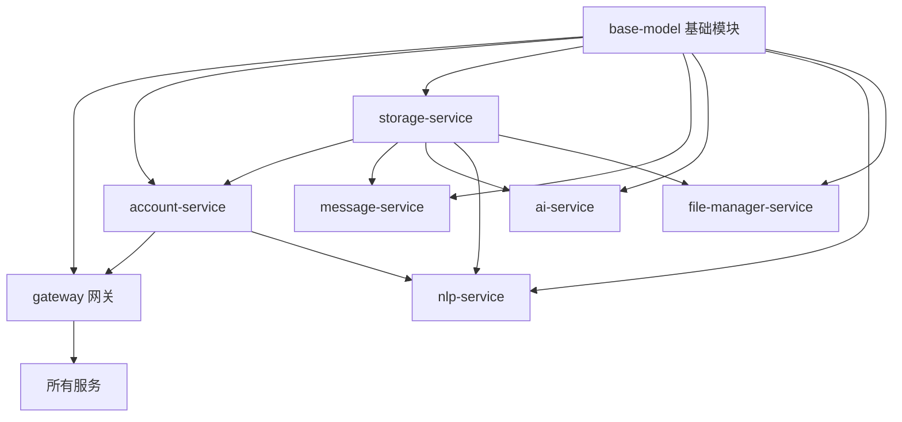

# HavenButler 项目总体开发面板

## 项目概述
智能家庭服务平台，采用多语言微服务架构，提供全方位的智能家居解决方案。

## 项目架构
- **核心业务层**：Java + Spring Cloud/Spring Boot
- **多语言适配层**：Python/Go/C++
- **前端层**：Vue3 Web端、小程序/APP、智能音箱
- **边缘计算**：Go + C++家庭边缘网关

## 总体任务进度跟踪

| 任务ID | 所属服务 | 负责人 | 状态 | 计划完成时间 | 实际进度 | 阻塞点 |
|--------|----------|--------|------|-------------|----------|--------|
| T001   | base-model | - | 待开始 | 2025-01-20 | 0% | 无 |
| T002   | gateway | - | 待开始 | 2025-01-25 | 0% | 无 |
| T003   | account-service | - | 待开始 | 2025-01-30 | 0% | 无 |
| T004   | storage-service | - | 待开始 | 2025-02-05 | 0% | 无 |
| T005   | message-service | - | 待开始 | 2025-02-10 | 0% | 无 |
| T006   | ai-service | - | 待开始 | 2025-02-15 | 0% | 无 |
| T007   | nlp-service | - | 待开始 | 2025-02-20 | 0% | 无 |
| T008   | file-manager-service | - | 待开始 | 2025-02-25 | 0% | 无 |

## 服务开发面板快速链接

### 基础设施层
- [base-model 基础模块](../infrastructure/base-model/dev-panel.md)
- [common 公共组件](../infrastructure/common/dev-panel.md)
- [admin 管理服务](../infrastructure/admin/dev-panel.md)

### 接入层
- [gateway 网关服务](../gateway/dev-panel.md)
- [edge-gateway 边缘网关](../edge-gateway/dev-panel.md)

### 核心业务层
- [account-service 账户服务](../services/account-service/dev-panel.md)
- [storage-service 存储服务](../services/storage-service/dev-panel.md)
- [message-service 消息服务](../services/message-service/dev-panel.md)
- [ai-service AI服务](../services/ai-service/dev-panel.md)
- [nlp-service NLP服务](../services/nlp-service/dev-panel.md)
- [file-manager-service 文件管理服务](../services/file-manager-service/dev-panel.md)

### 多语言适配层
- [iot-python IoT Python适配](../adapters/iot-python/dev-panel.md)
- [ocr-go OCR Go引擎](../adapters/ocr-go/dev-panel.md)
- [asr-cpp ASR C++引擎](../adapters/asr-cpp/dev-panel.md)

### 前端层
- [web-vue3 Vue3管理端](../frontend/web-vue3/dev-panel.md)
- [miniprogram 小程序端](../frontend/miniprogram/README.md)
- [mobile-app 移动APP](../frontend/mobile-app/README.md)

## 里程碑跟踪

| 里程碑 | 目标日期 | 状态 | 包含任务 |
|--------|----------|------|----------|
| M1: 基础架构搭建 | 2025-01-31 | 进行中 | T001, T002, T003 |
| M2: 核心服务开发 | 2025-02-28 | 待开始 | T004, T005, T006, T007, T008 |
| M3: 多语言适配集成 | 2025-03-31 | 待开始 | - |
| M4: 前端开发 | 2025-04-30 | 文档完成 | Vue3管理端已创建文档和参考资源 |
| M5: 测试与部署 | 2025-05-31 | 待开始 | - |

## 依赖关系矩阵

## 最近更新
- 2025-01-15: 项目初始化，创建微服务架构
- 2025-01-15: 完成前端Vue3管理端文档创建，包含UI设计规范和参考资源
- 2025-01-15: 完成多语言适配层文档创建（IoT-Python、OCR-Go、ASR-C++）
- 2025-01-15: 完成基础设施层文档创建（Common公共组件、Admin管理服务）