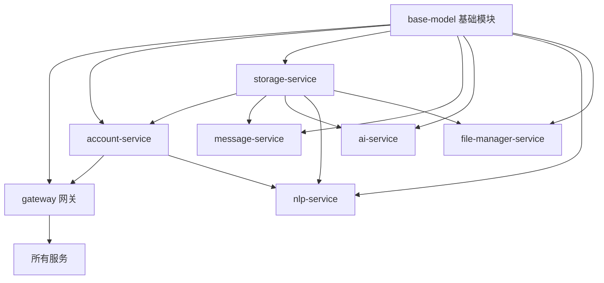

# HavenButler 项目总体开发面板

## 项目概述
智能家庭服务平台，采用多语言微服务架构，提供全方位的智能家居解决方案。

## 项目架构
- **核心业务层**：Java + Spring Cloud/Spring Boot
- **多语言适配层**：Python/Go/C++
- **前端层**：Vue3 Web端、小程序/APP、智能音箱
- **边缘计算**：Go + C++家庭边缘网关

## 总体任务进度跟踪

| 任务ID | 所属服务 | 负责人 | 状态 | 计划完成时间 | 实际进度 | 阻塞点 |
|--------|----------|--------|------|-------------|----------|--------|
| T001   | infrastructure/base-model | Claude | ✅ 已完成 | 2025-01-15 | 100% | 无 |
| T002   | infrastructure/common | Claude | ✅ 已完成 | 2025-01-15 | 100% | 无 |
| T003   | infrastructure/admin | Claude | ✅ 已完成 | 2025-01-15 | 100% | 无 |
| T004   | gateway | Claude | ✅ 已完成 | 2025-01-16 | 100% | 无 |
| T005   | services/storage-service | Claude | ✅ 已完成 | 2025-01-16 | 100% | 无 |
| T006   | services/account-service | Claude | ✅ 已完成 | 2025-01-16 | 100% | 无 |
| T007   | services/message-service | Claude | ✅ 已完成 | 2025-01-16 | 100% | 无 |
| T008   | services/ai-service | Claude | ✅ 已完成 | 2025-01-16 | 100% | 无 |
| T009   | services/nlp-service | Claude | ✅ 已完成 | 2025-01-16 | 100% | 无 |
| T010   | services/file-manager-service | Claude | ✅ 已完成 | 2025-01-16 | 100% | 无 |
| T011   | 文档体系完善 | Claude | 🚧 进行中 | 2025-01-17 | 85% | 无 |
| T012   | 多语言适配层 | - | 📋 规划中 | 2025-02-15 | 0% | 需求分析 |
| T013   | 前端应用开发 | - | 📋 规划中 | 2025-03-15 | 0% | 架构设计 |
| T014   | 边缘网关开发 | - | 📋 规划中 | 2025-04-15 | 0% | 技术选型 |

## 服务开发面板快速链接

### 基础设施层
- [base-model 基础模块](../infrastructure/base-model/dev-panel.md)
- [common 公共组件](../infrastructure/common/dev-panel.md)
- [admin 管理服务](../infrastructure/admin/dev-panel.md)

### 接入层
- [gateway 网关服务](../gateway/dev-panel.md)
- [edge-gateway 边缘网关](../edge-gateway/dev-panel.md)

### 核心业务层
- [account-service 账户服务](../services/account-service/dev-panel.md)
- [storage-service 存储服务](../services/storage-service/dev-panel.md)
- [message-service 消息服务](../services/message-service/dev-panel.md)
- [ai-service AI服务](../services/ai-service/dev-panel.md)
- [nlp-service NLP服务](../services/nlp-service/dev-panel.md)
- [file-manager-service 文件管理服务](../services/file-manager-service/dev-panel.md)

### 多语言适配层
- [iot-python IoT Python适配](../adapters/iot-python/dev-panel.md)
- [ocr-go OCR Go引擎](../adapters/ocr-go/dev-panel.md)
- [asr-cpp ASR C++引擎](../adapters/asr-cpp/dev-panel.md)

### 前端层
- [web-vue3 Vue3管理端](../frontend/web-vue3/dev-panel.md)
- [miniprogram 小程序端](../frontend/miniprogram/README.md)
- [mobile-app 移动APP](../frontend/mobile-app/README.md)

## 里程碑跟踪

| 里程碑 | 目标日期 | 状态 | 包含任务 | 完成度 |
|--------|----------|------|----------|----------|
| M1: 基础架构搭建 | 2025-01-16 | ✅ 已完成 | T001-T010 | 100% |
| M2: 文档体系完善 | 2025-01-17 | 🚧 进行中 | T011 | 85% |
| M3: 多语言适配集成 | 2025-02-28 | 📋 规划中 | T012 | 0% |
| M4: 前端开发 | 2025-03-31 | 📋 规划中 | T013 | 0% |
| M5: 边缘网关开发 | 2025-04-30 | 📋 规划中 | T014 | 0% |
| M6: 测试与部署 | 2025-05-31 | 📋 规划中 | - | 0% |

## 依赖关系矩阵

## 📈 开发统计

### 代码完成情况
- **Infrastructure层**：3个模块，100% 完成
- **Gateway层**：1个服务，100% 完成
- **Services层**：6个微服务，100% 完成
- **总计**：10个核心组件，完整的Spring Boot 3.1.0 + Spring Cloud 2023.0.1架构

### 文档完成情况
- **技术文档**：CLAUDE.md、README.md 100% 更新
- **开发面板**：所有服务 dev-panel.md 100% 完成
- **Infrastructure集成说明**：所有服务 README.md 100% 同步

### 当前技术栈状态
- ✅ **Java 17** + **Maven 3.8+**
- ✅ **Spring Cloud 2023.0.1** + **Spring Boot 3.1.0**
- ✅ **Nacos 2.3.0** (服务注册发现)
- ✅ **Spring Boot Admin 3.1.0** (监控面板)
- ✅ **Redis** + **RabbitMQ** + **MySQL** + **MongoDB** + **MinIO**

## 最近更新
- 2025-01-16: **重大里程碑** - 完成所有核心Java微服务开发
- 2025-01-16: 完成Infrastructure基础设施层（Base-Model、Common、Admin）
- 2025-01-16: 完成Gateway网关服务，支持路由、鉴权、限流
- 2025-01-16: 完成6个核心业务服务，完整Infrastructure集成
- 2025-01-16: 修复所有services文档编码问题，创建统一开发面板
- 2025-01-16: 更新根目录文档，反映实际开发进度