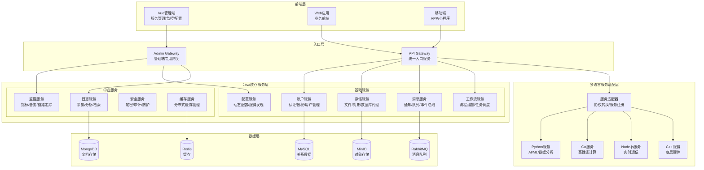

# Java服务平台架构设计方案

## 🎯 一、平台定位

构建一个**以Java为核心的基础服务平台**，提供完整的基础能力（账户、存储、消息等），通过统一入口服务（Gateway）集成多语言服务，配套Vue可视化管理端，实现服务的统一管理和监控。

### 核心理念
- **Java服务为主体**：所有基础服务使用Java开发，保证稳定性和可维护性
- **多语言服务集成**：通过Gateway统一接入Python/Go/Node.js等其他语言服务
- **可视化管理**：Vue管理端提供服务监控、配置管理、API测试等功能
- **插件化扩展**：支持动态加载新服务，无需修改核心代码

## 🏗️ 二、整体架构设计



## 📦 三、Java核心服务详细设计

### 3.1 基础服务框架

每个Java服务采用统一的项目结构：

```
service-name/
├── service-api/           # API定义模块
│   ├── src/main/java/
│   │   ├── dto/          # 数据传输对象
│   │   ├── api/          # Feign接口定义
│   │   └── constant/     # 常量定义
│   └── pom.xml
├── service-core/          # 核心业务模块
│   ├── src/main/java/
│   │   ├── controller/   # REST控制器
│   │   ├── service/      # 业务逻辑
│   │   ├── repository/   # 数据访问
│   │   ├── config/       # 配置类
│   │   └── Application.java
│   └── pom.xml
└── service-client/        # 客户端SDK模块
    ├── src/main/java/
    │   └── client/        # Feign客户端实现
    └── pom.xml
```

### 3.2 账户服务（Account Service）

```java
// 账户服务核心功能
@RestController
@RequestMapping("/api/account")
public class AccountController {
    
    @Autowired
    private AccountService accountService;
    
    // 用户认证
    @PostMapping("/auth/login")
    public Result<TokenDTO> login(@RequestBody LoginRequest request) {
        // 支持多种登录方式：用户名/手机号/邮箱
        TokenDTO token = accountService.authenticate(request);
        return Result.success(token);
    }
    
    // 用户注册
    @PostMapping("/register")
    public Result<UserDTO> register(@RequestBody RegisterRequest request) {
        UserDTO user = accountService.register(request);
        return Result.success(user);
    }
    
    // 权限验证
    @GetMapping("/permission/check")
    public Result<Boolean> checkPermission(
            @RequestParam String userId,
            @RequestParam String resource,
            @RequestParam String action) {
        boolean hasPermission = accountService.checkPermission(userId, resource, action);
        return Result.success(hasPermission);
    }
    
    // 角色管理
    @PostMapping("/role")
    public Result<RoleDTO> createRole(@RequestBody RoleRequest request) {
        RoleDTO role = accountService.createRole(request);
        return Result.success(role);
    }
}

// 统一认证拦截器
@Component
public class AuthInterceptor implements HandlerInterceptor {
    
    @Autowired
    private TokenService tokenService;
    
    @Override
    public boolean preHandle(HttpServletRequest request, 
                           HttpServletResponse response, 
                           Object handler) {
        String token = request.getHeader("Authorization");
        
        if (StringUtils.isEmpty(token)) {
            throw new UnauthorizedException("Token is required");
        }
        
        // 验证token并设置用户上下文
        UserContext context = tokenService.verify(token);
        UserContextHolder.set(context);
        
        return true;
    }
}
```

### 3.3 存储服务（Storage Service）

```java
// 统一存储抽象层
@Service
public class StorageService {
    
    @Autowired
    private StorageStrategyFactory strategyFactory;
    
    // 文件上传
    public StorageResult upload(MultipartFile file, StorageConfig config) {
        // 根据配置选择存储策略：本地/MinIO/OSS/S3
        StorageStrategy strategy = strategyFactory.getStrategy(config.getType());
        
        String fileId = generateFileId();
        String path = strategy.store(file, fileId);
        
        // 保存文件元数据
        FileMetadata metadata = FileMetadata.builder()
            .fileId(fileId)
            .fileName(file.getOriginalFilename())
            .size(file.getSize())
            .contentType(file.getContentType())
            .storagePath(path)
            .storageType(config.getType())
            .build();
            
        metadataRepository.save(metadata);
        
        return StorageResult.success(fileId, generateUrl(fileId));
    }
    
    // 数据库代理功能
    @PostMapping("/database/query")
    public Result<List<Map<String, Object>>> executeQuery(
            @RequestBody DatabaseQuery query) {
        // 支持多数据源动态切换
        DataSource dataSource = dataSourceManager.getDataSource(query.getDataSourceId());
        
        // SQL安全检查
        sqlSecurityChecker.check(query.getSql());
        
        // 执行查询
        List<Map<String, Object>> results = jdbcTemplate.queryForList(query.getSql());
        
        // 记录审计日志
        auditService.log(AuditLog.builder()
            .userId(UserContextHolder.getUserId())
            .action("DATABASE_QUERY")
            .resource(query.getDataSourceId())
            .sql(query.getSql())
            .build());
            
        return Result.success(results);
    }
}

// 存储策略接口
public interface StorageStrategy {
    String store(MultipartFile file, String fileId);
    InputStream retrieve(String fileId);
    void delete(String fileId);
}

// MinIO存储实现
@Component
public class MinioStorageStrategy implements StorageStrategy {
    
    @Autowired
    private MinioClient minioClient;
    
    @Override
    public String store(MultipartFile file, String fileId) {
        try {
            minioClient.putObject(
                PutObjectArgs.builder()
                    .bucket("haven-files")
                    .object(fileId)
                    .stream(file.getInputStream(), file.getSize(), -1)
                    .contentType(file.getContentType())
                    .build()
            );
            return "minio://haven-files/" + fileId;
        } catch (Exception e) {
            throw new StorageException("Failed to store file", e);
        }
    }
}
```

### 3.4 消息服务（Message Service）

```java
// 统一消息服务
@Service
public class MessageService {
    
    @Autowired
    private MessageChannelFactory channelFactory;
    
    @Autowired
    private MessageTemplateService templateService;
    
    // 发送消息
    public MessageResult send(MessageRequest request) {
        // 加载消息模板
        MessageTemplate template = templateService.getTemplate(request.getTemplateId());
        
        // 渲染消息内容
        String content = templateService.render(template, request.getParams());
        
        // 根据渠道类型发送
        MessageChannel channel = channelFactory.getChannel(request.getChannel());
        
        Message message = Message.builder()
            .recipient(request.getRecipient())
            .content(content)
            .metadata(request.getMetadata())
            .build();
            
        return channel.send(message);
    }
    
    // 批量发送
    @Async
    public CompletableFuture<BatchMessageResult> sendBatch(BatchMessageRequest request) {
        List<CompletableFuture<MessageResult>> futures = request.getRecipients()
            .stream()
            .map(recipient -> {
                MessageRequest singleRequest = request.toSingleRequest(recipient);
                return CompletableFuture.supplyAsync(() -> send(singleRequest));
            })
            .collect(Collectors.toList());
            
        return CompletableFuture.allOf(futures.toArray(new CompletableFuture[0]))
            .thenApply(v -> {
                List<MessageResult> results = futures.stream()
                    .map(CompletableFuture::join)
                    .collect(Collectors.toList());
                return new BatchMessageResult(results);
            });
    }
}

// 消息渠道接口
public interface MessageChannel {
    MessageResult send(Message message);
    boolean supports(ChannelType type);
}

// 邮件渠道实现
@Component
public class EmailChannel implements MessageChannel {
    
    @Autowired
    private JavaMailSender mailSender;
    
    @Override
    public MessageResult send(Message message) {
        SimpleMailMessage mailMessage = new SimpleMailMessage();
        mailMessage.setTo(message.getRecipient());
        mailMessage.setSubject(message.getMetadata().get("subject"));
        mailMessage.setText(message.getContent());
        
        mailSender.send(mailMessage);
        
        return MessageResult.success(message.getId());
    }
}
```

### 3.5 配置服务（Config Service）

```java
// 动态配置服务
@Service
public class ConfigService {
    
    @Autowired
    private ConfigRepository configRepository;
    
    @Autowired
    private ConfigEventPublisher eventPublisher;
    
    // 获取配置
    public ConfigValue getConfig(String namespace, String key) {
        Config config = configRepository.findByNamespaceAndKey(namespace, key);
        
        if (config == null) {
            return ConfigValue.empty();
        }
        
        // 支持多种数据类型
        return ConfigValue.of(config.getValue(), config.getType());
    }
    
    // 更新配置
    @Transactional
    public void updateConfig(String namespace, String key, Object value) {
        Config config = configRepository.findByNamespaceAndKey(namespace, key);
        
        if (config == null) {
            config = new Config();
            config.setNamespace(namespace);
            config.setKey(key);
        }
        
        String oldValue = config.getValue();
        config.setValue(JsonUtils.toJson(value));
        config.setUpdateTime(LocalDateTime.now());
        
        configRepository.save(config);
        
        // 发布配置变更事件
        eventPublisher.publish(ConfigChangeEvent.builder()
            .namespace(namespace)
            .key(key)
            .oldValue(oldValue)
            .newValue(config.getValue())
            .build());
    }
    
    // 批量获取配置
    public Map<String, ConfigValue> getConfigs(String namespace) {
        List<Config> configs = configRepository.findByNamespace(namespace);
        
        return configs.stream()
            .collect(Collectors.toMap(
                Config::getKey,
                c -> ConfigValue.of(c.getValue(), c.getType())
            ));
    }
    
    // 配置监听
    @EventListener
    public void handleConfigChange(ConfigChangeEvent event) {
        // 通知所有订阅该配置的服务
        List<String> subscribers = getSubscribers(event.getNamespace(), event.getKey());
        
        subscribers.forEach(serviceId -> {
            notificationService.notify(serviceId, event);
        });
    }
}
```

### 3.6 工作流服务（Workflow Service）

```java
// 工作流引擎服务
@Service
public class WorkflowService {
    
    @Autowired
    private ProcessEngine processEngine;
    
    @Autowired
    private TaskScheduler taskScheduler;
    
    // 创建流程定义
    public ProcessDefinition createProcess(ProcessDefinitionRequest request) {
        // 解析BPMN或自定义DSL
        ProcessModel model = processParser.parse(request.getDefinition());
        
        // 验证流程定义
        ValidationResult validation = processValidator.validate(model);
        if (!validation.isValid()) {
            throw new InvalidProcessException(validation.getErrors());
        }
        
        // 部署流程
        Deployment deployment = processEngine.getRepositoryService()
            .createDeployment()
            .name(request.getName())
            .addModelInstance(model)
            .deploy();
            
        return ProcessDefinition.from(deployment);
    }
    
    // 启动流程实例
    public ProcessInstance startProcess(String processKey, Map<String, Object> variables) {
        RuntimeService runtimeService = processEngine.getRuntimeService();
        
        org.camunda.bpm.engine.runtime.ProcessInstance instance = 
            runtimeService.startProcessInstanceByKey(processKey, variables);
            
        // 记录流程启动事件
        auditService.log(ProcessAuditLog.builder()
            .processInstanceId(instance.getId())
            .processKey(processKey)
            .action("START")
            .userId(UserContextHolder.getUserId())
            .variables(variables)
            .build());
            
        return ProcessInstance.from(instance);
    }
    
    // 任务调度
    public ScheduledTask scheduleTask(TaskRequest request) {
        Runnable task = () -> {
            try {
                // 执行任务逻辑
                Object result = taskExecutor.execute(request.getTaskType(), request.getParams());
                
                // 保存执行结果
                taskResultRepository.save(TaskResult.builder()
                    .taskId(request.getTaskId())
                    .result(result)
                    .status(TaskStatus.SUCCESS)
                    .build());
                    
            } catch (Exception e) {
                handleTaskError(request.getTaskId(), e);
            }
        };
        
        // 支持多种调度方式
        if (request.getCronExpression() != null) {
            return taskScheduler.schedule(task, new CronTrigger(request.getCronExpression()));
        } else if (request.getFixedDelay() != null) {
            return taskScheduler.scheduleWithFixedDelay(task, request.getFixedDelay());
        } else {
            return taskScheduler.schedule(task, request.getExecuteTime());
        }
    }
}
```

## 🚪 四、入口服务（Gateway）设计

### 4.1 Gateway核心架构

```java
// Gateway主配置
@Configuration
@EnableGateway
public class GatewayConfig {
    
    @Bean
    public RouteLocator customRouteLocator(RouteLocatorBuilder builder) {
        return builder.routes()
            // Java服务路由
            .route("account-service", r -> r
                .path("/api/account/**")
                .filters(f -> f
                    .stripPrefix(2)
                    .addRequestHeader("X-Service", "account")
                    .circuitBreaker(c -> c.setName("account-cb")))
                .uri("lb://ACCOUNT-SERVICE"))
                
            // 多语言服务路由
            .route("python-service", r -> r
                .path("/api/python/**")
                .filters(f -> f
                    .stripPrefix(2)
                    .filter(new ProtocolAdapterFilter())) // 协议适配
                .uri("http://python-service:8000"))
                
            .build();
    }
    
    @Bean
    public GlobalFilter authenticationFilter() {
        return new AuthenticationGlobalFilter();
    }
    
    @Bean
    public GlobalFilter loggingFilter() {
        return new LoggingGlobalFilter();
    }
}

// 多语言服务适配器
@Component
public class MultiLanguageServiceAdapter {
    
    @Autowired
    private ServiceRegistry serviceRegistry;
    
    @Autowired
    private ProtocolConverter protocolConverter;
    
    // 注册外部服务
    public void registerService(ExternalServiceDefinition definition) {
        // 验证服务健康
        boolean isHealthy = healthChecker.check(definition.getHealthEndpoint());
        
        if (!isHealthy) {
            throw new ServiceRegistrationException("Service is not healthy");
        }
        
        // 注册到服务注册表
        ServiceInstance instance = ServiceInstance.builder()
            .serviceId(definition.getServiceId())
            .host(definition.getHost())
            .port(definition.getPort())
            .metadata(Map.of(
                "language", definition.getLanguage(),
                "protocol", definition.getProtocol(),
                "version", definition.getVersion()
            ))
            .build();
            
        serviceRegistry.register(instance);
        
        // 动态添加路由
        dynamicRouteService.add(RouteDefinition.builder()
            .id(definition.getServiceId())
            .uri(definition.getUri())
            .predicates(definition.getPredicates())
            .filters(definition.getFilters())
            .build());
    }
    
    // 协议转换
    public Object convertRequest(Object request, Protocol from, Protocol to) {
        return protocolConverter.convert(request, from, to);
    }
}

// 服务调用链路追踪
@Component
public class TraceFilter implements GlobalFilter {
    
    @Override
    public Mono<Void> filter(ServerWebExchange exchange, GatewayFilterChain chain) {
        // 生成或传递TraceId
        String traceId = exchange.getRequest().getHeaders()
            .getFirst("X-Trace-Id");
            
        if (StringUtils.isEmpty(traceId)) {
            traceId = UUID.randomUUID().toString();
        }
        
        // 添加到请求头
        ServerHttpRequest request = exchange.getRequest().mutate()
            .header("X-Trace-Id", traceId)
            .build();
            
        // 记录请求开始
        long startTime = System.currentTimeMillis();
        
        return chain.filter(exchange.mutate().request(request).build())
            .doFinally(signal -> {
                // 记录请求结束
                long endTime = System.currentTimeMillis();
                long duration = endTime - startTime;
                
                // 发送链路数据
                traceCollector.collect(TraceData.builder()
                    .traceId(traceId)
                    .serviceName("gateway")
                    .path(exchange.getRequest().getPath().toString())
                    .method(exchange.getRequest().getMethod().toString())
                    .statusCode(exchange.getResponse().getStatusCode())
                    .duration(duration)
                    .build());
            });
    }
}
```

### 4.2 多语言服务集成规范

```yaml
# 服务注册配置示例
services:
  - id: python-ai-service
    name: AI分析服务
    language: python
    protocol: http
    host: python-service
    port: 8000
    health-check:
      endpoint: /health
      interval: 30s
      timeout: 5s
    routes:
      - path: /api/ai/**
        strip-prefix: 2
    adapters:
      - type: protocol
        from: http
        to: grpc
      - type: auth
        mode: jwt-to-apikey
        
  - id: go-compute-service
    name: 高性能计算服务
    language: go
    protocol: grpc
    host: go-service
    port: 9000
    health-check:
      endpoint: /grpc.health.v1.Health/Check
      interval: 30s
    routes:
      - path: /api/compute/**
        strip-prefix: 2
```

## 💻 五、Vue管理端设计

### 5.1 管理端功能架构

```
vue-admin/
├── src/
│   ├── views/
│   │   ├── dashboard/          # 仪表盘
│   │   │   ├── ServiceStatus.vue    # 服务状态总览
│   │   │   ├── Metrics.vue          # 关键指标
│   │   │   └── Alerts.vue           # 告警信息
│   │   ├── service/            # 服务管理
│   │   │   ├── ServiceList.vue      # 服务列表
│   │   │   ├── ServiceDetail.vue    # 服务详情
│   │   │   ├── ServiceConfig.vue    # 服务配置
│   │   │   └── ServiceMonitor.vue   # 服务监控
│   │   ├── gateway/            # 网关管理
│   │   │   ├── RouteManager.vue     # 路由管理
│   │   │   ├── FilterConfig.vue     # 过滤器配置
│   │   │   └── RateLimiter.vue      # 限流配置
│   │   ├── api/                # API管理
│   │   │   ├── ApiDocument.vue      # API文档
│   │   │   ├── ApiTest.vue          # API测试
│   │   │   └── MockServer.vue       # Mock服务
│   │   ├── config/             # 配置中心
│   │   │   ├── ConfigList.vue       # 配置列表
│   │   │   ├── ConfigEditor.vue     # 配置编辑
│   │   │   └── ConfigHistory.vue    # 配置历史
│   │   ├── monitor/            # 监控中心
│   │   │   ├── LogViewer.vue        # 日志查看
│   │   │   ├── TraceAnalyzer.vue    # 链路分析
│   │   │   └── MetricCharts.vue     # 指标图表
│   │   └── system/             # 系统管理
│   │       ├── UserManage.vue       # 用户管理
│   │       ├── RoleManage.vue       # 角色权限
│   │       └── AuditLog.vue         # 审计日志
│   ├── components/             # 通用组件
│   │   ├── ServiceCard.vue     # 服务卡片
│   │   ├── MetricChart.vue     # 指标图表
│   │   ├── JsonEditor.vue      # JSON编辑器
│   │   └── LogTerminal.vue     # 日志终端
│   └── api/                    # API调用
│       ├── service.js          # 服务相关API
│       ├── gateway.js          # 网关相关API
│       └── monitor.js          # 监控相关API
```

### 5.2 核心功能实现

```vue
<!-- 服务管理界面 -->
<template>
  <div class="service-manager">
    <!-- 服务列表 -->
    <el-card class="service-list">
      <template #header>
        <div class="card-header">
          <span>服务列表</span>
          <el-button type="primary" @click="registerService">注册新服务</el-button>
        </div>
      </template>
      
      <el-table :data="services" style="width: 100%">
        <el-table-column prop="name" label="服务名称" />
        <el-table-column prop="language" label="开发语言">
          <template #default="scope">
            <el-tag :type="getLanguageType(scope.row.language)">
              {{ scope.row.language }}
            </el-tag>
          </template>
        </el-table-column>
        <el-table-column prop="status" label="状态">
          <template #default="scope">
            <el-badge :type="getStatusType(scope.row.status)">
              {{ scope.row.status }}
            </el-badge>
          </template>
        </el-table-column>
        <el-table-column label="健康度">
          <template #default="scope">
            <el-progress 
              :percentage="scope.row.health" 
              :color="getHealthColor(scope.row.health)" />
          </template>
        </el-table-column>
        <el-table-column label="操作">
          <template #default="scope">
            <el-button-group>
              <el-button size="small" @click="viewDetail(scope.row)">详情</el-button>
              <el-button size="small" @click="configService(scope.row)">配置</el-button>
              <el-button size="small" @click="monitorService(scope.row)">监控</el-button>
            </el-button-group>
          </template>
        </el-table-column>
      </el-table>
    </el-card>
    
    <!-- 服务详情 -->
    <el-drawer
      v-model="detailDrawer"
      title="服务详情"
      size="50%">
      <ServiceDetail :service="currentService" />
    </el-drawer>
    
    <!-- 服务注册对话框 -->
    <el-dialog v-model="registerDialog" title="注册新服务" width="60%">
      <el-form :model="newService" label-width="120px">
        <el-form-item label="服务ID">
          <el-input v-model="newService.id" />
        </el-form-item>
        <el-form-item label="服务名称">
          <el-input v-model="newService.name" />
        </el-form-item>
        <el-form-item label="开发语言">
          <el-select v-model="newService.language">
            <el-option label="Java" value="java" />
            <el-option label="Python" value="python" />
            <el-option label="Go" value="go" />
            <el-option label="Node.js" value="nodejs" />
            <el-option label="C++" value="cpp" />
          </el-select>
        </el-form-item>
        <el-form-item label="协议类型">
          <el-radio-group v-model="newService.protocol">
            <el-radio label="http">HTTP/REST</el-radio>
            <el-radio label="grpc">gRPC</el-radio>
            <el-radio label="websocket">WebSocket</el-radio>
          </el-radio-group>
        </el-form-item>
        <el-form-item label="服务地址">
          <el-input v-model="newService.host" placeholder="服务主机地址" />
        </el-form-item>
        <el-form-item label="服务端口">
          <el-input-number v-model="newService.port" :min="1" :max="65535" />
        </el-form-item>
        <el-form-item label="健康检查">
          <el-input v-model="newService.healthEndpoint" placeholder="/health" />
        </el-form-item>
        <el-form-item label="路由配置">
          <JsonEditor v-model="newService.routes" />
        </el-form-item>
      </el-form>
      <template #footer>
        <el-button @click="registerDialog = false">取消</el-button>
        <el-button type="primary" @click="submitRegister">确认注册</el-button>
      </template>
    </el-dialog>
  </div>
</template>

<script setup>
import { ref, onMounted } from 'vue'
import { ElMessage } from 'element-plus'
import { getServices, registerService, getServiceDetail } from '@/api/service'
import ServiceDetail from './ServiceDetail.vue'
import JsonEditor from '@/components/JsonEditor.vue'

const services = ref([])
const currentService = ref(null)
const detailDrawer = ref(false)
const registerDialog = ref(false)
const newService = ref({
  id: '',
  name: '',
  language: 'java',
  protocol: 'http',
  host: '',
  port: 8080,
  healthEndpoint: '/health',
  routes: []
})

// 加载服务列表
const loadServices = async () => {
  try {
    const res = await getServices()
    services.value = res.data
  } catch (error) {
    ElMessage.error('加载服务列表失败')
  }
}

// 查看服务详情
const viewDetail = async (service) => {
  currentService.value = service
  detailDrawer.value = true
}

// 提交服务注册
const submitRegister = async () => {
  try {
    await registerService(newService.value)
    ElMessage.success('服务注册成功')
    registerDialog.value = false
    loadServices()
  } catch (error) {
    ElMessage.error('服务注册失败: ' + error.message)
  }
}

onMounted(() => {
  loadServices()
  // 每30秒刷新一次
  setInterval(loadServices, 30000)
})
</script>
```

### 5.3 API测试工具

```vue
<!-- API测试工具组件 -->
<template>
  <div class="api-tester">
    <el-form :model="request" label-position="top">
      <!-- 请求配置 -->
      <el-row :gutter="20">
        <el-col :span="4">
          <el-form-item label="Method">
            <el-select v-model="request.method">
              <el-option label="GET" value="GET" />
              <el-option label="POST" value="POST" />
              <el-option label="PUT" value="PUT" />
              <el-option label="DELETE" value="DELETE" />
            </el-select>
          </el-form-item>
        </el-col>
        <el-col :span="16">
          <el-form-item label="URL">
            <el-input v-model="request.url" placeholder="http://gateway/api/..." />
          </el-form-item>
        </el-col>
        <el-col :span="4">
          <el-form-item label="&nbsp;">
            <el-button type="primary" @click="sendRequest">发送请求</el-button>
          </el-form-item>
        </el-col>
      </el-row>
      
      <!-- Headers -->
      <el-form-item label="Headers">
        <el-table :data="request.headers" size="small">
          <el-table-column prop="key" label="Key">
            <template #default="scope">
              <el-input v-model="scope.row.key" size="small" />
            </template>
          </el-table-column>
          <el-table-column prop="value" label="Value">
            <template #default="scope">
              <el-input v-model="scope.row.value" size="small" />
            </template>
          </el-table-column>
          <el-table-column width="80">
            <template #header>
              <el-button size="small" @click="addHeader">添加</el-button>
            </template>
            <template #default="scope">
              <el-button size="small" type="danger" @click="removeHeader(scope.$index)">
                删除
              </el-button>
            </template>
          </el-table-column>
        </el-table>
      </el-form-item>
      
      <!-- Request Body -->
      <el-form-item label="Body" v-if="['POST', 'PUT'].includes(request.method)">
        <el-radio-group v-model="request.bodyType" size="small">
          <el-radio-button label="json">JSON</el-radio-button>
          <el-radio-button label="form">Form Data</el-radio-button>
          <el-radio-button label="raw">Raw</el-radio-button>
        </el-radio-group>
        <div class="body-editor">
          <JsonEditor v-if="request.bodyType === 'json'" v-model="request.body" />
          <el-input 
            v-else 
            type="textarea" 
            v-model="request.body" 
            :rows="10" />
        </div>
      </el-form-item>
    </el-form>
    
    <!-- 响应结果 -->
    <el-card class="response-card" v-if="response">
      <template #header>
        <div class="response-header">
          <span>响应结果</span>
          <el-tag :type="getStatusType(response.status)">
            {{ response.status }} {{ response.statusText }}
          </el-tag>
          <span class="response-time">耗时: {{ response.duration }}ms</span>
        </div>
      </template>
      
      <!-- 响应Headers -->
      <el-collapse>
        <el-collapse-item title="Response Headers">
          <pre>{{ formatHeaders(response.headers) }}</pre>
        </el-collapse-item>
      </el-collapse>
      
      <!-- 响应Body -->
      <div class="response-body">
        <JsonViewer v-if="isJson(response.contentType)" :data="response.data" />
        <pre v-else>{{ response.data }}</pre>
      </div>
    </el-card>
  </div>
</template>
```

## 🔧 六、部署架构

### 6.1 容器化部署

```yaml
# docker-compose.yml
version: '3.8'

services:
  # Java核心服务
  account-service:
    image: haven/account-service:latest
    environment:
      - SPRING_PROFILES_ACTIVE=prod
      - MYSQL_URL=jdbc:mysql://mysql:3306/haven
    depends_on:
      - mysql
      - redis
    networks:
      - haven-network
      
  storage-service:
    image: haven/storage-service:latest
    environment:
      - SPRING_PROFILES_ACTIVE=prod
      - MINIO_URL=http://minio:9000
    depends_on:
      - minio
    networks:
      - haven-network
      
  message-service:
    image: haven/message-service:latest
    environment:
      - SPRING_PROFILES_ACTIVE=prod
      - RABBITMQ_URL=amqp://rabbitmq:5672
    depends_on:
      - rabbitmq
    networks:
      - haven-network
      
  # Gateway
  gateway:
    image: haven/gateway:latest
    ports:
      - "8080:8080"
    environment:
      - EUREKA_URL=http://eureka:8761/eureka
    depends_on:
      - eureka
    networks:
      - haven-network
      
  # 管理端
  admin-ui:
    image: haven/admin-ui:latest
    ports:
      - "8090:80"
    environment:
      - API_BASE_URL=http://gateway:8080
    networks:
      - haven-network
      
  # 基础设施
  mysql:
    image: mysql:8.0
    environment:
      - MYSQL_ROOT_PASSWORD=root123
      - MYSQL_DATABASE=haven
    volumes:
      - mysql_data:/var/lib/mysql
    networks:
      - haven-network
      
  redis:
    image: redis:7-alpine
    networks:
      - haven-network
      
  minio:
    image: minio/minio
    command: server /data --console-address ":9001"
    environment:
      - MINIO_ROOT_USER=admin
      - MINIO_ROOT_PASSWORD=admin123
    volumes:
      - minio_data:/data
    networks:
      - haven-network
      
  rabbitmq:
    image: rabbitmq:3-management
    environment:
      - RABBITMQ_DEFAULT_USER=admin
      - RABBITMQ_DEFAULT_PASS=admin123
    networks:
      - haven-network

networks:
  haven-network:
    driver: bridge

volumes:
  mysql_data:
  minio_data:
```

### 6.2 Kubernetes部署

```yaml
# namespace.yaml
apiVersion: v1
kind: Namespace
metadata:
  name: haven-platform

---
# account-service-deployment.yaml
apiVersion: apps/v1
kind: Deployment
metadata:
  name: account-service
  namespace: haven-platform
spec:
  replicas: 3
  selector:
    matchLabels:
      app: account-service
  template:
    metadata:
      labels:
        app: account-service
    spec:
      containers:
      - name: account-service
        image: haven/account-service:latest
        ports:
        - containerPort: 8080
        env:
        - name: SPRING_PROFILES_ACTIVE
          value: "k8s"
        resources:
          requests:
            memory: "512Mi"
            cpu: "500m"
          limits:
            memory: "1Gi"
            cpu: "1000m"
        livenessProbe:
          httpGet:
            path: /actuator/health
            port: 8080
          initialDelaySeconds: 30
          periodSeconds: 10
        readinessProbe:
          httpGet:
            path: /actuator/health/readiness
            port: 8080
          initialDelaySeconds: 20
          periodSeconds: 5

---
# gateway-service.yaml
apiVersion: v1
kind: Service
metadata:
  name: gateway
  namespace: haven-platform
spec:
  type: LoadBalancer
  ports:
  - port: 80
    targetPort: 8080
  selector:
    app: gateway

---
# ingress.yaml
apiVersion: networking.k8s.io/v1
kind: Ingress
metadata:
  name: haven-ingress
  namespace: haven-platform
  annotations:
    nginx.ingress.kubernetes.io/rewrite-target: /
spec:
  rules:
  - host: api.haven.com
    http:
      paths:
      - path: /
        pathType: Prefix
        backend:
          service:
            name: gateway
            port:
              number: 80
  - host: admin.haven.com
    http:
      paths:
      - path: /
        pathType: Prefix
        backend:
          service:
            name: admin-ui
            port:
              number: 80
```

## 📊 七、监控与运维

### 7.1 监控体系

```java
// 自定义监控指标
@Component
public class CustomMetrics {
    
    private final MeterRegistry meterRegistry;
    
    // 服务调用计数
    public void recordServiceCall(String serviceName, String method, boolean success) {
        meterRegistry.counter("service.calls",
            "service", serviceName,
            "method", method,
            "success", String.valueOf(success)
        ).increment();
    }
    
    // 服务响应时间
    public Timer.Sample startTimer() {
        return Timer.start(meterRegistry);
    }
    
    public void recordTimer(Timer.Sample sample, String serviceName, String method) {
        sample.stop(meterRegistry.timer("service.response.time",
            "service", serviceName,
            "method", method
        ));
    }
    
    // 业务指标
    public void recordBusinessMetric(String metric, double value, String... tags) {
        meterRegistry.gauge("business." + metric, Tags.of(tags), value);
    }
}

// 健康检查
@Component
public class CustomHealthIndicator implements HealthIndicator {
    
    @Autowired
    private List<ExternalService> externalServices;
    
    @Override
    public Health health() {
        Map<String, Object> details = new HashMap<>();
        boolean allHealthy = true;
        
        for (ExternalService service : externalServices) {
            boolean isHealthy = service.checkHealth();
            details.put(service.getName(), isHealthy ? "UP" : "DOWN");
            allHealthy = allHealthy && isHealthy;
        }
        
        return allHealthy 
            ? Health.up().withDetails(details).build()
            : Health.down().withDetails(details).build();
    }
}
```

## 🎯 八、核心优势

1. **统一Java技术栈**：核心服务全部Java，降低维护成本
2. **灵活集成能力**：通过Gateway无缝集成Python/Go/Node.js等服务
3. **可视化管理**：Vue管理端提供完整的服务管理和监控能力
4. **插件化扩展**：新服务接入无需修改核心代码
5. **企业级稳定性**：基于Spring Cloud成熟生态
6. **完整工具链**：从开发到部署的全流程支持

这个架构方案以Java服务平台为核心，通过Gateway统一管理多语言服务，配合Vue可视化管理端，形成了一个完整的服务平台解决方案。