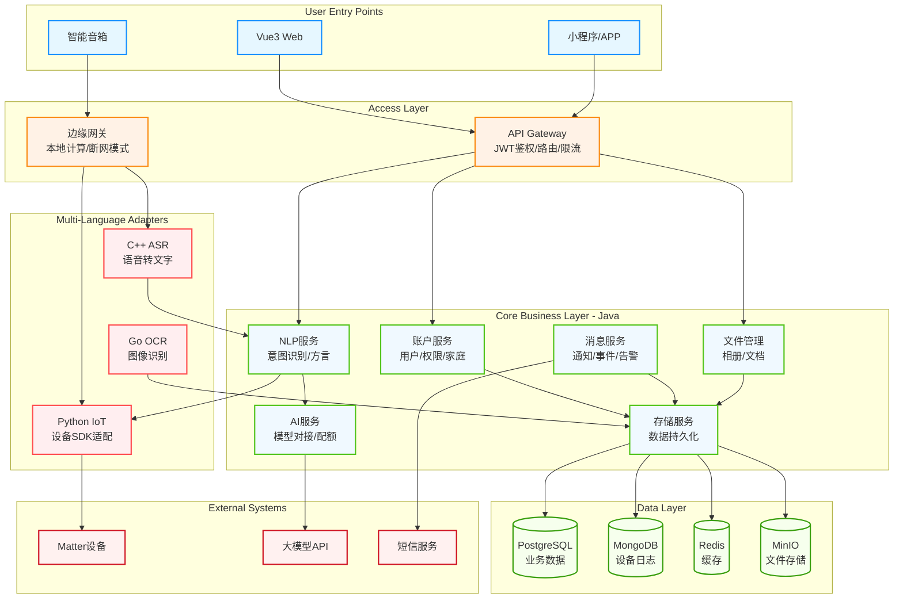
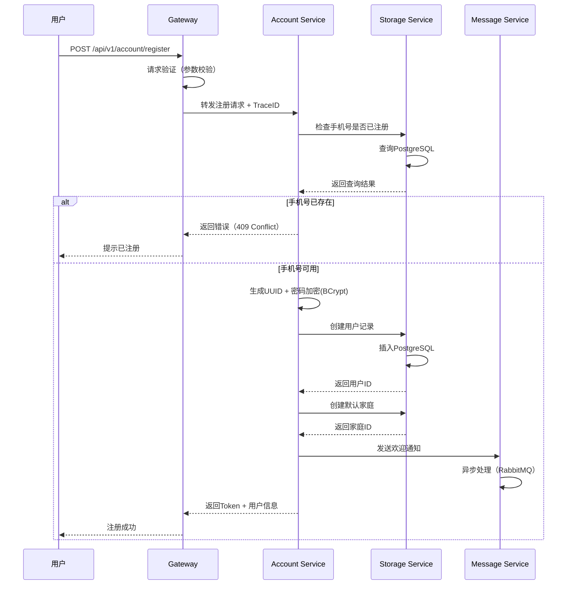
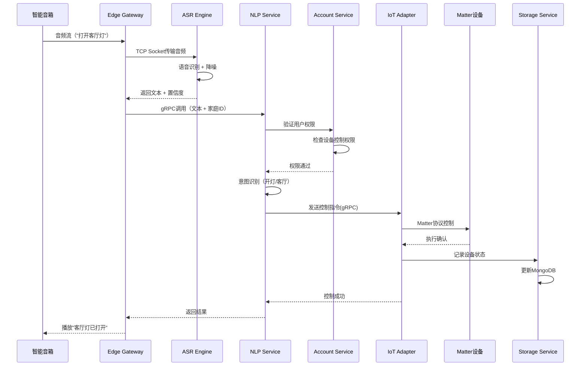

# HavenButler 后端架构文档

## Introduction

本文档概述了HavenButler智能家庭服务平台的后端架构设计，包括核心服务系统、多语言适配层、基础设施和非UI相关的技术决策。其主要目标是为AI驱动的开发提供架构蓝图，确保技术选型的一致性和架构模式的规范执行。

**与前端架构的关系：**
项目包含Vue3 Web端、小程序/APP、智能音箱等多个前端组件，将在独立的前端架构文档中详细说明。本文档定义的核心技术栈选择（见"Tech Stack"章节）对整个项目具有约束力，包括所有前端组件。

### Starter Template or Existing Project

本项目为全新构建的智能家庭服务平台，不基于任何现有的starter template。采用自主设计的多语言混合架构：

- **核心决策**：Java作为核心业务层主导语言（Spring Cloud/Spring Boot生态）
- **多语言适配**：Python（IoT设备SDK）、Go（OCR高性能计算）、C++（ASR低延迟语音）
- **架构特点**：核心统一、边缘灵活、安全可控的技术体系

项目从零开始构建，所有工具链和配置都将根据架构需求手动设置。

### Change Log

| Date | Version | Description | Author |
|------|---------|-------------|--------|
| 2025-01-12 | v1.0.0 | 初始架构文档，基于全架构设计文档创建 | Winston |

## High Level Architecture

### Technical Summary

HavenButler采用**微服务架构**结合**多语言适配层**的混合设计模式，以Java Spring Cloud为核心构建5个业务微服务（Account、Message、Storage、FileManager、AI、NLP），通过标准化通信协议（gRPC/HTTP/TCP）对接Python/Go/C++特化服务。系统遵循**领域驱动设计(DDD)**，采用**事件驱动架构**处理异步任务，实现设备接入→智能交互→数据管理→安全防护的全链路闭环，满足智能家庭场景下的高可用性（99.9%）和低延迟（<2秒）要求。

### High Level Overview

基于架构文档的技术定位，系统采用以下架构决策：

1. **架构风格**：**微服务架构** + **边缘计算**
   - 核心业务层：5个Java微服务独立部署，通过服务网格通信
   - 边缘层：家庭边缘网关本地部署，支持断网运行
   - 适配层：3个多语言服务处理特定场景

2. **仓库结构**：**Monorepo架构**
   - 统一的代码仓库管理所有服务
   - 共享配置、工具类和Protobuf定义
   - 独立的CI/CD pipeline per service

3. **服务架构决策**：
   - 同步通信：gRPC（服务间高频调用）
   - 异步通信：RabbitMQ（消息通知、事件驱动）
   - 缓存策略：Redis集群（会话、热点数据）

4. **数据流设计**：
   - 用户请求 → Gateway鉴权 → 业务服务处理 → 存储服务持久化
   - 设备数据 → 边缘网关预处理 → 适配层转换 → 核心服务处理

5. **关键架构决策理由**：
   - 微服务保证服务独立性和可扩展性
   - 多语言适配层充分利用各语言优势
   - 边缘计算降低云端依赖，提升响应速度

### High Level Project Diagram



### Architectural and Design Patterns

- **微服务架构（Microservices）**: 核心业务拆分为独立服务，每个服务独立部署和扩展 - _理由_: 满足不同服务的差异化性能要求，账户服务高可用、AI服务可弹性扩展
- **领域驱动设计（DDD）**: 按业务领域划分服务边界，每个服务管理自己的数据模型 - _理由_: 清晰的业务边界，减少服务间耦合，便于团队并行开发
- **事件驱动架构（Event-Driven）**: 使用RabbitMQ实现服务间异步通信和事件发布订阅 - _理由_: 解耦服务依赖，支持最终一致性，提高系统响应能力
- **API网关模式（API Gateway）**: 统一入口处理认证、路由、限流、监控 - _理由_: 简化客户端调用，集中管理横切关注点，保护后端服务
- **边缘计算模式（Edge Computing）**: 家庭网关本地处理语音识别和设备控制 - _理由_: 降低延迟（<100ms），支持断网运行，减少云端负载
- **适配器模式（Adapter Pattern）**: 多语言服务作为适配层对接异构设备和SDK - _理由_: 充分利用各语言优势，隔离第三方依赖变化
- **CQRS模式（Command Query Responsibility Segregation）**: 读写分离，查询走缓存，写入走主库 - _理由_: 优化读性能，支持高并发查询场景
- **断路器模式（Circuit Breaker）**: 服务调用失败自动熔断和降级 - _理由_: 防止级联故障，提高系统稳定性

## Tech Stack

### Cloud Infrastructure
- **Provider:** 私有部署（本地服务器/家庭NAS）
- **Key Services:** Docker容器化部署、自建存储、自建消息队列
- **Deployment Regions:** 本地部署 + 未来云服务扩展预留

### Technology Stack Table

| Category | Technology | Version | Purpose | Rationale |
|----------|------------|---------|---------|-----------|
| **核心语言** | Java | 21 LTS | 核心业务服务开发语言 | 最新LTS版本、虚拟线程支持、性能提升显著 |
| **核心框架** | Spring Cloud | 2023.0.1 | 微服务框架 | 完整的微服务治理能力、Java 21完美支持 |
| **基础框架** | Spring Boot | 3.2.0 | 应用开发框架 | 快速开发、自动配置、原生镜像支持 |
| **服务注册** | Nacos | 2.3.0 | 服务注册与配置中心 | 轻量级、易部署、动态配置管理 |
| **API网关** | Spring Cloud Gateway | 4.1.0 | API路由与鉴权 | 唯一对外暴露服务、响应式架构 |
| **RPC框架** | gRPC | 1.58.0 | 服务间通信 | Docker内网通信、高性能、Protobuf序列化 |
| **消息队列** | RabbitMQ | 3.12.0 | 异步消息处理 | 确认选择、可靠性高、Docker部署简单 |
| **数据库-主** | PostgreSQL | 16.1 | 关系型数据存储 | 功能强大、JSON支持好、扩展性强、开源免费 |
| **数据库-文档** | MongoDB | 7.0.5 | 设备日志与非结构化数据 | 灵活文档模型、时序数据处理能力强 |
| **缓存** | Redis | 7.2.4 | 缓存与会话存储 | 性能极高、数据结构丰富、Docker部署方便 |
| **对象存储** | MinIO | 2024.1.16 | 文件存储服务 | 私有部署、S3兼容（便于未来迁移云） |
| **存储抽象层** | Storage Service | - | 统一数据访问接口 | 预留云服务配置入口、支持多存储切换 |
| **Python运行时** | Python | 3.11.7 | IoT设备适配层 | 设备SDK生态丰富、异步支持完善 |
| **Python框架** | FastAPI | 0.109.0 | Python服务框架 | 高性能、自动API文档、异步原生支持 |
| **Go运行时** | Go | 1.21.6 | OCR服务与边缘网关 | 编译型高性能、协程模型、内存占用小 |
| **Go框架** | Gin | 1.9.1 | Go Web框架 | 轻量高性能、路由性能优秀 |
| **C++编译器** | GCC | 13.2.0 | ASR引擎开发 | 性能优化极致、实时处理能力 |
| **C++框架** | gRPC C++ | 1.58.0 | C++服务通信 | 统一通信协议、高性能 |
| **容器化** | Docker | 24.0.7 | 服务容器化 | 所有服务独立容器部署 |
| **容器网络** | Docker Network | bridge | 内部服务通信 | 服务间通过容器名访问、网络隔离 |
| **反向代理** | Nginx | 1.25.3 | 外部访问入口 | 仅暴露必要端口、负载均衡、SSL终止 |
| **CI/CD** | Jenkins | 2.440 | 持续集成/部署 | 本地部署、Pipeline支持、Docker集成 |
| **代码仓库** | GitLab CE | 16.8.0 | 代码版本管理 | 私有部署、免费社区版、CI/CD集成 |
| **监控-指标** | Prometheus | 2.49.0 | 项目运行监控 | 容器监控、服务指标收集、告警规则 |
| **监控-可视化** | Grafana | 10.3.0 | 监控大盘展示 | 可视化监控数据、自定义Dashboard |
| **日志收集** | Loki | 2.9.4 | 轻量级日志管理 | 比ELK轻量、与Grafana集成好、成本低 |
| **链路追踪** | Jaeger | 1.53.0 | 分布式追踪 | 请求链路可视化、性能分析 |
| **开发IDE** | IntelliJ IDEA | 2024.1 | Java开发主IDE | Spring全家桶支持最好、功能强大 |
| **IDE-Python** | PyCharm | 2024.1 | Python开发IDE | JetBrains生态统一、调试功能强 |
| **IDE-Go** | GoLand | 2024.1 | Go开发IDE | Go开发体验最佳、重构功能完善 |
| **IDE-前端** | VS Code | 1.85 | 前端及C++开发 | 轻量、插件丰富、多语言支持 |
| **API测试** | Postman | 10.21 | API调试测试 | 团队协作、自动化测试、环境管理 |
| **数据库工具** | DBeaver | 23.3.3 | 数据库管理 | 支持PostgreSQL/MongoDB、免费开源 |

## Data Models

### User（用户模型）
**Purpose:** 管理平台用户账户信息，支持多种登录方式和用户画像

**Key Attributes:**
- user_id: UUID - 用户唯一标识符
- username: String - 用户名（唯一）
- phone: String - 手机号（加密存储）
- email: String - 邮箱地址（可选）
- password_hash: String - 密码哈希（BCrypt）
- avatar_url: String - 头像URL
- status: Enum - 账户状态（ACTIVE/INACTIVE/LOCKED）
- preferences: JSONB - 用户偏好设置
- created_at: Timestamp - 创建时间
- last_login_at: Timestamp - 最后登录时间

**Relationships:**
- 一对多：User → Family（用户可属于多个家庭）
- 一对多：User → Session（用户会话）
- 一对多：User → Notification（通知消息）

### Family（家庭模型）
**Purpose:** 家庭组织单元，数据隔离和权限管理的基础

**Key Attributes:**
- family_id: UUID - 家庭唯一标识
- family_name: String - 家庭名称
- owner_id: UUID - 创建者/管理员ID
- address: String - 家庭地址（加密）
- timezone: String - 时区设置
- settings: JSONB - 家庭配置（隐私模式、共享规则等）
- member_count: Integer - 成员数量
- device_quota: Integer - 设备配额限制
- created_at: Timestamp - 创建时间

**Relationships:**
- 多对多：Family ↔ User（通过FamilyMember关联）
- 一对多：Family → Room（房间）
- 一对多：Family → Device（设备）
- 一对多：Family → Scene（场景）

### Device（设备模型）
**Purpose:** 智能设备核心信息管理

**Key Attributes:**
- device_id: UUID - 设备唯一标识
- family_id: UUID - 所属家庭
- room_id: UUID - 所属房间（可选）
- device_name: String - 设备名称
- device_type: String - 设备类型（light/switch/sensor/camera等）
- brand: String - 品牌
- model: String - 型号
- protocol: Enum - 通信协议（MATTER/ZIGBEE/WIFI/BLUETOOTH）
- mac_address: String - MAC地址（唯一）
- ip_address: String - IP地址（可选）
- firmware_version: String - 固件版本
- status: Enum - 状态（ONLINE/OFFLINE/ERROR）
- capabilities: JSONB - 设备能力描述
- settings: JSONB - 设备配置
- last_seen: Timestamp - 最后在线时间

**Relationships:**
- 多对一：Device → Family
- 多对一：Device → Room（可选）
- 一对多：Device → DeviceState（状态历史）
- 一对多：Device → DeviceControl（控制记录）

### File（文件模型）
**Purpose:** 家庭相册、文档等文件管理

**Key Attributes:**
- file_id: UUID - 文件唯一标识
- family_id: UUID - 所属家庭
- owner_id: UUID - 上传者ID
- file_name: String - 文件名
- file_type: String - MIME类型
- file_size: BigInt - 文件大小（字节）
- storage_path: String - MinIO存储路径
- thumbnail_path: String - 缩略图路径（图片/视频）
- permission_level: Enum - 权限级别（PRIVATE/ROOM/FAMILY/PUBLIC）
- tags: Array<String> - 标签（AI识别或用户添加）
- ai_analysis: JSONB - AI分析结果（人脸、物体、场景）
- checksum: String - 文件哈希（去重用）
- created_at: Timestamp - 上传时间
- expires_at: Timestamp - 过期时间（可选）

**Relationships:**
- 多对一：File → Family
- 多对一：File → User（上传者）
- 一对多：File → FileShare（分享记录）

## Components

### API Gateway Service（API网关服务）
**Responsibility:** 统一入口、请求路由、认证鉴权、限流熔断、日志追踪

**Key Interfaces:**
- REST API路由转发：`/api/v1/*` → 后端服务
- WebSocket支持：`/ws/*` → 实时通信
- 静态资源代理：`/static/*` → MinIO存储

**Dependencies:** Nacos（服务发现）、Redis（限流计数、JWT黑名单）

**Technology Stack:** Spring Cloud Gateway + JWT + Redis + Resilience4j

### Account Service（账户服务）
**Responsibility:** 用户注册登录、家庭管理、成员关系、权限控制（RBAC）

**Key Interfaces:**
- gRPC：`AccountService.proto` - 内部权限验证
- REST：`/api/v1/account/*` - 用户管理API
- Event：发布用户事件到RabbitMQ

**Dependencies:** Storage Service（数据持久化）、Message Service（通知发送）

**Technology Stack:** Spring Boot + Spring Security + gRPC Server + PostgreSQL Client

### Storage Service（存储服务）
**Responsibility:** 统一数据访问层、多存储适配、数据加密、备份管理

**Key Interfaces:**
- gRPC：`StorageService.proto` - CRUD操作
- 内部API：PostgreSQL/MongoDB/Redis/MinIO统一接口
- 配置接口：动态切换存储后端（本地/云）

**Dependencies:** PostgreSQL、MongoDB、Redis、MinIO

**Technology Stack:** Spring Boot + Spring Data JPA/MongoDB + MinIO Client + 加密库

### Message Service（消息服务）
**Responsibility:** 多渠道通知（APP推送/短信/邮件）、消息队列管理、事件分发

**Key Interfaces:**
- gRPC：`MessageService.proto` - 发送通知
- RabbitMQ Consumer：监听各服务事件
- REST：`/api/v1/notifications/*` - 消息管理

**Dependencies:** Storage Service（消息持久化）、外部SMS/Email服务

**Technology Stack:** Spring Boot + RabbitMQ + Spring Mail + 极光推送SDK

### File Manager Service（文件管理服务）
**Responsibility:** 文件上传下载、权限控制、图片处理、AI分析集成、相册管理

**Key Interfaces:**
- REST：`/api/v1/files/*` - 文件操作API
- gRPC：`FileService.proto` - 内部文件访问
- Event：文件处理完成事件

**Dependencies:** Storage Service（元数据）、MinIO（文件存储）、AI Service（图片分析）

**Technology Stack:** Spring Boot + MinIO Client + ImageMagick + Thumbnailator

### AI Service（AI服务）
**Responsibility:** 大模型对接、提示词管理、配额控制、模型路由

**Key Interfaces:**
- gRPC：`AIService.proto` - AI能力调用
- REST：`/api/v1/ai/*` - AI对话接口
- WebSocket：流式响应支持

**Dependencies:** Account Service（配额校验）、外部LLM API

**Technology Stack:** Spring Boot + WebClient + Token计算库 + 模型适配器模式

### NLP Service（NLP服务）
**Responsibility:** 意图识别、语义理解、方言处理、设备指令转换

**Key Interfaces:**
- gRPC：`NLPService.proto` - 文本处理
- REST：`/api/v1/nlp/*` - NLP分析API
- Event：语音指令处理结果

**Dependencies:** AI Service（复杂语义）、IoT Python Adapter（指令执行）

**Technology Stack:** Spring Boot + HanLP + Jieba分词 + 自定义意图引擎

### IoT Python Adapter（IoT适配服务）
**Responsibility:** Python SDK设备对接、协议转换、设备状态同步

**Key Interfaces:**
- gRPC Server：`iot_adapter.proto` - 接收控制指令
- MQTT Client：连接IoT设备
- HTTP Webhook：设备事件回调

**Dependencies:** Device Registry（设备信息）、Message Queue（状态上报）

**Technology Stack:** FastAPI + gRPC + Paho-MQTT + AsyncIO

### OCR Go Service（OCR识别服务）
**Responsibility:** 图片文字识别、设备标签识别、票据识别

**Key Interfaces:**
- HTTP API：`/ocr/recognize` - 图片识别
- gRPC：`ocr_service.proto` - 批量处理
- Job Queue：异步任务处理

**Dependencies:** Storage Service（图片获取）、File Manager（结果存储）

**Technology Stack:** Gin + Tesseract-OCR + GoCV + gRPC

### ASR C++ Engine（语音识别引擎）
**Responsibility:** 实时语音转文字、方言识别、噪音消除

**Key Interfaces:**
- TCP Socket：流式音频输入
- gRPC：`asr_engine.proto` - 识别结果输出
- WebSocket：实时转写

**Dependencies:** NLP Service（文本处理）

**Technology Stack:** C++ + gRPC + Kaldi/Whisper + WebRTC音频处理

## External APIs

### Claude API（AI大模型）
- **Purpose:** 智能对话、复杂语义理解、场景建议、智能助手功能
- **Documentation:** https://docs.anthropic.com/claude/reference/getting-started
- **Base URL(s):** https://api.anthropic.com/v1
- **Authentication:** API Key (X-API-Key header)
- **Rate Limits:** 根据订阅等级，建议：10 requests/minute

**Key Endpoints Used:**
- `POST /messages` - 发送对话请求，获取AI响应
- `POST /completions` - 文本补全（流式响应支持）

**Integration Notes:** 
需要实现Token计算逻辑控制成本，支持流式响应以提升用户体验，实现本地Prompt模板管理，配置故障切换到其他模型（DeepSeek等）

### Matter设备控制API
- **Purpose:** Matter协议设备的发现、配对、控制
- **Documentation:** Matter SDK文档（本地部署）
- **Base URL(s):** 本地网络广播，无固定URL
- **Authentication:** 设备证书 + PIN码配对
- **Rate Limits:** 无限制（本地网络）

**Key Endpoints Used:**
- mDNS服务发现
- CoAP协议控制指令
- 设备状态订阅（WebSocket）

**Integration Notes:** 
需要集成Matter SDK（C++/Python），支持设备自动发现，实现设备证书管理，边缘网关本地处理

## Core Workflows

### 工作流1：用户注册与家庭创建流程



### 工作流2：语音控制设备流程



## Database Schema

### PostgreSQL Schema设计

```sql
-- 用户表
CREATE TABLE users (
    user_id UUID PRIMARY KEY DEFAULT gen_random_uuid(),
    username VARCHAR(50) UNIQUE NOT NULL,
    phone VARCHAR(20) UNIQUE,
    email VARCHAR(100) UNIQUE,
    password_hash VARCHAR(128) NOT NULL,
    avatar_url VARCHAR(255),
    status VARCHAR(20) DEFAULT 'ACTIVE' CHECK (status IN ('ACTIVE', 'INACTIVE', 'LOCKED')),
    preferences JSONB DEFAULT '{}',
    created_at TIMESTAMP WITH TIME ZONE DEFAULT NOW(),
    updated_at TIMESTAMP WITH TIME ZONE DEFAULT NOW(),
    last_login_at TIMESTAMP WITH TIME ZONE
);

-- 家庭表
CREATE TABLE families (
    family_id UUID PRIMARY KEY DEFAULT gen_random_uuid(),
    family_name VARCHAR(100) NOT NULL,
    owner_id UUID NOT NULL REFERENCES users(user_id) ON DELETE CASCADE,
    address TEXT, -- 加密存储
    timezone VARCHAR(50) DEFAULT 'Asia/Shanghai',
    settings JSONB DEFAULT '{}',
    member_count INTEGER DEFAULT 1,
    device_quota INTEGER DEFAULT 50,
    created_at TIMESTAMP WITH TIME ZONE DEFAULT NOW(),
    updated_at TIMESTAMP WITH TIME ZONE DEFAULT NOW()
);

-- 设备表
CREATE TABLE devices (
    device_id UUID PRIMARY KEY DEFAULT gen_random_uuid(),
    family_id UUID NOT NULL REFERENCES families(family_id) ON DELETE CASCADE,
    room_id UUID REFERENCES rooms(room_id) ON DELETE SET NULL,
    device_name VARCHAR(100) NOT NULL,
    device_type VARCHAR(50) NOT NULL,
    brand VARCHAR(50),
    model VARCHAR(100),
    protocol VARCHAR(20) CHECK (protocol IN ('MATTER', 'ZIGBEE', 'WIFI', 'BLUETOOTH')),
    mac_address VARCHAR(17) UNIQUE,
    ip_address INET,
    firmware_version VARCHAR(20),
    status VARCHAR(20) DEFAULT 'OFFLINE' CHECK (status IN ('ONLINE', 'OFFLINE', 'ERROR')),
    capabilities JSONB DEFAULT '{}',
    settings JSONB DEFAULT '{}',
    created_at TIMESTAMP WITH TIME ZONE DEFAULT NOW(),
    updated_at TIMESTAMP WITH TIME ZONE DEFAULT NOW(),
    last_seen TIMESTAMP WITH TIME ZONE
);

-- 文件表
CREATE TABLE files (
    file_id UUID PRIMARY KEY DEFAULT gen_random_uuid(),
    family_id UUID NOT NULL REFERENCES families(family_id) ON DELETE CASCADE,
    owner_id UUID NOT NULL REFERENCES users(user_id) ON DELETE CASCADE,
    file_name VARCHAR(255) NOT NULL,
    file_type VARCHAR(100) NOT NULL,
    file_size BIGINT NOT NULL,
    storage_path VARCHAR(500) NOT NULL,
    thumbnail_path VARCHAR(500),
    permission_level VARCHAR(20) DEFAULT 'FAMILY' 
        CHECK (permission_level IN ('PRIVATE', 'ROOM', 'FAMILY', 'PUBLIC')),
    tags TEXT[], -- PostgreSQL数组
    ai_analysis JSONB DEFAULT '{}',
    checksum VARCHAR(64) NOT NULL,
    created_at TIMESTAMP WITH TIME ZONE DEFAULT NOW(),
    expires_at TIMESTAMP WITH TIME ZONE
);

-- 索引策略
CREATE INDEX idx_users_phone ON users(phone) WHERE phone IS NOT NULL;
CREATE INDEX idx_devices_family_id ON devices(family_id);
CREATE INDEX idx_files_family_id ON files(family_id);
CREATE INDEX idx_files_tags ON files USING gin(tags);
CREATE INDEX idx_files_ai_analysis ON files USING gin(ai_analysis);
```

### MongoDB Schema设计（时序数据）

```javascript
// 设备状态时序数据
db.device_states.createIndex({
    "family_id": 1,
    "device_id": 1,
    "timestamp": -1
})

// 示例文档结构
{
    _id: ObjectId("..."),
    device_id: "uuid-string",
    family_id: "uuid-string", 
    timestamp: ISODate("2024-01-12T10:30:00Z"),
    state: {
        temperature: 23.5,
        humidity: 60,
        power: true,
        brightness: 80
    },
    source: "DEVICE", // DEVICE|USER|AUTOMATION
    quality: 0.98
}

// TTL索引（数据保留6个月）
db.device_states.createIndex(
    {"timestamp": 1}, 
    {expireAfterSeconds: 15552000} // 6个月
)
```

## Source Tree

```
HavenButler/
├── .bmad-core/                     # BMAD工具配置
│   ├── core-config.yaml           # 核心配置文件
│   ├── tasks/                     # 任务模板
│   ├── templates/                 # 文档模板
│   └── data/                      # 数据文件
├── docs/                          # 项目文档
│   ├── architecture/              # 架构文档
│   │   ├── backend-architecture.md    # 本文档
│   │   ├── coding-standards.md        # 编码标准
│   │   └── tech-stack.md             # 技术栈说明
│   ├── prd/                       # 产品需求文档（分片）
│   └── requirements/              # 需求分析
├── dev-dashboard/                 # 开发面板（必需）
│   ├── project-overview.md        # 项目整体进度
│   ├── task-matrix.md            # 任务关联矩阵
│   └── milestones.md             # 里程碑跟踪
├── dev-logs/                      # 修改记录（必需）
│   ├── 2024-01-12/               # 按日期分组
│   │   ├── account-service/      # 按服务分类
│   │   ├── gateway-service/
│   │   └── storage-service/
│   └── 2024-01-13/
├── infrastructure/                # 基础设施
│   ├── common/                    # 公共组件
│   │   ├── proto/                # gRPC定义
│   │   ├── java-libs/            # Java公共库
│   │   └── configs/              # 公共配置
│   └── deployment/               # 部署配置
│       ├── docker-compose/       # 各环境编排文件
│       ├── nginx/                # 反向代理配置
│       └── monitoring/           # 监控部署
├── services/                     # Java核心服务
│   ├── gateway-service/          # API网关
│   │   ├── README.md            # 服务文档（必需）
│   │   ├── dev-panel.md         # 服务开发面板（必需）
│   │   ├── src/main/java/com/haven/gateway/
│   │   ├── docker/              # Docker相关
│   │   └── tests/               # 集成测试
│   ├── account-service/         # 账户服务
│   │   ├── README.md           # 必需：服务定位、技术栈、部署信息
│   │   ├── dev-panel.md        # 必需：任务进度、开发状态
│   │   └── src/main/java/com/haven/account/
│   ├── storage-service/         # 存储服务
│   ├── message-service/         # 消息服务
│   ├── file-manager-service/    # 文件管理服务
│   ├── ai-service/             # AI服务
│   └── nlp-service/            # NLP服务
├── adapters/                   # 多语言适配层
│   ├── iot-python/             # Python IoT适配
│   │   ├── README.md           # 服务定位、Python版本、FastAPI版本
│   │   ├── dev-panel.md        # 开发状态跟踪
│   │   ├── src/                # Python源码
│   │   ├── requirements.txt    # Python依赖
│   │   └── docker/             # Docker配置
│   ├── ocr-go/                 # Go OCR引擎
│   └── asr-cpp/               # C++ ASR引擎
├── edge-gateway/              # Go边缘网关
├── frontend/                 # 前端项目
├── scripts/                   # 全局脚本
│   ├── setup-dev.sh          # 开发环境搭建
│   ├── build-all.sh          # 全量构建
│   └── docker-compose.yml    # 开发环境编排
├── README.md                 # 项目总说明
├── CLAUDE.md                 # Claude Code指导文档
└── docker-compose.yml        # 完整环境编排
```

## Infrastructure and Deployment

### Infrastructure as Code
- **Tool:** Docker Compose + 自定义脚本 v24.0.7
- **Location:** `infrastructure/deployment/`
- **Approach:** 基于Docker Compose的服务编排，支持多环境配置

### Deployment Strategy
- **Strategy:** 蓝绿部署 + 滚动更新
- **CI/CD Platform:** Jenkins + GitLab CI/CD
- **Pipeline Configuration:** `.gitlab-ci.yml` + `Jenkinsfile`

### Environments
- **开发环境(dev):** 本地Docker开发 - 单机部署，热重载支持，调试端口开放
- **测试环境(test):** 完整功能测试 - 多容器模拟生产，性能测试支持
- **预发布环境(staging):** 生产环境镜像 - 与生产配置一致，灰度发布验证
- **生产环境(prod):** 高可用部署 - 多节点容器编排，监控告警完整

### Environment Promotion Flow
```
代码提交 → dev环境自动部署 → 单元测试 → test环境部署 → 集成测试 → staging环境部署 → 人工验收 → prod环境发布
```

### Rollback Strategy
- **Primary Method:** Docker镜像版本回滚 + 数据库快照恢复
- **Trigger Conditions:** 服务不可用、错误率>5%、性能下降50%
- **Recovery Time Objective:** 5分钟内完成服务回滚

### Docker部署架构

```yaml
# 生产环境Docker Compose配置示例
version: '3.8'

networks:
  haven-butler-network:
    driver: bridge

services:
  # 基础设施服务
  postgres:
    image: postgres:16.1
    container_name: postgres
    environment:
      POSTGRES_DB: havenbutler
      POSTGRES_USER: ${DB_USER}
      POSTGRES_PASSWORD: ${DB_PASSWORD}
    networks:
      - haven-butler-network
    restart: unless-stopped

  # 核心业务服务
  storage-service:
    image: havenbutler/storage-service:${VERSION:-latest}
    container_name: storage-service
    environment:
      - SPRING_PROFILES_ACTIVE=prod
      - NACOS_ADDR=nacos:8848
    networks:
      - haven-butler-network
    depends_on:
      - postgres
      - nacos

  gateway-service:
    image: havenbutler/gateway-service:${VERSION:-latest}
    container_name: gateway-service
    environment:
      - SPRING_PROFILES_ACTIVE=prod
      - NACOS_ADDR=nacos:8848
    networks:
      - haven-butler-network
    depends_on:
      - account-service

  # 反向代理（唯一对外端口）
  nginx:
    image: nginx:1.25.3
    container_name: nginx
    ports:
      - "80:80"
      - "443:443"
    volumes:
      - ./nginx/nginx.conf:/etc/nginx/nginx.conf
    networks:
      - haven-butler-network
    depends_on:
      - gateway-service
```

## Error Handling Strategy

### General Approach
- **Error Model:** 分层错误处理模型，业务异常与系统异常分离处理
- **Exception Hierarchy:** 基于错误类型和严重程度的异常层次结构
- **Error Propagation:** 错误信息不跨服务直接传播，通过标准化错误码转换

### Logging Standards
- **Library:** SLF4J + Logback 1.4.14（Java）/ structlog（Python）/ logrus（Go）/ spdlog（C++）
- **Format:** JSON结构化日志，便于日志聚合和分析
- **Levels:** DEBUG < INFO < WARN < ERROR < FATAL，严格控制日志级别
- **Required Context:**
  - Correlation ID: `tr-yyyyMMdd-HHmmss-随机6位`格式，全链路追踪
  - Service Context: 服务名称、版本、实例ID
  - User Context: 脱敏后的用户ID、家庭ID、操作类型

### 统一错误响应格式

```json
{
  "success": false,
  "code": "ACCOUNT_001",
  "message": "用户名或密码错误",
  "traceId": "tr-20240112-103000-123456",
  "timestamp": "2024-01-12T10:30:00.000Z",
  "path": "/api/v1/account/login",
  "details": {
    "field": "password",
    "constraint": "密码长度至少8位"
  }
}
```

### Error Handling Patterns

#### External API Errors
- **Retry Policy:** 指数退避重试，最大重试3次，初始间隔1秒
- **Circuit Breaker:** 失败率>50%时熔断30秒，半开状态尝试恢复
- **Timeout Configuration:** AI调用30秒，其他外部API 10秒
- **Error Translation:** 外部错误码统一转换为内部EXT_xxx错误码

#### Business Logic Errors
- **Custom Exceptions:** 继承BaseBusinessException的业务异常类
- **User-Facing Errors:** 友好的中文错误提示，隐藏技术细节
- **Error Codes:** BIZ_xxx系列错误码，便于客户端处理

#### Data Consistency
- **Transaction Strategy:** 分布式事务使用Saga模式，本地事务优先
- **Compensation Logic:** 每个业务操作定义补偿操作
- **Idempotency:** 基于业务键的幂等性设计，防止重复操作

## Coding Standards

### Core Standards
- **Languages & Runtimes:** Java 21 LTS, Python 3.11.7, Go 1.21.6, C++ 17, Node.js 20.11.0
- **Style & Linting:** 
  - Java: Google Java Style + Checkstyle
  - Python: Black + isort + flake8
  - Go: gofmt + golangci-lint
  - C++: clang-format
- **Test Organization:** 与源码平行目录结构，测试类以`Test`后缀，测试方法以`test`前缀

### Naming Conventions

| Element | Convention | Example |
|---------|------------|---------|
| **Java类名** | PascalCase | `UserAccountService`, `DeviceController` |
| **Java方法名** | camelCase | `getUserProfile()`, `validateDeviceAccess()` |
| **Java常量** | UPPER_SNAKE_CASE | `MAX_RETRY_COUNT`, `DEFAULT_TIMEOUT_MS` |
| **Python函数** | snake_case | `get_user_profile()`, `validate_device_access()` |
| **Go结构体** | PascalCase | `UserAccount`, `DeviceController` |
| **数据库表** | snake_case | `user_accounts`, `device_states` |
| **API路径** | kebab-case | `/api/v1/user-profiles`, `/api/v1/device-control` |

### Critical Rules

#### Java服务关键规则
- **日志规范：** 禁止使用System.out.println，必须使用SLF4J的log对象，异常信息必须包含TraceID
- **数据库访问：** 严禁在业务服务中直接连接数据库，必须通过Storage Service的gRPC接口访问
- **异常处理：** 所有Controller方法必须包含异常处理，业务异常继承BaseBusinessException
- **配置管理：** 禁止硬编码配置项，所有配置通过@Value或@ConfigurationProperties注入
- **API响应格式：** 所有REST API必须返回统一的ResponseEntity<ApiResponse<T>>包装类型

#### Python服务关键规则
- **类型提示：** 所有函数参数和返回值必须添加类型提示，使用mypy进行静态检查
- **异步编程：** FastAPI路由函数优先使用async/await，避免阻塞I/O操作
- **依赖注入：** 使用FastAPI的Depends进行依赖注入，不要直接实例化服务类
- **gRPC调用：** 所有gRPC调用必须添加超时设置和异常处理

#### Go服务关键规则
- **错误处理：** 每个可能出错的函数调用都必须检查error，使用pkg/errors包装错误信息
- **上下文传递：** 所有网络调用和数据库操作必须传递context.Context，设置超时
- **并发安全：** 使用sync包的并发原语，避免goroutine泄漏，defer关闭资源

#### C++服务关键规则
- **内存管理：** 优先使用智能指针(std::unique_ptr/shared_ptr)，避免裸指针和手动内存管理
- **异常安全：** 使用RAII模式管理资源，构造函数可能抛异常的资源使用智能指针包装
- **并发编程：** 使用std::thread和std::async，共享数据必须使用std::mutex保护

## Test Strategy and Standards

### Testing Philosophy
- **Approach:** 测试驱动开发(TDD) + 持续集成测试，Docker环境强制执行
- **Coverage Goals:** 核心业务逻辑≥80%，API接口≥90%，关键路径100%
- **Test Pyramid:** 70%单元测试 + 20%集成测试 + 10%端到端测试

### Test Types and Organization

#### Unit Tests
- **Framework:** JUnit 5 + Mockito 5.8.0（Java）
- **File Convention:** `*Test.java`，与源码包结构一致
- **Location:** `src/test/java/`
- **Mocking Library:** Mockito（Java）+ pytest-mock（Python）+ testify/mock（Go）
- **Coverage Requirement:** ≥80%

**AI Agent Requirements:**
- 为所有public方法生成测试用例
- 覆盖边界条件和异常处理场景
- 遵循AAA模式（Arrange, Act, Assert）
- Mock所有外部依赖服务

#### Integration Tests
- **Scope:** 服务间通信、数据库操作、外部API集成
- **Location:** `tests/integration/`
- **Test Infrastructure:**
  - **数据库：** Testcontainers PostgreSQL + MongoDB
  - **消息队列：** Testcontainers RabbitMQ
  - **缓存：** Testcontainers Redis
  - **外部API：** WireMock服务端Mock

#### End-to-End Tests
- **Framework:** Playwright（前端E2E）+ RestAssured（API E2E）
- **Scope:** 完整的业务流程验证
- **Environment:** Docker Compose完整环境
- **Test Data:** 通过SQL脚本和API预置测试数据

### Test Data Management
- **Strategy:** 数据库事务回滚 + Docker容器重建
- **Fixtures:** SQL脚本 + JSON数据文件
- **Factories:** Builder模式创建测试对象
- **Cleanup:** 每个测试方法结束后自动清理

### Continuous Testing
- **CI Integration:** 每次代码提交触发完整测试套件
- **Performance Tests:** JMeter + K6进行API性能测试
- **Security Tests:** OWASP ZAP安全扫描

## Security

### Input Validation
- **Validation Library:** Hibernate Validator（Java）+ Pydantic（Python）+ go-playground/validator（Go）
- **Validation Location:** API Gateway统一预校验 + 各服务业务校验双重保障
- **Required Rules:**
  - 所有外部输入必须经过白名单验证
  - API边界强制参数校验，拒绝未定义字段
  - 文件上传类型和大小限制，病毒扫描

### Authentication & Authorization
- **Auth Method:** JWT Token + 家庭级RBAC权限模型
- **Session Management:** Redis存储会话，支持多设备登录和强制下线
- **Required Patterns:**
  - 所有API请求必须携带有效JWT Token
  - 三级权限校验：家庭成员身份 → 房间访问权限 → 设备操作权限

### Secrets Management
- **Development:** .env文件 + Git忽略列表
- **Production:** KMS密钥管理服务 + Docker Secrets
- **Code Requirements:**
  - 严禁硬编码任何密钥和敏感信息
  - 数据库连接、API Key通过加密配置服务获取
  - 日志和错误信息中不得包含敏感数据

### API Security
- **Rate Limiting:** Redis + Sliding Window算法，用户级和IP级双重限流
- **CORS Policy:** 严格的跨域访问控制，仅允许授权域名
- **Security Headers:** 完整的HTTP安全头设置
- **HTTPS Enforcement:** 强制HTTPS，HTTP自动跳转

### Data Protection
- **Encryption at Rest:** PostgreSQL TDE + AES-256字段级加密
- **Encryption in Transit:** TLS 1.3强制加密，证书定期轮换
- **PII Handling:** 手机号、身份证等敏感信息脱敏处理和加密存储
- **Logging Restrictions:** 禁止记录密码、Token等敏感信息

### Dependency Security
- **Scanning Tool:** OWASP Dependency Check + Snyk扫描
- **Update Policy:** 每月安全补丁检查，严重漏洞24小时内修复
- **Approval Process:** 新依赖需安全团队审核，记录安全评估报告

### Security Testing
- **SAST Tool:** SonarQube静态代码安全扫描
- **DAST Tool:** OWASP ZAP动态安全测试
- **Penetration Testing:** 季度外部渗透测试

---

## 总结

本文档完整定义了HavenButler智能家庭服务平台的后端架构，采用微服务架构结合多语言适配层的设计模式，以Java 21作为核心开发语言，通过Docker容器化实现私有部署。

### 架构特点
- **多语言协同**：Java核心服务 + Python/Go/C++适配层
- **安全优先**：五层防护体系，零信任架构
- **Docker化**：完全容器化部署，网络隔离
- **高可用性**：微服务独立部署，故障隔离
- **可扩展性**：预留云服务接口，支持平滑迁移

### 下一步建议
1. 使用 `/BMad:agents:dev` 开始服务实现
2. 创建项目开发面板和修改记录目录
3. 根据架构文档开始编写具体服务代码
4. 搭建开发和测试环境
5. 实施CI/CD流水线