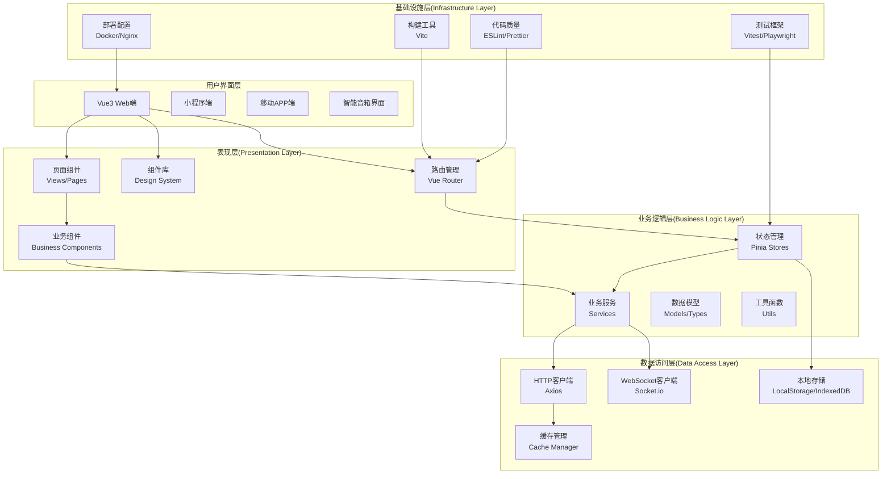
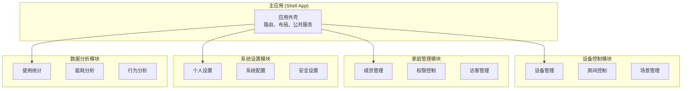
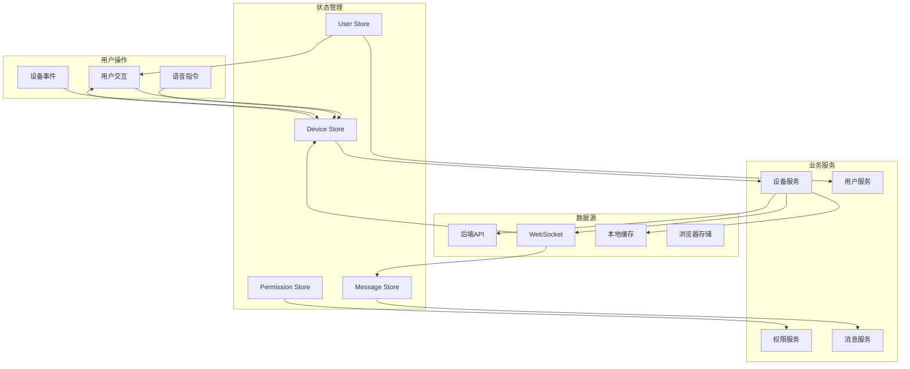
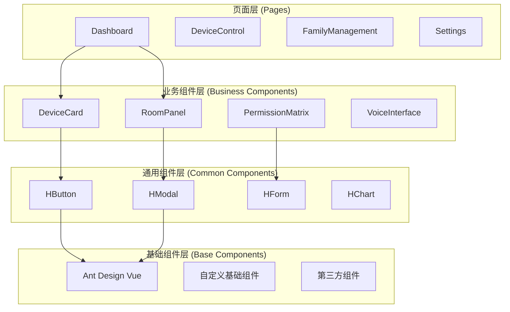
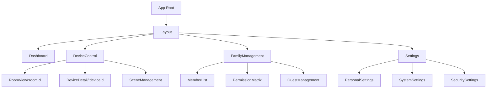

# HavenButler 前端架构设计文档

## 文档信息

| 项目 | 内容 |
|------|------|
| 文档名称 | HavenButler 前端架构设计 |
| 版本 | v1.0.0 |
| 创建日期 | 2024-09-12 |
| 最后更新 | 2024-09-12 |
| 文档状态 | 初稿 |
| 编写者 | Claude (基于BMAD架构代理) |

## 目录

1. [架构概述](#1-架构概述)
2. [技术选型](#2-技术选型)
3. [系统架构](#3-系统架构)
4. [数据流设计](#4-数据流设计)
5. [组件架构](#5-组件架构)
6. [路由设计](#6-路由设计)
7. [状态管理](#7-状态管理)
8. [样式系统](#8-样式系统)
9. [构建与部署](#9-构建与部署)
10. [性能优化](#10-性能优化)
11. [安全与权限](#11-安全与权限)
12. [测试策略](#12-测试策略)
13. [国际化支持](#13-国际化支持)
14. [移动端适配](#14-移动端适配)
15. [开发规范](#15-开发规范)

## 1. 架构概述

### 1.1 项目简介

HavenButler前端架构采用多端统一设计，支持Vue3 Web端、小程序、移动APP和智能音箱交互，为用户提供一致的智能家庭服务体验。

### 1.2 架构目标

- **多端一致性**：一套代码支持多端部署，降低维护成本
- **用户体验优先**：针对不同年龄层用户优化交互体验
- **性能优化**：确保快速响应和流畅交互
- **可扩展性**：支持业务快速迭代和功能扩展
- **安全性**：完善的权限控制和数据保护机制

### 1.3 核心特性

- 基于Vue3 + TypeScript的现代化前端架构
- 响应式设计，支持移动端到大屏的全尺寸适配
- 组件化设计系统，基于Ant Design Vue定制
- 状态管理采用Pinia，支持持久化和时间旅行
- 多语言国际化支持
- PWA支持，可离线使用核心功能
- 微前端架构，支持模块独立开发和部署

## 2. 技术选型

### 2.1 核心技术栈

| 技术类别 | 选择 | 版本 | 说明 |
|----------|------|------|------|
| 前端框架 | Vue3 | ^3.3.0 | 采用Composition API，更好的TypeScript支持 |
| 开发语言 | TypeScript | ^5.0.0 | 类型安全，提升开发效率 |
| 状态管理 | Pinia | ^2.1.0 | Vue3官方推荐状态管理库 |
| 路由管理 | Vue Router | ^4.2.0 | 官方路由解决方案 |
| UI组件库 | Ant Design Vue | ^4.0.0 | 企业级UI设计语言和组件库 |
| 构建工具 | Vite | ^4.4.0 | 快速冷启动，热重载 |
| 包管理器 | pnpm | ^8.6.0 | 高效的包管理工具 |
| CSS预处理器 | Sass | ^1.64.0 | 强大的CSS扩展语言 |
| 测试框架 | Vitest | ^0.34.0 | 基于Vite的单元测试框架 |
| E2E测试 | Playwright | ^1.37.0 | 跨浏览器端到端测试 |

### 2.2 开发工具链

| 工具类型 | 选择 | 说明 |
|----------|------|------|
| 代码格式化 | Prettier | 代码格式化工具 |
| 代码检查 | ESLint | JavaScript/TypeScript代码检查 |
| Git钩子 | Husky | Git提交前检查 |
| 提交规范 | Commitizen | 规范化提交信息 |
| Mock服务 | MSW | Service Worker级别的API Mock |
| 图标库 | @ant-design/icons-vue | Ant Design官方图标库 |
| 日期处理 | dayjs | 轻量级日期处理库 |
| HTTP客户端 | axios | Promise基础的HTTP客户端 |

### 2.3 技术选型依据

#### Vue3选择理由
- **性能优势**：比Vue2性能提升40%，支持Tree-shaking
- **Composition API**：更好的逻辑复用和TypeScript支持
- **生态成熟**：丰富的第三方库和工具链支持
- **团队熟悉度**：团队具备Vue开发经验

#### TypeScript选择理由
- **类型安全**：编译时发现错误，降低生产环境bug
- **IDE支持**：更好的代码提示和重构能力
- **团队协作**：类型定义即文档，提升协作效率
- **大型项目友好**：适合复杂业务逻辑的开发维护

#### Pinia选择理由
- **Vue3原生支持**：专为Vue3设计，完美集成
- **TypeScript友好**：天然支持TypeScript推断
- **模块化设计**：支持按功能模块拆分store
- **开发工具支持**：完整的Vue DevTools支持

## 3. 系统架构

### 3.1 整体架构图



### 3.2 微前端架构设计

采用Module Federation实现微前端架构，支持功能模块独立开发和部署：



### 3.3 层次结构详解

#### 3.3.1 用户界面层
- **Vue3 Web端**：主要桌面端界面，功能最完整
- **小程序端**：轻量级移动端体验，核心功能优先
- **移动APP端**：原生体验，离线功能支持
- **智能音箱界面**：语音交互优先，简化视觉界面

#### 3.3.2 表现层
- **路由管理**：基于Vue Router 4的声明式路由配置
- **组件库**：基于Ant Design Vue的定制化设计系统
- **页面组件**：业务页面级组件，负责布局和数据编排
- **业务组件**：可复用的业务组件，封装特定业务逻辑

#### 3.3.3 业务逻辑层
- **状态管理**：Pinia stores管理应用状态
- **业务服务**：封装业务逻辑，处理数据转换
- **数据模型**：TypeScript类型定义和数据模型
- **工具函数**：通用工具函数和业务工具函数

#### 3.3.4 数据访问层
- **HTTP客户端**：封装API调用，支持请求拦截和响应处理
- **WebSocket客户端**：实时数据通信，设备状态同步
- **本地存储**：用户偏好设置和离线数据存储
- **缓存管理**：接口数据缓存，提升用户体验

## 4. 数据流设计

### 4.1 数据流架构图



### 4.2 状态管理设计

#### 4.2.1 Store结构设计

```typescript
// stores/index.ts - 状态管理入口
export interface RootState {
  device: DeviceState
  user: UserState
  permission: PermissionState
  message: MessageState
  system: SystemState
}

// stores/device.ts - 设备状态管理
export interface DeviceState {
  devices: Device[]
  rooms: Room[]
  scenes: Scene[]
  activeDevice: Device | null
  deviceStatus: Record<string, DeviceStatus>
  loading: boolean
  error: string | null
}

// stores/user.ts - 用户状态管理
export interface UserState {
  currentUser: User | null
  familyMembers: FamilyMember[]
  preferences: UserPreferences
  isAuthenticated: boolean
  loading: boolean
}

// stores/permission.ts - 权限状态管理
export interface PermissionState {
  userPermissions: UserPermission[]
  devicePermissions: Record<string, DevicePermission>
  pendingRequests: PermissionRequest[]
  permissionMatrix: PermissionMatrix
}
```

#### 4.2.2 状态更新流程

```typescript
// 设备控制状态更新示例
export const useDeviceStore = defineStore('device', () => {
  const state = reactive<DeviceState>({
    devices: [],
    activeDevice: null,
    loading: false,
    error: null
  })

  // Actions
  const controlDevice = async (deviceId: string, command: DeviceCommand) => {
    state.loading = true
    state.error = null
    
    try {
      // 1. 本地状态立即更新（乐观更新）
      const device = state.devices.find(d => d.id === deviceId)
      if (device) {
        updateDeviceStatus(device, command)
      }
      
      // 2. 发送API请求
      const result = await deviceService.controlDevice(deviceId, command)
      
      // 3. 更新最终状态
      updateDeviceFromAPI(result)
      
    } catch (error) {
      // 4. 错误处理，回滚本地状态
      state.error = error.message
      revertDeviceStatus(deviceId)
    } finally {
      state.loading = false
    }
  }

  return {
    ...toRefs(state),
    controlDevice
  }
})
```

### 4.3 实时数据同步

#### 4.3.1 WebSocket连接管理

```typescript
// services/websocket.ts
export class WebSocketManager {
  private connections: Map<string, WebSocket> = new Map()
  private reconnectAttempts: Map<string, number> = new Map()
  private maxReconnectAttempts = 5
  
  connect(endpoint: string, options: WebSocketOptions) {
    const ws = new WebSocket(endpoint)
    
    ws.onopen = () => {
      console.log(`WebSocket connected: ${endpoint}`)
      this.resetReconnectAttempts(endpoint)
    }
    
    ws.onmessage = (event) => {
      this.handleMessage(endpoint, JSON.parse(event.data))
    }
    
    ws.onclose = () => {
      console.log(`WebSocket disconnected: ${endpoint}`)
      this.attemptReconnect(endpoint, options)
    }
    
    ws.onerror = (error) => {
      console.error(`WebSocket error: ${endpoint}`, error)
    }
    
    this.connections.set(endpoint, ws)
  }
  
  private handleMessage(endpoint: string, message: WebSocketMessage) {
    // 根据消息类型分发到对应的store
    switch (message.type) {
      case 'device_status_update':
        const deviceStore = useDeviceStore()
        deviceStore.updateDeviceStatus(message.data)
        break
      case 'permission_request':
        const permissionStore = usePermissionStore()
        permissionStore.addPendingRequest(message.data)
        break
      case 'system_notification':
        const messageStore = useMessageStore()
        messageStore.addNotification(message.data)
        break
    }
  }
}
```

#### 4.3.2 离线状态处理

```typescript
// composables/useOfflineSync.ts
export function useOfflineSync() {
  const isOnline = ref(navigator.onLine)
  const pendingActions = ref<PendingAction[]>([])
  
  // 监听网络状态变化
  window.addEventListener('online', () => {
    isOnline.value = true
    syncPendingActions()
  })
  
  window.addEventListener('offline', () => {
    isOnline.value = false
  })
  
  const addPendingAction = (action: PendingAction) => {
    if (!isOnline.value) {
      pendingActions.value.push(action)
      // 存储到本地存储
      localStorage.setItem('pendingActions', JSON.stringify(pendingActions.value))
    }
  }
  
  const syncPendingActions = async () => {
    if (!isOnline.value || pendingActions.value.length === 0) return
    
    for (const action of pendingActions.value) {
      try {
        await executeAction(action)
        // 移除已成功执行的动作
        const index = pendingActions.value.indexOf(action)
        pendingActions.value.splice(index, 1)
      } catch (error) {
        console.error('Failed to sync action:', action, error)
      }
    }
    
    // 更新本地存储
    localStorage.setItem('pendingActions', JSON.stringify(pendingActions.value))
  }
  
  return {
    isOnline: readonly(isOnline),
    addPendingAction,
    syncPendingActions
  }
}
```

## 5. 组件架构

### 5.1 组件分层设计



### 5.2 设计系统规范

#### 5.2.1 组件命名规范

```typescript
// 组件命名规范
export interface ComponentNamingConvention {
  // 页面组件：以View结尾
  pages: 'DashboardView' | 'DeviceControlView' | 'SettingsView'
  
  // 业务组件：业务含义明确
  business: 'DeviceCard' | 'PermissionRing' | 'VoiceInterface'
  
  // 通用组件：以H(Haven)前缀
  common: 'HButton' | 'HModal' | 'HForm' | 'HTable'
  
  // 布局组件：以Layout结尾
  layout: 'AppLayout' | 'PageLayout' | 'CardLayout'
}
```

#### 5.2.2 核心业务组件

##### DeviceCard组件
```vue
<!-- components/business/DeviceCard.vue -->
<template>
  <div class="device-card" :class="deviceCardClasses">
    <!-- 设备状态指示器 -->
    <div class="device-status">
      <DeviceStatusIndicator :status="device.status" />
      <span class="device-name">{{ device.name }}</span>
    </div>
    
    <!-- 权限环显示 -->
    <PermissionRing
      :permission-level="userPermission"
      :device-type="device.type"
      :size="48"
      @click="handlePermissionClick"
    />
    
    <!-- 设备控制区域 -->
    <div class="device-controls">
      <slot name="controls" :device="device" :permission="userPermission">
        <HButton 
          v-if="canControl" 
          @click="toggleDevice"
          :loading="loading"
        >
          {{ device.isOn ? '关闭' : '开启' }}
        </HButton>
      </slot>
    </div>
    
    <!-- 设备详情链接 -->
    <div class="device-details">
      <HButton 
        type="link" 
        @click="$emit('view-details', device)"
      >
        详细设置
      </HButton>
    </div>
  </div>
</template>

<script setup lang="ts">
interface Props {
  device: Device
  userPermission: number
  loading?: boolean
}

interface Emits {
  (e: 'toggle', device: Device): void
  (e: 'view-details', device: Device): void
  (e: 'permission-click', device: Device): void
}

const props = withDefaults(defineProps<Props>(), {
  loading: false
})

const emit = defineEmits<Emits>()

const deviceCardClasses = computed(() => ({
  'device-card--online': props.device.status === 'online',
  'device-card--offline': props.device.status === 'offline',
  'device-card--error': props.device.status === 'error'
}))

const canControl = computed(() => props.userPermission >= 3)

const toggleDevice = () => {
  emit('toggle', props.device)
}

const handlePermissionClick = () => {
  emit('permission-click', props.device)
}
</script>
```

##### PermissionRing组件
```vue
<!-- components/business/PermissionRing.vue -->
<template>
  <div class="permission-ring" :style="ringStyle">
    <svg :width="size" :height="size" class="permission-ring__svg">
      <!-- 背景圆环 -->
      <circle
        :cx="center"
        :cy="center"
        :r="radius"
        class="permission-ring__bg"
        :stroke-width="strokeWidth"
      />
      
      <!-- 权限进度圆环 -->
      <circle
        :cx="center"
        :cy="center"
        :r="radius"
        class="permission-ring__progress"
        :stroke-width="strokeWidth"
        :stroke-dasharray="circumference"
        :stroke-dashoffset="dashOffset"
        :style="progressStyle"
      />
      
      <!-- 冲突指示器 -->
      <circle
        v-if="hasConflict"
        :cx="center"
        :cy="center"
        :r="radius + 4"
        class="permission-ring__conflict"
        :stroke-width="2"
      />
    </svg>
    
    <!-- 中心内容 -->
    <div class="permission-ring__content">
      <Icon :name="deviceIcon" :size="size * 0.4" />
    </div>
  </div>
</template>

<script setup lang="ts">
interface Props {
  permissionLevel: number // 0-5权限等级
  deviceType: string
  size?: number
  hasConflict?: boolean
  interactive?: boolean
}

const props = withDefaults(defineProps<Props>(), {
  size: 48,
  hasConflict: false,
  interactive: false
})

const center = computed(() => props.size / 2)
const radius = computed(() => (props.size - 8) / 2)
const strokeWidth = computed(() => Math.max(2, props.size / 12))
const circumference = computed(() => 2 * Math.PI * radius.value)
const dashOffset = computed(() => 
  circumference.value * (1 - props.permissionLevel / 5)
)

const deviceIcon = computed(() => {
  const iconMap: Record<string, string> = {
    lighting: 'bulb',
    climate: 'temperature',
    security: 'lock',
    entertainment: 'play-circle'
  }
  return iconMap[props.deviceType] || 'device'
})

const progressStyle = computed(() => ({
  stroke: getPermissionColor(props.permissionLevel),
  transition: 'stroke-dashoffset 0.3s ease'
}))

const ringStyle = computed(() => ({
  cursor: props.interactive ? 'pointer' : 'default'
}))

function getPermissionColor(level: number): string {
  const colors = [
    '#d9d9d9', // 无权限
    '#fa8c16', // 紧急权限
    '#fadb14', // 查看权限
    '#1890ff', // 基础权限
    '#52c41a', // 高级权限
    '#13c2c2'  // 完全权限
  ]
  return colors[level] || colors[0]
}
</script>
```

##### VoiceInterface组件
```vue
<!-- components/business/VoiceInterface.vue -->
<template>
  <div class="voice-interface" :class="voiceInterfaceClasses">
    <!-- 语音状态显示 -->
    <div class="voice-status">
      <div class="voice-wave" v-show="isListening">
        <div 
          v-for="i in 5" 
          :key="i" 
          class="voice-wave__bar"
          :style="{ animationDelay: `${i * 0.1}s` }"
        />
      </div>
      
      <div class="voice-text" v-show="recognizedText">
        <span class="voice-text__content">{{ recognizedText }}</span>
        <Icon name="check-circle" v-if="isRecognized" class="voice-text__check" />
      </div>
    </div>
    
    <!-- 语音控制按钮 -->
    <div class="voice-controls">
      <HButton
        type="primary"
        shape="circle"
        :size="buttonSize"
        :loading="isProcessing"
        @mousedown="startListening"
        @mouseup="stopListening"
        @mouseleave="stopListening"
        class="voice-button"
      >
        <Icon name="microphone" />
      </HButton>
      
      <HButton
        type="default"
        @click="showTextInput = true"
        class="text-input-button"
      >
        <Icon name="keyboard" />
        文字输入
      </HButton>
    </div>
    
    <!-- 语音建议 -->
    <div class="voice-suggestions" v-if="suggestions.length">
      <div class="voice-suggestions__title">💡 您可以这样说：</div>
      <ul class="voice-suggestions__list">
        <li 
          v-for="suggestion in suggestions" 
          :key="suggestion"
          @click="$emit('text-command', suggestion)"
          class="voice-suggestions__item"
        >
          "{{ suggestion }}"
        </li>
      </ul>
    </div>
    
    <!-- 文字输入模态框 -->
    <HModal
      v-model:visible="showTextInput"
      title="文字输入"
      @ok="handleTextCommand"
    >
      <HInput
        v-model:value="textCommand"
        placeholder="请输入指令"
        @press-enter="handleTextCommand"
      />
    </HModal>
  </div>
</template>

<script setup lang="ts">
interface Props {
  suggestions?: string[]
  size?: 'small' | 'default' | 'large'
}

interface Emits {
  (e: 'voice-command', command: string): void
  (e: 'text-command', command: string): void
}

const props = withDefaults(defineProps<Props>(), {
  suggestions: () => [
    '调节客厅温度到25度',
    '打开所有灯光',
    '播放轻音乐',
    '切换到睡觉模式'
  ],
  size: 'default'
})

const emit = defineEmits<Emits>()

const isListening = ref(false)
const isProcessing = ref(false)
const isRecognized = ref(false)
const recognizedText = ref('')
const showTextInput = ref(false)
const textCommand = ref('')

const voiceInterfaceClasses = computed(() => ({
  'voice-interface--listening': isListening.value,
  'voice-interface--processing': isProcessing.value,
  [`voice-interface--${props.size}`]: true
}))

const buttonSize = computed(() => {
  const sizeMap = { small: 'small', default: 'large', large: 64 }
  return sizeMap[props.size]
})

let recognition: SpeechRecognition | null = null

onMounted(() => {
  if ('webkitSpeechRecognition' in window || 'SpeechRecognition' in window) {
    const SpeechRecognition = window.SpeechRecognition || window.webkitSpeechRecognition
    recognition = new SpeechRecognition()
    recognition.continuous = false
    recognition.interimResults = true
    recognition.lang = 'zh-CN'
    
    recognition.onstart = () => {
      isListening.value = true
    }
    
    recognition.onresult = (event) => {
      const result = event.results[event.results.length - 1]
      recognizedText.value = result[0].transcript
      
      if (result.isFinal) {
        isRecognized.value = true
        emit('voice-command', recognizedText.value)
      }
    }
    
    recognition.onend = () => {
      isListening.value = false
      isProcessing.value = false
    }
    
    recognition.onerror = (event) => {
      console.error('语音识别错误:', event.error)
      isListening.value = false
      isProcessing.value = false
    }
  }
})

const startListening = () => {
  if (recognition && !isListening.value) {
    recognizedText.value = ''
    isRecognized.value = false
    recognition.start()
  }
}

const stopListening = () => {
  if (recognition && isListening.value) {
    recognition.stop()
  }
}

const handleTextCommand = () => {
  if (textCommand.value.trim()) {
    emit('text-command', textCommand.value)
    textCommand.value = ''
    showTextInput.value = false
  }
}
</script>
```

### 5.3 组件通信模式

#### 5.3.1 父子组件通信
- **Props Down, Events Up**：标准的Vue组件通信模式
- **v-model双向绑定**：表单组件使用v-model简化数据绑定
- **Slots插槽**：提供组件内容定制能力

#### 5.3.2 跨层级组件通信
- **Provide/Inject**：依赖注入模式，适用于深层组件通信
- **Event Bus**：全局事件总线，用于紧急事件广播
- **Pinia Store**：状态管理，适用于共享状态

#### 5.3.3 组件间松耦合设计
```typescript
// composables/useComponentCommunication.ts
export function useComponentCommunication() {
  // 事件总线
  const eventBus = new EventTarget()
  
  const emit = (type: string, detail?: any) => {
    eventBus.dispatchEvent(new CustomEvent(type, { detail }))
  }
  
  const on = (type: string, listener: EventListener) => {
    eventBus.addEventListener(type, listener)
  }
  
  const off = (type: string, listener: EventListener) => {
    eventBus.removeEventListener(type, listener)
  }
  
  return { emit, on, off }
}

// 组件中使用
export default defineComponent({
  setup() {
    const { emit, on, off } = useComponentCommunication()
    
    // 发送事件
    const sendNotification = (message: string) => {
      emit('global-notification', { message, type: 'success' })
    }
    
    // 监听事件
    onMounted(() => {
      on('device-status-changed', handleDeviceStatusChange)
    })
    
    onUnmounted(() => {
      off('device-status-changed', handleDeviceStatusChange)
    })
    
    return { sendNotification }
  }
})
```

## 6. 路由设计

### 6.1 路由架构



### 6.2 路由配置

```typescript
// router/index.ts
import { createRouter, createWebHistory } from 'vue-router'
import { useUserStore } from '@/stores/user'
import type { RouteRecordRaw } from 'vue-router'

const routes: RouteRecordRaw[] = [
  {
    path: '/',
    name: 'Root',
    redirect: '/dashboard'
  },
  {
    path: '/login',
    name: 'Login',
    component: () => import('@/views/auth/LoginView.vue'),
    meta: { requiresAuth: false, layout: 'AuthLayout' }
  },
  {
    path: '/dashboard',
    name: 'Dashboard',
    component: () => import('@/views/DashboardView.vue'),
    meta: { 
      requiresAuth: true, 
      title: '智能家庭控制台',
      icon: 'home'
    }
  },
  {
    path: '/devices',
    name: 'DeviceControl',
    component: () => import('@/views/device/DeviceControlView.vue'),
    meta: { 
      requiresAuth: true, 
      title: '设备控制',
      icon: 'control'
    },
    children: [
      {
        path: 'rooms/:roomId',
        name: 'RoomView',
        component: () => import('@/views/device/RoomView.vue'),
        meta: { title: '房间控制' }
      },
      {
        path: 'detail/:deviceId',
        name: 'DeviceDetail',
        component: () => import('@/views/device/DeviceDetailView.vue'),
        meta: { title: '设备详情' }
      },
      {
        path: 'scenes',
        name: 'SceneManagement',
        component: () => import('@/views/device/SceneManagementView.vue'),
        meta: { title: '场景管理' }
      }
    ]
  },
  {
    path: '/family',
    name: 'FamilyManagement',
    component: () => import('@/views/family/FamilyManagementView.vue'),
    meta: { 
      requiresAuth: true,
      title: '家庭管理',
      icon: 'team',
      requiredPermission: 'family.manage'
    },
    children: [
      {
        path: 'members',
        name: 'MemberList',
        component: () => import('@/views/family/MemberListView.vue'),
        meta: { title: '成员管理' }
      },
      {
        path: 'permissions',
        name: 'PermissionMatrix',
        component: () => import('@/views/family/PermissionMatrixView.vue'),
        meta: { title: '权限管理' }
      },
      {
        path: 'guests',
        name: 'GuestManagement',
        component: () => import('@/views/family/GuestManagementView.vue'),
        meta: { title: '访客管理' }
      }
    ]
  },
  {
    path: '/messages',
    name: 'MessageCenter',
    component: () => import('@/views/MessageCenterView.vue'),
    meta: { 
      requiresAuth: true,
      title: '消息中心',
      icon: 'message'
    }
  },
  {
    path: '/settings',
    name: 'Settings',
    component: () => import('@/views/settings/SettingsView.vue'),
    meta: { 
      requiresAuth: true,
      title: '设置',
      icon: 'setting'
    },
    children: [
      {
        path: 'personal',
        name: 'PersonalSettings',
        component: () => import('@/views/settings/PersonalSettingsView.vue'),
        meta: { title: '个人设置' }
      },
      {
        path: 'system',
        name: 'SystemSettings',
        component: () => import('@/views/settings/SystemSettingsView.vue'),
        meta: { 
          title: '系统设置',
          requiredPermission: 'system.manage'
        }
      },
      {
        path: 'security',
        name: 'SecuritySettings',
        component: () => import('@/views/settings/SecuritySettingsView.vue'),
        meta: { 
          title: '安全设置',
          requiredPermission: 'security.manage'
        }
      }
    ]
  },
  // 紧急模式路由
  {
    path: '/emergency',
    name: 'Emergency',
    component: () => import('@/views/EmergencyView.vue'),
    meta: { 
      requiresAuth: true,
      layout: 'EmergencyLayout',
      title: '紧急模式',
      priority: 'high'
    }
  },
  // 404页面
  {
    path: '/:pathMatch(.*)*',
    name: 'NotFound',
    component: () => import('@/views/error/NotFoundView.vue'),
    meta: { layout: 'ErrorLayout' }
  }
]

const router = createRouter({
  history: createWebHistory(import.meta.env.BASE_URL),
  routes,
  scrollBehavior(to, from, savedPosition) {
    if (savedPosition) {
      return savedPosition
    } else {
      return { top: 0 }
    }
  }
})

// 全局路由守卫
router.beforeEach(async (to, from) => {
  const userStore = useUserStore()
  
  // 身份验证检查
  if (to.meta.requiresAuth && !userStore.isAuthenticated) {
    return { name: 'Login', query: { redirect: to.fullPath } }
  }
  
  // 权限检查
  if (to.meta.requiredPermission && !userStore.hasPermission(to.meta.requiredPermission)) {
    throw new Error('没有访问权限')
  }
  
  // 紧急模式检查
  if (userStore.isEmergencyMode && to.name !== 'Emergency') {
    return { name: 'Emergency' }
  }
  
  // 设置页面标题
  if (to.meta.title) {
    document.title = `${to.meta.title} - HavenButler`
  }
  
  return true
})

export default router
```

### 6.3 动态路由与权限控制

```typescript
// router/permission.ts
export interface RoutePermission {
  path: string
  roles: string[]
  permissions: string[]
  condition?: (user: User) => boolean
}

export const routePermissions: RoutePermission[] = [
  {
    path: '/family',
    roles: ['admin', 'manager'],
    permissions: ['family.manage'],
    condition: (user) => user.familyRole !== 'guest'
  },
  {
    path: '/settings/system',
    roles: ['admin'],
    permissions: ['system.manage'],
    condition: (user) => user.isSystemAdmin
  }
]

// 动态路由生成
export function generateDynamicRoutes(user: User): RouteRecordRaw[] {
  return routePermissions
    .filter(rp => checkRoutePermission(rp, user))
    .map(rp => createRouteFromPermission(rp))
}

function checkRoutePermission(routePermission: RoutePermission, user: User): boolean {
  // 检查角色
  if (routePermission.roles.length > 0 && 
      !routePermission.roles.includes(user.role)) {
    return false
  }
  
  // 检查权限
  if (routePermission.permissions.length > 0 &&
      !routePermission.permissions.every(p => user.permissions.includes(p))) {
    return false
  }
  
  // 检查自定义条件
  if (routePermission.condition && !routePermission.condition(user)) {
    return false
  }
  
  return true
}
```

### 6.4 路由懒加载与预加载

```typescript
// router/lazy-loading.ts
export const lazyLoad = (componentName: string) => {
  return defineAsyncComponent({
    loader: () => import(`@/views/${componentName}.vue`),
    loadingComponent: () => import('@/components/common/Loading.vue'),
    errorComponent: () => import('@/components/common/LoadError.vue'),
    delay: 200,
    timeout: 3000
  })
}

// 预加载策略
export function preloadRoutes() {
  const routes = [
    'DashboardView',
    'device/DeviceControlView',
    'MessageCenterView'
  ]
  
  // 空闲时预加载核心路由
  if ('requestIdleCallback' in window) {
    window.requestIdleCallback(() => {
      routes.forEach(route => {
        import(`@/views/${route}.vue`)
      })
    })
  }
}
```

## 7. 状态管理

### 7.1 Pinia Store设计

#### 7.1.1 Store结构

```typescript
// stores/types.ts - 状态管理类型定义
export interface StoreState {
  loading: boolean
  error: string | null
  lastUpdated: number
}

export interface DeviceState extends StoreState {
  devices: Device[]
  rooms: Room[]
  scenes: Scene[]
  activeDevice: Device | null
  deviceStatuses: Record<string, DeviceStatus>
  controlHistory: DeviceControlRecord[]
}

export interface UserState extends StoreState {
  currentUser: User | null
  familyMembers: FamilyMember[]
  preferences: UserPreferences
  isAuthenticated: boolean
  authToken: string | null
  refreshToken: string | null
}

export interface PermissionState extends StoreState {
  userPermissions: UserPermission[]
  devicePermissions: Record<string, DevicePermission[]>
  pendingRequests: PermissionRequest[]
  permissionMatrix: PermissionMatrix
  conflictResolution: ConflictResolution[]
}
```

#### 7.1.2 设备状态管理Store

```typescript
// stores/device.ts
export const useDeviceStore = defineStore('device', () => {
  // State
  const state = reactive<DeviceState>({
    devices: [],
    rooms: [],
    scenes: [],
    activeDevice: null,
    deviceStatuses: {},
    controlHistory: [],
    loading: false,
    error: null,
    lastUpdated: 0
  })
  
  // Getters
  const devicesByRoom = computed(() => {
    return state.devices.reduce((acc, device) => {
      const roomId = device.roomId
      if (!acc[roomId]) acc[roomId] = []
      acc[roomId].push(device)
      return acc
    }, {} as Record<string, Device[]>)
  })
  
  const onlineDeviceCount = computed(() => {
    return state.devices.filter(device => 
      state.deviceStatuses[device.id]?.status === 'online'
    ).length
  })
  
  const devicesByType = computed(() => {
    return groupBy(state.devices, 'type')
  })
  
  // Actions
  const fetchDevices = async () => {
    state.loading = true
    state.error = null
    
    try {
      const response = await deviceService.getDevices()
      state.devices = response.data
      state.lastUpdated = Date.now()
    } catch (error) {
      state.error = error.message
      throw error
    } finally {
      state.loading = false
    }
  }
  
  const controlDevice = async (deviceId: string, command: DeviceCommand) => {
    const device = state.devices.find(d => d.id === deviceId)
    if (!device) throw new Error('设备不存在')
    
    // 权限检查
    const permissionStore = usePermissionStore()
    if (!permissionStore.canControlDevice(deviceId)) {
      throw new Error('没有控制权限')
    }
    
    state.loading = true
    
    try {
      // 乐观更新
      updateDeviceStatusOptimistic(device, command)
      
      // 发送控制指令
      const result = await deviceService.controlDevice(deviceId, command)
      
      // 更新设备状态
      updateDeviceStatus(deviceId, result.status)
      
      // 记录控制历史
      addControlHistory({
        deviceId,
        command,
        timestamp: Date.now(),
        userId: useUserStore().currentUser?.id,
        success: true
      })
      
    } catch (error) {
      // 回滚乐观更新
      revertDeviceStatus(deviceId)
      
      // 记录失败历史
      addControlHistory({
        deviceId,
        command,
        timestamp: Date.now(),
        userId: useUserStore().currentUser?.id,
        success: false,
        error: error.message
      })
      
      throw error
    } finally {
      state.loading = false
    }
  }
  
  const updateDeviceStatus = (deviceId: string, status: DeviceStatus) => {
    state.deviceStatuses[deviceId] = {
      ...state.deviceStatuses[deviceId],
      ...status,
      lastUpdated: Date.now()
    }
  }
  
  const addDevice = async (deviceData: CreateDeviceRequest) => {
    state.loading = true
    
    try {
      const newDevice = await deviceService.addDevice(deviceData)
      state.devices.push(newDevice)
      
      // 初始化设备状态
      state.deviceStatuses[newDevice.id] = {
        status: 'offline',
        lastSeen: Date.now(),
        lastUpdated: Date.now()
      }
      
    } catch (error) {
      state.error = error.message
      throw error
    } finally {
      state.loading = false
    }
  }
  
  const removeDevice = async (deviceId: string) => {
    const index = state.devices.findIndex(d => d.id === deviceId)
    if (index === -1) return
    
    state.loading = true
    
    try {
      await deviceService.removeDevice(deviceId)
      
      // 移除设备和相关状态
      state.devices.splice(index, 1)
      delete state.deviceStatuses[deviceId]
      
      // 移除相关权限
      const permissionStore = usePermissionStore()
      permissionStore.removeDevicePermissions(deviceId)
      
    } catch (error) {
      state.error = error.message
      throw error
    } finally {
      state.loading = false
    }
  }
  
  // 辅助函数
  const updateDeviceStatusOptimistic = (device: Device, command: DeviceCommand) => {
    const currentStatus = state.deviceStatuses[device.id]
    const newStatus = predictDeviceStatus(currentStatus, command)
    updateDeviceStatus(device.id, newStatus)
  }
  
  const revertDeviceStatus = (deviceId: string) => {
    // 这里可以实现更复杂的回滚逻辑
    // 例如从历史状态中恢复或重新获取服务器状态
    fetchDeviceStatus(deviceId)
  }
  
  const addControlHistory = (record: DeviceControlRecord) => {
    state.controlHistory.unshift(record)
    
    // 限制历史记录数量
    if (state.controlHistory.length > 1000) {
      state.controlHistory = state.controlHistory.slice(0, 1000)
    }
  }
  
  // WebSocket事件处理
  const handleDeviceStatusUpdate = (update: DeviceStatusUpdate) => {
    updateDeviceStatus(update.deviceId, update.status)
    
    // 通知其他组件
    const { emit } = useComponentCommunication()
    emit('device-status-changed', { deviceId: update.deviceId, status: update.status })
  }
  
  // 返回公开接口
  return {
    // State
    devices: readonly(toRef(state, 'devices')),
    rooms: readonly(toRef(state, 'rooms')),
    scenes: readonly(toRef(state, 'scenes')),
    activeDevice: readonly(toRef(state, 'activeDevice')),
    deviceStatuses: readonly(toRef(state, 'deviceStatuses')),
    loading: readonly(toRef(state, 'loading')),
    error: readonly(toRef(state, 'error')),
    
    // Getters
    devicesByRoom,
    onlineDeviceCount,
    devicesByType,
    
    // Actions
    fetchDevices,
    controlDevice,
    updateDeviceStatus,
    addDevice,
    removeDevice,
    handleDeviceStatusUpdate
  }
})
```

#### 7.1.3 权限管理Store

```typescript
// stores/permission.ts
export const usePermissionStore = defineStore('permission', () => {
  const state = reactive<PermissionState>({
    userPermissions: [],
    devicePermissions: {},
    pendingRequests: [],
    permissionMatrix: {},
    conflictResolution: [],
    loading: false,
    error: null,
    lastUpdated: 0
  })
  
  // Getters
  const canControlDevice = (deviceId: string) => {
    return (userId?: string) => {
      const userStore = useUserStore()
      const currentUserId = userId || userStore.currentUser?.id
      
      if (!currentUserId) return false
      
      const permissions = state.devicePermissions[deviceId] || []
      const userPermission = permissions.find(p => p.userId === currentUserId)
      
      // 权限等级：0-无权限，1-紧急权限，2-查看权限，3-基础权限，4-高级权限，5-完全权限
      return (userPermission?.level || 0) >= 3
    }
  }
  
  const getPermissionLevel = (deviceId: string, userId?: string) => {
    const userStore = useUserStore()
    const currentUserId = userId || userStore.currentUser?.id
    
    if (!currentUserId) return 0
    
    const permissions = state.devicePermissions[deviceId] || []
    const userPermission = permissions.find(p => p.userId === currentUserId)
    
    return userPermission?.level || 0
  }
  
  const hasPermissionConflict = (deviceId: string) => {
    const permissions = state.devicePermissions[deviceId] || []
    const activeUsers = permissions.filter(p => p.isActive && p.level >= 3)
    
    return activeUsers.length > 1
  }
  
  const getPendingRequestsCount = computed(() => state.pendingRequests.length)
  
  // Actions
  const requestPermission = async (request: PermissionRequest) => {
    state.loading = true
    
    try {
      // 添加到待处理请求
      state.pendingRequests.push({
        ...request,
        id: generateId(),
        timestamp: Date.now(),
        status: 'pending'
      })
      
      // 发送权限申请
      await permissionService.requestPermission(request)
      
      // 通知相关管理员
      const messageStore = useMessageStore()
      messageStore.addNotification({
        type: 'permission_request',
        title: '权限申请',
        content: `${request.userName}申请${request.deviceName}的控制权限`,
        priority: 'normal',
        recipients: request.approvers
      })
      
    } catch (error) {
      state.error = error.message
      throw error
    } finally {
      state.loading = false
    }
  }
  
  const approvePermissionRequest = async (requestId: string, approval: PermissionApproval) => {
    const request = state.pendingRequests.find(r => r.id === requestId)
    if (!request) throw new Error('权限申请不存在')
    
    state.loading = true
    
    try {
      // 发送审批结果
      await permissionService.approvePermissionRequest(requestId, approval)
      
      if (approval.approved) {
        // 更新设备权限
        if (!state.devicePermissions[request.deviceId]) {
          state.devicePermissions[request.deviceId] = []
        }
        
        state.devicePermissions[request.deviceId].push({
          userId: request.userId,
          deviceId: request.deviceId,
          level: approval.permissionLevel,
          expiresAt: approval.expiresAt,
          isActive: true,
          grantedBy: useUserStore().currentUser?.id,
          grantedAt: Date.now()
        })
      }
      
      // 移除待处理请求
      const index = state.pendingRequests.findIndex(r => r.id === requestId)
      if (index !== -1) {
        state.pendingRequests.splice(index, 1)
      }
      
      // 通知申请人
      const messageStore = useMessageStore()
      messageStore.addNotification({
        type: 'permission_response',
        title: approval.approved ? '权限申请已批准' : '权限申请被拒绝',
        content: approval.reason || '无',
        priority: 'normal',
        recipients: [request.userId]
      })
      
    } catch (error) {
      state.error = error.message
      throw error
    } finally {
      state.loading = false
    }
  }
  
  const revokePermission = async (deviceId: string, userId: string) => {
    state.loading = true
    
    try {
      await permissionService.revokePermission(deviceId, userId)
      
      // 更新本地状态
      const permissions = state.devicePermissions[deviceId] || []
      const index = permissions.findIndex(p => p.userId === userId)
      
      if (index !== -1) {
        permissions.splice(index, 1)
      }
      
    } catch (error) {
      state.error = error.message
      throw error
    } finally {
      state.loading = false
    }
  }
  
  const resolvePermissionConflict = async (deviceId: string, resolution: ConflictResolution) => {
    state.loading = true
    
    try {
      await permissionService.resolveConflict(deviceId, resolution)
      
      // 更新冲突解决方案
      state.conflictResolution.push({
        ...resolution,
        deviceId,
        timestamp: Date.now(),
        resolvedBy: useUserStore().currentUser?.id
      })
      
      // 根据解决方案更新权限
      applyConflictResolution(deviceId, resolution)
      
    } catch (error) {
      state.error = error.message
      throw error
    } finally {
      state.loading = false
    }
  }
  
  // 辅助函数
  const applyConflictResolution = (deviceId: string, resolution: ConflictResolution) => {
    const permissions = state.devicePermissions[deviceId] || []
    
    switch (resolution.strategy) {
      case 'priority_based':
        // 基于优先级的解决方案
        permissions.forEach(p => {
          p.isActive = p.userId === resolution.priorityUserId
        })
        break
        
      case 'time_sharing':
        // 时间分片解决方案
        permissions.forEach(p => {
          const timeSlot = resolution.timeSlots?.find(ts => ts.userId === p.userId)
          p.isActive = timeSlot ? isInTimeSlot(timeSlot) : false
        })
        break
        
      case 'voting':
        // 投票解决方案
        permissions.forEach(p => {
          p.isActive = resolution.votingResult?.winnerIds.includes(p.userId) || false
        })
        break
    }
  }
  
  const isInTimeSlot = (timeSlot: TimeSlot): boolean => {
    const now = new Date()
    const currentTime = now.getHours() * 60 + now.getMinutes()
    const slotStart = parseTime(timeSlot.startTime)
    const slotEnd = parseTime(timeSlot.endTime)
    
    return currentTime >= slotStart && currentTime < slotEnd
  }
  
  return {
    // State
    userPermissions: readonly(toRef(state, 'userPermissions')),
    devicePermissions: readonly(toRef(state, 'devicePermissions')),
    pendingRequests: readonly(toRef(state, 'pendingRequests')),
    loading: readonly(toRef(state, 'loading')),
    error: readonly(toRef(state, 'error')),
    
    // Getters
    canControlDevice,
    getPermissionLevel,
    hasPermissionConflict,
    getPendingRequestsCount,
    
    // Actions
    requestPermission,
    approvePermissionRequest,
    revokePermission,
    resolvePermissionConflict
  }
})
```

### 7.2 状态持久化

```typescript
// plugins/persistence.ts
export function createPersistedState(key: string, paths?: string[]) {
  return {
    beforeCreate() {
      // 从localStorage恢复状态
      const saved = localStorage.getItem(key)
      if (saved) {
        try {
          const parsed = JSON.parse(saved)
          if (paths) {
            // 只恢复指定路径的状态
            paths.forEach(path => {
              set(this.$state, path, get(parsed, path))
            })
          } else {
            // 恢复整个状态
            Object.assign(this.$state, parsed)
          }
        } catch (error) {
          console.warn(`Failed to restore state for ${key}:`, error)
        }
      }
    },
    
    afterCreate() {
      // 监听状态变化并保存
      this.$subscribe((mutation, state) => {
        try {
          let dataToSave = state
          
          // 只保存指定路径的状态
          if (paths) {
            dataToSave = {}
            paths.forEach(path => {
              set(dataToSave, path, get(state, path))
            })
          }
          
          localStorage.setItem(key, JSON.stringify(dataToSave))
        } catch (error) {
          console.warn(`Failed to persist state for ${key}:`, error)
        }
      }, { detached: true })
    }
  }
}

// 在store中使用
export const useUserStore = defineStore('user', () => {
  // ... store implementation
}, {
  // 持久化配置
  persist: createPersistedState('user-store', [
    'preferences',
    'authToken',
    'refreshToken'
  ])
})
```

### 7.3 状态同步与一致性

```typescript
// composables/useStateSync.ts
export function useStateSync() {
  const syncStore = reactive({
    lastSyncTime: 0,
    syncInProgress: false,
    conflictResolution: 'server-wins' as 'server-wins' | 'client-wins' | 'manual'
  })
  
  const syncWithServer = async () => {
    if (syncStore.syncInProgress) return
    
    syncStore.syncInProgress = true
    
    try {
      // 获取所有store的状态
      const stores = {
        device: useDeviceStore(),
        user: useUserStore(),
        permission: usePermissionStore()
      }
      
      // 构建同步请求
      const syncRequest = {
        lastSyncTime: syncStore.lastSyncTime,
        clientState: extractSyncableState(stores),
        conflicts: []
      }
      
      // 发送同步请求
      const syncResponse = await apiClient.post('/sync', syncRequest)
      
      // 处理同步响应
      await applySyncResponse(stores, syncResponse.data)
      
      syncStore.lastSyncTime = Date.now()
      
    } catch (error) {
      console.error('State sync failed:', error)
      throw error
    } finally {
      syncStore.syncInProgress = false
    }
  }
  
  const extractSyncableState = (stores: any) => {
    return {
      devices: stores.device.devices,
      userPermissions: stores.permission.userPermissions,
      preferences: stores.user.preferences
    }
  }
  
  const applySyncResponse = async (stores: any, syncData: SyncResponse) => {
    // 处理设备状态同步
    if (syncData.devices) {
      await syncDevices(stores.device, syncData.devices)
    }
    
    // 处理权限同步
    if (syncData.permissions) {
      await syncPermissions(stores.permission, syncData.permissions)
    }
    
    // 处理冲突
    if (syncData.conflicts && syncData.conflicts.length > 0) {
      await resolveConflicts(stores, syncData.conflicts)
    }
  }
  
  const resolveConflicts = async (stores: any, conflicts: SyncConflict[]) => {
    for (const conflict of conflicts) {
      switch (syncStore.conflictResolution) {
        case 'server-wins':
          applyServerState(stores, conflict.serverState)
          break
        case 'client-wins':
          await pushClientState(stores, conflict.path)
          break
        case 'manual':
          await showConflictResolutionDialog(conflict)
          break
      }
    }
  }
  
  return {
    syncStore: readonly(syncStore),
    syncWithServer
  }
}
```

## 8. 样式系统

### 8.1 设计Token系统

```scss
// styles/tokens/_colors.scss
:root {
  // 基础色彩
  --color-primary: #1890ff;
  --color-primary-light: #40a9ff;
  --color-primary-dark: #096dd9;
  
  --color-secondary: #52c41a;
  --color-secondary-light: #73d13d;
  --color-secondary-dark: #389e0d;
  
  --color-accent: #fa8c16;
  --color-accent-light: #ffa940;
  --color-accent-dark: #d46b08;
  
  // 状态色彩
  --color-success: #52c41a;
  --color-warning: #fadb14;
  --color-error: #f5222d;
  --color-info: #1890ff;
  
  // 中性色彩
  --color-white: #ffffff;
  --color-gray-50: #fafafa;
  --color-gray-100: #f5f5f5;
  --color-gray-200: #f0f0f0;
  --color-gray-300: #d9d9d9;
  --color-gray-400: #bfbfbf;
  --color-gray-500: #8c8c8c;
  --color-gray-600: #595959;
  --color-gray-700: #434343;
  --color-gray-800: #262626;
  --color-gray-900: #1f1f1f;
  --color-black: #000000;
  
  // 权限状态色彩
  --permission-none: var(--color-gray-300);
  --permission-emergency: var(--color-accent);
  --permission-view: var(--color-warning);
  --permission-basic: var(--color-primary);
  --permission-advanced: var(--color-secondary);
  --permission-full: #13c2c2;
  
  // 设备状态色彩
  --device-online: var(--color-secondary);
  --device-offline: var(--color-gray-400);
  --device-connecting: var(--color-warning);
  --device-error: var(--color-error);
  --device-maintenance: var(--color-accent);
}
```

```scss
// styles/tokens/_typography.scss
:root {
  // 字体家族
  --font-family-primary: 'PingFang SC', 'Microsoft YaHei', -apple-system, BlinkMacSystemFont, sans-serif;
  --font-family-secondary: 'SF Pro Display', 'Helvetica Neue', Arial, sans-serif;
  --font-family-mono: 'SF Mono', Monaco, 'Cascadia Code', Consolas, monospace;
  
  // 字体大小 - 基于16px基准
  --font-size-xs: 0.75rem;   // 12px
  --font-size-sm: 0.875rem;  // 14px
  --font-size-base: 1rem;    // 16px
  --font-size-lg: 1.125rem;  // 18px
  --font-size-xl: 1.25rem;   // 20px
  --font-size-2xl: 1.5rem;   // 24px
  --font-size-3xl: 1.75rem;  // 28px
  --font-size-4xl: 2rem;     // 32px
  
  // 字体粗细
  --font-weight-light: 300;
  --font-weight-normal: 400;
  --font-weight-medium: 500;
  --font-weight-semibold: 600;
  --font-weight-bold: 700;
  
  // 行高
  --line-height-tight: 1.2;
  --line-height-normal: 1.5;
  --line-height-relaxed: 1.8;
}

// 老人友好主题
[data-theme="elder"] {
  --font-size-base: 1.125rem;  // 18px
  --font-size-lg: 1.25rem;     // 20px
  --font-size-xl: 1.375rem;    // 22px
  --font-size-2xl: 1.625rem;   // 26px
  --font-size-3xl: 2rem;       // 32px
  --line-height-normal: 1.8;
}
```

```scss
// styles/tokens/_spacing.scss
:root {
  // 间距系统 - 基于8px网格
  --spacing-0: 0;
  --spacing-1: 0.25rem;   // 4px
  --spacing-2: 0.5rem;    // 8px
  --spacing-3: 0.75rem;   // 12px
  --spacing-4: 1rem;      // 16px
  --spacing-5: 1.25rem;   // 20px
  --spacing-6: 1.5rem;    // 24px
  --spacing-8: 2rem;      // 32px
  --spacing-10: 2.5rem;   // 40px
  --spacing-12: 3rem;     // 48px
  --spacing-16: 4rem;     // 64px
  --spacing-20: 5rem;     // 80px
  --spacing-24: 6rem;     // 96px
  
  // 容器最大宽度
  --container-sm: 640px;
  --container-md: 768px;
  --container-lg: 1024px;
  --container-xl: 1280px;
  --container-2xl: 1536px;
  
  // 边框半径
  --radius-none: 0;
  --radius-sm: 0.125rem;   // 2px
  --radius-base: 0.25rem;  // 4px
  --radius-md: 0.375rem;   // 6px
  --radius-lg: 0.5rem;     // 8px
  --radius-xl: 0.75rem;    // 12px
  --radius-2xl: 1rem;      // 16px
  --radius-full: 9999px;   // 完全圆角
}
```

### 8.2 组件样式架构

```scss
// styles/components/_device-card.scss
.device-card {
  // 基础样式
  position: relative;
  padding: var(--spacing-4);
  background: var(--color-white);
  border: 1px solid var(--color-gray-200);
  border-radius: var(--radius-lg);
  box-shadow: 0 2px 8px rgba(0, 0, 0, 0.06);
  transition: all 0.2s cubic-bezier(0.4, 0, 0.2, 1);
  
  // 悬停效果
  &:hover {
    border-color: var(--color-primary-light);
    box-shadow: 0 4px 16px rgba(0, 0, 0, 0.12);
    transform: translateY(-2px);
  }
  
  // 状态变体
  &--online {
    border-left: 4px solid var(--device-online);
    
    .device-card__status {
      color: var(--device-online);
    }
  }
  
  &--offline {
    opacity: 0.6;
    
    .device-card__status {
      color: var(--device-offline);
    }
  }
  
  &--error {
    border-left: 4px solid var(--device-error);
    background: rgba(245, 34, 45, 0.02);
    
    .device-card__status {
      color: var(--device-error);
    }
  }
  
  // 响应式适配
  @media (max-width: 768px) {
    padding: var(--spacing-3);
    
    .device-card__controls {
      flex-direction: column;
      gap: var(--spacing-2);
    }
  }
  
  // 高对比度模式
  @media (prefers-contrast: high) {
    border-width: 2px;
    box-shadow: none;
    
    &:hover {
      box-shadow: 0 0 0 3px var(--color-primary);
    }
  }
  
  // 减少动画模式
  @media (prefers-reduced-motion: reduce) {
    transition: none;
    
    &:hover {
      transform: none;
    }
  }
}

// 设备卡片内部布局
.device-card__header {
  display: flex;
  justify-content: space-between;
  align-items: flex-start;
  margin-bottom: var(--spacing-3);
}

.device-card__status {
  display: flex;
  align-items: center;
  gap: var(--spacing-2);
  font-size: var(--font-size-sm);
  font-weight: var(--font-weight-medium);
}

.device-card__name {
  font-size: var(--font-size-lg);
  font-weight: var(--font-weight-semibold);
  color: var(--color-gray-800);
  margin: 0 0 var(--spacing-2) 0;
}

.device-card__controls {
  display: flex;
  gap: var(--spacing-2);
  align-items: center;
  margin-top: var(--spacing-4);
}

.device-card__details {
  margin-top: var(--spacing-3);
  padding-top: var(--spacing-3);
  border-top: 1px solid var(--color-gray-200);
}
```

### 8.3 响应式设计系统

```scss
// styles/mixins/_responsive.scss
// 断点定义
$breakpoints: (
  'mobile': 0px,
  'tablet': 768px,
  'desktop': 1024px,
  'wide': 1440px
);

// 响应式混入
@mixin respond-to($breakpoint) {
  $size: map-get($breakpoints, $breakpoint);
  
  @if $breakpoint == 'mobile' {
    @media (max-width: 767px) {
      @content;
    }
  } @else {
    @media (min-width: $size) {
      @content;
    }
  }
}

// 响应式字体大小
@mixin responsive-font-size($mobile, $tablet: null, $desktop: null) {
  font-size: $mobile;
  
  @if $tablet {
    @include respond-to('tablet') {
      font-size: $tablet;
    }
  }
  
  @if $desktop {
    @include respond-to('desktop') {
      font-size: $desktop;
    }
  }
}

// 响应式间距
@mixin responsive-spacing($property, $mobile, $tablet: null, $desktop: null) {
  #{$property}: $mobile;
  
  @if $tablet {
    @include respond-to('tablet') {
      #{$property}: $tablet;
    }
  }
  
  @if $desktop {
    @include respond-to('desktop') {
      #{$property}: $desktop;
    }
  }
}
```

### 8.4 主题切换系统

```typescript
// composables/useTheme.ts
export type Theme = 'light' | 'dark' | 'elder' | 'high-contrast'

export function useTheme() {
  const currentTheme = ref<Theme>('light')
  
  // 从localStorage恢复主题设置
  const savedTheme = localStorage.getItem('theme') as Theme
  if (savedTheme) {
    currentTheme.value = savedTheme
  }
  
  // 应用主题
  const applyTheme = (theme: Theme) => {
    // 移除旧主题类
    document.documentElement.className = document.documentElement.className
      .replace(/data-theme-\w+/g, '')
    
    // 添加新主题类
    document.documentElement.setAttribute('data-theme', theme)
    
    // 更新状态
    currentTheme.value = theme
    
    // 保存到localStorage
    localStorage.setItem('theme', theme)
    
    // 通知其他组件
    window.dispatchEvent(new CustomEvent('theme-changed', { detail: theme }))
  }
  
  // 切换主题
  const toggleTheme = () => {
    const themes: Theme[] = ['light', 'dark', 'elder', 'high-contrast']
    const currentIndex = themes.indexOf(currentTheme.value)
    const nextIndex = (currentIndex + 1) % themes.length
    applyTheme(themes[nextIndex])
  }
  
  // 检测系统主题偏好
  const detectSystemTheme = () => {
    if (window.matchMedia('(prefers-color-scheme: dark)').matches) {
      return 'dark'
    } else if (window.matchMedia('(prefers-contrast: high)').matches) {
      return 'high-contrast'
    }
    return 'light'
  }
  
  // 监听系统主题变化
  const watchSystemTheme = () => {
    const darkModeQuery = window.matchMedia('(prefers-color-scheme: dark)')
    const highContrastQuery = window.matchMedia('(prefers-contrast: high)')
    
    darkModeQuery.addListener((e) => {
      if (e.matches && currentTheme.value === 'light') {
        applyTheme('dark')
      } else if (!e.matches && currentTheme.value === 'dark') {
        applyTheme('light')
      }
    })
    
    highContrastQuery.addListener((e) => {
      if (e.matches) {
        applyTheme('high-contrast')
      }
    })
  }
  
  // 初始化主题
  onMounted(() => {
    applyTheme(currentTheme.value)
    watchSystemTheme()
  })
  
  return {
    currentTheme: readonly(currentTheme),
    applyTheme,
    toggleTheme,
    detectSystemTheme
  }
}
```

```scss
// styles/themes/_dark.scss
[data-theme="dark"] {
  // 重新定义暗色主题变量
  --color-white: #1f1f1f;
  --color-gray-50: #262626;
  --color-gray-100: #2f2f2f;
  --color-gray-200: #404040;
  --color-gray-300: #595959;
  --color-gray-400: #8c8c8c;
  --color-gray-500: #bfbfbf;
  --color-gray-600: #d9d9d9;
  --color-gray-700: #f0f0f0;
  --color-gray-800: #f5f5f5;
  --color-gray-900: #fafafa;
  --color-black: #ffffff;
  
  // 调整组件在暗色主题下的样式
  .device-card {
    background: var(--color-gray-100);
    border-color: var(--color-gray-200);
    
    &:hover {
      background: var(--color-gray-200);
    }
  }
  
  .app-header {
    background: var(--color-gray-50);
    border-color: var(--color-gray-200);
  }
}
```

## 9. 构建与部署

### 9.1 构建配置

```typescript
// vite.config.ts
import { defineConfig } from 'vite'
import vue from '@vitejs/plugin-vue'
import { resolve } from 'path'
import { createHtmlPlugin } from 'vite-plugin-html'
import { visualizer } from 'rollup-plugin-visualizer'
import { VitePWA } from 'vite-plugin-pwa'

export default defineConfig({
  plugins: [
    vue(),
    
    // HTML模板插件
    createHtmlPlugin({
      inject: {
        data: {
          title: 'HavenButler - 智能家庭服务平台',
          description: '为您的家庭提供智能化控制和管理服务'
        }
      }
    }),
    
    // PWA插件
    VitePWA({
      registerType: 'autoUpdate',
      workbox: {
        globPatterns: ['**/*.{js,css,html,ico,png,svg}'],
        runtimeCaching: [
          {
            urlPattern: /^https:\/\/api\.havenbutler\.com\//,
            handler: 'NetworkFirst',
            options: {
              cacheName: 'api-cache',
              cacheableResponse: {
                statuses: [0, 200]
              }
            }
          }
        ]
      },
      includeAssets: ['favicon.ico', 'apple-touch-icon.png', 'masked-icon.svg'],
      manifest: {
        name: 'HavenButler 智能家庭',
        short_name: 'HavenButler',
        description: '智能家庭控制平台',
        theme_color: '#1890ff',
        background_color: '#ffffff',
        display: 'standalone',
        icons: [
          {
            src: 'pwa-192x192.png',
            sizes: '192x192',
            type: 'image/png'
          },
          {
            src: 'pwa-512x512.png',
            sizes: '512x512',
            type: 'image/png'
          }
        ]
      }
    }),
    
    // 构建分析插件
    process.env.ANALYZE && visualizer({
      filename: 'dist/stats.html',
      open: true,
      gzipSize: true
    })
  ],
  
  resolve: {
    alias: {
      '@': resolve(__dirname, 'src'),
      '@components': resolve(__dirname, 'src/components'),
      '@views': resolve(__dirname, 'src/views'),
      '@stores': resolve(__dirname, 'src/stores'),
      '@utils': resolve(__dirname, 'src/utils'),
      '@api': resolve(__dirname, 'src/api'),
      '@styles': resolve(__dirname, 'src/styles')
    }
  },
  
  css: {
    preprocessorOptions: {
      scss: {
        additionalData: `
          @import "@/styles/variables.scss";
          @import "@/styles/mixins.scss";
        `
      }
    }
  },
  
  build: {
    // 构建输出目录
    outDir: 'dist',
    
    // 静态资源内联阈值
    assetsInlineLimit: 4096,
    
    // 启用/禁用 CSS 代码分割
    cssCodeSplit: true,
    
    // 构建后是否生成 source map 文件
    sourcemap: process.env.NODE_ENV === 'development',
    
    // 设置最终构建的浏览器兼容目标
    target: 'es2015',
    
    // 代码分块策略
    rollupOptions: {
      output: {
        manualChunks: {
          // 框架核心
          'vendor-vue': ['vue', 'vue-router', 'pinia'],
          
          // UI组件库
          'vendor-ui': ['ant-design-vue'],
          
          // 工具库
          'vendor-utils': ['axios', 'dayjs', 'lodash-es'],
          
          // 图表库
          'vendor-charts': ['echarts'],
          
          // 多媒体处理
          'vendor-media': ['@/utils/audio', '@/utils/image']
        }
      }
    },
    
    // 压缩配置
    minify: 'terser',
    terserOptions: {
      compress: {
        drop_console: process.env.NODE_ENV === 'production',
        drop_debugger: true
      }
    }
  },
  
  server: {
    port: 3000,
    open: true,
    cors: true,
    
    // 代理配置
    proxy: {
      '/api': {
        target: 'http://localhost:8080',
        changeOrigin: true,
        rewrite: (path) => path.replace(/^\/api/, '')
      },
      '/ws': {
        target: 'ws://localhost:8080',
        ws: true,
        changeOrigin: true
      }
    }
  },
  
  preview: {
    port: 4173,
    cors: true
  },
  
  // 环境变量配置
  define: {
    __APP_VERSION__: JSON.stringify(process.env.npm_package_version)
  }
})
```

### 9.2 Docker化部署

```dockerfile
# Dockerfile
# 多阶段构建：构建阶段
FROM node:18-alpine as build-stage

# 设置工作目录
WORKDIR /app

# 安装pnpm
RUN npm install -g pnpm

# 复制package.json和pnpm-lock.yaml
COPY package*.json pnpm-lock.yaml ./

# 安装依赖
RUN pnpm install --frozen-lockfile

# 复制源代码
COPY . .

# 构建应用
RUN pnpm run build

# 生产阶段
FROM nginx:alpine as production-stage

# 复制nginx配置
COPY docker/nginx.conf /etc/nginx/nginx.conf

# 复制构建产物到nginx目录
COPY --from=build-stage /app/dist /usr/share/nginx/html

# 暴露端口
EXPOSE 80

# 健康检查
HEALTHCHECK --interval=30s --timeout=10s --start-period=5s --retries=3 \
  CMD curl -f http://localhost/ || exit 1

# 启动nginx
CMD ["nginx", "-g", "daemon off;"]
```

```nginx
# docker/nginx.conf
user nginx;
worker_processes auto;
error_log /var/log/nginx/error.log warn;
pid /var/run/nginx.pid;

events {
    worker_connections 1024;
}

http {
    include /etc/nginx/mime.types;
    default_type application/octet-stream;

    # 日志格式
    log_format main '$remote_addr - $remote_user [$time_local] "$request" '
                    '$status $body_bytes_sent "$http_referer" '
                    '"$http_user_agent" "$http_x_forwarded_for"';

    access_log /var/log/nginx/access.log main;

    # 基础配置
    sendfile on;
    tcp_nopush on;
    tcp_nodelay on;
    keepalive_timeout 65;
    types_hash_max_size 2048;

    # 压缩配置
    gzip on;
    gzip_vary on;
    gzip_min_length 1024;
    gzip_comp_level 6;
    gzip_types text/plain text/css text/xml text/javascript
               application/json application/javascript application/xml
               application/rss+xml application/atom+xml image/svg+xml;

    # 缓存配置
    map $sent_http_content_type $expires {
        default                    off;
        text/html                  epoch;
        text/css                   max;
        application/javascript     max;
        ~image/                    max;
    }

    server {
        listen 80;
        server_name localhost;
        root /usr/share/nginx/html;
        index index.html;

        # 安全头配置
        add_header X-Frame-Options "SAMEORIGIN" always;
        add_header X-XSS-Protection "1; mode=block" always;
        add_header X-Content-Type-Options "nosniff" always;
        add_header Referrer-Policy "no-referrer-when-downgrade" always;
        add_header Content-Security-Policy "default-src 'self' http: https: data: blob: 'unsafe-inline'" always;

        # 设置过期时间
        expires $expires;

        # SPA路由支持
        location / {
            try_files $uri $uri/ /index.html;
        }

        # API代理
        location /api/ {
            proxy_pass http://backend:8080/;
            proxy_set_header Host $host;
            proxy_set_header X-Real-IP $remote_addr;
            proxy_set_header X-Forwarded-For $proxy_add_x_forwarded_for;
            proxy_set_header X-Forwarded-Proto $scheme;
            
            # 超时配置
            proxy_connect_timeout 5s;
            proxy_send_timeout 30s;
            proxy_read_timeout 30s;
        }

        # WebSocket代理
        location /ws/ {
            proxy_pass http://backend:8080/ws/;
            proxy_http_version 1.1;
            proxy_set_header Upgrade $http_upgrade;
            proxy_set_header Connection "upgrade";
            proxy_set_header Host $host;
            proxy_set_header X-Real-IP $remote_addr;
            proxy_set_header X-Forwarded-For $proxy_add_x_forwarded_for;
            proxy_set_header X-Forwarded-Proto $scheme;
        }

        # 静态资源缓存
        location ~* \.(js|css|png|jpg|jpeg|gif|ico|svg)$ {
            expires 1y;
            add_header Cache-Control "public, immutable";
        }

        # 错误页面
        error_page 500 502 503 504 /50x.html;
        location = /50x.html {
            root /usr/share/nginx/html;
        }
    }
}
```

### 9.3 Docker Compose配置

```yaml
# docker-compose.yml
version: '3.8'

services:
  # 前端服务
  frontend:
    build:
      context: .
      dockerfile: Dockerfile
    ports:
      - "80:80"
    depends_on:
      - backend
    networks:
      - app-network
    environment:
      - NODE_ENV=production
    restart: unless-stopped
    
  # 后端服务（示例）
  backend:
    image: havenbutler/backend:latest
    ports:
      - "8080:8080"
    networks:
      - app-network
    environment:
      - SPRING_PROFILES_ACTIVE=docker
      - DATABASE_URL=postgresql://db:5432/havenbutler
    depends_on:
      - db
      - redis
    restart: unless-stopped
    
  # 数据库
  db:
    image: postgres:15-alpine
    volumes:
      - postgres_data:/var/lib/postgresql/data
    networks:
      - app-network
    environment:
      - POSTGRES_DB=havenbutler
      - POSTGRES_USER=havenbutler
      - POSTGRES_PASSWORD=secure_password
    restart: unless-stopped
    
  # 缓存
  redis:
    image: redis:7-alpine
    volumes:
      - redis_data:/data
    networks:
      - app-network
    restart: unless-stopped

  # Nginx反向代理
  nginx:
    image: nginx:alpine
    ports:
      - "443:443"
      - "80:80"
    volumes:
      - ./docker/nginx-proxy.conf:/etc/nginx/nginx.conf:ro
      - ./ssl:/etc/nginx/ssl:ro
    depends_on:
      - frontend
    networks:
      - app-network
    restart: unless-stopped

volumes:
  postgres_data:
  redis_data:

networks:
  app-network:
    driver: bridge
```

### 9.4 CI/CD配置

```yaml
# .github/workflows/deploy.yml
name: Build and Deploy

on:
  push:
    branches: [ main, develop ]
  pull_request:
    branches: [ main ]

jobs:
  test:
    runs-on: ubuntu-latest
    steps:
    - uses: actions/checkout@v3
    
    - name: Setup Node.js
      uses: actions/setup-node@v3
      with:
        node-version: '18'
        cache: 'pnpm'
    
    - name: Install pnpm
      run: npm install -g pnpm
    
    - name: Install dependencies
      run: pnpm install --frozen-lockfile
    
    - name: Run linting
      run: pnpm run lint
    
    - name: Run type checking
      run: pnpm run type-check
    
    - name: Run unit tests
      run: pnpm run test:unit
    
    - name: Run e2e tests
      run: pnpm run test:e2e
      
    - name: Upload test coverage
      uses: codecov/codecov-action@v3
      with:
        file: ./coverage/lcov.info

  build:
    needs: test
    runs-on: ubuntu-latest
    if: github.ref == 'refs/heads/main'
    
    steps:
    - uses: actions/checkout@v3
    
    - name: Setup Node.js
      uses: actions/setup-node@v3
      with:
        node-version: '18'
        cache: 'pnpm'
    
    - name: Install pnpm
      run: npm install -g pnpm
    
    - name: Install dependencies
      run: pnpm install --frozen-lockfile
    
    - name: Build application
      run: pnpm run build
      env:
        NODE_ENV: production
    
    - name: Build Docker image
      run: |
        docker build -t havenbutler/frontend:${{ github.sha }} .
        docker tag havenbutler/frontend:${{ github.sha }} havenbutler/frontend:latest
    
    - name: Login to Docker Hub
      uses: docker/login-action@v2
      with:
        username: ${{ secrets.DOCKER_USERNAME }}
        password: ${{ secrets.DOCKER_PASSWORD }}
    
    - name: Push Docker image
      run: |
        docker push havenbutler/frontend:${{ github.sha }}
        docker push havenbutler/frontend:latest

  deploy:
    needs: build
    runs-on: ubuntu-latest
    if: github.ref == 'refs/heads/main'
    
    steps:
    - name: Deploy to production
      uses: appleboy/ssh-action@v0.1.5
      with:
        host: ${{ secrets.HOST }}
        username: ${{ secrets.USERNAME }}
        key: ${{ secrets.SSH_KEY }}
        script: |
          cd /opt/havenbutler
          docker-compose pull frontend
          docker-compose up -d frontend
          docker system prune -f
```

## 10. 性能优化

### 10.1 加载性能优化

#### 10.1.1 代码分割策略

```typescript
// router/lazy-loading.ts
// 路由级代码分割
const routes = [
  {
    path: '/dashboard',
    component: () => import('@/views/DashboardView.vue')
  },
  {
    path: '/devices',
    component: () => import('@/views/device/DeviceControlView.vue')
  }
]

// 组件级动态导入
export const AsyncDeviceCard = defineAsyncComponent({
  loader: () => import('@/components/business/DeviceCard.vue'),
  loadingComponent: LoadingSpinner,
  errorComponent: LoadingError,
  delay: 200,
  timeout: 3000
})

// 预加载关键组件
export function preloadCriticalComponents() {
  const criticalComponents = [
    () => import('@/components/business/VoiceInterface.vue'),
    () => import('@/components/business/PermissionRing.vue'),
    () => import('@/views/EmergencyView.vue')
  ]
  
  if ('requestIdleCallback' in window) {
    window.requestIdleCallback(() => {
      criticalComponents.forEach(loader => loader())
    })
  }
}
```

#### 10.1.2 资源优化

```typescript
// vite.config.ts - 资源优化配置
export default defineConfig({
  build: {
    rollupOptions: {
      output: {
        manualChunks: (id) => {
          // 第三方库分包
          if (id.includes('node_modules')) {
            if (id.includes('vue')) return 'vue'
            if (id.includes('ant-design-vue')) return 'antd'
            if (id.includes('echarts')) return 'charts'
            return 'vendor'
          }
          
          // 业务模块分包
          if (id.includes('/src/views/device/')) return 'device'
          if (id.includes('/src/views/family/')) return 'family'
          if (id.includes('/src/components/business/')) return 'business'
        }
      }
    }
  },
  
  // 图片优化
  plugins: [
    // 图片压缩
    viteImageOptimize({
      gifsicle: { optimizationLevel: 7 },
      mozjpeg: { quality: 85 },
      pngquant: { quality: [0.8, 0.9] },
      svgo: {
        plugins: [
          { name: 'removeViewBox', active: false },
          { name: 'removeEmptyAttrs', active: false }
        ]
      }
    })
  ]
})
```

#### 10.1.3 缓存策略

```typescript
// utils/cache.ts
export class CacheManager {
  private memoryCache = new Map<string, CacheItem>()
  private readonly maxMemoryCacheSize = 50 // MB
  private currentMemorySize = 0
  
  // 内存缓存
  set(key: string, value: any, ttl = 300000) { // 默认5分钟
    const item: CacheItem = {
      value,
      expiry: Date.now() + ttl,
      size: this.calculateSize(value)
    }
    
    // 检查内存限制
    if (this.currentMemorySize + item.size > this.maxMemoryCacheSize * 1024 * 1024) {
      this.evictLRU()
    }
    
    this.memoryCache.set(key, item)
    this.currentMemorySize += item.size
  }
  
  get(key: string) {
    const item = this.memoryCache.get(key)
    
    if (!item) return null
    
    if (Date.now() > item.expiry) {
      this.delete(key)
      return null
    }
    
    return item.value
  }
  
  // IndexedDB持久化缓存
  async setPersistent(key: string, value: any, ttl = 86400000) { // 默认24小时
    try {
      await this.openDB()
      const transaction = this.db.transaction(['cache'], 'readwrite')
      const store = transaction.objectStore('cache')
      
      await store.put({
        id: key,
        value,
        expiry: Date.now() + ttl,
        createdAt: Date.now()
      })
    } catch (error) {
      console.warn('Failed to set persistent cache:', error)
    }
  }
  
  async getPersistent(key: string) {
    try {
      await this.openDB()
      const transaction = this.db.transaction(['cache'], 'readonly')
      const store = transaction.objectStore('cache')
      const result = await store.get(key)
      
      if (!result) return null
      
      if (Date.now() > result.expiry) {
        await this.deletePersistent(key)
        return null
      }
      
      return result.value
    } catch (error) {
      console.warn('Failed to get persistent cache:', error)
      return null
    }
  }
  
  private evictLRU() {
    // 实现LRU淘汰策略
    const sortedEntries = Array.from(this.memoryCache.entries())
      .sort(([,a], [,b]) => (a.lastAccessed || 0) - (b.lastAccessed || 0))
    
    const toEvict = sortedEntries.slice(0, Math.ceil(sortedEntries.length * 0.3))
    toEvict.forEach(([key]) => this.delete(key))
  }
}

// 使用缓存装饰器
export function Cacheable(key: string, ttl?: number) {
  return function (target: any, propertyName: string, descriptor: PropertyDescriptor) {
    const method = descriptor.value
    
    descriptor.value = async function (...args: any[]) {
      const cacheKey = `${key}:${JSON.stringify(args)}`
      
      // 尝试从缓存获取
      let result = cacheManager.get(cacheKey)
      if (result !== null) {
        return result
      }
      
      // 执行原方法
      result = await method.apply(this, args)
      
      // 缓存结果
      cacheManager.set(cacheKey, result, ttl)
      
      return result
    }
  }
}
```

### 10.2 运行时性能优化

#### 10.2.1 虚拟列表

```vue
<!-- components/common/VirtualList.vue -->
<template>
  <div class="virtual-list" ref="containerRef" @scroll="handleScroll">
    <div class="virtual-list__spacer" :style="{ height: `${totalHeight}px` }">
      <div
        class="virtual-list__content"
        :style="{
          transform: `translateY(${startOffset}px)`
        }"
      >
        <div
          v-for="item in visibleItems"
          :key="getItemKey(item)"
          class="virtual-list__item"
          :style="{ height: `${itemHeight}px` }"
        >
          <slot :item="item" :index="item.index" />
        </div>
      </div>
    </div>
  </div>
</template>

<script setup lang="ts">
interface Props {
  items: any[]
  itemHeight: number
  containerHeight?: number
  overscan?: number
  getItemKey?: (item: any) => string | number
}

const props = withDefaults(defineProps<Props>(), {
  containerHeight: 400,
  overscan: 5,
  getItemKey: (item, index) => index
})

const containerRef = ref<HTMLElement>()
const scrollTop = ref(0)

// 计算可视范围
const visibleRange = computed(() => {
  const start = Math.floor(scrollTop.value / props.itemHeight)
  const end = Math.min(
    start + Math.ceil(props.containerHeight / props.itemHeight),
    props.items.length - 1
  )
  
  return {
    start: Math.max(0, start - props.overscan),
    end: Math.min(props.items.length - 1, end + props.overscan)
  }
})

// 可视项目
const visibleItems = computed(() => {
  const { start, end } = visibleRange.value
  return props.items.slice(start, end + 1).map((item, i) => ({
    ...item,
    index: start + i
  }))
})

// 总高度
const totalHeight = computed(() => props.items.length * props.itemHeight)

// 起始偏移
const startOffset = computed(() => visibleRange.value.start * props.itemHeight)

// 滚动处理
const handleScroll = throttle(() => {
  if (containerRef.value) {
    scrollTop.value = containerRef.value.scrollTop
  }
}, 16) // 60fps

function throttle<T extends (...args: any[]) => any>(
  func: T,
  delay: number
): T {
  let timeoutId: NodeJS.Timeout
  let lastExecTime = 0
  
  return ((...args) => {
    const currentTime = Date.now()
    
    if (currentTime - lastExecTime > delay) {
      func(...args)
      lastExecTime = currentTime
    } else {
      clearTimeout(timeoutId)
      timeoutId = setTimeout(() => {
        func(...args)
        lastExecTime = Date.now()
      }, delay - (currentTime - lastExecTime))
    }
  }) as T
}
</script>
```

#### 10.2.2 防抖节流优化

```typescript
// composables/usePerformance.ts
export function usePerformance() {
  // 防抖函数
  const debounce = <T extends (...args: any[]) => any>(
    func: T,
    delay: number
  ): T => {
    let timeoutId: NodeJS.Timeout
    
    return ((...args) => {
      clearTimeout(timeoutId)
      timeoutId = setTimeout(() => func(...args), delay)
    }) as T
  }
  
  // 节流函数
  const throttle = <T extends (...args: any[]) => any>(
    func: T,
    delay: number
  ): T => {
    let lastExecTime = 0
    
    return ((...args) => {
      const currentTime = Date.now()
      if (currentTime - lastExecTime >= delay) {
        func(...args)
        lastExecTime = currentTime
      }
    }) as T
  }
  
  // RAF节流
  const rafThrottle = <T extends (...args: any[]) => any>(func: T): T => {
    let rafId: number
    
    return ((...args) => {
      if (rafId) return
      
      rafId = requestAnimationFrame(() => {
        func(...args)
        rafId = 0
      })
    }) as T
  }
  
  // 空闲时执行
  const idleCallback = (callback: () => void, timeout = 5000) => {
    if ('requestIdleCallback' in window) {
      return window.requestIdleCallback(callback, { timeout })
    } else {
      return setTimeout(callback, 1)
    }
  }
  
  // 取消空闲回调
  const cancelIdleCallback = (id: number) => {
    if ('cancelIdleCallback' in window) {
      window.cancelIdleCallback(id)
    } else {
      clearTimeout(id)
    }
  }
  
  return {
    debounce,
    throttle,
    rafThrottle,
    idleCallback,
    cancelIdleCallback
  }
}

// 性能监控
export function usePerformanceMonitor() {
  const metrics = reactive({
    fps: 0,
    memory: 0,
    loadTime: 0,
    renderTime: 0
  })
  
  // FPS监控
  const startFPSMonitor = () => {
    let frames = 0
    let lastTime = performance.now()
    
    const tick = () => {
      frames++
      const currentTime = performance.now()
      
      if (currentTime >= lastTime + 1000) {
        metrics.fps = Math.round((frames * 1000) / (currentTime - lastTime))
        frames = 0
        lastTime = currentTime
      }
      
      requestAnimationFrame(tick)
    }
    
    requestAnimationFrame(tick)
  }
  
  // 内存监控
  const startMemoryMonitor = () => {
    if ('memory' in performance) {
      setInterval(() => {
        const memory = (performance as any).memory
        metrics.memory = Math.round(memory.usedJSHeapSize / 1024 / 1024)
      }, 5000)
    }
  }
  
  // 渲染时间监控
  const measureRenderTime = (name: string) => {
    const startTime = performance.now()
    
    return () => {
      const endTime = performance.now()
      const renderTime = endTime - startTime
      
      metrics.renderTime = renderTime
      
      if (renderTime > 16) {
        console.warn(`Slow render detected: ${name} took ${renderTime.toFixed(2)}ms`)
      }
    }
  }
  
  onMounted(() => {
    startFPSMonitor()
    startMemoryMonitor()
    
    // 页面加载时间
    metrics.loadTime = performance.now()
  })
  
  return {
    metrics: readonly(metrics),
    measureRenderTime
  }
}
```

### 10.3 内存优化

```typescript
// composables/useMemoryOptimization.ts
export function useMemoryOptimization() {
  const observers = new Set<() => void>()
  const timers = new Set<NodeJS.Timeout>()
  const eventListeners = new Set<{
    target: EventTarget
    event: string
    handler: EventListener
  }>()
  
  // 添加观察器
  const addObserver = (cleanup: () => void) => {
    observers.add(cleanup)
    return () => observers.delete(cleanup)
  }
  
  // 添加定时器
  const addTimer = (timer: NodeJS.Timeout) => {
    timers.add(timer)
    return () => {
      clearTimeout(timer)
      timers.delete(timer)
    }
  }
  
  // 添加事件监听器
  const addEventListener = (
    target: EventTarget,
    event: string,
    handler: EventListener,
    options?: AddEventListenerOptions
  ) => {
    target.addEventListener(event, handler, options)
    
    const listener = { target, event, handler }
    eventListeners.add(listener)
    
    return () => {
      target.removeEventListener(event, handler)
      eventListeners.delete(listener)
    }
  }
  
  // 清理所有资源
  const cleanup = () => {
    // 清理观察器
    observers.forEach(observer => observer())
    observers.clear()
    
    // 清理定时器
    timers.forEach(timer => clearTimeout(timer))
    timers.clear()
    
    // 清理事件监听器
    eventListeners.forEach(({ target, event, handler }) => {
      target.removeEventListener(event, handler)
    })
    eventListeners.clear()
  }
  
  // 组件卸载时自动清理
  onUnmounted(cleanup)
  
  // 内存泄漏检测
  const detectMemoryLeaks = () => {
    if (process.env.NODE_ENV === 'development') {
      const checkLeaks = () => {
        if (observers.size > 0) {
          console.warn(`Potential memory leak: ${observers.size} observers not cleaned up`)
        }
        if (timers.size > 0) {
          console.warn(`Potential memory leak: ${timers.size} timers not cleaned up`)
        }
        if (eventListeners.size > 0) {
          console.warn(`Potential memory leak: ${eventListeners.size} event listeners not cleaned up`)
        }
      }
      
      // 延迟检查，给组件卸载时间
      setTimeout(checkLeaks, 1000)
    }
  }
  
  onUnmounted(detectMemoryLeaks)
  
  return {
    addObserver,
    addTimer,
    addEventListener,
    cleanup
  }
}

// 大数据处理优化
export function useLargeDataOptimization() {
  // 分批处理大数据
  const processBatches = async <T, R>(
    items: T[],
    processor: (item: T) => R | Promise<R>,
    batchSize = 100
  ): Promise<R[]> => {
    const results: R[] = []
    
    for (let i = 0; i < items.length; i += batchSize) {
      const batch = items.slice(i, i + batchSize)
      const batchResults = await Promise.all(
        batch.map(item => processor(item))
      )
      
      results.push(...batchResults)
      
      // 让出主线程
      await new Promise(resolve => setTimeout(resolve, 0))
    }
    
    return results
  }
  
  // Web Worker处理
  const processWithWorker = <T, R>(
    data: T[],
    workerScript: string
  ): Promise<R[]> => {
    return new Promise((resolve, reject) => {
      const worker = new Worker(workerScript)
      
      worker.postMessage(data)
      
      worker.onmessage = (event) => {
        resolve(event.data)
        worker.terminate()
      }
      
      worker.onerror = (error) => {
        reject(error)
        worker.terminate()
      }
      
      // 5秒超时
      setTimeout(() => {
        reject(new Error('Worker timeout'))
        worker.terminate()
      }, 5000)
    })
  }
  
  return {
    processBatches,
    processWithWorker
  }
}
```

<function_calls>
<invoke name="TodoWrite">
<parameter name="todos">[{"content": "\u521b\u5efa\u524d\u7aef\u67b6\u6784\u6587\u6863", "status": "completed", "activeForm": "\u6b63\u5728\u521b\u5efa\u524d\u7aef\u67b6\u6784\u6587\u6863"}]