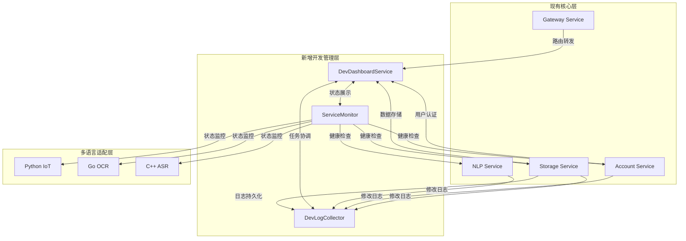

# HavenButler智能家庭服务平台 - 开发管理增强Brownfield架构文档

<!-- Powered by BMAD™ Core -->

## 文档信息

- **文档类型**: Brownfield Enhancement Architecture
- **项目名称**: HavenButler智能家庭服务平台
- **版本**: v1.0
- **创建时间**: 2024-06-01
- **最后更新**: 2024-06-01

## Introduction

本文档旨在为HavenButler智能家庭服务平台提供开发管理功能的架构增强方案。基于对现有系统的深入分析，本文档定义了如何在不影响现有业务系统稳定性的前提下，新增开发面板管理、修改记录跟踪和服务监控功能。

**与现有架构的关系**：
本文档补充现有项目架构，定义新组件如何与当前Spring Cloud微服务体系集成。在新旧架构模式冲突时，本文档提供保持一致性的指导原则，确保系统整体架构的统一性。

## 现有项目分析

### 当前项目状态

- **主要用途**: 智能家庭服务平台，提供设备控制、语音交互、AI服务集成
- **当前技术栈**: Java 17 + Spring Cloud 2023.0.1 + Vue3 + Docker + MySQL/Redis
- **架构风格**: 多语言混合微服务架构（Java核心 + Python IoT + Go OCR + C++ ASR）
- **部署方式**: Docker容器化 + Spring Cloud Gateway + Nacos配置中心

### 可用文档

- 智能家庭服务平台 - 全架构设计文档.md - 370行完整架构设计
- 要求文档.md - 开发管理规范和微服务文档标准
- CLAUDE.md - 项目概述和BMAD工具使用指导
- .bmad-core/ - BMAD工具链配置和模板

### 识别到的约束

- 所有数据访问必须通过storage-service统一接口，禁止直接连接数据库
- 仅Gateway服务允许映射宿主机端口，其他服务通过Docker内网通信
- 严格遵循五层安全防护架构（用户→接入→服务→数据→设备）
- 必须保持30%以上的中文注释密度
- 所有服务间通信必须携带TraceID进行链路追踪

## 增强功能范围和集成策略

### 增强功能概述

**增强类型**: 开发运维管理功能增强
**范围**: 新增开发面板、任务跟踪、服务监控、日志收集功能
**集成影响**: 低影响 - 通过独立微服务实现，不修改现有业务代码

### 集成策略

**代码集成策略**: 新增独立微服务，通过Gateway统一路由，与现有服务松耦合集成
**数据库集成**: 新增独立数据表，通过storage-service标准接口访问，保持数据层一致性
**API集成**: 新增/dev/*路由前缀，复用现有JWT认证和错误处理格式
**UI集成**: 在现有Vue3项目中新增dev-management页面模块，保持界面风格一致

### 兼容性要求

- **现有API兼容性**: 完全保持，新API使用独立路由前缀避免冲突
- **数据库模式兼容性**: 向后兼容，仅新增表和字段，不修改现有结构
- **UI/UX一致性**: 严格遵循现有Vue3组件库和设计规范
- **性能影响**: 新增服务采用异步处理，不影响现有API响应时间

## 技术栈对齐

### 现有技术栈

| 分类 | 当前技术 | 版本 | 增强功能使用 | 备注 |
|------|----------|------|--------------|------|
| 核心框架 | Spring Cloud | 2023.0.1 | 完全复用 | 新服务遵循相同微服务模式 |
| Web框架 | Spring Boot | 3.1.0 | 完全复用 | 使用相同starter和配置模式 |
| 前端框架 | Vue 3 | 最新 | 完全复用 | 新增管理页面集成现有项目 |
| 数据存储 | MySQL/Redis | 8.0/7.0 | 通过storage-service | 遵循统一数据访问规范 |
| 容器化 | Docker | 最新 | 完全复用 | 新服务使用相同容器化标准 |
| 配置管理 | Nacos | 2.3.0 | 完全复用 | 集成现有配置中心 |
| 网关路由 | Spring Cloud Gateway | 4.0 | 扩展配置 | 新增/dev/*路由规则 |

### 新增技术组件

| 技术 | 版本 | 用途 | 理由 | 集成方式 |
|------|------|------|------|----------|
| Spring Boot Admin | 3.1.0 | 开发面板UI | 提供微服务监控界面 | 独立服务集成现有监控 |
| H2 Database | 2.2.220 | 开发环境测试 | 简化开发环境配置 | 仅dev profile使用 |
| Docker Compose | 最新 | 开发服务编排 | 统一管理新增服务 | 扩展现有compose文件 |

## 数据模型和模式变更

### 新数据模型

#### ProjectTask（项目任务模型）
**目的**: 支持跨微服务任务跟踪和依赖管理
**与现有系统集成**: 通过existing user management system进行权限控制

**关键属性**:
- taskId: String - 任务唯一标识（格式：T001, T002...）
- serviceName: String - 所属微服务名称
- assignee: String - 负责人（关联现有用户系统）
- status: Enum - 任务状态（PENDING, IN_PROGRESS, BLOCKED, COMPLETED）
- plannedCompletionDate: Date - 计划完成时间
- actualProgress: Integer - 实际进度百分比
- blockingIssues: String - 阻塞问题描述
- dependencies: List<String> - 依赖任务ID列表

**关系**:
- **与现有系统**: User表外键关联，Service注册表关联
- **与新模型**: 关联ChangeLog和Milestone

#### ChangeLog（修改记录模型）
**目的**: 记录每日代码修改和配置调整历史
**与现有系统集成**: 继承现有审计日志格式和权限机制

**关键属性**:
- logId: String - 记录唯一标识
- changeDate: Date - 修改日期
- serviceName: String - 修改的服务名称
- modifier: String - 修改人
- changeDescription: Text - 修改内容摘要
- relatedTaskIds: List<String> - 关联任务ID
- filesChanged: List<String> - 变更文件路径
- testResults: String - 测试结果状态

**关系**:
- **与现有系统**: User表关联，现有审计系统集成
- **与新模型**: 关联ProjectTask

#### ServiceHealth（服务健康状态模型）
**目的**: 实时监控微服务运行状态和性能指标
**与现有系统集成**: 扩展现有监控数据结构

**关键属性**:
- serviceId: String - 服务标识
- timestamp: DateTime - 检查时间戳
- status: Enum - 健康状态（HEALTHY, DEGRADED, UNHEALTHY）
- responseTime: Long - 响应时间毫秒
- memoryUsage: Double - 内存使用百分比
- cpuUsage: Double - CPU使用百分比
- errorRate: Double - 错误率

**关系**:
- **与现有系统**: Service registry集成，Alert system关联
- **与新模型**: 支撑Dashboard展示

### 模式集成策略

**数据库变更要求**:
- **新表**: project_tasks, change_logs, service_health_metrics, task_dependencies
- **修改表**: 现有users表添加developer_role字段，services表添加health_check_endpoint字段
- **新索引**: task_service_idx, change_date_service_idx, health_timestamp_idx
- **迁移策略**: 渐进式迁移，先创建新表，再通过Spring Boot Admin逐步同步历史数据

**向后兼容性**:
- 保持现有API接口不变，新功能通过/dev-management/*路由提供
- 现有数据库表结构完全保留，仅添加新字段和新表
- 现有服务无需感知开发管理功能，通过可选配置启用

## 组件架构

### 新组件

#### DevDashboardService（开发面板服务）
**职责**: 提供统一的开发进度监控、任务管理和跨服务协调功能
**集成点**: 通过Spring Cloud Gateway路由，与现有认证系统集成

**关键接口**:
- GET /dev/api/v1/dashboard/overview - 获取项目整体进度
- POST /dev/api/v1/tasks - 创建和更新任务
- GET /dev/api/v1/services/health - 获取服务健康状态

**依赖关系**:
- **现有组件**: account-service（用户认证）、gateway-service（路由转发）、storage-service（数据持久化）
- **新组件**: DevLogCollector、ServiceMonitor

**技术栈**: Spring Boot 3.1.0 + Spring Cloud 2023.0.1，复用现有Maven配置

#### DevLogCollector（开发日志收集器）
**职责**: 自动收集各微服务的修改记录，按日期和服务分类组织存储
**集成点**: 通过现有的TraceID机制与各服务的审计日志集成

**关键接口**:
- POST /dev/api/v1/logs/collect - 接收服务修改日志
- GET /dev/api/v1/logs/{date}/{service} - 查询特定服务的日志记录
- PUT /dev/api/v1/logs/aggregate - 触发日志聚合分析

**依赖关系**:
- **现有组件**: 所有微服务（日志源）、storage-service（持久化）
- **新组件**: DevDashboardService

**技术栈**: Spring Boot + RabbitMQ异步处理，集成现有ELK日志栈

#### ServiceMonitor（服务监控组件）
**职责**: 实时监控各微服务健康状态，提供多语言服务统一监控接口
**集成点**: 扩展现有Actuator健康检查，支持Java/Python/Go/C++服务

**关键接口**:
- GET /monitor/api/v1/services/status - 获取所有服务状态
- POST /monitor/api/v1/alerts/configure - 配置告警规则
- WebSocket /monitor/ws/realtime - 实时状态推送

**依赖关系**:
- **现有组件**: 所有微服务（监控目标）、现有监控基础设施
- **新组件**: DevDashboardService

**技术栈**: Spring Boot + WebFlux响应式编程，集成Prometheus/Grafana

### 组件交互图



## API设计和集成

### API集成策略

**API集成策略**: REST-first设计，通过现有Gateway统一路由，保持与现有API的风格一致性
**认证方式**: 复用现有JWT Token + HMAC签名机制，确保安全策略统一
**版本控制**: 采用URL路径版本控制（/dev/api/v1/*），与现有服务版本策略保持一致

### 新API端点

#### DevDashboard API
**端点名称**: 开发面板管理API
- **方法**: GET
- **端点**: /dev/api/v1/dashboard/overview
- **用途**: 获取项目整体开发进度和服务状态概览
- **与现有系统集成**: 通过Gateway路由，使用现有用户认证和权限验证

**请求格式**:
```json
{
  "timeRange": "7d",
  "services": ["account-service", "nlp-service"],
  "includeMetrics": true
}
```

**响应格式**:
```json
{
  "code": 200,
  "message": "success",
  "traceId": "tr-20240601-100000-123456",
  "data": {
    "projectOverview": {
      "totalTasks": 15,
      "completedTasks": 8,
      "blockedTasks": 2,
      "overallProgress": 60
    },
    "serviceHealth": [
      {
        "serviceName": "account-service",
        "status": "HEALTHY",
        "responseTime": 150,
        "errorRate": 0.01
      }
    ],
    "recentChanges": [
      {
        "date": "2024-06-01",
        "service": "account-service",
        "changesCount": 3
      }
    ]
  }
}
```

#### TaskManagement API  
**端点名称**: 任务管理API
- **方法**: POST
- **端点**: /dev/api/v1/tasks
- **用途**: 创建、更新开发任务和跟踪依赖关系
- **与现有系统集成**: 关联现有用户系统进行任务分配，通过storage-service持久化

**请求格式**:
```json
{
  "taskId": "T001",
  "serviceName": "account-service", 
  "assignee": "zhang.san",
  "description": "实现RBAC权限模型",
  "plannedCompletionDate": "2024-06-15",
  "dependencies": ["T002"],
  "priority": "HIGH"
}
```

**响应格式**:
```json
{
  "code": 200,
  "message": "任务创建成功",
  "traceId": "tr-20240601-100001-123457",
  "data": {
    "taskId": "T001",
    "status": "PENDING",
    "createdAt": "2024-06-01T10:00:00Z",
    "estimatedCompletionDate": "2024-06-15T18:00:00Z"
  }
}
```

#### LogCollection API
**端点名称**: 日志收集API
- **方法**: POST  
- **端点**: /dev/api/v1/logs/collect
- **用途**: 接收各微服务的修改记录和变更日志
- **与现有系统集成**: 扩展现有审计日志格式，保持TraceID追踪链路

**请求格式**:
```json
{
  "serviceName": "account-service",
  "changeDate": "2024-06-01",
  "modifier": "zhang.san",
  "changeType": "CODE_UPDATE",
  "description": "添加用户权限验证逻辑",
  "filesChanged": [
    "src/main/java/com/haven/account/service/AuthService.java"
  ],
  "relatedTaskId": "T001",
  "testResults": "PASSED"
}
```

**响应格式**:
```json
{
  "code": 200,
  "message": "日志记录成功",
  "traceId": "tr-20240601-100002-123458",
  "data": {
    "logId": "LOG-20240601-001",
    "indexed": true,
    "aggregationScheduled": true
  }
}
```

## 源代码树集成

### 现有项目结构
```plaintext
HavenButler/
├── docs/                           # 现有文档目录
│   ├── architecture/               # 架构文档（已存在）
│   ├── prd/                       # 产品需求文档
│   └── 智能家庭服务平台 - 全架构设计文档.md
├── services/                      # 现有Java核心服务
│   ├── account-service/           # 账户服务（已存在）
│   ├── message-service/           # 消息服务
│   ├── storage-service/           # 存储服务
│   ├── ai-service/               # AI服务  
│   └── nlp-service/              # NLP服务
├── gateway/                       # Java Gateway服务（已存在）
├── frontend/                     # 前端项目
│   └── web-vue3/                 # Vue3 Web端（已存在）
└── .bmad-core/                   # BMAD配置（已存在）
    ├── templates/
    └── data/
```

### 新文件组织
```plaintext
HavenButler/
├── docs/                           # 现有文档目录
│   ├── architecture/               
│   │   └── brownfield-enhancement-architecture.md  # 新增：本架构文档
│   ├── prd/                       
│   └── 智能家庭服务平台 - 全架构设计文档.md
├── dev-dashboard/                  # 新增：总开发面板
│   ├── project-overview.md         # 项目整体进度
│   ├── task-matrix.md             # 任务关联矩阵  
│   └── milestones.md              # 里程碑跟踪
├── dev-logs/                      # 新增：修改记录根目录
│   ├── 2024-06-01/               # 按日期分组
│   │   ├── account-service/       # 按服务分类
│   │   ├── nlp-service/          
│   │   └── gateway-service/
│   └── 2024-06-02/
├── services/                      # 现有核心服务（扩展）
│   ├── account-service/           # 现有服务
│   │   ├── dev-panel.md          # 新增：服务独立面板
│   │   └── README.md             # 现有文件（需增强）
│   ├── dev-dashboard-service/     # 新增：开发面板服务
│   │   ├── src/main/java/com/haven/dev/
│   │   │   ├── controller/        # REST控制器
│   │   │   ├── service/           # 业务逻辑层
│   │   │   ├── repository/        # 数据访问层
│   │   │   └── config/            # 配置类
│   │   ├── src/main/resources/
│   │   │   ├── application.yml    # 服务配置
│   │   │   └── bootstrap.yml      # Nacos配置
│   │   ├── dev-panel.md          # 服务开发面板
│   │   ├── README.md             # 服务说明文档
│   │   └── pom.xml               # Maven配置
│   ├── dev-log-collector/         # 新增：日志收集服务
│   │   ├── src/main/java/com/haven/logs/
│   │   └── [标准Spring Boot结构]
│   ├── service-monitor/           # 新增：服务监控组件
│   │   ├── src/main/java/com/haven/monitor/
│   │   └── [标准Spring Boot结构]
│   └── [其他现有服务保持不变]
├── gateway/                       # 现有Gateway（配置扩展）
│   ├── src/main/resources/
│   │   └── application.yml        # 现有文件（新增路由配置）
│   └── README.md                  # 现有文件（更新路由信息）
├── frontend/                     # 前端项目
│   └── web-vue3/                 # 现有Vue3项目
│       ├── src/views/
│       │   └── dev-management/    # 新增：开发管理页面
│       │       ├── Dashboard.vue  # 开发面板页面
│       │       ├── TaskBoard.vue  # 任务看板
│       │       └── ServiceMonitor.vue # 服务监控页面
│       └── [其他现有文件保持不变]
└── infrastructure/               # 现有基础设施
    ├── docker/
    │   └── dev-services.yml      # 新增：开发服务Docker配置
    └── monitoring/
        └── dev-metrics.yml       # 新增：开发指标配置
```

### 集成指导原则

**文件命名一致性**:
- 新增微服务遵循现有命名约定（kebab-case）
- Java包名遵循 com.haven.{service} 规范  
- 配置文件使用现有的 application.yml + bootstrap.yml 模式

**文件夹组织方式**:
- 开发管理功能通过独立的 dev-* 前缀明确标识
- 保持现有服务目录结构完全不变，仅在services/下新增服务
- 文档按类型分层组织，架构文档放入docs/architecture/

**导入/导出模式一致性**:
- 新服务严格遵循现有的Spring Cloud依赖注入模式
- 使用现有的@Autowired和@Service注解规范
- API调用通过现有的RestTemplate/WebClient模式实现
- 配置管理完全集成现有的Nacos配置中心

## 基础设施和部署集成

### 现有基础设施

**当前部署方式**: 基于Docker容器化 + Spring Cloud微服务架构
**基础设施工具**: Docker + Docker Compose + Nacos配置中心 + Spring Cloud Gateway
**运行环境**: 开发环境（本地Docker）、测试环境、生产环境

### 增强功能部署策略

**部署方式**: 完全复用现有Docker容器化部署流程
**基础设施变更**:
- 新增3个微服务容器（dev-dashboard-service、dev-log-collector、service-monitor）
- 扩展现有docker-compose.yml配置文件
- 增强Gateway路由配置支持新的/dev/*路径

**流水线集成**:
- 使用现有的Maven构建流程
- 集成现有的Docker镜像构建和推送流程
- 复用现有的服务发现和配置管理机制

### 增强功能部署配置

**Docker Compose扩展配置**:
```yaml
# 新增到现有docker-compose.yml中
services:
  # 现有服务保持不变...
  
  dev-dashboard-service:
    build: ./services/dev-dashboard-service
    image: smart-home/dev-dashboard-service:v1.0.0
    container_name: dev-dashboard-service
    networks:
      - smart-home-network
    environment:
      - NACOS_ADDR=nacos:8848
      - STORAGE_SERVICE_URL=http://storage-service:8080
      - SPRING_PROFILES_ACTIVE=docker
    depends_on:
      - nacos
      - storage-service
    healthcheck:
      test: ["CMD", "curl", "-f", "http://localhost:8080/actuator/health"]
      interval: 30s
      timeout: 10s
      retries: 3

  dev-log-collector:
    build: ./services/dev-log-collector  
    image: smart-home/dev-log-collector:v1.0.0
    container_name: dev-log-collector
    networks:
      - smart-home-network
    environment:
      - NACOS_ADDR=nacos:8848
      - RABBITMQ_HOST=rabbitmq:5672
      - STORAGE_SERVICE_URL=http://storage-service:8080
    depends_on:
      - nacos
      - storage-service
      - rabbitmq

  service-monitor:
    build: ./services/service-monitor
    image: smart-home/service-monitor:v1.0.0  
    container_name: service-monitor
    networks:
      - smart-home-network
    environment:
      - NACOS_ADDR=nacos:8848
      - PROMETHEUS_URL=http://prometheus:9090
    depends_on:
      - nacos
      - prometheus
```

**Gateway路由配置扩展**:
```yaml
# 在gateway-service的application.yml中新增
spring:
  cloud:
    gateway:
      routes:
        # 现有路由保持不变...
        - id: dev-dashboard-route
          uri: lb://dev-dashboard-service
          predicates:
            - Path=/dev/api/v1/dashboard/**
          filters:
            - name: RequestRateLimiter
              args:
                key-resolver: "#{@ipKeyResolver}"
                redis-rate-limiter.replenishRate: 100
                redis-rate-limiter.burstCapacity: 200
        - id: dev-logs-route  
          uri: lb://dev-log-collector
          predicates:
            - Path=/dev/api/v1/logs/**
        - id: service-monitor-route
          uri: lb://service-monitor
          predicates:
            - Path=/monitor/api/v1/**
```

### 回滚策略

**回滚方法**: 基于Docker镜像版本的快速回滚机制
- 保留现有服务的所有镜像版本不变
- 新增服务支持独立回滚，不影响现有业务
- 通过docker-compose down/up实现服务级别的快速回滚

**风险缓解**:
- 新增服务完全独立部署，失败时不影响现有系统运行
- 通过feature toggle机制控制新功能的启用/禁用
- 监控现有服务性能指标，确保增强功能不影响系统性能

**监控方式**:
- 扩展现有Prometheus + Grafana监控体系
- 新增开发管理相关的监控指标和告警规则
- 集成现有的ELK日志聚合和分析流程

## 编码标准和约定

### 现有标准合规性

**代码风格**: 严格遵循现有的Java编码规范
- Google Java Style Guide（基于现有services/目录下的代码分析）
- 缩进：2个空格，不使用Tab
- 行长度：100字符限制
- 命名约定：类名PascalCase，方法和变量camelCase

**代码质量工具**: 集成现有的质量检查流程
- Checkstyle配置：复用现有checkstyle.xml规则
- SpotBugs静态分析：遵循现有bug-pattern配置
- SonarQube代码质量：复用现有quality gates规则

**测试模式**: 遵循现有的测试组织结构
- JUnit 5 + Mockito测试框架
- 测试类命名：{ClassName}Test
- 测试方法命名：should{ExpectedBehavior}When{StateUnderTest}
- 测试覆盖率要求：≥80%（与现有服务保持一致）

**文档风格**: 统一的中文注释规范
- 所有公共类和方法必须包含完整的Javadoc注释
- 注释密度要求：≥30%（符合CLAUDE.md规范）
- 业务逻辑注释使用中文，技术实现注释可使用英文
- 复杂算法和业务规则必须添加详细说明

### 增强功能专属标准

#### 开发管理服务特定规范

**服务间通信标准**:
```java
/**
 * 开发任务管理服务接口
 * 负责跨微服务任务协调和进度跟踪
 */
@RestController
@RequestMapping("/dev/api/v1/tasks")
@Validated
public class TaskManagementController {
    
    /**
     * 创建开发任务
     * @param request 任务创建请求，包含任务详情和依赖关系
     * @return 创建结果，包含任务ID和预估完成时间
     */
    @PostMapping
    public ResponseEntity<ApiResponse<TaskCreateResponse>> createTask(
            @Valid @RequestBody TaskCreateRequest request,
            @RequestHeader("X-Trace-ID") String traceId) {
        // 业务逻辑实现...
    }
}
```

**数据访问层规范**:
```java
/**
 * 任务数据访问接口
 * 遵循现有storage-service标准化接口规范
 */
@Repository
public interface TaskRepository extends JpaRepository<ProjectTask, String> {
    
    /**
     * 根据服务名称查询任务列表
     * @param serviceName 微服务名称
     * @param status 任务状态过滤条件
     * @return 符合条件的任务列表
     */
    List<ProjectTask> findByServiceNameAndStatus(String serviceName, TaskStatus status);
    
    /**
     * 查询跨服务依赖任务
     * 用于分析任务依赖关系和阻塞情况
     */
    @Query("SELECT t FROM ProjectTask t WHERE t.dependencies IS NOT EMPTY")
    List<ProjectTask> findTasksWithDependencies();
}
```

### 关键集成规则

**现有API兼容性规则**:
- 新增API必须使用/dev/*路径前缀，避免与现有业务API冲突
- 所有响应格式必须遵循现有的ApiResponse<T>封装规范
- 错误码必须使用现有的错误码体系，新增错误码范围：9000-9999

**数据库集成规则**:
- 禁止直接访问MySQL/Redis，必须通过storage-service提供的标准化接口
- 新增数据表必须添加created_by、created_at、updated_by、updated_at审计字段
- 所有数据操作必须包含family_id进行数据隔离

**错误处理集成**:
```java
/**
 * 开发管理异常处理器
 * 统一处理开发管理相关异常，保持与现有错误格式一致
 */
@RestControllerAdvice(basePackages = "com.haven.dev")
public class DevManagementExceptionHandler {
    
    @ExceptionHandler(TaskNotFoundException.class)
    public ResponseEntity<ApiResponse<Void>> handleTaskNotFound(TaskNotFoundException e) {
        return ResponseEntity.status(HttpStatus.NOT_FOUND)
                .body(ApiResponse.error(9001, "任务不存在: " + e.getTaskId(), getCurrentTraceId()));
    }
    
    @ExceptionHandler(ServiceDependencyException.class)  
    public ResponseEntity<ApiResponse<Void>> handleServiceDependency(ServiceDependencyException e) {
        return ResponseEntity.status(HttpStatus.SERVICE_UNAVAILABLE)
                .body(ApiResponse.error(9002, "依赖服务不可用: " + e.getServiceName(), getCurrentTraceId()));
    }
}
```

**日志一致性规则**:
- 所有业务操作必须记录INFO级别日志，包含用户ID、操作类型、关键参数
- 系统异常记录ERROR级别日志，包含完整堆栈信息和TraceID
- 性能敏感操作记录耗时，超过2秒的操作必须记录WARN级别日志

## 测试策略

### 与现有测试集成

**现有测试框架**: JUnit 5 + Mockito + Spring Boot Test + Testcontainers
**测试组织结构**: 遵循Maven标准目录结构 src/test/java
**覆盖率要求**: 单元测试≥80%，集成测试≥70%（与现有服务保持一致）

### 新测试要求

#### 单元测试（新组件专属）

**测试框架**: JUnit 5 + Mockito + AssertJ
**测试位置**: 各服务的src/test/java目录下
**覆盖率目标**: ≥80%
**与现有集成**: 完全复用现有测试基础设施和CI/CD流水线

**DevDashboardService单元测试示例**:
```java
/**
 * 开发面板服务单元测试
 * 测试任务管理和进度跟踪核心逻辑
 */
@ExtendWith(MockitoExtension.class)
class DevDashboardServiceTest {
    
    @Mock
    private TaskRepository taskRepository;
    
    @Mock
    private StorageServiceClient storageServiceClient;
    
    @InjectMocks
    private DevDashboardService devDashboardService;
    
    @Test
    @DisplayName("应该正确计算项目整体进度")
    void shouldCalculateProjectProgressCorrectly() {
        // Given: 模拟任务数据
        List<ProjectTask> mockTasks = Arrays.asList(
            createTask("T001", "account-service", TaskStatus.COMPLETED),
            createTask("T002", "nlp-service", TaskStatus.IN_PROGRESS),
            createTask("T003", "storage-service", TaskStatus.PENDING)
        );
        when(taskRepository.findAll()).thenReturn(mockTasks);
        
        // When: 获取项目概览
        ProjectOverviewResponse response = devDashboardService.getProjectOverview();
        
        // Then: 验证进度计算正确
        assertThat(response.getTotalTasks()).isEqualTo(3);
        assertThat(response.getCompletedTasks()).isEqualTo(1);
        assertThat(response.getOverallProgress()).isEqualTo(33); // 1/3 * 100
    }
    
    @Test
    @DisplayName("当依赖任务未完成时应该标识为阻塞状态")
    void shouldIdentifyBlockedTasksWhenDependenciesNotCompleted() {
        // 测试任务依赖关系和阻塞状态识别逻辑
        // ...
    }
}
```

#### 集成测试

**测试范围**: 服务间通信、数据库交互、外部API集成
**现有系统验证**: 确保新功能不影响现有服务正常运行
**新功能测试**: 验证开发管理功能的端到端流程

**集成测试配置**:
```java
/**
 * 开发管理功能集成测试
 * 验证新服务与现有系统的集成正确性
 */
@SpringBootTest(webEnvironment = SpringBootTest.WebEnvironment.RANDOM_PORT)
@Testcontainers
@TestPropertySource("classpath:application-integration-test.yml")
class DevManagementIntegrationTest {
    
    @Container
    static MySQLContainer<?> mysql = new MySQLContainer<>("mysql:8.0")
            .withDatabaseName("smart_home_test")
            .withUsername("test")
            .withPassword("test");
    
    @Container  
    static GenericContainer<?> redis = new GenericContainer<>("redis:7")
            .withExposedPorts(6379);
            
    @Autowired
    private TestRestTemplate restTemplate;
    
    @Autowired
    private TaskRepository taskRepository;
    
    @Test
    @DisplayName("创建任务后应该能够通过API查询到")
    void shouldRetrieveTaskAfterCreation() {
        // Given: 准备任务创建请求
        TaskCreateRequest request = TaskCreateRequest.builder()
                .serviceName("account-service")
                .assignee("test.user")
                .description("集成测试任务")
                .build();
                
        // When: 通过API创建任务
        ResponseEntity<ApiResponse<TaskCreateResponse>> createResponse = 
                restTemplate.postForEntity("/dev/api/v1/tasks", request, 
                        new ParameterizedTypeReference<ApiResponse<TaskCreateResponse>>() {});
                        
        // Then: 验证任务创建成功并可查询
        assertThat(createResponse.getStatusCode()).isEqualTo(HttpStatus.OK);
        String taskId = createResponse.getBody().getData().getTaskId();
        
        // 验证数据库中存在该任务
        Optional<ProjectTask> savedTask = taskRepository.findById(taskId);
        assertThat(savedTask).isPresent();
        assertThat(savedTask.get().getServiceName()).isEqualTo("account-service");
    }
    
    @Test
    @DisplayName("应该与现有storage-service正确集成")
    void shouldIntegrateWithExistingStorageService() {
        // 验证通过storage-service进行数据持久化的集成测试
        // ...
    }
}
```

#### 回归测试

**现有功能验证策略**:
- **自动回归测试套件**: 扩展现有的CI/CD流水线，在部署新功能后自动运行现有服务的完整测试套件
- **性能基线验证**: 监控现有API的响应时间，确保新增功能不影响现有系统性能
- **数据完整性验证**: 验证新增的数据表和字段不影响现有数据查询和业务逻辑

**手动测试要求**:
- **核心业务流程验证**: 手动测试用户登录、设备控制、语音交互等关键功能
- **跨服务通信验证**: 验证account-service、nlp-service等现有服务间通信正常
- **UI/UX一致性验证**: 确保新增的开发管理页面与现有Vue3界面风格一致

#### Docker环境测试

**容器化测试要求**:
```yaml
# docker/integration-test.yml
version: '3.8'
services:
  # 现有服务...
  account-service-test:
    image: smart-home/account-service:latest
    environment:
      - SPRING_PROFILES_ACTIVE=test
      
  dev-dashboard-service-test:
    build: ./services/dev-dashboard-service
    environment:
      - SPRING_PROFILES_ACTIVE=test
      - NACOS_ADDR=nacos-test:8848
    depends_on:
      - account-service-test
      - storage-service-test
      
  mysql-test:
    image: mysql:8.0
    environment:
      MYSQL_DATABASE: smart_home_test
      MYSQL_ROOT_PASSWORD: test_password
    tmpfs:
      - /var/lib/mysql  # 使用内存存储提高测试速度
```

**测试执行流程**:
```bash
#!/bin/bash
# scripts/run-integration-tests.sh

echo "启动测试环境..."
docker-compose -f docker/integration-test.yml up -d

echo "等待服务就绪..."
./scripts/wait-for-services.sh

echo "执行集成测试..."
docker-compose exec dev-dashboard-service-test mvn test -Pintegration-test

echo "收集测试报告..."
docker cp dev-dashboard-service-test:/app/target/surefire-reports ./test-results/

echo "清理测试环境..."
docker-compose -f docker/integration-test.yml down -v
```

## 安全集成

### 现有安全措施

**认证系统**: JWT Token + RBAC权限模型（通过account-service实现）
**授权机制**: 基于家庭ID的数据隔离 + 房间-设备三级权限控制
**数据保护**: AES-256加密（敏感数据）+ TLS 1.3（传输加密）
**安全工具**: Spring Security + OAuth2 + HMAC签名验证

### 增强功能安全要求

#### 开发管理权限扩展

**新增权限角色**:
- **DEV_ADMIN**: 开发管理员，可查看所有服务的开发状态和日志
- **DEV_LEAD**: 开发负责人，可管理特定服务的任务和进度
- **DEV_MEMBER**: 开发成员，仅可查看自己负责的任务和提交日志

**权限集成策略**:
```java
/**
 * 开发管理权限配置
 * 扩展现有RBAC系统，新增开发管理相关权限
 */
@Configuration
@EnableWebSecurity
public class DevManagementSecurityConfig {
    
    @Bean
    public SecurityFilterChain devManagementFilterChain(HttpSecurity http) throws Throwable {
        return http
            .securityMatcher("/dev/api/**")
            .authorizeHttpRequests(auth -> auth
                // 开发面板概览需要任意开发权限
                .requestMatchers(GET, "/dev/api/v1/dashboard/overview").hasAnyRole("DEV_ADMIN", "DEV_LEAD", "DEV_MEMBER")
                // 任务管理需要负责人或管理员权限
                .requestMatchers(POST, "/dev/api/v1/tasks").hasAnyRole("DEV_ADMIN", "DEV_LEAD")
                // 日志收集仅管理员权限
                .requestMatchers("/dev/api/v1/logs/**").hasRole("DEV_ADMIN")
                // 服务监控需要运维权限
                .requestMatchers("/monitor/api/**").hasAnyRole("DEV_ADMIN", "OPS_ADMIN")
                .anyRequest().authenticated()
            )
            // 复用现有JWT认证过滤器
            .addFilterBefore(jwtAuthenticationFilter(), UsernamePasswordAuthenticationFilter.class)
            .sessionManagement(session -> session.sessionCreationPolicy(STATELESS))
            .build();
    }
}
```

#### 数据访问安全

**敏感信息保护**:
- **开发日志脱敏**: 自动过滤日志中的密码、Token、API密钥等敏感信息
- **任务数据加密**: 任务描述中可能包含的敏感业务信息使用AES-256加密存储
- **访问审计**: 所有开发管理操作记录审计日志，包含操作人、时间、IP地址

```java
/**
 * 开发数据安全处理器
 * 确保开发管理数据的安全存储和传输
 */
@Component
public class DevDataSecurityHandler {
    
    private final AESEncryption aesEncryption;
    private final SensitiveDataMasker dataMasker;
    
    /**
     * 安全存储任务信息
     * 加密敏感字段并记录访问审计
     */
    public ProjectTask secureStoreTask(TaskCreateRequest request, String operatorId) {
        // 加密任务描述中的敏感信息
        String encryptedDescription = aesEncryption.encrypt(
            dataMasker.maskSensitiveContent(request.getDescription())
        );
        
        ProjectTask task = ProjectTask.builder()
            .taskId(generateTaskId())
            .serviceName(request.getServiceName())
            .assignee(request.getAssignee())
            .description(encryptedDescription)
            .createdBy(operatorId)
            .build();
            
        // 记录数据访问审计日志
        auditLogger.logDataAccess("TASK_CREATE", operatorId, 
            request.getServiceName(), getCurrentTraceId());
            
        return task;
    }
    
    /**
     * 安全处理开发日志
     * 自动过滤敏感信息并分类存储
     */
    public void secureProcessDevLog(ChangeLogRequest request) {
        // 过滤敏感信息：密码、Token、密钥等
        String sanitizedContent = dataMasker.maskSensitivePatterns(
            request.getChangeDescription()
        );
        
        // 根据敏感程度分级存储
        SecurityLevel level = classifySecurityLevel(request);
        if (level == SecurityLevel.CONFIDENTIAL) {
            // 机密信息额外加密存储
            sanitizedContent = aesEncryption.encrypt(sanitizedContent);
        }
        
        // 存储处理后的日志
        devLogRepository.save(ChangeLog.builder()
            .content(sanitizedContent)
            .securityLevel(level)
            .build());
    }
}
```

#### 网络安全集成

**API安全防护**:
- **速率限制**: 开发管理API集成现有的Redis限流机制，防止API滥用
- **CORS配置**: 仅允许现有Vue3前端域名访问开发管理接口
- **CSRF防护**: 开发管理页面使用现有的CSRF Token机制

**服务间通信安全**:
```java
/**
 * 开发服务间通信安全配置
 * 确保新增服务与现有服务的安全通信
 */
@Configuration
public class DevServiceSecurityConfig {
    
    @Bean
    @LoadBalanced
    public RestTemplate secureRestTemplate() {
        RestTemplate restTemplate = new RestTemplate();
        
        // 添加JWT Token传递拦截器
        restTemplate.getInterceptors().add((request, body, execution) -> {
            String token = SecurityContextHolder.getContext()
                .getAuthentication().getCredentials().toString();
            request.getHeaders().setBearerAuth(token);
            
            // 添加HMAC签名验证
            String signature = hmacSignatureGenerator.generateSignature(body, token);
            request.getHeaders().add("X-Signature", signature);
            
            return execution.execute(request, body);
        });
        
        return restTemplate;
    }
}
```

### 安全测试

**现有安全测试集成**: 扩展现有的OWASP ZAP安全扫描流程，包含新增API端点
**新安全测试要求**:
- **权限验证测试**: 验证不同角色用户只能访问授权的开发管理功能
- **数据泄露测试**: 确保开发日志中不包含生产环境的敏感信息
- **注入攻击测试**: 验证任务创建、日志收集接口的SQL注入和XSS防护

**渗透测试要求**:
- **API安全测试**: 使用现有的安全测试工具验证新增API的安全性
- **数据访问测试**: 验证开发管理功能无法绕过现有的数据隔离机制
- **权限提升测试**: 确保普通开发成员无法通过新增功能获得超出授权的系统访问权限

```java
/**
 * 开发管理安全测试
 * 验证权限控制和数据保护的正确性
 */
@SpringBootTest
@TestMethodOrder(OrderAnnotation.class)
class DevManagementSecurityTest {
    
    @Test
    @Order(1)
    @DisplayName("DEV_MEMBER角色应该无法访问日志收集接口")
    void devMemberShouldNotAccessLogCollectionApi() {
        // Given: DEV_MEMBER权限的JWT Token
        String memberToken = generateJwtToken("test.member", Set.of("DEV_MEMBER"));
        
        // When: 尝试访问日志收集接口
        ResponseEntity<String> response = restTemplate.exchange(
            "/dev/api/v1/logs/collect",
            HttpMethod.POST,
            new HttpEntity<>(createLogRequest(), createAuthHeaders(memberToken)),
            String.class
        );
        
        // Then: 应该返回403禁止访问
        assertThat(response.getStatusCode()).isEqualTo(HttpStatus.FORBIDDEN);
    }
    
    @Test
    @Order(2)
    @DisplayName("任务描述中的敏感信息应该被正确脱敏")
    void sensitiveInfoShouldBeMaskedInTaskDescription() {
        // 验证密码、API密钥等敏感信息的脱敏处理
        // ...
    }
}
```

## Next Steps

### Story Manager Handoff

**任务交接说明**:
基于本brownfield架构文档，请Story Manager按以下要求进行开发故事规划：

1. **架构文档依据**: 严格参照本文档的组件设计、API定义和集成策略
2. **关键集成要求**:
   - 新增服务必须通过现有Gateway统一路由
   - 数据访问严格遵循storage-service标准化接口
   - 安全认证完全集成现有JWT + RBAC体系
3. **现有系统约束**:
   - 不得修改现有服务的任何源码文件
   - 必须保持Docker网络隔离和容器化部署标准
   - 严格遵循现有的编码规范和测试覆盖率要求
4. **首个故事建议**:
   - **Story 1**: "实现DevDashboardService基础框架"
   - 集成检查点：Gateway路由配置、Nacos服务注册、基础API响应
   - 验收标准：通过/dev/api/v1/dashboard/health返回正确的健康检查状态
5. **系统完整性保证**: 每个故事实现后必须运行完整的回归测试套件，确保现有功能不受影响

### Developer Handoff

**开发实施指导**:
开发团队开始实施时请严格遵循以下技术要求：

1. **架构基础**: 基于本文档分析的现有Spring Cloud + Vue3技术栈
2. **集成要求**:
   - 使用现有checkstyle.xml、pom.xml模板创建新服务
   - API设计必须遵循现有的ApiResponse<T>封装格式
   - 日志格式必须包含TraceID并集成现有ELK栈
3. **实际项目约束**:
   - 所有新增服务加入smart-home-network Docker网络
   - 配置管理通过Nacos，环境变量遵循现有命名规范
   - 数据库操作禁止直接连接，必须通过storage-service接口
4. **技术决策依据**: 本文档基于对现有项目的深入分析，所有技术选择都经过兼容性验证
5. **实施序列**:
   - 第一阶段：创建dev-dashboard-service基础框架
   - 第二阶段：实现任务管理API和数据模型
   - 第三阶段：开发日志收集和监控功能
   - 第四阶段：Vue3前端开发管理页面集成
6. **兼容性验证**: 每个阶段完成后运行现有服务的完整测试套件，确保系统稳定性

---

**架构文档总结**:

本架构文档基于对现有系统的深入分析，提供了一个完整的、风险可控的开发管理功能增强方案。通过严格遵循现有技术栈、安全策略和部署流程，确保新功能能够与现有系统无缝集成，同时不影响系统的稳定性和性能。

**核心设计原则**:
- **最小侵入**: 新功能完全独立，不修改现有代码
- **架构一致**: 严格遵循现有Spring Cloud微服务模式
- **安全统一**: 集成现有五层防护和权限体系
- **部署标准**: 复用现有Docker容器化和CI/CD流程
- **监控集成**: 扩展现有Prometheus + Grafana监控体系

该架构为后续的Story Manager和Developer提供了详细的技术实施指导，确保开发过程的规范化和可追溯性。