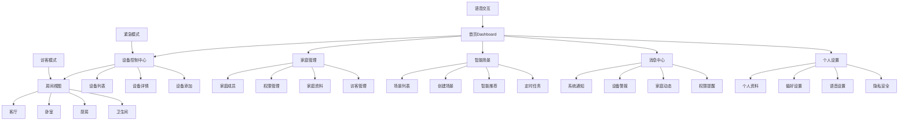
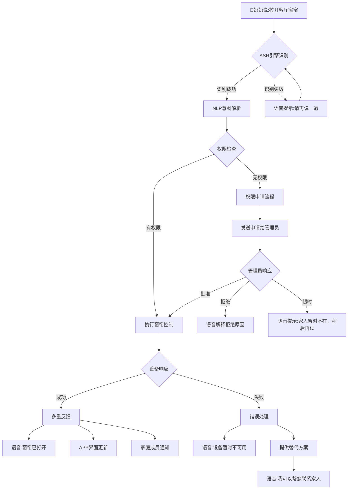
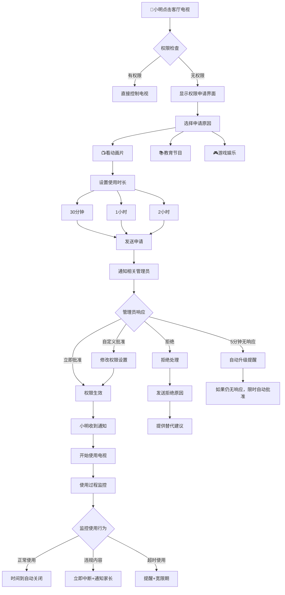
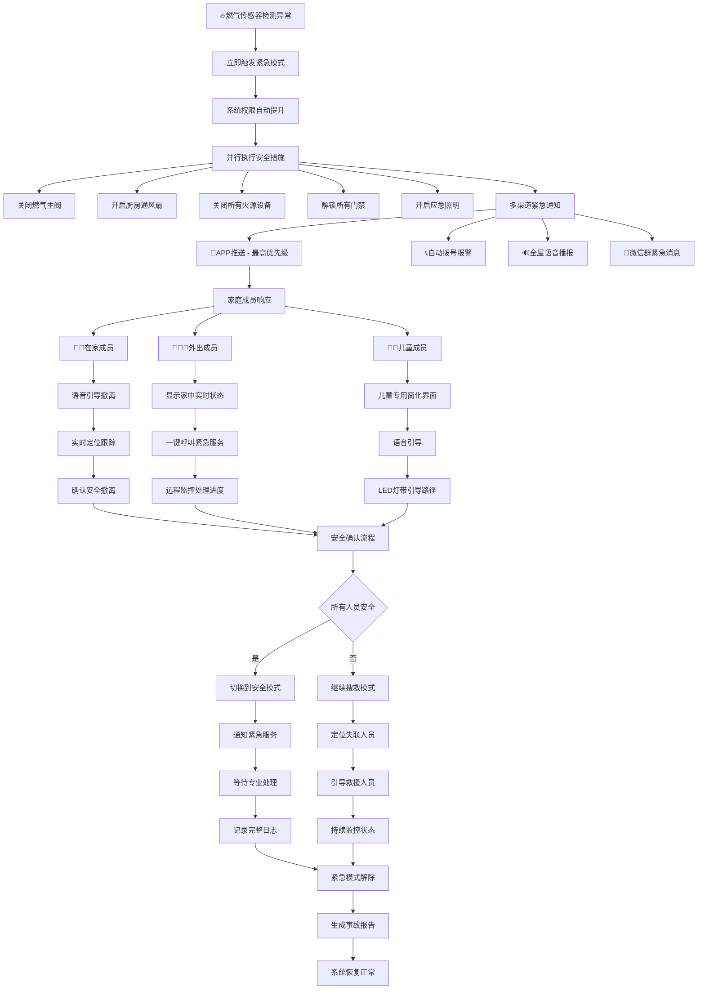

# HavenButler UI/UX Specification

这份文档定义了HavenButler智能家庭服务平台用户界面的用户体验目标、信息架构、用户流程和视觉设计规范。它将作为视觉设计和Vue3前端开发的基础，确保一个连贯且以用户为中心的体验。

## 变更日志

| 日期 | 版本 | 描述 | 作者 |
|------|------|------|------|
| 2024-09-11 | 1.0 | 初始版本创建 | UX Expert Sally |

## 1. Introduction

### 1.1 总体UX目标与原则

#### 目标用户画像

**👨‍👩‍👧‍👦 家庭管理员**
- **技术能力**: 熟练使用微信、支付宝等常用APP，中等学习能力
- **行为模式**: 主要在晚饭后(19:00-22:00)和周末统一管理，谨慎型决策
- **痛点**: 担心操作错误影响全家设备，希望有"安全模式"
- **需求**: 需要完整的权限控制和设备状态总览

**👵👴 家庭普通成员(老人)**
- **技术能力**: 基础触屏操作，语音交互天然优势，需要支持方言
- **行为模式**: 分散全天使用，高峰期在早晨(6:00-9:00)和傍晚(17:00-19:00)
- **特殊需求**: 高对比度、大字体、大按钮，习惯固定操作流程
- **学习方式**: 依赖家人教导，喜欢重复练习，遇到问题容易放弃

**👦👧 家庭普通成员(孩子)**
- **技术能力**: 数字原生，对触屏和语音都很熟悉，探索欲强
- **行为模式**: 放学后(16:00-18:00)和睡前(20:00-21:00)使用
- **特点**: 注意力短暂但专注，需要即时反馈，安全意识较弱
- **需求**: 游戏化界面元素，需要权限限制保护

**🔧 设备维护者**
- **技术能力**: IT或工程背景，理解网络和设备概念，能独立排查问题
- **行为模式**: 集中在问题出现时和定期维护，系统化工作流程
- **需求**: 需要高级功能、专业视图、详细日志和批量操作能力

#### 可用性目标

- **学习易用性**: 老人和孩子可以在10分钟内学会基本设备控制
- **语音优先**: 语音控制响应时间<2秒，支持方言识别
- **视觉清晰**: 大字体、高对比度设计，适合全年龄段用户
- **错误预防**: 重要操作(如删除设备)需要二次确认，提供撤销功能

#### 设计原则

1. **简单至上** - 隐藏复杂功能，优先展示常用操作
2. **语音为王** - 界面设计支持语音反馈，减少视觉依赖  
3. **家庭友好** - 考虑多代人使用习惯，避免过于技术化的术语
4. **安全可见** - 权限状态和安全信息清晰可见
5. **智能预测** - 基于使用习惯提供个性化建议

### 1.2 家庭动态交互分析

#### 权力结构与决策层级

家庭权力金字塔：
```
        👨‍💼 家庭管理员 (顶层)
       /                    \
    👵 长辈权威              👩 配偶协作
   /    \                    /    \
👦 孩子  👧 孩子          🏠 设备维护者
```

**关键洞察**：
- **正式权力 vs 实际影响力**: 老人虽不是管理员，但在传统家庭中话语权很大
- **临时权力转移**: 管理员出差时，权力临时转移给配偶
- **情感影响**: 孩子的需求往往能影响成人决策

#### 冲突场景与解决机制

**常见冲突类型**:
- **🌡️ 温度设定冲突**: 老人要26°C，年轻人要20°C → 需要"温度协商"功能
- **💡 照明控制冲突**: 孩子学习需要亮灯，大人看电视要暗光 → 房间级权重系统
- **🔊 音响控制权**: 多人想同时播放不同音乐 → 音频队列系统

**解决策略**:
1. **时间分片策略**: 显示各成员的"时间段优先权"
2. **区域划分策略**: 基于地理位置的自动权限切换
3. **民主投票系统**: 重大设备改动需要家庭成员投票

## 2. Information Architecture (信息架构)

### 2.1 站点地图



### 2.2 导航结构

#### 主导航 (Primary Navigation)

**底部标签栏设计** (移动优先)：
```
┌─────┬─────┬─────┬─────┬─────┐
│ 🏠  │ 🎮  │ ⭕  │ 💬  │ 👤  │
│首页  │控制  │场景  │消息  │我的  │
└─────┴─────┴─────┴─────┴─────┘
```

**设计考虑**：
- **图标+文字**: 双重提示，降低认知负担
- **高对比度**: 确保视力不佳的老人能清楚识别  
- **大触控区域**: 最小44px×44px，适合粗大手指操作
- **中央紧急按钮**: 圆形设计，一键直达紧急控制

#### 次级导航

**面包屑策略**: `首页 > 设备控制 > 客厅 > 空调详情`

### 2.3 基于用户角色的信息架构适配

#### 👴👵 老人模式信息架构

```
┌─ 简单模式 ─────────────────────┐
│ 🌅 早安，张奶奶 (语音播报)       │
│                              │
│ 🏠 常用设备                   │
│ [🔆开关灯光] [🌡️调节温度]       │
│ [📺电视控制] [🔊音量调节]       │
│                              │
│ 🎯 一键场景                   │
│ [🌅早安] [🍽️用餐] [😴睡觉]       │
│                              │
│ 🆘 需要帮助？                 │
│ [📞联系家人] [🎤语音求助]       │
└──────────────────────────────┘
```

#### 👦👧 儿童模式信息架构

```
┌─ 儿童模式 ─────────────────────┐
│ 🌟 小明的智能屋                │
│                              │
│ 🏆 今日任务 (gamification)    │
│ ✅ 关闭卧室灯 (+10分)          │
│ ⏳ 整理房间后开空调 (待完成)     │
│                              │
│ 🎮 房间探险                   │
│ [🛏️我的房间] [🎯游戏室]         │
│                              │
│ 🔒 需要爸妈同意               │
│ [📺客厅电视] [🎵音响系统]       │
└──────────────────────────────┘
```

#### 👨‍💼 管理员模式信息架构

```
┌─ 家庭总控制台 ─────────────────┐
│ 📊 系统状态  🟢在线 | ⚠️2个警报  │
│                              │
│ 👥 家庭成员 (4/5在线)          │
│ 👴👵 客厅 | 👦📚书房 | 👧😴卧室   │
│                              │
│ ⚡ 待处理事项                  │
│ • 小明申请客厅空调权限          │
│ • 客厅灯泡需要更换             │
│ • 奶奶的药品提醒已设置          │
│                              │
│ 📈 使用统计 | 🔐权限管理 | ⚙️系统  │
└──────────────────────────────┘
```

## 3. User Flows (用户流程)

### 3.1 老人语音控制设备

**用户目标**: 奶奶想通过四川话语音指令控制客厅窗帘

**入口点**: 智能音箱语音唤醒、手机APP语音按钮、紧急情况下的任何设备

**成功标准**: 语音识别成功率≥95%，端到端响应时间≤2秒，操作结果有语音+视觉反馈

#### 流程图



#### 边界情况和错误处理

- **方言识别失败**: 提供普通话模式切换，或文字输入备选
- **设备离线**: 自动切换到本地边缘网关控制
- **权限冲突**: 当其他人正在使用时，提供协商机制
- **紧急插队**: 老人摔倒等紧急情况自动获得最高权限
- **网络断开**: 本地缓存常用指令，离线执行

### 3.2 家庭成员权限申请与批准

**用户目标**: 小明想要获得客厅电视的控制权限观看动画片

**入口点**: 直接点击受限设备、权限管理页面主动申请、语音请求"我想看电视"

**成功标准**: 申请流程≤3步完成，管理员收到即时通知，申请状态实时可追踪

#### 流程图



### 3.3 设备故障紧急处理

**用户目标**: 系统检测到厨房燃气泄漏，需要立即处理

**入口点**: 传感器自动触发、用户手动报警按钮、语音紧急呼叫"紧急情况"

**成功标准**: 0延迟进入紧急模式，所有家庭成员同时收到警报，自动执行安全措施

#### 流程图



## 4. Wireframes & Mockups (线框图与原型)

### 4.1 设计文件管理

**主要设计工具链**: 
- **Figma** (推荐): 协作设计，支持Vue组件库对接
- **备用工具**: Sketch + InVision用于原型交互
- **设计系统**: 基于Ant Design Vue进行定制

### 4.2 关键界面线框设计

#### 🏠 首页Dashboard (桌面端)

**目的**: 提供家庭设备状态总览和快速控制入口

**布局线框**:
```
┌─ Header ────────────────────────────────────────────────────────┐
│ 🏠 HavenButler    [🔍搜索框]    👤张三 🔔(3) ⚙️设置 🆘紧急    │
└─────────────────────────────────────────────────────────────────┘

┌─ Sidebar ─┐ ┌─ Main Content ─────────────────────────────────┐
│📊 总览     │ │ ┌─ 家庭成员状态 ─────────────────────────────┐ │
│🏠 房间控制  │ │ │👴张爷爷🟢  👵李奶奶🟢  👨张先生🔴  👩王女士🟢│ │  
│👥 家庭管理  │ │ │客厅        客厅        出差中     厨房    │ │
│🎮 智能场景  │ │ └─────────────────────────────────────────┘ │
│💬 消息中心  │ │                                            │
│📊 统计分析  │ │ ┌─ 房间快控 ─────────────────────────────────┐ │
│⚙️ 设置     │ │ │🛋️客厅 (👴👵)         🛏️主卧 (无人)        │ │
└───────────┘ │ │[💡●●●●●] [🌡️●●●○○] [📺●●○○○]  [💡○○○○○]      │ │
              │ │                                            │
              │ │🍳厨房 (👩)           📚书房 (👦)           │ │
              │ │[🔥●●●○○] [💨●●●●○] [💡●●●●●] [🖥️●●●●○]      │ │
              │ └─────────────────────────────────────────┘ │
              └──────────────────────────────────────────────┘
```

#### 📱 移动端首页 (响应式适配)

**布局线框**:
```
┌─ Mobile Header ───────────────────────┐
│ ☰  🏠 智能家庭    🔔(3)  👤  🆘      │
└───────────────────────────────────────┘

┌─ Status Bar ─────────────────────────┐
│ 🌅 早安，张三          4人在线  🟢安全│
└───────────────────────────────────────┘

┌─ Quick Actions ─────────────────────┐
│ [🔆全开灯光] [🌡️调节温度] [📺娱乐模式] │
└───────────────────────────────────────┘

┌─ Room Cards (Swipeable) ─────────────┐
│ ┌─ 客厅 ─────────────┐                │
│ │ 👴👵 2人在内         │ ← 滑动查看更多房间
│ │ 💡●●●●● 🌡️●●●○○    │                │  
│ │ 📺●●○○○ 🔊●●●●○    │                │
│ │ [一键关闭] [夜间模式] │                │
│ └─────────────────────┘                │
└───────────────────────────────────────┘

┌─ Bottom Navigation ──────────────────┐
│  🏠     🎮      ⭕      💬      👤    │
│ 首页   控制    场景    消息    我的   │
└───────────────────────────────────────┘
```

#### 🔐 权限管理界面

**布局线框**:
```
┌─ Permission Management ─────────────────────────────────────────┐
│ ← 返回  权限管理                               [+ 添加成员]      │
└─────────────────────────────────────────────────────────────────┘

┌─ Permission Matrix ────────────────────────────────────────────┐
│         👴爷爷  👵奶奶  👨爸爸  👩妈妈  👦小明  👧小红  🏠访客   │
│ 🛋️客厅                                                        │
│ ├ 💡灯光    ●●●●● ●●●●● ●●●●● ●●●●● ●●●○○ ●●●○○ ●●○○○    │
│ ├ 🌡️空调    ●●●○○ ●●●○○ ●●●●● ●●●●● ●○○○○ ●○○○○ ○○○○○    │
│ ├ 📺电视    ●●●●● ●●●●● ●●●●● ●●●●● [申请] [申请] ○○○○○    │
│ └ 🔊音响    ●●●○○ ●●●○○ ●●●●● ●●●● ●●●●● ●●●●● ●○○○○    │
└─────────────────────────────────────────────────────────────────┘
```

#### 🎙️ 语音交互界面

**布局线框**:
```
┌─ Voice Interface ──────────────────────────────────────────────┐
│                    🎤 语音助手                                │
│                                                              │
│ ┌─ Voice Input Status ─────────────────────────────────────┐  │
│ │             🎵🎵🎵 正在聆听...                             │  │
│ │                                                          │  │
│ │     "拉开客厅窗帘"  ← 实时语音识别文字                     │  │
│ │                                                          │  │
│ │ ✅ 识别成功  🔍 理解意图  ⚡ 执行中                        │  │
│ └──────────────────────────────────────────────────────────┘  │
│                                                              │
│ ┌─ Context & Suggestions ─────────────────────────────────┐   │
│ │ 💡 您可以这样说:                                           │
│ │ • "调节客厅温度到25度"                                     │
│ │ • "打开所有灯光"                                           │
│ │ • "播放轻音乐"                                             │
│ │ • "切换到睡觉模式"                                         │
│ └──────────────────────────────────────────────────────────┘   │
│                                                              │
│              [🎤 按住说话]  [⌨️ 文字输入]                      │
└─────────────────────────────────────────────────────────────────┘
```

#### 🚨 紧急模式界面

**布局线框**:
```
┌─ EMERGENCY MODE ═══════════════════════════════════════════════┐
│ 🚨 紧急模式 - 燃气泄漏                    [退出紧急模式]      │
└═══════════════════════════════════════════════════════════════┘

┌─ Danger Status ───────────────────────────────────────────────┐
│                   ⚠️  厨房燃气浓度异常                        │
│                                                              │
│             所有家庭成员已收到警报通知                          │
│               👴已安全撤离  👵撤离中                          │
└─────────────────────────────────────────────────────────────────┘

┌─ Emergency Actions ───────────────────────────────────────────┐
│ ┌─────────────┐ ┌─────────────┐ ┌─────────────┐              │
│ │   🔥关闭    │ │   💨开启    │ │   📞拨打    │              │
│ │  燃气总阀    │ │  通风系统    │ │  119报警    │              │
│ │   [已执行]   │ │   [已执行]   │ │  [点击拨打]  │              │
│ └─────────────┘ └─────────────┘ └─────────────┘              │
│                                                              │
│ ┌─────────────┐ ┌─────────────┐ ┌─────────────┐              │
│ │   🚪解锁    │ │   💡开启    │ │   📋查看    │              │
│ │  所有门禁    │ │  应急照明    │ │  撤离状态    │              │
│ │   [已执行]   │ │   [已执行]   │ │  [点击查看]  │              │
│ └─────────────┘ └─────────────┘ └─────────────┘              │
└─────────────────────────────────────────────────────────────────┘
```

## 5. Component Library / Design System (组件库/设计系统)

### 5.1 设计系统方法

**设计系统方案**: 基于Ant Design Vue的定制化设计系统

**选择理由**:
- **成熟稳定**: Ant Design Vue提供企业级组件基础
- **可定制性强**: 支持深度主题定制，满足智能家居场景需求
- **无障碍友好**: 内置完善的可访问性支持
- **社区活跃**: 长期维护保证，适合企业项目

### 5.2 核心设计令牌

#### 颜色系统

```scss
// 基础色板
$color-primary: #1890ff;    // 主品牌蓝色
$color-secondary: #52c41a;  // 绿色(安全、在线)
$color-accent: #fa8c16;     // 橙色(警告、待处理)

// 权限状态色彩
$permission-colors: (
  'none': #d9d9d9,          // 无权限-灰色
  'emergency': #fa8c16,     // 紧急权限-橙色  
  'view': #fadb14,          // 查看权限-黄色
  'basic': #1890ff,         // 基础权限-蓝色
  'advanced': #52c41a,      // 高级权限-绿色
  'full': #13c2c2,          // 完全权限-青色
);

// 设备状态色彩
$device-status-colors: (
  'online': #52c41a,        // 在线-绿色
  'offline': #d9d9d9,       // 离线-灰色
  'connecting': #fadb14,    // 连接中-黄色
  'error': #f5222d,         // 错误-红色
  'emergency': #fa8c16,     // 紧急-橙色
);
```

#### 字体系统

```scss
// 字体族定义
$font-family-primary: 'PingFang SC', 'Microsoft YaHei', sans-serif;
$font-family-secondary: 'SF Pro Display', 'Helvetica Neue', Arial, sans-serif;
$font-family-mono: 'SF Mono', Monaco, 'Cascadia Code', 'Consolas', monospace;

// 字体尺寸规模 (考虑老人视力需求)
$font-sizes: (
  'xs': 12px,   // 辅助信息
  'sm': 14px,   // 小字体
  'base': 16px, // 基础字体(提升到16px)
  'lg': 18px,   // 大字体 
  'xl': 20px,   // 标题字体
  '2xl': 24px,  // 大标题
  '3xl': 28px,  // 主标题(老人模式)
  '4xl': 32px,  // 紧急信息
);
```

### 5.3 核心组件

#### PermissionRing - 权限环组件

**目的**: 直观显示和控制设备权限状态

**组件特性**:
- 5级权限可视化显示
- 支持权限冲突检测
- 紧急模式自动适配
- 实时权限变更动画

**使用方式**:
```vue
<PermissionRing
  :permission-level="3"
  device-type="lighting"
  :size="48"
  :has-conflict="false"
  :interactive="true"
  @click="handlePermissionClick"
/>
```

#### DeviceCard - 设备卡片组件

**目的**: 统一的设备展示和控制入口

**组件特性**:
- 设备状态实时显示
- 权限感知控制界面
- 快捷操作按钮插槽
- 响应式布局适配

**使用方式**:
```vue
<DeviceCard
  :device="deviceData"
  :permission-level="permissionLevel"
  :current-controller="controllerUser"
  @click="openDeviceDetail"
>
  <template #controls="{ device }">
    <HavenButton @click="toggleDevice(device)">
      {{ device.isOn ? '关闭' : '开启' }}
    </HavenButton>
  </template>
</DeviceCard>
```

#### VoiceInterface - 语音交互组件

**目的**: 提供统一的语音交互界面和反馈

**组件特性**:
- 实时语音波形动画
- 多状态视觉反馈
- 语音建议和提示
- 键盘输入备选方案

**使用方式**:
```vue
<VoiceInterface
  :suggestions="voiceSuggestions"
  size="large"
  @voice-command="handleVoiceCommand"
  @text-command="handleTextCommand"
/>
```

### 5.4 主题定制系统

#### CSS变量定义

```css
:root {
  /* 基础色彩 */
  --primary-color: #1890ff;
  --primary-color-light: rgba(24, 144, 255, 0.1);
  
  /* 权限色彩系统 */
  --permission-none: #d9d9d9;
  --permission-emergency: #fa8c16;
  --permission-view: #fadb14;
  --permission-basic: #1890ff;
  --permission-advanced: #52c41a;
  --permission-full: #13c2c2;
  
  /* 设备状态色彩 */
  --device-online: #52c41a;
  --device-offline: #d9d9d9;
  --device-connecting: #fadb14;
  --device-error: #f5222d;
}

/* 老人友好主题 */
[data-theme="elder"] {
  --font-size-base: 18px;
  --line-height-base: 1.8;
  --spacing-base: 20px;
  --text-color: #000000;
  --border-color: #333333;
}
```

## 6. Animation & Micro-interactions (动画与微交互)

### 6.1 动画设计原则

1. **功能性优先** - 动画服务于用户理解，不是装饰
2. **多代际友好** - 速度适中，既不让老人跟不上，也不让孩子失去耐心
3. **性能为王** - 确保在各种设备上流畅运行
4. **一致性保证** - 建立统一的动画语言

### 6.2 关键动画效果

#### 权限状态变化动画

```css
/* 权限等级提升动画 */
@keyframes permission-upgrade {
  0% { 
    stroke-dasharray: 0 100;
    filter: brightness(1);
  }
  50% { 
    filter: brightness(1.3);
    transform: scale(1.05);
  }
  100% { 
    stroke-dasharray: var(--target-progress) 100;
    filter: brightness(1);
    transform: scale(1);
  }
}

/* 权限冲突脉冲动画 */
@keyframes permission-conflict {
  0%, 100% { 
    box-shadow: 0 0 0 0 rgba(239, 68, 68, 0.7);
    border-color: var(--color-red-500);
  }
  50% { 
    box-shadow: 0 0 0 8px rgba(239, 68, 68, 0);
    border-color: var(--color-red-300);
  }
}
```

#### 语音交互动画

```css
/* 语音输入波形动画 */
.voice-wave .bar {
  width: 4px;
  background: linear-gradient(to top, #3b82f6, #06b6d4);
  border-radius: 2px;
  animation: voice-wave 1.2s ease-in-out infinite;
}

@keyframes voice-wave {
  0%, 40%, 100% { height: 8px; opacity: 0.5; }
  20% { height: 24px; opacity: 1; }
}
```

#### 紧急模式动画

```css
/* 紧急按钮脉冲动画 */
.emergency-button {
  animation: emergency-pulse 2s infinite;
}

@keyframes emergency-pulse {
  0%, 100% { box-shadow: 0 0 0 0 rgba(239, 68, 68, 0.7); }
  50% { box-shadow: 0 0 0 16px rgba(239, 68, 68, 0); }
}
```

### 6.3 微交互设计

#### 触摸反馈

```css
.interactive-button {
  transition: transform 0.1s ease;
}

.interactive-button:active {
  transform: scale(0.98);
}

/* 水波纹效果 */
.interactive-button::after {
  content: '';
  position: absolute;
  border-radius: 50%;
  background: rgba(255, 255, 255, 0.6);
  transform: scale(0);
  animation: ripple 0.6s linear;
}

@keyframes ripple {
  to { transform: scale(4); opacity: 0; }
}
```

#### 状态切换

```css
.switch-thumb {
  transition: transform 0.3s cubic-bezier(0.4, 0, 0.2, 1);
}

.switch.active .switch-thumb {
  transform: translateX(28px);
}
```

### 6.4 性能优化

```css
/* GPU加速优化 */
.gpu-accelerated {
  transform: translateZ(0);
  will-change: transform, opacity;
  backface-visibility: hidden;
}

/* 响应式动画适配 */
@media (prefers-reduced-motion: reduce) {
  * {
    animation-duration: 0.01ms !important;
    transition-duration: 0.01ms !important;
  }
}
```

## 7. Branding & Style Guide (品牌与样式指南)

### 7.1 视觉识别

**品牌指南**: 遵循智能家居行业的现代、简洁、科技感设计语言

### 7.2 色彩规范

| 颜色类型 | 十六进制 | 使用场景 |
|---------|----------|----------|
| Primary | #1890ff | 主要操作按钮、链接、品牌色 |
| Secondary | #52c41a | 成功状态、在线指示、安全提示 |
| Accent | #fa8c16 | 警告信息、待处理事项、紧急提醒 |
| Success | #52c41a | 操作成功、确认信息 |
| Warning | #fadb14 | 注意事项、重要提示 |
| Error | #f5222d | 错误信息、危险操作、紧急状态 |
| Neutral | #d9d9d9 | 文本、边框、背景 |

### 7.3 字体规范

#### 字体家族
- **主字体**: PingFang SC, Microsoft YaHei, sans-serif
- **次要字体**: SF Pro Display, Helvetica Neue, Arial, sans-serif  
- **等宽字体**: SF Mono, Monaco, Cascadia Code, Consolas, monospace

#### 字体尺寸

| 元素 | 尺寸 | 字重 | 行高 |
|------|------|------|------|
| H1 | 28px | 700 | 1.2 |
| H2 | 24px | 600 | 1.3 |
| H3 | 20px | 600 | 1.4 |
| Body | 16px | 400 | 1.5 |
| Small | 14px | 400 | 1.4 |

### 7.4 图标系统

**图标库**: 基于Ant Design Icons，补充智能家居专用图标

**使用指南**: 
- 图标尺寸: 16px, 20px, 24px, 32px
- 线条粗细: 2px (默认)
- 圆角半径: 2px
- 颜色: 继承文本颜色或指定主题色

### 7.5 间距与布局

**间距系统**: 基于8px网格系统

**Grid System**: 24列栅格布局，支持响应式断点

**Spacing Scale**: 4px, 8px, 12px, 16px, 20px, 24px, 32px, 40px, 48px, 64px

## 8. Accessibility Requirements (无障碍要求)

### 8.1 合规目标

**标准**: WCAG 2.1 AA级别合规

### 8.2 关键要求

#### 视觉要求
- **色彩对比度**: 文本与背景对比度 ≥ 4.5:1，大文本 ≥ 3:1
- **焦点指示器**: 明显的键盘焦点指示，2px蓝色外框
- **文字缩放**: 支持200%缩放而不丢失功能

#### 交互要求  
- **键盘导航**: 所有功能可通过键盘操作
- **屏幕阅读器支持**: 提供完整的ARIA标签和语义化HTML
- **触摸目标**: 最小44×44px触摸区域

#### 内容要求
- **替代文本**: 所有图像提供有意义的alt属性
- **标题结构**: 逻辑清晰的h1-h6标题层级
- **表单标签**: 所有表单元素关联明确的label

### 8.3 测试策略

**测试工具**: 
- axe-core自动化测试
- NVDA/JAWS屏幕阅读器测试
- 键盘导航测试
- 色盲模拟测试

## 9. Responsiveness Strategy (响应式策略)

### 9.1 断点设计

| 断点 | 最小宽度 | 最大宽度 | 目标设备 |
|------|----------|----------|----------|
| Mobile | 0px | 767px | 手机 |
| Tablet | 768px | 1023px | 平板 |
| Desktop | 1024px | 1439px | 桌面 |
| Wide | 1440px | - | 大屏显示器 |

### 9.2 适配模式

#### 布局变化
- **移动端**: 单栏布局，底部导航
- **平板端**: 两栏布局，侧边导航折叠
- **桌面端**: 三栏布局，固定侧边导航

#### 导航变化
- **移动端**: 底部标签栏 + 汉堡菜单
- **平板端**: 侧边抽屉导航
- **桌面端**: 固定侧边导航栏

#### 内容优先级
- **核心功能**: 设备控制、语音交互在所有尺寸下优先显示
- **辅助功能**: 统计图表、详细设置在大屏优先显示
- **装饰元素**: 品牌元素、背景图在小屏隐藏

### 9.3 交互适配

- **触摸优化**: 移动端按钮最小44px，增大点击区域
- **手势支持**: 滑动切换房间，长按快捷操作
- **键盘支持**: 桌面端完整键盘快捷键

## 10. Performance Considerations (性能考虑)

### 10.1 性能目标

- **首页加载**: ≤ 2秒
- **交互响应**: ≤ 100毫秒
- **动画帧率**: ≥ 60fps

### 10.2 设计策略

#### 资源优化
- **图片懒加载**: 非首屏图片延迟加载
- **组件按需加载**: 路由级代码分割
- **SVG图标**: 使用SVG替代PNG图标

#### 渲染优化
- **虚拟滚动**: 长列表使用虚拟滚动
- **防抖节流**: 搜索、滑动等高频操作
- **缓存策略**: 合理使用浏览器缓存

#### 动画优化
- **硬件加速**: 使用transform和opacity属性
- **reduce-motion**: 支持用户减少动画偏好
- **性能监控**: 实时FPS监控和自动降级

## 11. Next Steps (下一步计划)

### 11.1 即时行动

1. **设计评审**: 与产品经理和开发团队评审本规格文档
2. **原型制作**: 基于线框图制作高保真交互原型
3. **技术对接**: 与Vue3开发团队确认技术可行性
4. **用户测试**: 准备关键流程的可用性测试

### 11.2 设计交付检查清单

- [x] 所有用户流程的线框图完成
- [x] 组件库规范建立
- [x] 响应式适配方案确认  
- [x] 无障碍设计规范集成
- [x] 动画和微交互系统完成
- [x] 品牌风格指南应用

## 12. 总结

这份HavenButler UI/UX规格文档为智能家庭服务平台的Vue3前端开发提供了全面的设计指导。文档特别关注了多用户权限管理、跨代际用户体验和智能家居场景的特殊需求。

**核心创新点**:
1. **权限可视化系统** - 创新的5级权限环形指示器
2. **多代际适配界面** - 老人、儿童、管理员差异化界面
3. **语音优先设计** - 深度整合语音交互的视觉体验
4. **家庭协作机制** - 系统化的权限冲突处理和家庭成员协作

**技术特色**:
1. **Vue3 + TypeScript** - 现代前端技术栈
2. **组件化设计系统** - 基于Ant Design Vue的定制化组件库
3. **响应式优先** - 移动端到大屏的全尺寸适配
4. **无障碍友好** - WCAG 2.1 AA级合规设计

这份规格文档将指导团队构建一个真正以用户为中心、技术先进且易于维护的智能家居控制界面。