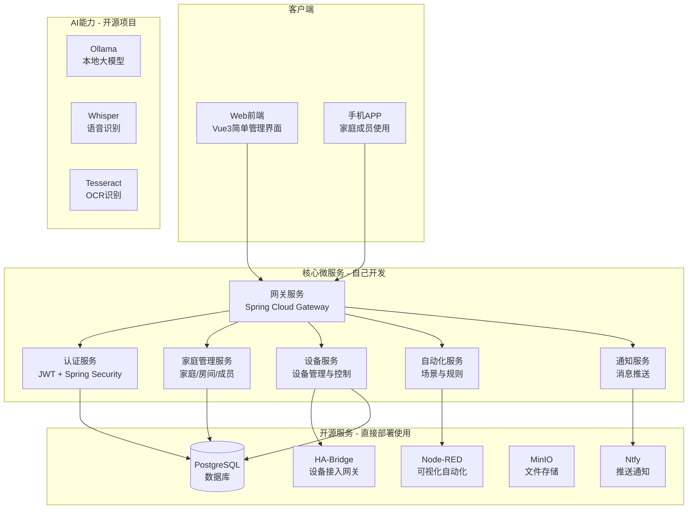
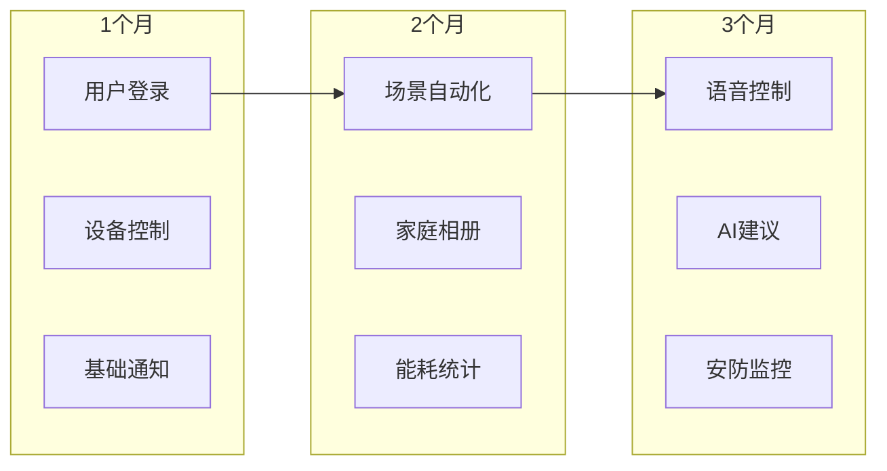

# 家庭服务平台 - 个人开发者版本

## 🎯 一、设计理念

### 1.1 核心原则
- **一人开发**：所有服务设计都考虑单人维护的可行性
- **渐进式交付**：一个服务开发完就能上线使用，不影响其他服务
- **开源优先**：复杂功能直接用成熟开源项目，不重复造轮子
- **极简运维**：Docker Compose一键部署，最小化运维成本
- **AI辅助开发**：充分利用Claude协作，提高开发效率

### 1.2 技术选型原则
- **统一技术栈**：全部Java Spring Boot，降低学习成本
- **轻量级组件**：不用复杂的服务网格，用简单的服务发现
- **数据库简化**：一个PostgreSQL搞定大部分需求
- **部署简化**：Docker Compose管理所有服务

## 🏗️ 二、极简微服务架构

### 2.1 整体架构图



### 2.2 服务优先级与开发顺序

| 优先级 | 服务名称 | 开发周期 | 功能说明 | 依赖 |
|--------|----------|----------|----------|------|
| P0 | 认证服务 | 1周 | 用户登录、JWT生成 | PostgreSQL |
| P0 | 网关服务 | 3天 | 统一入口、路由转发 | 无 |
| P1 | 家庭管理服务 | 1周 | 家庭、房间、成员管理 | 认证服务 |
| P1 | 设备服务 | 2周 | 设备接入、状态管理 | HA-Bridge |
| P2 | 自动化服务 | 1周 | 场景配置、规则执行 | Node-RED |
| P2 | 通知服务 | 3天 | 消息推送 | Ntfy |
| P3 | 文件服务 | 1周 | 照片存储、家庭相册 | MinIO |
| P3 | AI助手服务 | 2周 | 语音控制、智能推荐 | Ollama |

## 📦 三、核心服务快速开发模板

### 3.1 统一父POM（减少配置）

```xml
<!-- haven-parent/pom.xml -->
<project>
    <groupId>com.haven</groupId>
    <artifactId>haven-parent</artifactId>
    <version>1.0.0</version>
    <packaging>pom</packaging>
    
    <parent>
        <groupId>org.springframework.boot</groupId>
        <artifactId>spring-boot-starter-parent</artifactId>
        <version>3.2.0</version>
    </parent>
    
    <properties>
        <java.version>17</java.version>
        <spring-cloud.version>2023.0.0</spring-cloud.version>
    </properties>
    
    <!-- 统一依赖管理 -->
    <dependencies>
        <!-- 每个服务都需要的基础依赖 -->
        <dependency>
            <groupId>org.springframework.boot</groupId>
            <artifactId>spring-boot-starter-web</artifactId>
        </dependency>
        <dependency>
            <groupId>org.springframework.boot</groupId>
            <artifactId>spring-boot-starter-actuator</artifactId>
        </dependency>
        <dependency>
            <groupId>org.projectlombok</groupId>
            <artifactId>lombok</artifactId>
        </dependency>
        <!-- 服务发现（用最简单的） -->
        <dependency>
            <groupId>org.springframework.cloud</groupId>
            <artifactId>spring-cloud-starter-consul-discovery</artifactId>
        </dependency>
    </dependencies>
    
    <!-- 统一构建配置 -->
    <build>
        <plugins>
            <plugin>
                <groupId>org.springframework.boot</groupId>
                <artifactId>spring-boot-maven-plugin</artifactId>
                <configuration>
                    <image>
                        <name>haven/${project.artifactId}:latest</name>
                    </image>
                </configuration>
            </plugin>
        </plugins>
    </build>
</project>
```

### 3.2 微服务快速生成脚本

```bash
#!/bin/bash
# create-service.sh - 快速创建新服务

SERVICE_NAME=$1
SERVICE_PORT=$2

mkdir -p haven-$SERVICE_NAME/src/main/java/com/haven/$SERVICE_NAME
mkdir -p haven-$SERVICE_NAME/src/main/resources

# 生成pom.xml
cat > haven-$SERVICE_NAME/pom.xml << EOF
<project>
    <parent>
        <groupId>com.haven</groupId>
        <artifactId>haven-parent</artifactId>
        <version>1.0.0</version>
    </parent>
    
    <artifactId>haven-$SERVICE_NAME</artifactId>
    <name>Haven $SERVICE_NAME Service</name>
</project>
EOF

# 生成主类
cat > haven-$SERVICE_NAME/src/main/java/com/haven/$SERVICE_NAME/Application.java << EOF
package com.haven.$SERVICE_NAME;

import org.springframework.boot.SpringApplication;
import org.springframework.boot.autoconfigure.SpringBootApplication;
import org.springframework.cloud.client.discovery.EnableDiscoveryClient;

@SpringBootApplication
@EnableDiscoveryClient
public class Application {
    public static void main(String[] args) {
        SpringApplication.run(Application.class, args);
    }
}
EOF

# 生成配置文件
cat > haven-$SERVICE_NAME/src/main/resources/application.yml << EOF
spring:
  application:
    name: haven-$SERVICE_NAME
    
server:
  port: $SERVICE_PORT
  
# 数据库配置（如果需要）
spring:
  datasource:
    url: jdbc:postgresql://localhost:5432/haven
    username: haven
    password: haven123
    
# 服务发现（Consul）
spring:
  cloud:
    consul:
      host: localhost
      port: 8500
      discovery:
        service-name: \${spring.application.name}
        health-check-path: /actuator/health
        health-check-interval: 10s
EOF

echo "Service haven-$SERVICE_NAME created successfully!"
```

### 3.3 认证服务（第一个开发）

```java
// 最简认证服务实现
@RestController
@RequestMapping("/api/auth")
public class AuthController {
    
    @Autowired
    private JwtUtil jwtUtil;
    
    @Autowired
    private UserRepository userRepository;
    
    // 注册（家庭第一个用户）
    @PostMapping("/register")
    public Result<String> register(@RequestBody RegisterRequest request) {
        // 简单验证
        if (userRepository.existsByUsername(request.getUsername())) {
            return Result.error("用户名已存在");
        }
        
        // 创建用户和家庭
        User user = User.builder()
            .username(request.getUsername())
            .password(BCrypt.hashpw(request.getPassword(), BCrypt.gensalt()))
            .role("ADMIN") // 第一个用户是管理员
            .build();
            
        userRepository.save(user);
        
        // 创建默认家庭
        Home home = Home.builder()
            .name(request.getUsername() + "的家")
            .ownerId(user.getId())
            .build();
            
        homeRepository.save(home);
        
        return Result.success("注册成功");
    }
    
    // 登录
    @PostMapping("/login")
    public Result<TokenResponse> login(@RequestBody LoginRequest request) {
        User user = userRepository.findByUsername(request.getUsername());
        
        if (user == null || !BCrypt.checkpw(request.getPassword(), user.getPassword())) {
            return Result.error("用户名或密码错误");
        }
        
        // 生成JWT
        String token = jwtUtil.generateToken(user.getId(), user.getUsername(), user.getRole());
        
        return Result.success(TokenResponse.builder()
            .token(token)
            .userId(user.getId())
            .username(user.getUsername())
            .role(user.getRole())
            .build());
    }
    
    // 添加家庭成员（简化版）
    @PostMapping("/member/add")
    public Result<String> addMember(@RequestBody AddMemberRequest request) {
        String currentUserId = getCurrentUserId();
        
        // 验证是否是家庭管理员
        if (!isHomeAdmin(currentUserId)) {
            return Result.error("只有管理员可以添加成员");
        }
        
        // 创建成员账号
        User member = User.builder()
            .username(request.getUsername())
            .password(BCrypt.hashpw(request.getPassword(), BCrypt.gensalt()))
            .role("MEMBER")
            .homeId(getHomeId(currentUserId))
            .build();
            
        userRepository.save(member);
        
        return Result.success("成员添加成功");
    }
}

// JWT工具类（极简版）
@Component
public class JwtUtil {
    
    @Value("${jwt.secret:haven-secret-key-2024}")
    private String secret;
    
    public String generateToken(Long userId, String username, String role) {
        return Jwts.builder()
            .setSubject(username)
            .claim("userId", userId)
            .claim("role", role)
            .setIssuedAt(new Date())
            .setExpiration(new Date(System.currentTimeMillis() + 7 * 24 * 60 * 60 * 1000)) // 7天
            .signWith(SignatureAlgorithm.HS256, secret)
            .compact();
    }
    
    public Claims parseToken(String token) {
        return Jwts.parser()
            .setSigningKey(secret)
            .parseClaimsJws(token)
            .getBody();
    }
}
```

### 3.4 设备服务（对接开源HA-Bridge）

```java
// 设备服务 - 对接HA-Bridge
@Service
@Slf4j
public class DeviceService {
    
    @Value("${habridge.url:http://localhost:8080}")
    private String habridgeUrl;
    
    @Autowired
    private DeviceRepository deviceRepository;
    
    // 添加设备（通过HA-Bridge）
    public Device addDevice(DeviceRequest request) {
        // 保存到本地数据库
        Device device = Device.builder()
            .name(request.getName())
            .type(request.getType())
            .roomId(request.getRoomId())
            .protocol(request.getProtocol()) // zigbee/wifi/bluetooth
            .status("OFFLINE")
            .build();
            
        deviceRepository.save(device);
        
        // 注册到HA-Bridge
        registerToHaBridge(device);
        
        return device;
    }
    
    // 控制设备
    public void controlDevice(Long deviceId, String command) {
        Device device = deviceRepository.findById(deviceId)
            .orElseThrow(() -> new RuntimeException("设备不存在"));
            
        // 通过HA-Bridge控制
        RestTemplate restTemplate = new RestTemplate();
        String url = habridgeUrl + "/api/devices/" + device.getHaBridgeId() + "/control";
        
        Map<String, Object> payload = Map.of(
            "command", command,
            "deviceId", device.getHaBridgeId()
        );
        
        try {
            restTemplate.postForObject(url, payload, String.class);
            
            // 更新设备状态
            device.setLastCommand(command);
            device.setLastCommandTime(LocalDateTime.now());
            deviceRepository.save(device);
            
        } catch (Exception e) {
            log.error("控制设备失败", e);
            throw new RuntimeException("设备控制失败");
        }
    }
    
    // 获取家庭所有设备
    public List<DeviceVO> getHomeDevices(Long homeId) {
        List<Device> devices = deviceRepository.findByHomeId(homeId);
        
        return devices.stream()
            .map(this::toDeviceVO)
            .collect(Collectors.toList());
    }
}
```

## 🚀 四、推荐的开源项目

### 4.1 设备接入层

| 项目 | 用途 | GitHub | 为什么选它 |
|------|------|--------|------------|
| **Home Assistant** | 智能家居中枢 | [home-assistant/core](https://github.com/home-assistant/core) | 支持数千种设备，活跃社区 |
| **HA-Bridge** | 设备桥接 | [bwssytems/ha-bridge](https://github.com/bwssytems/ha-bridge) | 轻量级，易集成 |
| **Zigbee2MQTT** | Zigbee设备接入 | [Koenkk/zigbee2mqtt](https://github.com/Koenkk/zigbee2mqtt) | 支持大量Zigbee设备 |
| **Tuya-Convert** | 涂鸦设备接入 | [ct-Open-Source/tuya-convert](https://github.com/ct-Open-Source/tuya-convert) | 破解涂鸦设备 |

### 4.2 自动化引擎

| 项目 | 用途 | GitHub | 为什么选它 |
|------|------|--------|------------|
| **Node-RED** | 可视化编程 | [node-red/node-red](https://github.com/node-red/node-red) | 拖拽式自动化，超简单 |
| **n8n** | 工作流自动化 | [n8n-io/n8n](https://github.com/n8n-io/n8n) | 更强大的自动化 |
| **Huginn** | 智能代理 | [huginn/huginn](https://github.com/huginn/huginn) | 复杂场景自动化 |

### 4.3 AI能力

| 项目 | 用途 | GitHub | 为什么选它 |
|------|------|--------|------------|
| **Ollama** | 本地大模型 | [ollama/ollama](https://github.com/ollama/ollama) | 一行命令运行LLM |
| **Whisper** | 语音识别 | [openai/whisper](https://github.com/openai/whisper) | OpenAI开源，效果好 |
| **Tesseract** | OCR识别 | [tesseract-ocr/tesseract](https://github.com/tesseract-ocr/tesseract) | 老牌OCR，稳定 |
| **PaddleOCR** | 中文OCR | [PaddlePaddle/PaddleOCR](https://github.com/PaddlePaddle/PaddleOCR) | 中文识别率高 |
| **Rhasspy** | 离线语音助手 | [rhasspy/rhasspy](https://github.com/rhasspy/rhasspy) | 完整的离线语音方案 |

### 4.4 通知推送

| 项目 | 用途 | GitHub | 为什么选它 |
|------|------|--------|------------|
| **Ntfy** | 推送通知 | [binwiederhier/ntfy](https://github.com/binwiederhier/ntfy) | 超简单，无需注册 |
| **Gotify** | 推送服务器 | [gotify/server](https://github.com/gotify/server) | 自托管推送 |
| **Apprise** | 多渠道通知 | [caronc/apprise](https://github.com/caronc/apprise) | 支持50+通知渠道 |

### 4.5 存储与数据库

| 项目 | 用途 | GitHub | 为什么选它 |
|------|------|--------|------------|
| **MinIO** | 对象存储 | [minio/minio](https://github.com/minio/minio) | S3兼容，单二进制部署 |
| **PhotoPrism** | 照片管理 | [photoprism/photoprism](https://github.com/photoprism/photoprism) | AI照片分类 |
| **Immich** | 家庭相册 | [immich-app/immich](https://github.com/immich-app/immich) | 类Google Photos |

### 4.6 监控运维

| 项目 | 用途 | GitHub | 为什么选它 |
|------|------|--------|------------|
| **Uptime Kuma** | 服务监控 | [louislam/uptime-kuma](https://github.com/louislam/uptime-kuma) | 漂亮的监控界面 |
| **Grafana** | 数据可视化 | [grafana/grafana](https://github.com/grafana/grafana) | 强大的图表 |
| **Dozzle** | Docker日志 | [amir20/dozzle](https://github.com/amir20/dozzle) | 实时查看容器日志 |

## 🐳 五、Docker Compose一键部署

### 5.1 完整部署配置

```yaml
# docker-compose.yml
version: '3.8'

services:
  # 数据库
  postgres:
    image: postgres:15-alpine
    environment:
      POSTGRES_DB: haven
      POSTGRES_USER: haven
      POSTGRES_PASSWORD: haven123
    volumes:
      - postgres_data:/var/lib/postgresql/data
    ports:
      - "5432:5432"
    restart: unless-stopped

  # 服务发现（用最简单的Consul）
  consul:
    image: consul:latest
    ports:
      - "8500:8500"
    command: agent -server -bootstrap-expect=1 -ui -client=0.0.0.0
    restart: unless-stopped

  # 网关服务
  gateway:
    image: haven/gateway:latest
    ports:
      - "8080:8080"
    environment:
      CONSUL_HOST: consul
      CONSUL_PORT: 8500
    depends_on:
      - consul
    restart: unless-stopped

  # 认证服务
  auth-service:
    image: haven/auth:latest
    environment:
      DB_HOST: postgres
      DB_NAME: haven
      DB_USER: haven
      DB_PASSWORD: haven123
      CONSUL_HOST: consul
    depends_on:
      - postgres
      - consul
    restart: unless-stopped

  # 设备服务
  device-service:
    image: haven/device:latest
    environment:
      DB_HOST: postgres
      HABRIDGE_URL: http://ha-bridge:8080
      CONSUL_HOST: consul
    depends_on:
      - postgres
      - consul
      - ha-bridge
    restart: unless-stopped

  # === 开源服务 ===
  
  # HA-Bridge设备网关
  ha-bridge:
    image: habridge/ha-bridge:latest
    volumes:
      - habridge_data:/habridge
    ports:
      - "8081:8080"
    restart: unless-stopped

  # Node-RED自动化
  node-red:
    image: nodered/node-red:latest
    volumes:
      - nodered_data:/data
    ports:
      - "1880:1880"
    environment:
      TZ: Asia/Shanghai
    restart: unless-stopped

  # Ntfy推送通知
  ntfy:
    image: binwiederhier/ntfy
    volumes:
      - ntfy_data:/var/cache/ntfy
    ports:
      - "8082:80"
    command: serve --cache-file /var/cache/ntfy/cache.db
    restart: unless-stopped

  # MinIO对象存储
  minio:
    image: minio/minio:latest
    ports:
      - "9000:9000"
      - "9001:9001"
    volumes:
      - minio_data:/data
    environment:
      MINIO_ROOT_USER: admin
      MINIO_ROOT_PASSWORD: admin123
    command: server /data --console-address ":9001"
    restart: unless-stopped

  # Ollama本地AI（可选，需要GPU）
  ollama:
    image: ollama/ollama:latest
    volumes:
      - ollama_data:/root/.ollama
    ports:
      - "11434:11434"
    restart: unless-stopped
    # 如果有GPU，添加以下配置
    # deploy:
    #   resources:
    #     reservations:
    #       devices:
    #         - driver: nvidia
    #           count: 1
    #           capabilities: [gpu]

  # 监控服务
  uptime-kuma:
    image: louislam/uptime-kuma:latest
    volumes:
      - uptime_data:/app/data
    ports:
      - "3001:3001"
    restart: unless-stopped

volumes:
  postgres_data:
  habridge_data:
  nodered_data:
  ntfy_data:
  minio_data:
  ollama_data:
  uptime_data:

networks:
  default:
    name: haven-network
```

### 5.2 快速启动脚本

```bash
#!/bin/bash
# start.sh - 一键启动所有服务

echo "🚀 启动Haven家庭服务平台..."

# 启动基础设施
echo "📦 启动基础服务..."
docker-compose up -d postgres consul

# 等待数据库就绪
echo "⏳ 等待数据库启动..."
sleep 10

# 初始化数据库
echo "🗃️ 初始化数据库..."
docker exec -i haven-postgres psql -U haven -d haven < init.sql

# 启动开源服务
echo "🔧 启动开源服务..."
docker-compose up -d ha-bridge node-red ntfy minio uptime-kuma

# 启动核心服务
echo "🎯 启动核心服务..."
docker-compose up -d gateway auth-service device-service

echo "✅ 所有服务已启动！"
echo ""
echo "📋 服务访问地址："
echo "  - 网关服务: http://localhost:8080"
echo "  - Consul UI: http://localhost:8500"
echo "  - Node-RED: http://localhost:1880"
echo "  - MinIO Console: http://localhost:9001"
echo "  - Uptime Kuma: http://localhost:3001"
echo ""
echo "默认账号: admin / admin123"
```

## 📱 六、简单的Vue管理界面

### 6.1 最小化管理端

```vue
<!-- App.vue - 超简单的单页面应用 -->
<template>
  <div id="app">
    <el-container>
      <!-- 侧边栏 -->
      <el-aside width="200px">
        <el-menu default-active="1">
          <el-menu-item index="1" @click="currentView = 'dashboard'">
            <i class="el-icon-s-home"></i>
            <span>仪表盘</span>
          </el-menu-item>
          <el-menu-item index="2" @click="currentView = 'devices'">
            <i class="el-icon-mobile"></i>
            <span>设备管理</span>
          </el-menu-item>
          <el-menu-item index="3" @click="currentView = 'automation'">
            <i class="el-icon-s-operation"></i>
            <span>自动化</span>
          </el-menu-item>
          <el-menu-item index="4" @click="currentView = 'family'">
            <i class="el-icon-user"></i>
            <span>家庭成员</span>
          </el-menu-item>
        </el-menu>
      </el-aside>
      
      <!-- 主内容 -->
      <el-main>
        <!-- 仪表盘 -->
        <div v-if="currentView === 'dashboard'">
          <h2>我的家</h2>
          <el-row :gutter="20">
            <el-col :span="6" v-for="stat in stats" :key="stat.label">
              <el-card>
                <div class="stat-value">{{ stat.value }}</div>
                <div class="stat-label">{{ stat.label }}</div>
              </el-card>
            </el-col>
          </el-row>
        </div>
        
        <!-- 设备管理 -->
        <div v-if="currentView === 'devices'">
          <h2>设备管理</h2>
          <el-button type="primary" @click="addDevice">添加设备</el-button>
          <el-table :data="devices" style="width: 100%; margin-top: 20px">
            <el-table-column prop="name" label="设备名称" />
            <el-table-column prop="room" label="房间" />
            <el-table-column prop="status" label="状态">
              <template #default="scope">
                <el-tag :type="scope.row.status === 'ONLINE' ? 'success' : 'danger'">
                  {{ scope.row.status }}
                </el-tag>
              </template>
            </el-table-column>
            <el-table-column label="操作">
              <template #default="scope">
                <el-switch 
                  v-model="scope.row.power" 
                  @change="toggleDevice(scope.row)" />
              </template>
            </el-table-column>
          </el-table>
        </div>
        
        <!-- 自动化 -->
        <div v-if="currentView === 'automation'">
          <h2>自动化场景</h2>
          <el-button type="primary" @click="openNodeRed">打开Node-RED</el-button>
          <div class="scene-list">
            <el-card v-for="scene in scenes" :key="scene.id" class="scene-card">
              <h3>{{ scene.name }}</h3>
              <p>{{ scene.description }}</p>
              <el-switch v-model="scene.enabled" @change="toggleScene(scene)" />
            </el-card>
          </div>
        </div>
      </el-main>
    </el-container>
  </div>
</template>

<script setup>
import { ref, onMounted } from 'vue'
import axios from 'axios'

const currentView = ref('dashboard')
const devices = ref([])
const scenes = ref([])
const stats = ref([
  { label: '在线设备', value: 12 },
  { label: '今日用电', value: '15.3kWh' },
  { label: '室内温度', value: '26°C' },
  { label: '活动场景', value: 3 }
])

const API_BASE = 'http://localhost:8080/api'

// 加载设备列表
const loadDevices = async () => {
  const res = await axios.get(`${API_BASE}/devices`)
  devices.value = res.data
}

// 切换设备开关
const toggleDevice = async (device) => {
  await axios.post(`${API_BASE}/devices/${device.id}/control`, {
    command: device.power ? 'ON' : 'OFF'
  })
}

// 打开Node-RED
const openNodeRed = () => {
  window.open('http://localhost:1880', '_blank')
}

onMounted(() => {
  loadDevices()
})
</script>

<style>
.stat-value {
  font-size: 24px;
  font-weight: bold;
  color: #409EFF;
}

.stat-label {
  color: #909399;
  margin-top: 5px;
}

.scene-card {
  margin-bottom: 20px;
}
</style>
```

## 🎯 七、个人开发者最佳实践

### 7.1 开发流程

1. **先跑通最小闭环**
   - 第1周：认证服务 + 网关 = 能登录
   - 第2周：设备服务 + HA-Bridge = 能控制一个灯
   - 第3周：通知服务 + Ntfy = 能收到推送

2. **充分利用开源项目**
   - 不要自己写设备协议，用HA-Bridge
   - 不要自己写自动化引擎，用Node-RED
   - 不要自己写推送系统，用Ntfy

3. **保持简单**
   - 不用Kubernetes，Docker Compose够了
   - 不用服务网格，Consul服务发现够了
   - 不用分布式事务，单体事务够了

### 7.2 与Claude协作技巧

```markdown
# 给Claude的提示词模板

我正在开发Haven家庭服务平台的[服务名称]服务。

技术栈：
- Spring Boot 3.2
- PostgreSQL
- Docker部署

当前任务：
[具体描述你要实现的功能]

已有代码：
[贴入相关代码]

请帮我：
1. 实现[具体功能]
2. 代码要简单直接，不要过度设计
3. 考虑到这是个人项目，要易于维护
```

### 7.3 成本估算

| 项目 | 成本 | 说明 |
|------|------|------|
| 开发时间 | 2-3个月 | 每天2-3小时 |
| 服务器 | ¥50/月 | 2核4G足够家用 |
| 域名 | ¥50/年 | 可选 |
| 设备 | ¥500-2000 | Zigbee网关、智能插座等 |
| **总计** | **<¥3000** | 一年总成本 |

### 7.4 渐进式功能扩展



## 🚀 八、快速开始

```bash
# 1. 克隆项目
git clone https://github.com/yourusername/HavenButler.git
cd HavenButler

# 2. 构建第一个服务（认证服务）
cd haven-auth
mvn clean package
docker build -t haven/auth:latest .

# 3. 启动基础设施
docker-compose up -d postgres consul

# 4. 启动认证服务
docker-compose up -d auth-service

# 5. 测试注册登录
curl -X POST http://localhost:8080/api/auth/register \
  -H "Content-Type: application/json" \
  -d '{"username":"admin","password":"admin123"}'

# 恭喜！你的第一个服务已经上线了！
```

## 💡 九、写在最后

这个架构专门为个人开发者设计：
- **不追求完美**：能用就行，后续再优化
- **不重复造轮子**：站在巨人肩膀上
- **保持简单**：宁可功能少，不要复杂度高
- **渐进式开发**：一个服务一个服务地完成

记住：**Done is better than perfect!**

有了这个架构，你可以：
1. 今天完成认证服务
2. 明天接入第一个智能设备
3. 后天实现第一个自动化场景

每个小进步都是实实在在的功能，家人立刻就能用上！