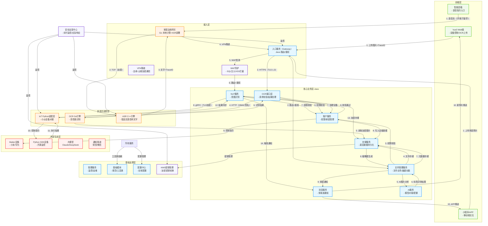

# 智能家庭服务平台 - 全架构设计文档

## 🏗️ 一、架构总览：定位与核心原则

### 1.1 架构定位

本平台以**Java 为核心服务开发语言**（依托 Spring Cloud/Spring Boot 生态保障企业级稳定性），结合**Python/Go/C++ 多语言适配**（针对设备 SDK 兼容性、高性能计算等场景），构建 “核心统一、边缘灵活、安全可控” 的智能家庭技术体系，覆盖 “设备接入→智能交互→数据管理→安全防护” 全链路。

### 1.2 架构层级

| 层级         | 核心组件                            | 核心作用                                   | 主导语言                            |
| ------------ | ----------------------------------- | ------------------------------------------ | ----------------------------------- |
| 前端层       | Vue3 Web 端、小程序 / APP、智能音箱 | 用户交互入口，承接设备控制、语音指令等     | -                                   |
| 接入层       | 入口服务（Gateway）、家庭边缘网关   | 统一请求入口，负责路由、鉴权、本地计算转发 | Java（Gateway）+ 多语言（边缘网关） |
| 核心业务层   | 账户、消息、存储、AI、NLP 服务      | 承载核心业务逻辑，保障数据安全与流程稳定   | Java                                |
| 多语言适配层 | IoT Python 适配层、OCR Go 引擎等    | 对接特殊场景设备 / 计算需求，解耦核心链路  | Python/Go/C++                       |
| 基础支撑层   | 基础模块、管理服务、Nacos 配置中心  | 提供全局规范、运维能力、配置管理           | Java                                |
| 外部生态层   | Matter 设备、大模型、通知渠道       | 扩展业务边界，对接第三方设备与服务         | -                                   |

### 1.3 核心设计原则

1. **技术选型原则**：核心业务用 Java 保稳定，场景化需求用多语言适配（设备 SDK→Python，高并发→Go，低延迟→C++）；
2. **安全防护原则**：构建 “用户→接入→服务→数据→设备” 五层防护网，遵循 “最小权限、纵深防御”；
3. **运维统一原则**：多语言服务通过标准化协议接入，监控、日志、部署流程全局统一；
4. **业务扩展原则**：预留能源管理、健康监测等场景接口，支持快速接入新设备与服务。

## 🔧 二、核心服务设计：职责与语言分工

### 2.1 基础支撑层（Java 主导）

| 服务名称           | 主语言 | 核心职责                                                     | 技术选型理由                                             |
| ------------------ | ------ | ------------------------------------------------------------ | -------------------------------------------------------- |
| 基础模块（Common） | Java   | 封装全局规范（响应体 / 错误码 / 日志格式）、提供跨语言工具类、定义通用模型（如`DeviceDTO`）。 | Spring 生态成熟，支持多语言工具类模板，确保规范统一。    |
| 管理服务（Admin）  | Java   | 服务治理（注册发现 / 健康检查）、监控告警（Prometheus/Grafana）、日志管理（ELK）。 | 运维工具的 Java 客户端成熟，支持自定义指标与全链路追踪。 |
| Nacos 配置中心     | Java   | 全局配置管理（OCR 精度 / AI 配额）、配置动态推送、敏感配置加密。 | 与 Spring Cloud 无缝集成，支持服务注册与配置管理二合一。 |

### 2.2 接入层（Java + 边缘多语言）

| 服务名称            | 主语言      | 核心职责                                                     | 技术选型理由                                                 |
| ------------------- | ----------- | ------------------------------------------------------------ | ------------------------------------------------------------ |
| 入口服务（Gateway） | Java        | 路由转发、JWT 鉴权、接口限流、WAF 防护、API 文档聚合。       | Spring Cloud Gateway 开箱即用，支持注解式配置与安全组件集成。 |
| 家庭边缘网关        | Go+Java+C++ | 本地计算（轻量 AI/ASR 引擎）、断网兼容（本地场景执行）、设备转发（ZigBee/MQTT）。 | Go 轻量高并发适合边缘部署，集成 C++ ASR 引擎实现低延迟语音处理。 |

### 2.3 核心业务层（全 Java）

| 服务名称           | 主语言 | 核心职责                                           | 技术选型理由                                                 |
|----------------| ------ |------------------------------------------------| ------------------------------------------------------------ |
| 账户服务（Account）  | Java   | 用户注册 / 登录、家庭权限管理（RBAC 模型）、设备级权限控制。             | Spring Security/OAuth2 组件成熟，支持 MySQL 分库分表与多家庭数据隔离。 |
| 消息服务（Message）  | Java   | 多渠道通知（短信 / 微信 / APP）、异步解耦（事件转发）、消息追踪与重试。       | Spring AMQP/RabbitMQ 客户端稳定，支持死信队列与第三方通知 SDK 集成。 |
| 存储服务（Storage）  | Java   | 多存储适配（MySQL/MongoDB/Redis/MinIO）、底层数据持久化、数据备份。 | Spring Data 系列适配多数据源，专注底层存储抽象，与业务逻辑解耦。 |
| 文件管理服务（FileManager） | Java   | 文件生命周期管理、权限控制、画廊功能、版本管理、智能分类与去重。               | 基于Spring Boot构建，集成图片处理库，支持多级权限模型和AI分析集成。 |
| AI 平台服务（AI适配器） | Java   | 大模型对接（Claude/DeepSeek）、提示词管理、配额控制与边缘模型切换。      | Java HTTP 客户端稳定，支持与账户服务权限联动，控制 AI 调用范围。 |
| NLP 服务（NLP）    | Java   | 意图识别（如 "打开空调"）、上下文理解、方言适配（陕西话 / 广东话）。          | 轻量 NLP 库（HanLP）适配 Java 生态，与核心服务同语言通信延迟低（<100ms）。 |

### 2.4 多语言适配层（场景化选型）

| 服务名称          | 主语言 | 核心职责                                                     | 与 Java 核心交互方式    |
| ----------------- | ------ | ------------------------------------------------------------ | ----------------------- |
| IoT Python 适配层 | Python | 对接 Python SDK 设备（开源监控 / 智能窗帘）、数据预处理、执行自定义控制脚本。 | gRPC（Protobuf 序列化） |
| OCR Go 识别引擎   | Go     | 高性能图片识别（设备标签 / 账单）、图像预处理（降噪 / 裁剪）、批量异步处理。 | HTTP/JSON（带 TraceID） |
| ASR C++ 核心引擎  | C++    | 低延迟语音转文字（1 秒内处理 3 秒语音）、方言优化、实时流式处理。 | TCP Socket（长连接）    |

## 🔄 三、多语言通信与适配规范

### 3.1 通信协议选型

| 通信场景             | 推荐协议       | 优势                                 | 保障措施（超时 / 重试 / 加密）                    |
| -------------------- | -------------- | ------------------------------------ | ------------------------------------------------- |
| 高频同步（设备状态） | gRPC           | 高性能（HTTP/2）、Protobuf 体积小    | 超时 2 秒，幂等接口重试 2 次，TLS 加密 + 证书认证 |
| 低频任务（OCR 识别） | HTTP/JSON      | 简单易调试、多语言客户端丰富         | 超时 5 秒，携带 HMAC 签名，HTTPS（TLS 1.3）       |
| 流式传输（语音）     | TCP Socket     | 长连接、低延迟，适合持续数据传输     | 心跳 10 秒 / 次，AES-256 加密，主备引擎切换机制   |
| 异步解耦（消息通知） | RabbitMQ/Kafka | 解耦服务、支持重试，多语言客户端完善 | 消息持久化，死信队列（失败 3 次后归档）           |

### 3.2 数据格式与链路追踪

- 统一数据格式：
  - 结构化数据：Protobuf 定义全局模型（如`DeviceStatusProto`含家庭 ID / 设备 ID / 状态）；
  - 错误返回：统一格式`{"code":xxx, "message":"", "traceId":""}`，错误码遵循基础模块规范。
- 全局 TraceID：
  - 生成：Gateway 生成`tr-yyyyMMdd-HHmmss-随机6位`格式 ID；
  - 传递：多语言服务必须携带并在日志中包含，支持全链路检索。

### 3.3 开发规范

- 多语言服务需使用基础模块提供的工具类（Java/ Python/Go），确保日志格式、TraceID 生成统一；
- 联调需部署至专用环境，通过 Gateway 发起请求，携带固定 TraceID，验证全链路通畅性。

## 🧩 四、架构流程图：全链路可视化




## 📌 五、关键业务场景落地

### 场景 1：老人语音控制智能窗帘（多语言 + 安全协同）

1. 老人通过智能音箱发出四川话指令：“拉开客厅窗帘”；
2. 语音流经家庭边缘网关传递至**ASR C++ 引擎**，转文字并生成 TraceID `tr-20240601-153000-123456`；
3. 结果通过**VPN 加密隧道**发送至云端**入口服务**，经 WAF 检测与 JWT 鉴权后路由至 NLP 服务；
4. NLP 服务调用**账户服务**校验老人权限（“家庭普通成员，允许控制客厅窗帘”）；
5. 权限通过后，NLP 服务通过**加密 gRPC**调用**IoT Python 适配层**，触发窗帘控制指令；
6. 执行结果同步至 NLP 服务，经**存储服务**加密存储（AES-256），并通过**消息服务**推送 APP 通知；
7. 全链路日志通过 TraceID 可追溯，安全运营中心实时监控异常行为。

### 场景 2：OCR 识别录入空调设备（多语言 + 数据安全）

1. 用户在 Web 端上传空调标签图片，请求经 HTTPS（TLS 1.3）传输至**入口服务**；
2. **OCR Java 接口层**校验用户权限（"家庭管理员"），通过**HMAC 签名的 HTTP 请求**转发至**OCR Go 引擎**；
3. Go 引擎从**存储服务**读取加密图片，识别出 "型号：KFR-35GW，支持 Matter 协议"；
4. 结果返回至 Java 接口层，结构化后调用**账户服务**创建设备记录，关联用户家庭；
5. 设备数据加密存储，用户收到微信通知，可在 APP 中直接控制该 Matter 空调；
6. 图片识别过程中，原始图片仅在内存处理，不落地存储，符合隐私保护要求。

### 场景 3：家庭相册智能管理（文件管理 + AI 协同）

1. 家庭成员通过 APP 上传家庭聚餐照片，请求经**入口服务**鉴权后路由至**文件管理服务**；
2. **文件管理服务**校验用户权限（"家庭成员，允许上传到家庭相册"），通过**存储服务**加密保存原图至 MinIO；
3. 异步调用**AI 服务**进行图片内容识别，生成标签（"家庭聚餐、客厅、3人"）和人脸识别结果；
4. **文件管理服务**基于 AI 结果自动生成多尺寸缩略图，将元数据（权限=家庭共享、标签、拍摄时间）加密存储；
5. 通过**消息服务**推送通知给其他家庭成员："新增家庭照片，快来查看"；
6. 家庭成员在 APP 画廊中可按时间轴、标签、人物等维度浏览，支持生成分享链接（7天有效）给亲友查看；
7. 全过程遵循四级权限模型，敏感私人照片仅所有者可见，家庭照片支持成员共享。

## 🔒 六、安全架构设计

### 6.1 五层防护网

| 防护层级 | 核心措施                                                     |
| -------- | ------------------------------------------------------------ |
| 用户层   | 多因素认证（密码 + 短信 / 指纹）、终端安全检测（越狱 / ROOT 限制）、行为审计日志 |
| 接入层   | WAF 防护（SQL 注入 / XSS 拦截）、流量控制（单 IP 限速）、HTTPS/TLS 1.3 强制加密 |
| 服务层   | 三级权限控制（家庭 - 房间 - 设备）、服务间加密通信（TLS / 签名）、熔断隔离 |
| 数据层   | 分级加密（高敏感 AES-256）、KMS 密钥管理（定期轮换）、数据生命周期管理（自动清理） |
| 设备层   | 双因素认证（证书 + 秘钥）、固件签名校验、异常行为隔离（沙箱模式） |

### 6.2 安全运营

- **实时监控**：SIEM 系统聚合安全日志，三级告警机制（P1 紧急 / P2 重要 / P3 一般）；
- **应急响应**：数据泄露→冻结隔离 + 恢复；勒索攻击→离线备份恢复；设备劫持→远程安全模式；
- **合规保障**：数据本地化存储、用户知情权（数据范围 / 保留周期）、未成年人保护机制。

## ⚠️ 七、风险与应对策略

| 风险类别 | 风险点                | 应对策略                                                     |
| -------- | --------------------- | ------------------------------------------------------------ |
| 技术风险 | 多语言数据格式不一致  | 基于 Protobuf 定义全局模型，开发格式校验工具，多语言联调验证兼容性 |
| 技术风险 | 跨语言调用超时 / 失败 | 按场景设置超时（2-5 秒），幂等接口重试，熔断器隔离故障（失败率 > 50% 触发） |
| 安全风险 | 设备证书泄露          | 证书定期轮换（每 90 天），泄露后立即吊销并推送新证书，设备离线告警 |
| 安全风险 | 数据传输中被篡改      | 所有通信启用签名校验（HMAC/CRC），敏感数据加密传输（AES-256） |
| 运维风险 | 多语言服务部署复杂    | 全服务容器化（Docker），K8s 统一编排，标准化部署脚本（Helm Chart） |

## 🚀 八、未来扩展规划

1. 业务扩展：

   * 能源服务：对接电表 / 水表，AI 分析能耗趋势，提供节能建议；

   - 健康监测：接入智能手环（Python 适配层），NLP 解析健康数据并推送建议。

2. 技术扩展：

   - 边缘计算深化：支持 Rust 开发高性能设备控制服务，与 Go/C++ 协同；
   - 低代码适配层：可视化配置设备 SDK 对接逻辑，自动生成多语言适配脚本。

## 📁 八、文件管理服务详细设计

### 8.1 服务架构分层

```
文件管理服务 (file-manager-service)
├── 控制层 (Controller)          # REST API接口，权限校验
├── 业务层 (Service)             # 文件生命周期、权限管理、画廊逻辑
├── 适配层 (Adapter)             # 与Storage/AI/Account服务交互
└── 数据层 (Repository)          # 文件元数据管理
```

### 8.2 核心功能模块

#### 文件生命周期管理
- **上传处理**：支持断点续传、格式校验、病毒扫描
- **版本控制**：文件修改历史、版本回滚、增量存储
- **生命周期**：自动清理过期文件、分层存储优化

#### 四级权限模型实现
```yaml
权限级别:
  PRIVATE:        # 私有文件
    - 仅文件所有者可见
    - 支持设置密码保护
  ROOM:           # 房间级共享
    - 指定房间成员可见
    - 继承房间权限设置
  FAMILY:         # 家庭级共享
    - 所有家庭成员可见
    - 默认家庭相册模式
  TEMPORARY:      # 临时分享
    - 生成带过期时间的链接
    - 支持访问密码和下载限制
```

#### 画廊功能技术实现
- **智能分类**：集成AI服务进行图片内容识别
- **缩略图生成**：异步生成多尺寸预览图（150px/300px/800px）
- **相似检测**：基于感知哈希算法自动去重
- **元数据提取**：EXIF信息解析、地理位置、拍摄时间

### 8.3 服务间交互设计

#### 与存储服务交互
```
文件上传流程：
FileManager → Storage → MinIO (原文件)
            → Redis   (缓存热点文件信息)
            → MySQL   (文件元数据)
```

#### 与AI服务交互
```
图片分析流程：
FileManager → AI Service → 图片内容识别
                        → 人脸识别
                        → 文字OCR
                        → 智能标签生成
```

#### 与账户服务交互
```
权限校验流程：
FileManager → Account → 用户权限验证
                     → 家庭关系确认
                     → 房间访问权限
```

### 8.4 安全防护措施

- **文件隔离**：基于家庭ID的存储隔离，防止跨家庭访问
- **访问控制**：JWT Token + 文件级权限双重验证
- **敏感文件保护**：私有文件AES-256加密，密钥定期轮换
- **分享链接安全**：临时Token + 防盗链验证

## 📖 九、术语表

| 术语        | 解释                                                       |
| ----------- | ---------------------------------------------------------- |
| Matter 协议 | 智能家庭统一设备协议，兼容多品牌设备，解决 "互联互通" 问题 |
| TraceID     | 全局链路 ID，跨语言传递，用于日志检索与问题定位            |
| 适配层      | 多语言服务与 Java 核心的中间层，负责协议转换与数据预处理   |
| 边缘网关    | 家庭本地设备，支持断网运行与本地计算，减少云端依赖         |
| KMS         | 密钥管理服务，动态生成 / 轮换加密密钥，保障数据加密安全性  |
| 感知哈希    | 图像相似度检测算法，用于识别重复或相似的图片文件           |
| 四级权限    | 文件访问权限模型：私有、房间、家庭、临时分享四个层级       |

本文档完整覆盖智能家庭服务平台的 “技术架构、多语言协同、安全防护、业务落地”，可作为开发、测试、运维的全流程指导手册，同时预留扩展空间，支持未来业务与技术演进。