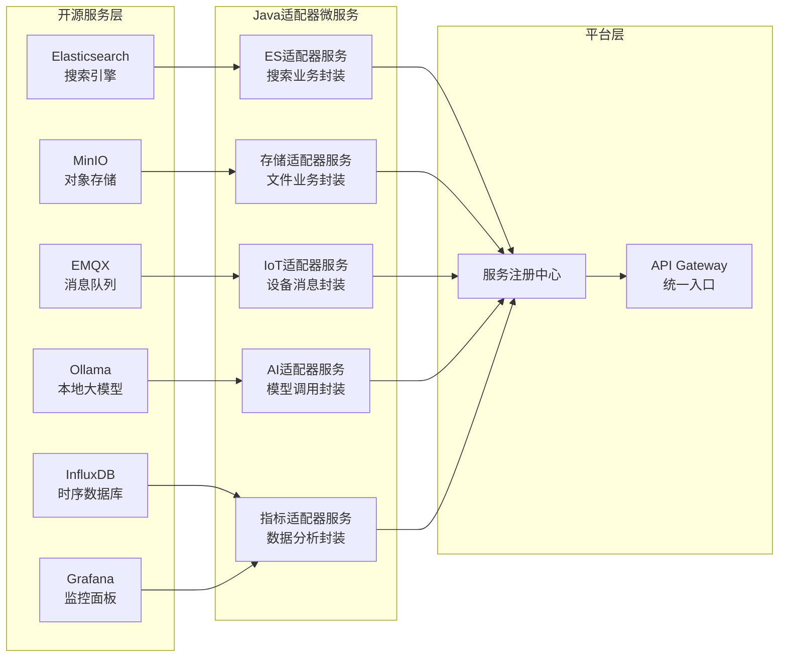

# 适配器微服务开发指南

## 🎯 一、适配器模式架构

### 1.1 整体架构



### 1.2 适配器服务职责

- **协议转换**：将开源服务的原生协议转换为统一的REST API
- **业务封装**：添加业务逻辑、权限控制、数据验证
- **连接管理**：管理与开源服务的连接池、重试机制
- **数据转换**：统一数据格式，屏蔽底层差异
- **监控集成**：提供健康检查、性能指标

## 📦 二、适配器服务模板

### 2.1 标准项目结构

```
adapter-service-template/
├── adapter-core/                    # 核心模块
│   ├── src/main/java/
│   │   ├── config/                 # 配置类
│   │   │   ├── ClientConfig.java   # 客户端配置
│   │   │   ├── PoolConfig.java     # 连接池配置
│   │   │   └── RetryConfig.java    # 重试配置
│   │   ├── client/                 # 原生客户端封装
│   │   │   ├── NativeClient.java   # 底层客户端
│   │   │   └── ClientFactory.java  # 客户端工厂
│   │   ├── converter/              # 数据转换器
│   │   │   ├── RequestConverter.java
│   │   │   └── ResponseConverter.java
│   │   ├── service/                # 业务服务层
│   │   │   ├── AdapterService.java # 适配器核心服务
│   │   │   └── BusinessService.java # 业务逻辑封装
│   │   ├── controller/             # REST接口
│   │   │   └── AdapterController.java
│   │   └── health/                 # 健康检查
│   │       └── ServiceHealthIndicator.java
│   └── src/main/resources/
│       ├── application.yml         # 应用配置
│       └── bootstrap.yml           # 启动配置
├── adapter-api/                    # API定义模块
│   └── src/main/java/
│       ├── dto/                    # 数据传输对象
│       ├── api/                    # Feign接口定义
│       └── constant/               # 常量定义
└── adapter-client/                 # 客户端SDK模块
    └── src/main/java/
        └── client/                 # Feign客户端实现
```

### 2.2 基础适配器类

```java
// 适配器服务基类
@Slf4j
public abstract class BaseAdapterService<T, R> {
    
    // 获取原生客户端
    protected abstract T getNativeClient();
    
    // 数据转换
    protected abstract R convertResponse(Object nativeResponse);
    
    // 执行适配器调用
    protected R execute(Function<T, Object> operation) {
        // 获取客户端
        T client = getNativeClient();
        
        // 记录调用开始
        long startTime = System.currentTimeMillis();
        String traceId = MDC.get("traceId");
        
        try {
            // 执行原生调用
            Object nativeResult = operation.apply(client);
            
            // 转换响应
            R result = convertResponse(nativeResult);
            
            // 记录成功
            recordSuccess(System.currentTimeMillis() - startTime);
            
            return result;
            
        } catch (Exception e) {
            // 记录失败
            recordFailure(e);
            
            // 异常转换
            throw translateException(e);
        }
    }
    
    // 重试机制
    protected R executeWithRetry(Function<T, Object> operation, int maxRetries) {
        int attempts = 0;
        Exception lastException = null;
        
        while (attempts < maxRetries) {
            try {
                return execute(operation);
            } catch (Exception e) {
                lastException = e;
                attempts++;
                
                if (shouldRetry(e) && attempts < maxRetries) {
                    log.warn("Retry attempt {} after error: {}", attempts, e.getMessage());
                    sleep(calculateBackoff(attempts));
                } else {
                    break;
                }
            }
        }
        
        throw new AdapterException("Failed after " + attempts + " attempts", lastException);
    }
    
    // 判断是否应该重试
    protected boolean shouldRetry(Exception e) {
        return e instanceof IOException || 
               e instanceof TimeoutException ||
               e instanceof ConnectException;
    }
    
    // 计算退避时间
    protected long calculateBackoff(int attempt) {
        return Math.min(1000 * (long) Math.pow(2, attempt), 30000);
    }
    
    // 异常转换
    protected RuntimeException translateException(Exception e) {
        if (e instanceof TimeoutException) {
            return new ServiceTimeoutException("Service timeout", e);
        } else if (e instanceof ConnectException) {
            return new ServiceUnavailableException("Service unavailable", e);
        } else {
            return new AdapterException("Adapter error", e);
        }
    }
    
    // 性能监控
    private void recordSuccess(long duration) {
        Metrics.counter("adapter.calls", "status", "success").increment();
        Metrics.timer("adapter.duration").record(duration, TimeUnit.MILLISECONDS);
    }
    
    private void recordFailure(Exception e) {
        Metrics.counter("adapter.calls", "status", "failure", 
                       "error", e.getClass().getSimpleName()).increment();
    }
}
```

## 🔌 三、具体适配器实现示例

### 3.1 Elasticsearch适配器服务

```java
// ES适配器服务实现
@Service
@Slf4j
public class ElasticsearchAdapterService extends BaseAdapterService<RestHighLevelClient, SearchResult> {
    
    @Autowired
    private RestHighLevelClient esClient;
    
    @Autowired
    private QueryBuilder queryBuilder;
    
    @Override
    protected RestHighLevelClient getNativeClient() {
        return esClient;
    }
    
    @Override
    protected SearchResult convertResponse(Object nativeResponse) {
        SearchResponse response = (SearchResponse) nativeResponse;
        
        return SearchResult.builder()
            .total(response.getHits().getTotalHits().value)
            .took(response.getTook().millis())
            .items(Arrays.stream(response.getHits().getHits())
                .map(this::convertHit)
                .collect(Collectors.toList()))
            .aggregations(convertAggregations(response.getAggregations()))
            .build();
    }
    
    // 全文搜索
    public SearchResult search(SearchRequest request) {
        return executeWithRetry(client -> {
            // 构建ES查询
            SearchSourceBuilder sourceBuilder = new SearchSourceBuilder();
            
            // 添加查询条件
            BoolQueryBuilder boolQuery = QueryBuilders.boolQuery();
            
            // 关键词搜索
            if (StringUtils.isNotEmpty(request.getKeyword())) {
                boolQuery.must(QueryBuilders.multiMatchQuery(request.getKeyword())
                    .field("title", 2.0f)  // 标题权重更高
                    .field("content")
                    .field("tags"));
            }
            
            // 过滤条件
            if (request.getFilters() != null) {
                request.getFilters().forEach((field, value) -> {
                    boolQuery.filter(QueryBuilders.termQuery(field, value));
                });
            }
            
            sourceBuilder.query(boolQuery);
            
            // 分页
            sourceBuilder.from(request.getOffset());
            sourceBuilder.size(request.getLimit());
            
            // 排序
            if (request.getSortField() != null) {
                sourceBuilder.sort(request.getSortField(), 
                    request.isAscending() ? SortOrder.ASC : SortOrder.DESC);
            }
            
            // 高亮
            if (request.isHighlight()) {
                HighlightBuilder highlightBuilder = new HighlightBuilder();
                highlightBuilder.field("title");
                highlightBuilder.field("content");
                sourceBuilder.highlighter(highlightBuilder);
            }
            
            // 执行搜索
            org.elasticsearch.action.search.SearchRequest esRequest = 
                new org.elasticsearch.action.search.SearchRequest(request.getIndex());
            esRequest.source(sourceBuilder);
            
            return client.search(esRequest, RequestOptions.DEFAULT);
        }, 3);
    }
    
    // 聚合分析
    public AggregationResult aggregate(AggregationRequest request) {
        return executeWithRetry(client -> {
            SearchSourceBuilder sourceBuilder = new SearchSourceBuilder();
            
            // 构建聚合
            if ("terms".equals(request.getType())) {
                sourceBuilder.aggregation(
                    AggregationBuilders.terms(request.getName())
                        .field(request.getField())
                        .size(request.getSize())
                );
            } else if ("date_histogram".equals(request.getType())) {
                sourceBuilder.aggregation(
                    AggregationBuilders.dateHistogram(request.getName())
                        .field(request.getField())
                        .calendarInterval(DateHistogramInterval.DAY)
                );
            }
            
            org.elasticsearch.action.search.SearchRequest esRequest = 
                new org.elasticsearch.action.search.SearchRequest(request.getIndex());
            esRequest.source(sourceBuilder);
            
            SearchResponse response = client.search(esRequest, RequestOptions.DEFAULT);
            
            return convertAggregationResult(response.getAggregations());
        }, 3);
    }
    
    // 批量索引
    @Async
    public CompletableFuture<BulkResult> bulkIndex(List<Document> documents) {
        return CompletableFuture.supplyAsync(() -> {
            BulkRequest bulkRequest = new BulkRequest();
            
            documents.forEach(doc -> {
                IndexRequest indexRequest = new IndexRequest(doc.getIndex())
                    .id(doc.getId())
                    .source(doc.getSource(), XContentType.JSON);
                bulkRequest.add(indexRequest);
            });
            
            try {
                BulkResponse response = esClient.bulk(bulkRequest, RequestOptions.DEFAULT);
                
                return BulkResult.builder()
                    .success(!response.hasFailures())
                    .totalItems(documents.size())
                    .failedItems(response.hasFailures() ? 
                        Arrays.stream(response.getItems())
                            .filter(BulkItemResponse::isFailed)
                            .count() : 0)
                    .build();
                    
            } catch (IOException e) {
                throw new AdapterException("Bulk index failed", e);
            }
        });
    }
}

// ES适配器控制器
@RestController
@RequestMapping("/api/search")
@Api(tags = "搜索服务")
public class ElasticsearchAdapterController {
    
    @Autowired
    private ElasticsearchAdapterService adapterService;
    
    @PostMapping("/query")
    @ApiOperation("全文搜索")
    public Result<SearchResult> search(@RequestBody @Valid SearchRequest request) {
        // 添加用户权限过滤
        String userId = UserContextHolder.getUserId();
        request.addFilter("userId", userId);
        
        SearchResult result = adapterService.search(request);
        return Result.success(result);
    }
    
    @PostMapping("/aggregate")
    @ApiOperation("聚合分析")
    public Result<AggregationResult> aggregate(@RequestBody @Valid AggregationRequest request) {
        AggregationResult result = adapterService.aggregate(request);
        return Result.success(result);
    }
    
    @PostMapping("/bulk")
    @ApiOperation("批量索引")
    public Result<String> bulkIndex(@RequestBody List<Document> documents) {
        adapterService.bulkIndex(documents);
        return Result.success("Bulk indexing started");
    }
}
```

### 3.2 MinIO存储适配器服务

```java
// MinIO适配器服务
@Service
@Slf4j
public class MinioAdapterService extends BaseAdapterService<MinioClient, StorageResult> {
    
    @Value("${minio.bucket:haven-storage}")
    private String defaultBucket;
    
    @Autowired
    private MinioClient minioClient;
    
    @Autowired
    private FileMetadataService metadataService;
    
    // 文件上传（带业务逻辑）
    public StorageResult uploadFile(MultipartFile file, UploadOptions options) {
        return executeWithRetry(client -> {
            try {
                // 生成文件ID
                String fileId = generateFileId(file, options);
                
                // 构建存储路径
                String objectName = buildObjectPath(fileId, options);
                
                // 文件预处理
                InputStream processedStream = preprocessFile(file, options);
                
                // 上传到MinIO
                client.putObject(
                    PutObjectArgs.builder()
                        .bucket(options.getBucket() != null ? options.getBucket() : defaultBucket)
                        .object(objectName)
                        .stream(processedStream, file.getSize(), -1)
                        .contentType(file.getContentType())
                        .userMetadata(buildMetadata(file, options))
                        .build()
                );
                
                // 保存文件元数据到数据库
                FileMetadata metadata = FileMetadata.builder()
                    .fileId(fileId)
                    .fileName(file.getOriginalFilename())
                    .fileSize(file.getSize())
                    .contentType(file.getContentType())
                    .bucket(defaultBucket)
                    .objectName(objectName)
                    .userId(UserContextHolder.getUserId())
                    .tags(options.getTags())
                    .expiresAt(options.getExpiresAt())
                    .build();
                    
                metadataService.save(metadata);
                
                // 生成访问URL
                String url = generatePresignedUrl(objectName, options.getUrlExpiry());
                
                return StorageResult.builder()
                    .fileId(fileId)
                    .url(url)
                    .size(file.getSize())
                    .build();
                    
            } catch (Exception e) {
                throw new AdapterException("Upload failed", e);
            }
        }, 3);
    }
    
    // 文件预处理（压缩、加密等）
    private InputStream preprocessFile(MultipartFile file, UploadOptions options) throws IOException {
        InputStream stream = file.getInputStream();
        
        // 图片压缩
        if (options.isCompressImage() && isImage(file.getContentType())) {
            stream = compressImage(stream, options.getQuality());
        }
        
        // 文件加密
        if (options.isEncrypt()) {
            stream = encryptStream(stream, options.getEncryptionKey());
        }
        
        // 病毒扫描
        if (options.isVirusScan()) {
            scanForVirus(stream);
        }
        
        return stream;
    }
    
    // 分片上传
    public String initiateMultipartUpload(MultipartUploadRequest request) {
        String uploadId = UUID.randomUUID().toString();
        
        // 初始化分片上传会话
        MultipartUploadSession session = MultipartUploadSession.builder()
            .uploadId(uploadId)
            .fileName(request.getFileName())
            .totalParts(request.getTotalParts())
            .partSize(request.getPartSize())
            .build();
            
        uploadSessionCache.put(uploadId, session);
        
        return uploadId;
    }
    
    // 上传分片
    public PartUploadResult uploadPart(String uploadId, int partNumber, InputStream partData) {
        MultipartUploadSession session = uploadSessionCache.get(uploadId);
        
        if (session == null) {
            throw new IllegalArgumentException("Invalid upload ID");
        }
        
        return executeWithRetry(client -> {
            try {
                // 上传分片到临时位置
                String partKey = String.format("temp/%s/part-%d", uploadId, partNumber);
                
                client.putObject(
                    PutObjectArgs.builder()
                        .bucket(defaultBucket)
                        .object(partKey)
                        .stream(partData, -1, 10485760)
                        .build()
                );
                
                // 更新会话
                session.addCompletedPart(partNumber);
                
                return PartUploadResult.builder()
                    .partNumber(partNumber)
                    .etag(DigestUtils.md5Hex(partData))
                    .build();
                    
            } catch (Exception e) {
                throw new AdapterException("Part upload failed", e);
            }
        }, 3);
    }
    
    // 文件下载（带权限控制）
    public InputStream downloadFile(String fileId) {
        // 检查权限
        FileMetadata metadata = metadataService.getByFileId(fileId);
        checkDownloadPermission(metadata);
        
        return execute(client -> {
            try {
                GetObjectResponse response = client.getObject(
                    GetObjectArgs.builder()
                        .bucket(metadata.getBucket())
                        .object(metadata.getObjectName())
                        .build()
                );
                
                // 记录下载日志
                auditService.logDownload(fileId, UserContextHolder.getUserId());
                
                // 如果文件加密，进行解密
                if (metadata.isEncrypted()) {
                    return decryptStream(response);
                }
                
                return response;
                
            } catch (Exception e) {
                throw new AdapterException("Download failed", e);
            }
        });
    }
    
    // 批量操作
    @Async
    public CompletableFuture<BatchOperationResult> batchDelete(List<String> fileIds) {
        return CompletableFuture.supplyAsync(() -> {
            List<DeleteObject> objects = fileIds.stream()
                .map(fileId -> {
                    FileMetadata metadata = metadataService.getByFileId(fileId);
                    return new DeleteObject(metadata.getObjectName());
                })
                .collect(Collectors.toList());
                
            Iterable<Result<DeleteError>> results = minioClient.removeObjects(
                RemoveObjectsArgs.builder()
                    .bucket(defaultBucket)
                    .objects(objects)
                    .build()
            );
            
            // 统计结果
            int successCount = 0;
            int failureCount = 0;
            
            for (Result<DeleteError> result : results) {
                try {
                    result.get();
                    failureCount++;
                } catch (Exception e) {
                    successCount++;
                }
            }
            
            // 删除元数据
            metadataService.deleteByFileIds(fileIds);
            
            return BatchOperationResult.builder()
                .totalCount(fileIds.size())
                .successCount(successCount)
                .failureCount(failureCount)
                .build();
        });
    }
}
```

### 3.3 MQTT/IoT适配器服务

```java
// MQTT适配器服务
@Service
@Slf4j
public class MqttAdapterService extends BaseAdapterService<MqttClient, MessageResult> {
    
    @Autowired
    private MqttClient mqttClient;
    
    @Autowired
    private DeviceRegistry deviceRegistry;
    
    @Autowired
    private MessageProcessor messageProcessor;
    
    // 设备消息订阅管理
    private final Map<String, Set<String>> subscriptions = new ConcurrentHashMap<>();
    
    @PostConstruct
    public void init() {
        // 设置消息回调
        mqttClient.setCallback(new MqttCallback() {
            @Override
            public void messageArrived(String topic, MqttMessage message) {
                handleIncomingMessage(topic, message);
            }
            
            @Override
            public void connectionLost(Throwable cause) {
                log.error("MQTT connection lost", cause);
                reconnect();
            }
            
            @Override
            public void deliveryComplete(IMqttDeliveryToken token) {
                log.debug("Message delivered: {}", token.getMessageId());
            }
        });
        
        // 订阅系统主题
        subscribeSystemTopics();
    }
    
    // 发送设备控制指令
    public MessageResult sendCommand(DeviceCommand command) {
        return executeWithRetry(client -> {
            try {
                // 验证设备状态
                Device device = deviceRegistry.getDevice(command.getDeviceId());
                if (!device.isOnline()) {
                    throw new DeviceOfflineException("Device is offline");
                }
                
                // 构建MQTT消息
                String topic = buildCommandTopic(device);
                MqttMessage message = new MqttMessage();
                
                // 设置消息内容
                CommandPayload payload = CommandPayload.builder()
                    .commandId(UUID.randomUUID().toString())
                    .deviceId(command.getDeviceId())
                    .action(command.getAction())
                    .params(command.getParams())
                    .timestamp(System.currentTimeMillis())
                    .build();
                    
                message.setPayload(JsonUtils.toJson(payload).getBytes());
                message.setQos(command.getQos() != null ? command.getQos() : 1);
                message.setRetained(false);
                
                // 发送消息
                client.publish(topic, message);
                
                // 记录命令日志
                commandLogService.log(CommandLog.builder()
                    .commandId(payload.getCommandId())
                    .deviceId(command.getDeviceId())
                    .userId(UserContextHolder.getUserId())
                    .action(command.getAction())
                    .status(CommandStatus.SENT)
                    .build());
                
                // 等待响应（如果需要）
                if (command.isWaitResponse()) {
                    return waitForResponse(payload.getCommandId(), command.getTimeout());
                }
                
                return MessageResult.success(payload.getCommandId());
                
            } catch (Exception e) {
                throw new AdapterException("Send command failed", e);
            }
        }, 3);
    }
    
    // 处理设备上报数据
    private void handleIncomingMessage(String topic, MqttMessage message) {
        try {
            // 解析主题
            TopicInfo topicInfo = parseTopicInfo(topic);
            
            // 解析消息内容
            String payload = new String(message.getPayload());
            
            // 根据消息类型处理
            switch (topicInfo.getMessageType()) {
                case TELEMETRY:
                    handleTelemetry(topicInfo.getDeviceId(), payload);
                    break;
                case STATUS:
                    handleStatusUpdate(topicInfo.getDeviceId(), payload);
                    break;
                case ALERT:
                    handleAlert(topicInfo.getDeviceId(), payload);
                    break;
                case RESPONSE:
                    handleCommandResponse(topicInfo.getDeviceId(), payload);
                    break;
                default:
                    log.warn("Unknown message type: {}", topicInfo.getMessageType());
            }
            
        } catch (Exception e) {
            log.error("Failed to process message from topic: {}", topic, e);
        }
    }
    
    // 处理遥测数据
    private void handleTelemetry(String deviceId, String payload) {
        TelemetryData telemetry = JsonUtils.fromJson(payload, TelemetryData.class);
        
        // 数据验证
        if (!validateTelemetry(telemetry)) {
            log.warn("Invalid telemetry data from device: {}", deviceId);
            return;
        }
        
        // 数据处理
        ProcessedTelemetry processed = messageProcessor.processTelemetry(deviceId, telemetry);
        
        // 存储到时序数据库
        timeSeriesService.save(deviceId, processed);
        
        // 触发规则引擎
        ruleEngine.evaluate(deviceId, processed);
        
        // 发送到事件总线
        eventBus.publish(new TelemetryEvent(deviceId, processed));
    }
    
    // 设备注册
    public DeviceRegistrationResult registerDevice(DeviceRegistrationRequest request) {
        // 生成设备证书
        DeviceCredentials credentials = generateDeviceCredentials(request);
        
        // 注册设备
        Device device = Device.builder()
            .deviceId(request.getDeviceId())
            .deviceType(request.getDeviceType())
            .metadata(request.getMetadata())
            .credentials(credentials)
            .status(DeviceStatus.REGISTERED)
            .build();
            
        deviceRegistry.register(device);
        
        // 订阅设备主题
        subscribeDeviceTopics(device.getDeviceId());
        
        return DeviceRegistrationResult.builder()
            .deviceId(device.getDeviceId())
            .mqttEndpoint(getMqttEndpoint())
            .topics(getDeviceTopics(device.getDeviceId()))
            .credentials(credentials)
            .build();
    }
    
    // 批量设备管理
    public BatchResult batchControl(BatchControlRequest request) {
        List<CompletableFuture<MessageResult>> futures = request.getDeviceIds()
            .stream()
            .map(deviceId -> CompletableFuture.supplyAsync(() -> {
                try {
                    DeviceCommand command = DeviceCommand.builder()
                        .deviceId(deviceId)
                        .action(request.getAction())
                        .params(request.getParams())
                        .build();
                    return sendCommand(command);
                } catch (Exception e) {
                    return MessageResult.failure(e.getMessage());
                }
            }))
            .collect(Collectors.toList());
            
        CompletableFuture.allOf(futures.toArray(new CompletableFuture[0])).join();
        
        List<MessageResult> results = futures.stream()
            .map(CompletableFuture::join)
            .collect(Collectors.toList());
            
        long successCount = results.stream()
            .filter(MessageResult::isSuccess)
            .count();
            
        return BatchResult.builder()
            .totalCount(request.getDeviceIds().size())
            .successCount(successCount)
            .failureCount(request.getDeviceIds().size() - successCount)
            .details(results)
            .build();
    }
}
```

### 3.4 AI模型适配器服务（Ollama）

```java
// Ollama AI适配器服务
@Service
@Slf4j
public class OllamaAdapterService extends BaseAdapterService<OllamaClient, AIResponse> {
    
    @Autowired
    private OllamaClient ollamaClient;
    
    @Autowired
    private PromptTemplateService templateService;
    
    @Autowired
    private TokenCounter tokenCounter;
    
    // 文本生成
    public AIResponse generate(GenerateRequest request) {
        return executeWithRetry(client -> {
            // 加载提示词模板
            String prompt = preparePrompt(request);
            
            // 检查token限制
            int tokenCount = tokenCounter.count(prompt);
            if (tokenCount > request.getMaxTokens()) {
                throw new TokenLimitExceededException("Prompt exceeds token limit");
            }
            
            // 构建请求
            OllamaGenerateRequest ollamaRequest = OllamaGenerateRequest.builder()
                .model(request.getModel() != null ? request.getModel() : "llama2")
                .prompt(prompt)
                .temperature(request.getTemperature())
                .topP(request.getTopP())
                .maxTokens(request.getMaxTokens())
                .stream(false)
                .build();
            
            // 调用模型
            OllamaResponse response = client.generate(ollamaRequest);
            
            // 转换响应
            return AIResponse.builder()
                .content(response.getResponse())
                .model(request.getModel())
                .usage(Usage.builder()
                    .promptTokens(tokenCount)
                    .completionTokens(tokenCounter.count(response.getResponse()))
                    .build())
                .metadata(Map.of(
                    "duration", response.getDuration(),
                    "model_version", response.getModelVersion()
                ))
                .build();
                
        }, 3);
    }
    
    // 对话
    public AIResponse chat(ChatRequest request) {
        return executeWithRetry(client -> {
            // 构建对话上下文
            List<Message> messages = buildChatContext(request);
            
            // 调用聊天API
            OllamaChatRequest chatRequest = OllamaChatRequest.builder()
                .model(request.getModel())
                .messages(messages)
                .temperature(request.getTemperature())
                .build();
                
            OllamaChatResponse response = client.chat(chatRequest);
            
            // 保存对话历史
            saveChatHistory(request.getSessionId(), messages, response);
            
            return AIResponse.builder()
                .content(response.getMessage().getContent())
                .role(response.getMessage().getRole())
                .sessionId(request.getSessionId())
                .build();
        }, 3);
    }
    
    // 嵌入向量生成
    public EmbeddingResponse generateEmbedding(EmbeddingRequest request) {
        return executeWithRetry(client -> {
            OllamaEmbeddingRequest embeddingRequest = OllamaEmbeddingRequest.builder()
                .model("nomic-embed-text")
                .prompt(request.getText())
                .build();
                
            OllamaEmbeddingResponse response = client.embedding(embeddingRequest);
            
            return EmbeddingResponse.builder()
                .embedding(response.getEmbedding())
                .dimension(response.getEmbedding().length)
                .build();
        }, 3);
    }
    
    // 流式生成
    public Flux<String> streamGenerate(GenerateRequest request) {
        String prompt = preparePrompt(request);
        
        OllamaGenerateRequest ollamaRequest = OllamaGenerateRequest.builder()
            .model(request.getModel())
            .prompt(prompt)
            .stream(true)
            .build();
            
        return Flux.create(sink -> {
            try {
                ollamaClient.streamGenerate(ollamaRequest, new StreamCallback() {
                    @Override
                    public void onToken(String token) {
                        sink.next(token);
                    }
                    
                    @Override
                    public void onComplete() {
                        sink.complete();
                    }
                    
                    @Override
                    public void onError(Exception e) {
                        sink.error(e);
                    }
                });
            } catch (Exception e) {
                sink.error(e);
            }
        });
    }
}
```

## 📝 四、适配器服务配置

### 4.1 统一配置模板

```yaml
# application-base.yml
spring:
  application:
    name: ${SERVICE_NAME}-adapter
    
  cloud:
    nacos:
      discovery:
        server-addr: ${NACOS_SERVER:localhost:8848}
        namespace: ${NACOS_NAMESPACE:haven-platform}
        group: adapter-services
        
server:
  port: ${SERVER_PORT:8080}
  
# 适配器通用配置
adapter:
  # 重试配置
  retry:
    max-attempts: 3
    backoff:
      initial-interval: 1000
      max-interval: 30000
      multiplier: 2
      
  # 连接池配置
  pool:
    max-total: 100
    max-per-route: 20
    connection-timeout: 5000
    socket-timeout: 10000
    
  # 熔断器配置
  circuit-breaker:
    failure-threshold: 50
    success-threshold: 5
    timeout: 30000
    
  # 监控配置
  metrics:
    enabled: true
    export:
      prometheus:
        enabled: true
        
# 健康检查
management:
  endpoints:
    web:
      exposure:
        include: health,info,metrics,prometheus
  health:
    defaults:
      enabled: true
    custom:
      enabled: true
      
# 日志配置
logging:
  level:
    root: INFO
    com.haven.adapter: DEBUG
  pattern:
    console: "%d{yyyy-MM-dd HH:mm:ss} [%thread] %-5level %logger{36} - %msg%n"
    
# 特定服务配置（以ES为例）
elasticsearch:
  hosts: ${ES_HOSTS:localhost:9200}
  username: ${ES_USERNAME:}
  password: ${ES_PASSWORD:}
  connection-timeout: 5000
  socket-timeout: 30000
  max-retry-timeout: 30000
```

### 4.2 Docker化部署

```dockerfile
# Dockerfile模板
FROM openjdk:17-jdk-slim

WORKDIR /app

# 添加健康检查脚本
COPY health-check.sh /health-check.sh
RUN chmod +x /health-check.sh

# 复制JAR文件
COPY target/*-adapter.jar app.jar

# 暴露端口
EXPOSE 8080

# 健康检查
HEALTHCHECK --interval=30s --timeout=3s --start-period=40s --retries=3 \
  CMD /health-check.sh || exit 1

# 启动命令
ENTRYPOINT ["java", "-jar", "/app/app.jar"]
```

```yaml
# docker-compose.yml
version: '3.8'

services:
  # ES适配器
  es-adapter:
    image: haven/es-adapter:latest
    environment:
      - SERVICE_NAME=elasticsearch
      - ES_HOSTS=elasticsearch:9200
      - NACOS_SERVER=nacos:8848
    depends_on:
      - elasticsearch
      - nacos
    networks:
      - haven-network
      
  # MinIO适配器
  storage-adapter:
    image: haven/storage-adapter:latest
    environment:
      - SERVICE_NAME=storage
      - MINIO_ENDPOINT=minio:9000
      - MINIO_ACCESS_KEY=admin
      - MINIO_SECRET_KEY=admin123
    depends_on:
      - minio
      - nacos
    networks:
      - haven-network
      
  # MQTT适配器
  iot-adapter:
    image: haven/iot-adapter:latest
    environment:
      - SERVICE_NAME=iot
      - MQTT_BROKER=tcp://emqx:1883
      - MQTT_USERNAME=admin
      - MQTT_PASSWORD=admin123
    depends_on:
      - emqx
      - nacos
    networks:
      - haven-network
      
  # AI适配器
  ai-adapter:
    image: haven/ai-adapter:latest
    environment:
      - SERVICE_NAME=ai
      - OLLAMA_HOST=http://ollama:11434
    depends_on:
      - ollama
      - nacos
    networks:
      - haven-network

networks:
  haven-network:
    driver: bridge
```

## 🔄 五、服务注册与发现

### 5.1 自动注册机制

```java
// 适配器服务自动注册
@Component
@Slf4j
public class AdapterServiceRegistrar {
    
    @Autowired
    private NacosServiceRegistry registry;
    
    @Autowired
    private AdapterProperties properties;
    
    @PostConstruct
    public void register() {
        // 构建服务实例
        NacosServiceInstance instance = NacosServiceInstance.builder()
            .serviceId(properties.getServiceId())
            .host(getLocalHost())
            .port(properties.getPort())
            .secure(false)
            .metadata(Map.of(
                "adapter.type", properties.getAdapterType(),
                "adapter.version", properties.getVersion(),
                "adapter.target", properties.getTargetService()
            ))
            .build();
            
        // 注册服务
        registry.register(instance);
        
        // 注册健康检查
        registry.setStatus(instance, "UP");
        
        log.info("Adapter service registered: {}", instance.getServiceId());
    }
    
    @PreDestroy
    public void deregister() {
        registry.deregister(buildServiceInstance());
        log.info("Adapter service deregistered");
    }
}
```

### 5.2 Gateway动态路由

```java
// Gateway动态发现适配器服务
@Component
public class AdapterRouteLocator {
    
    @Autowired
    private DiscoveryClient discoveryClient;
    
    @Scheduled(fixedDelay = 30000)
    public void refreshRoutes() {
        // 发现所有适配器服务
        List<ServiceInstance> adapters = discoveryClient.getInstances("adapter-services");
        
        adapters.forEach(adapter -> {
            String adapterType = adapter.getMetadata().get("adapter.type");
            
            // 动态创建路由
            Route route = Route.builder()
                .id("adapter-" + adapterType)
                .uri("lb://" + adapter.getServiceId())
                .predicate(PathPredicateFactory.apply("/api/" + adapterType + "/**"))
                .filter(StripPrefixGatewayFilterFactory.apply(2))
                .build();
                
            routeRegistry.add(route);
        });
    }
}
```

## 📊 六、监控与管理

### 6.1 适配器监控指标

```java
// 适配器监控指标收集
@Component
public class AdapterMetricsCollector {
    
    private final MeterRegistry registry;
    
    // 调用计数
    private final Counter callCounter;
    
    // 响应时间
    private final Timer responseTimer;
    
    // 错误率
    private final Counter errorCounter;
    
    // 连接池状态
    private final Gauge poolGauge;
    
    public AdapterMetricsCollector(MeterRegistry registry) {
        this.registry = registry;
        
        this.callCounter = Counter.builder("adapter.calls")
            .description("Total adapter calls")
            .register(registry);
            
        this.responseTimer = Timer.builder("adapter.response.time")
            .description("Adapter response time")
            .register(registry);
            
        this.errorCounter = Counter.builder("adapter.errors")
            .description("Total adapter errors")
            .register(registry);
            
        this.poolGauge = Gauge.builder("adapter.pool.active", this, 
            AdapterMetricsCollector::getActiveConnections)
            .description("Active connections in pool")
            .register(registry);
    }
    
    @EventListener
    public void handleAdapterCall(AdapterCallEvent event) {
        callCounter.increment();
        
        Timer.Sample sample = Timer.start(registry);
        
        event.onComplete(result -> {
            sample.stop(responseTimer);
            
            if (!result.isSuccess()) {
                errorCounter.increment();
            }
        });
    }
}
```

### 6.2 Vue管理端集成

```vue
<!-- 适配器服务管理界面 -->
<template>
  <div class="adapter-manager">
    <el-card>
      <template #header>
        <div class="card-header">
          <span>适配器服务列表</span>
          <el-button type="primary" @click="showRegisterDialog">
            注册新适配器
          </el-button>
        </div>
      </template>
      
      <el-table :data="adapters" style="width: 100%">
        <el-table-column prop="name" label="适配器名称" />
        <el-table-column prop="type" label="类型">
          <template #default="scope">
            <el-tag>{{ scope.row.type }}</el-tag>
          </template>
        </el-table-column>
        <el-table-column prop="targetService" label="目标服务" />
        <el-table-column prop="status" label="状态">
          <template #default="scope">
            <el-badge 
              :type="scope.row.status === 'UP' ? 'success' : 'danger'"
              :value="scope.row.status" />
          </template>
        </el-table-column>
        <el-table-column label="监控指标">
          <template #default="scope">
            <div class="metrics">
              <span>调用次数: {{ scope.row.metrics.calls }}</span>
              <span>平均响应: {{ scope.row.metrics.avgResponse }}ms</span>
              <span>错误率: {{ scope.row.metrics.errorRate }}%</span>
            </div>
          </template>
        </el-table-column>
        <el-table-column label="操作">
          <template #default="scope">
            <el-button-group>
              <el-button size="small" @click="viewConfig(scope.row)">
                配置
              </el-button>
              <el-button size="small" @click="viewMonitor(scope.row)">
                监控
              </el-button>
              <el-button size="small" @click="testAdapter(scope.row)">
                测试
              </el-button>
            </el-button-group>
          </template>
        </el-table-column>
      </el-table>
    </el-card>
    
    <!-- 适配器测试对话框 -->
    <el-dialog v-model="testDialog" title="测试适配器" width="60%">
      <AdapterTestPanel :adapter="currentAdapter" />
    </el-dialog>
  </div>
</template>

<script setup>
import { ref, onMounted } from 'vue'
import { getAdapters, testAdapter } from '@/api/adapter'
import AdapterTestPanel from './AdapterTestPanel.vue'

const adapters = ref([])
const currentAdapter = ref(null)
const testDialog = ref(false)

const loadAdapters = async () => {
  const res = await getAdapters()
  adapters.value = res.data
}

const testAdapter = (adapter) => {
  currentAdapter.value = adapter
  testDialog.value = true
}

onMounted(() => {
  loadAdapters()
  // 定时刷新
  setInterval(loadAdapters, 10000)
})
</script>
```

## 🚀 七、最佳实践

### 7.1 适配器开发规范

1. **统一异常处理**：所有异常转换为平台标准异常
2. **统一日志格式**：必须包含TraceId、服务名、操作类型
3. **统一监控指标**：调用次数、响应时间、错误率、连接池状态
4. **统一健康检查**：检查目标服务连通性、连接池状态
5. **统一配置管理**：通过Nacos动态配置

### 7.2 性能优化建议

1. **连接池优化**：根据负载动态调整连接池大小
2. **批量操作**：支持批量API减少网络开销
3. **缓存策略**：对频繁访问的数据进行缓存
4. **异步处理**：长耗时操作使用异步方式
5. **熔断降级**：防止级联故障

### 7.3 安全加固

1. **认证授权**：所有适配器必须验证调用方身份
2. **数据加密**：敏感数据传输加密
3. **审计日志**：记录所有操作日志
4. **限流控制**：防止恶意调用
5. **数据脱敏**：日志中的敏感信息脱敏

通过这种适配器模式，你可以灵活地将各种开源服务集成到你的Java服务平台中，同时保持架构的清晰和可维护性。