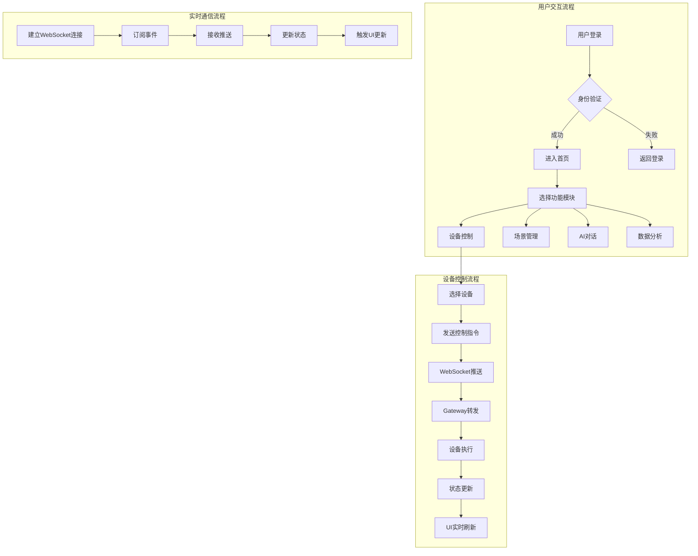

# HavenButler Web管理端 (Vue3)

## 项目定位
- **架构层级**：前端层
- **核心职责**：提供智能家庭服务平台的Web管理界面，包括设备控制、场景管理、数据可视化、系统配置等功能
- **业务范围**：家庭管理、设备控制、AI对话、数据分析、用户管理、系统监控

## 技术栈
- **核心框架**：Vue 3.4 + TypeScript 5
- **构建工具**：Vite 5
- **UI框架**：Vuetify 3 (Material Design 3)
- **状态管理**：Pinia
- **路由管理**：Vue Router 4
- **HTTP客户端**：Axios
- **WebSocket**：Socket.io-client
- **图表库**：ECharts 5
- **国际化**：Vue I18n

## 设计规范
- **设计系统**：Google Material Design 3
- **主题色**：Dynamic Color (支持动态主题)
- **响应式**：移动优先，支持手机、平板、桌面
- **无障碍**：WCAG 2.1 AA级标准
- **动效**：Material Motion

## 项目结构
```
web-vue3/
├── src/
│   ├── views/                 # 页面组件
│   │   ├── home/              # 首页仪表盘
│   │   ├── device/            # 设备管理
│   │   ├── scene/             # 场景管理
│   │   ├── family/            # 家庭管理
│   │   ├── ai/                # AI对话
│   │   ├── analytics/         # 数据分析
│   │   └── settings/          # 系统设置
│   ├── components/            # 通用组件
│   │   ├── common/            # 基础组件
│   │   ├── device/            # 设备组件
│   │   ├── chart/             # 图表组件
│   │   └── layout/            # 布局组件
│   ├── composables/           # 组合式函数
│   ├── stores/                # Pinia状态管理
│   ├── router/                # 路由配置
│   ├── api/                   # API接口
│   ├── utils/                 # 工具函数
│   ├── assets/                # 静态资源
│   ├── styles/                # 全局样式
│   └── locales/               # 国际化文件
├── public/                    # 公共资源
├── docs/                      # 项目文档
└── tests/                     # 测试文件
```

## 核心功能模块

### 1. 首页仪表盘
- **设备状态总览**：实时显示所有设备状态
- **快捷控制**：常用设备快速操作
- **场景切换**：一键切换预设场景
- **消息通知**：系统消息和告警提示
- **数据卡片**：关键指标展示

### 2. 设备管理
- **设备列表**：分房间/分类展示设备
- **设备控制**：实时控制设备状态
- **设备详情**：查看设备信息和历史数据
- **设备添加**：扫码/手动添加新设备
- **设备分组**：自定义设备分组

### 3. 场景管理
- **场景列表**：预设和自定义场景
- **场景编辑**：可视化场景编排
- **自动化规则**：条件触发配置
- **场景执行**：手动/自动/语音触发
- **场景模板**：场景模板市场

### 4. AI助手
- **对话界面**：自然语言交互
- **语音输入**：语音识别输入
- **智能建议**：基于使用习惯的建议
- **历史记录**：对话历史查看
- **模型切换**：选择不同AI模型

### 5. 家庭管理
- **成员管理**：添加/删除家庭成员
- **权限设置**：三级权限配置
- **房间管理**：房间创建和编辑
- **共享相册**：家庭照片管理
- **家庭日志**：操作记录查看

### 6. 数据分析
- **能耗分析**：电量/水量统计
- **使用报告**：设备使用频率
- **趋势图表**：数据趋势分析
- **异常检测**：异常数据告警
- **导出报表**：数据导出功能

## 业务流程图



## 开发规范

### 组件开发规范
```vue
<template>
  <!-- 使用语义化标签 -->
  <section class="device-card">
    <!-- 遵循Material Design 3规范 -->
    <md-card>
      <md-card-content>
        <!-- 组件内容 -->
      </md-card-content>
    </md-card>
  </section>
</template>

<script setup lang="ts">
// 使用组合式API
import { ref, computed, onMounted } from 'vue'
import { useDeviceStore } from '@/stores/device'

// Props定义
interface Props {
  deviceId: string
  showDetails?: boolean
}

const props = withDefaults(defineProps<Props>(), {
  showDetails: false
})

// 组合式函数
const store = useDeviceStore()
const device = computed(() => store.getDeviceById(props.deviceId))
</script>

<style scoped lang="scss">
// 使用CSS变量实现主题
.device-card {
  background: var(--md-sys-color-surface);
  color: var(--md-sys-color-on-surface);
  border-radius: var(--md-sys-shape-corner-large);
}
</style>
```

### 状态管理规范
```typescript
// stores/device.ts
import { defineStore } from 'pinia'

export const useDeviceStore = defineStore('device', {
  state: () => ({
    devices: [] as Device[],
    loading: false
  }),
  
  getters: {
    onlineDevices: (state) => 
      state.devices.filter(d => d.online)
  },
  
  actions: {
    async fetchDevices() {
      this.loading = true
      try {
        const data = await api.getDevices()
        this.devices = data
      } finally {
        this.loading = false
      }
    }
  }
})
```

## API对接

### 基础配置
```typescript
// api/config.ts
export const API_BASE_URL = import.meta.env.VITE_API_BASE_URL || 'http://localhost:9783'
export const WS_URL = import.meta.env.VITE_WS_URL || 'ws://localhost:9783'

// 所有API请求必须通过Gateway
// 不允许直接访问微服务
```

### 请求拦截
```typescript
// api/interceptors.ts
axios.interceptors.request.use((config) => {
  // 添加Token
  config.headers.Authorization = `Bearer ${getToken()}`
  // 添加TraceID
  config.headers['X-Trace-ID'] = generateTraceId()
  return config
})
```

## 性能优化

### 1. 路由懒加载
```typescript
const routes = [
  {
    path: '/device',
    component: () => import('@/views/device/index.vue')
  }
]
```

### 2. 组件异步加载
```vue
<script setup>
import { defineAsyncComponent } from 'vue'

const HeavyChart = defineAsyncComponent(() => 
  import('@/components/chart/HeavyChart.vue')
)
</script>
```

### 3. 虚拟滚动
- 设备列表使用虚拟滚动
- 日志查看使用虚拟滚动

### 4. 图片优化
- 使用WebP格式
- 懒加载图片
- 响应式图片

## 测试要求

### 单元测试
```bash
npm run test:unit
# 覆盖率要求：≥80%
```

### E2E测试
```bash
npm run test:e2e
# 覆盖核心业务流程
```

### 测试内容
- 组件渲染测试
- 用户交互测试
- API调用测试
- 状态管理测试

## 部署配置

### 开发环境
```bash
npm run dev
# 本地开发服务器：http://localhost:5173
```

### 生产构建
```bash
npm run build
# 输出目录：dist/
```

### Docker部署
```dockerfile
FROM node:18-alpine as builder
WORKDIR /app
COPY package*.json ./
RUN npm ci
COPY . .
RUN npm run build

FROM nginx:alpine
COPY --from=builder /app/dist /usr/share/nginx/html
COPY nginx.conf /etc/nginx/nginx.conf
EXPOSE 80
```

## 监控指标
- **首屏加载时间**：< 2秒
- **页面切换时间**：< 300ms
- **API响应时间**：< 500ms
- **帧率**：≥ 60fps
- **内存占用**：< 100MB

## 安全要求
- XSS防护：内容安全策略(CSP)
- CSRF防护：Token验证
- 敏感信息：不在前端存储
- HTTPS：强制使用HTTPS
- 权限控制：前端路由守卫

## 浏览器兼容性
- Chrome 90+
- Firefox 88+
- Safari 14+
- Edge 90+
- 移动端浏览器支持

## 更新历史
- v1.0.0 (2025-01-15): 初始版本，基础功能框架