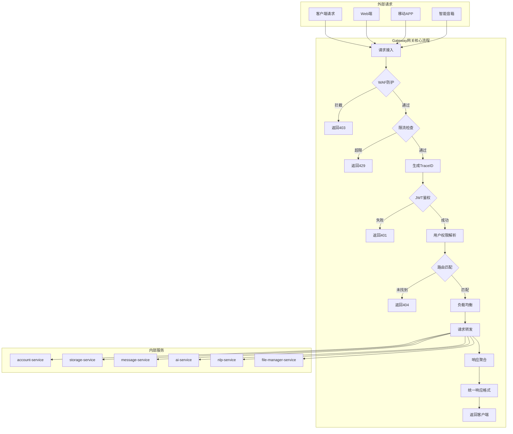

# Gateway 网关服务

## 服务定位
- **架构层级**：接入层
- **核心职责**：统一入口服务，负责路由转发、JWT鉴权、接口限流、WAF防护、API文档聚合
- **业务范围**：所有外部请求的统一入口，内部服务的路由分发，安全防护第一道关卡

## 技术栈
- **主开发语言**：Java 17
- **核心框架**：Spring Cloud Gateway 4.0.7, Spring Boot 3.1.0
- **通信协议**：HTTP/HTTPS (外部), HTTP/gRPC (内部)
- **数据存储**：通过 storage-service 统一访问

## 部署信息
- **Docker镜像**：`smart-home/gateway:v1.0.0`
- **内部端口**：8080 (Docker网络内)
- **外部端口**：9783 (宿主机映射，生产环境唯一对外端口)
- **健康检查**：`/actuator/health`
- **环境变量**：
  ```
  NACOS_ADDR=nacos:8848
  STORAGE_SERVICE_URL=http://storage-service:8080
  ACCOUNT_SERVICE_URL=http://account-service:8080
  JWT_SECRET=${JWT_SECRET}  # 从配置中心获取
  ```

## 业务流程图



## 路由配置汇总

| 服务名称 | 路由前缀 | 目标地址 | 鉴权要求 | 限流策略 |
|----------|----------|----------|----------|----------|
| account | /api/v1/account/* | account-service:8080 | 部分需要 | 100/分钟 |
| storage | /api/v1/storage/* | storage-service:8080 | JWT必需 | 50/分钟 |
| message | /api/v1/message/* | message-service:8080 | JWT必需 | 30/分钟 |
| ai | /api/v1/ai/* | ai-service:8080 | JWT必需 | 10/分钟 |
| nlp | /api/v1/nlp/* | nlp-service:8080 | JWT必需 | 50/分钟 |
| file | /api/v1/file/* | file-manager-service:8080 | JWT必需 | 20/分钟 |

## 鉴权规则

### 公开接口（无需认证）
- `/api/v1/account/login` - 用户登录
- `/api/v1/account/register` - 用户注册
- `/api/v1/health` - 健康检查
- `/swagger/**` - API文档

### 需要登录（JWT Token）
- 所有其他 `/api/v1/**` 接口

### 管理员权限
- `/api/v1/admin/**` - 管理后台接口
- `/api/v1/*/admin/**` - 各服务管理接口

## 核心功能模块

### 1. WAF防护
- SQL注入检测
- XSS攻击拦截
- 恶意请求识别
- IP黑白名单

### 2. 限流策略
- 基于令牌桶算法
- 支持用户级、IP级、API级限流
- 可配置的限流规则
- 限流降级策略

### 3. JWT鉴权
- Token解析验证
- 权限信息提取
- Token刷新机制
- 黑名单管理

### 4. 路由转发
- 动态路由配置
- 负载均衡（Round Robin/Random/Weight）
- 熔断降级
- 重试机制

### 5. 请求增强
- TraceID注入
- 请求日志记录
- 请求体缓存
- 响应体修改

## 安全防护措施

### 请求层面
- HTTPS强制加密（TLS 1.3）
- 请求签名验证（HMAC）
- 请求频率限制
- 请求大小限制（10MB）

### 认证授权
- JWT Token有效期（2小时）
- Refresh Token机制（7天）
- 多设备登录管理
- 异常登录检测

### 监控告警
- 异常流量监控
- 攻击行为告警
- 服务可用性监控
- 性能指标监控

## 性能优化

### 缓存策略
- 路由信息缓存
- 用户权限缓存
- 限流计数器缓存
- 使用Redis作为缓存存储

### 异步处理
- 日志异步写入
- 非关键路径异步化
- 响应流式处理

## 监控指标
- **请求QPS**：峰值10000/秒
- **平均响应时间**：<50ms（不含下游服务）
- **错误率**：<0.1%
- **可用性**：99.99%

## 故障处理

### 下游服务不可用
- 启用熔断机制
- 返回降级响应
- 自动重试（最多3次）

### 网关过载
- 触发限流保护
- 优先保障核心接口
- 动态扩容（K8s HPA）

### 安全攻击
- 自动拉黑攻击IP
- 触发WAF规则
- 实时告警通知

## 测试要求

### 单元测试
```bash
mvn test
# 覆盖率要求：≥80%
```

### 压力测试
```bash
# 使用JMeter或Gatling
# 目标：10000 QPS，错误率<0.1%
```

### 安全测试
```bash
# OWASP ZAP扫描
# 渗透测试
```

## Docker网络配置
- **网络名称**：smart-home-network
- **容器名称**：gateway
- **端口映射**：0.0.0.0:9783->8080/tcp（生产环境唯一对外）
- **内部通信**：其他服务通过 `gateway:8080` 访问（仅限健康检查等内部管理接口）

## 扩展接口

### 自定义过滤器开发
```java
@Component
public class CustomGatewayFilter implements GlobalFilter, Ordered {
    @Override
    public Mono<Void> filter(ServerWebExchange exchange, 
                             GatewayFilterChain chain) {
        // 自定义过滤逻辑
        return chain.filter(exchange);
    }
}
```

### 动态路由配置
通过Nacos配置中心动态更新路由规则，无需重启服务。

## 更新历史
- v1.0.0 (2025-01-15): 初始版本，基础网关功能