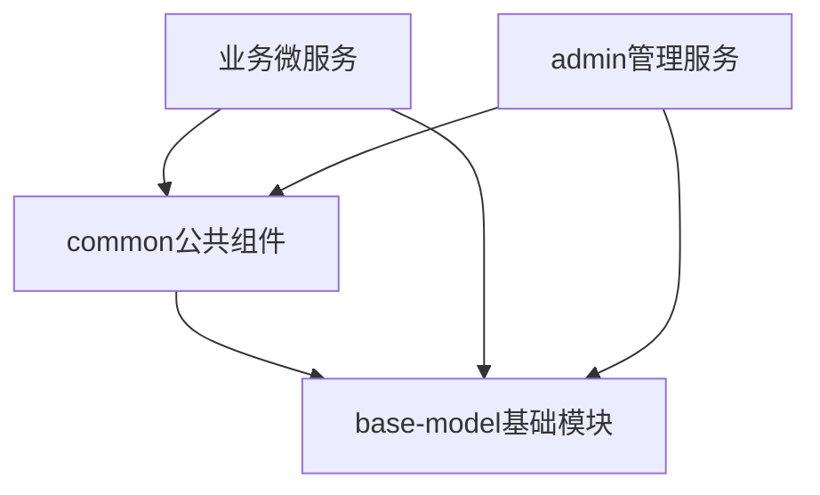

# Infrastructure 基础设施层

## 概述

Infrastructure层为HavenButler智能家庭服务平台提供基础设施支撑，包含所有Java微服务的基础组件、公共工具库和管理服务。本层采用模块化设计，各模块可独立使用，也可组合集成。

## 模块结构

```
infrastructure/
├── base-model/        # 基础模型和工具类库
├── common/           # 公共组件库
└── admin/            # 管理服务
```

## 模块说明

### 1. base-model（基础模块）

**版本**: 1.0.0

**核心功能**：
- ✅ **统一响应格式**：ResponseWrapper响应包装器
- ✅ **全局异常处理**：完整的异常体系和全局处理器
- ✅ **错误码规范**：标准化的错误码定义（100+预定义错误码）
- ✅ **工具类库**：TraceID、加密（AES/RSA）、JSON、日期、校验等工具
- ✅ **通用模型**：BaseEntity、分页模型、UserDTO、FamilyDTO、DeviceDTO
- ✅ **注解和切面**：@TraceLog、@RateLimit、@Encrypt、@Permission
- ✅ **拦截器**：TraceIdInterceptor自动注入链路ID

**技术栈**：
- Java 17
- Spring Boot 3.1.0
- AOP切面编程
- Jackson JSON处理

**快速使用**：
```xml
<dependency>
    <groupId>com.haven</groupId>
    <artifactId>base-model</artifactId>
    <version>1.0.0</version>
</dependency>
```

```java
// 使用示例
@RestController
public class TestController {
    @GetMapping("/test")
    @TraceLog("测试接口")
    public ResponseWrapper<String> test() {
        return ResponseWrapper.success("操作成功");
    }
}
```

### 2. common（公共组件库）

**版本**: 1.0.0

**核心功能**：
- ✅ **Redis工具**：RedisUtils、RedisCache、DistributedLock分布式锁
- ✅ **消息队列**：RabbitMQ配置、MessageSender、多种发送模式
- ✅ **安全组件**：JwtUtils、AuthFilter认证过滤器
- ✅ **Web组件**：限流切面RateLimitAspect、认证拦截器
- ✅ **工具扩展**：IdGenerator雪花算法、HttpUtils、ThreadPoolUtils
- ✅ **自动配置**：CommonAutoConfiguration按需加载组件

**技术栈**：
- Spring Data Redis
- Spring AMQP
- Spring Security
- Apache Commons
- Guava

**快速使用**：
```xml
<dependency>
    <groupId>com.haven</groupId>
    <artifactId>common</artifactId>
    <version>1.0.0</version>
</dependency>
```

```java
// Redis使用示例
@Autowired
private RedisUtils redisUtils;

// 设置缓存
redisUtils.set("key", value, 3600, TimeUnit.SECONDS);

// 分布式锁
if (redisUtils.tryLock("lock-key", "value", 10, TimeUnit.SECONDS)) {
    try {
        // 业务逻辑
    } finally {
        redisUtils.releaseLock("lock-key", "value");
    }
}
```

### 3. admin（管理服务）

**版本**: 1.0.0

**核心功能**：
- ✅ **服务监控**：ServiceManageController服务管理、实时健康监控
- ✅ **告警管理**：AlertController告警控制、AlertService规则引擎、多渠道通知
- ✅ **指标收集**：MetricsCollector指标采集、ServiceMetrics性能数据
- ✅ **健康检查**：ServiceHealthMonitor健康监控、自动故障检测
- ✅ **配置管理**：动态配置更新、配置版本控制
- ✅ **可视化界面**：Spring Boot Admin控制台

**技术栈**：
- Spring Boot Admin 3.1.0
- Micrometer
- Prometheus
- Spring Security

**访问地址**：
- URL: http://localhost:8888
- 账号: admin
- 密码: admin123

**Docker部署**：
```bash
docker run -d \
  --name admin-service \
  --network smart-home-network \
  -p 8888:8888 \
  smart-home/admin-service:v1.0.0
```

## 依赖关系



## 快速开始

### 1. 构建所有模块

```bash
# 构建base-model
cd base-model
mvn clean install

# 构建common
cd ../common
mvn clean install

# 构建admin
cd ../admin
mvn clean package
```

### 2. 在微服务中使用

在你的微服务`pom.xml`中添加依赖：

```xml
<dependencies>
    <!-- 基础模块（必需） -->
    <dependency>
        <groupId>com.haven</groupId>
        <artifactId>base-model</artifactId>
        <version>1.0.0</version>
    </dependency>

    <!-- 公共组件（按需） -->
    <dependency>
        <groupId>com.haven</groupId>
        <artifactId>common</artifactId>
        <version>1.0.0</version>
    </dependency>
</dependencies>
```

在主类上启用自动配置：

```java
@SpringBootApplication
@Import({BaseModelAutoConfiguration.class})
public class YourServiceApplication {
    public static void main(String[] args) {
        SpringApplication.run(YourServiceApplication.class, args);
    }
}
```

### 3. 配置文件

在`application.yml`中添加配置：

```yaml
# 引入基础配置
spring:
  profiles:
    include: base

# BaseModel配置
base-model:
  trace:
    enabled: true
  exception:
    enabled: true
  log:
    enabled: true
    level: INFO
  response:
    include-timestamp: true
    include-trace-id: true
```

## 核心特性

### 1. 链路追踪

所有请求自动生成TraceID，格式：`tr-yyyyMMdd-HHmmss-随机6位`

```java
// 自动注入到响应头
X-Trace-ID: tr-20250115-143022-a3b5c7

// 在代码中获取
String traceId = TraceIdUtil.getCurrentOrGenerate();
```

### 2. 统一异常处理

```java
// 业务异常
throw new BusinessException(ErrorCode.DEVICE_OFFLINE);

// 返回格式
{
    "code": 41001,
    "message": "设备离线",
    "traceId": "tr-20250115-143022-a3b5c7",
    "timestamp": "2025-01-15 14:30:22"
}
```

### 3. 日志追踪

```java
@TraceLog(value = "创建用户", module = "用户管理")
public void createUser(UserDTO user) {
    // 方法执行自动记录日志
}
```

### 4. 限流控制

```java
@RateLimit(limit = 100, window = 60, message = "请求过于频繁")
@GetMapping("/api/data")
public ResponseWrapper<?> getData() {
    // 每分钟最多100次请求
}
```

## 开发规范

### 命名规范
- 包名：`com.haven.{module}`
- 类名：PascalCase
- 方法名：camelCase
- 常量：UPPER_SNAKE_CASE

### 代码规范
- 所有公共类必须添加JavaDoc
- 工具类必须是final类，私有构造函数
- 异常必须继承BaseException
- 所有API返回ResponseWrapper

### 版本管理
- 遵循语义化版本：MAJOR.MINOR.PATCH
- 向后兼容原则
- 重大变更需要提前通知

## 测试

### 单元测试
```bash
mvn test
```

### 测试覆盖率要求
- base-model: ≥90%
- common: ≥80%
- admin: ≥70%

## 监控指标

Admin服务提供以下监控指标：

- **系统指标**：CPU、内存、磁盘、网络
- **JVM指标**：堆内存、GC、线程
- **HTTP指标**：请求数、响应时间、错误率
- **业务指标**：在线设备数、活跃用户数、API调用量

## 告警规则

默认告警规则：
- CPU使用率 > 80%
- 内存使用率 > 85%
- 磁盘使用率 > 90%
- API错误率 > 5%
- 响应时间 > 2秒

## 故障排查

### base-model相关
1. **TraceID未生成**：检查TraceIdInterceptor是否注册
2. **异常未捕获**：检查GlobalExceptionHandler是否生效
3. **切面不工作**：检查AOP依赖和@EnableAspectJAutoProxy

### common相关
1. **Redis连接失败**：检查Redis配置和网络
2. **分布式锁失效**：检查锁的超时时间设置
3. **消息队列异常**：检查RabbitMQ连接配置

### admin相关
1. **服务未发现**：检查服务是否注册到注册中心
2. **监控无数据**：检查Actuator端点是否开放
3. **告警未触发**：检查告警规则阈值设置

## 维护者

- 架构设计：HavenButler Team
- 主要开发：Development Team
- 文档维护：Documentation Team

## 更新历史

### v1.0.0 (2025-01-15)
- 初始版本发布
- 完成base-model基础模块
- 实现common公共组件
- 集成admin管理服务

## 许可证

本项目采用私有许可，仅供HavenButler项目内部使用。

## 联系方式

- 项目主页：https://github.com/havenbutler
- 问题反馈：https://github.com/havenbutler/issues
- 技术支持：support@havenbutler.com