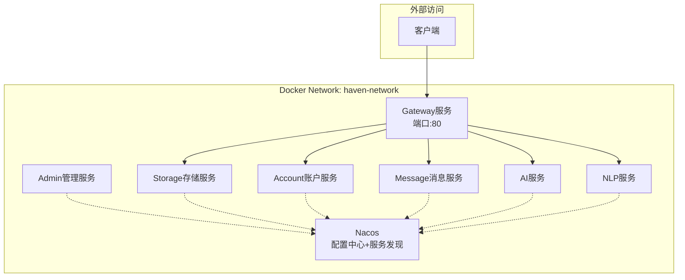

# HavenButler Nacos 配置中心与服务发现架构设计

> **适用场景**：Docker内部网络部署的HavenButler微服务架构
> **核心原则**：统一配置、统一发现、统一治理、零端口暴露（除Gateway）
> **版本要求**：Spring Boot 3.2.0 + Spring Cloud 2023.0.1 + Spring Cloud Alibaba 2023.0.1.0

## 📋 目录

- [1. 架构概述](#1-架构概述)
- [2. 快速开始](#2-快速开始)
- [3. 网络与安全规范](#3-网络与安全规范)
- [4. 命名空间与配置规范](#4-命名空间与配置规范)
- [5. 服务配置标准](#5-服务配置标准)
- [6. Docker部署配置](#6-docker部署配置)
- [7. 服务间通信](#7-服务间通信)
- [8. Admin运维管理](#8-admin运维管理)
- [9. 故障排查指南](#9-故障排查指南)
- [10. 最佳实践与约束](#10-最佳实践与约束)

## 1. 架构概述

### 1.1 设计目标

- **统一配置管理**：所有服务从Nacos加载配置，支持热更新和环境隔离
- **服务自动发现**：服务间通信基于注册发现，避免硬编码地址
- **零端口暴露**：除Gateway外，其他服务不对外暴露端口
- **环境隔离**：通过命名空间实现开发/测试/生产环境完全隔离

### 1.2 核心组件



### 1.3 规范清单（TL;DR）

- 服务命名：统一使用 `kebab-case`，并以 `-service` 结尾（如 `storage-service`）。
- 网络边界：仅 `gateway` 对外暴露端口；其余服务仅加入 `haven-network` 内部网络；`nacos/admin` 如需临时访问仅绑定 `127.0.0.1`。
- Nacos 组织：命名空间=环境；分组=`java-core-services`/`infrastructure-services`/`adapters`；DataId=`<service>.yml`。
- 导入策略：dev 用 `optional:nacos:`（可降级）；docker/prod 用 `nacos:`（强制）。
- 元数据必填：`management.context-path`、`version`、`environment`；建议：`role`、`zone`、`weight`、`owner`。
- 覆盖顺序：环境变量 > Nacos 远程配置 > 本地 application.yml 默认值。
- 安全基线：禁止 `MANAGEMENT_ENDPOINTS_WEB_EXPOSURE_INCLUDE=*`；生产仅 `health,info`。
- 存储访问：数据库/Redis 统一通过 Storage TCP 代理（禁止业务服务直连物理节点）。

## 2. 快速开始

### 2.1 前置条件

```bash
# 1. 创建Docker网络
docker network create haven-network

# 2. 准备环境变量文件
cat > .env <<EOF
ENVIRONMENT=dev
NACOS_NAMESPACE=havenbutler-dev
JWT_SECRET=your-jwt-secret-key-here
EOF
```

### 2.2 一键启动

```bash
# 1. 启动核心服务
docker-compose up -d nacos gateway storage-service account-service

# 2. 验证服务状态
curl http://localhost/actuator/health

# 3. 访问Nacos控制台（可选，仅本机）
# 取消注释docker-compose.yml中nacos的ports配置
# 访问 http://localhost:8848/nacos (nacos/nacos)
```

### 2.3 配置验证

```bash
# 检查服务注册状态
curl -s http://localhost:8848/nacos/v1/ns/instance/list?serviceName=gateway-service

# 检查配置加载
curl http://localhost/api/environment/current
```

## 3. 网络与安全规范

### 3.1 端口暴露策略

| 服务 | 对外端口 | 内部端口 | 访问方式 |
|------|----------|----------|----------|
| Gateway | 80 | 8080 | 公开访问 |
| Nacos | 仅运维时临时 | 8848 | 本机127.0.0.1 |
| Admin | 仅运维时临时 | 8888 | 本机127.0.0.1 |
| 其他服务 | 无 | 各自默认 | 内网服务名访问 |

### 3.2 Docker网络配置

```yaml
# docker-compose.yml 网络配置
networks:
  haven-network:
    external: true  # 使用预创建的外部网络

services:
  gateway:
    ports:
      - "80:8080"     # 唯一对外端口
    networks:
      - haven-network

  storage-service:
    # 无ports配置 - 仅内网访问
    networks:
      - haven-network
```

### 3.3 安全配置清单

- ✅ 最小端口暴露原则
- ✅ Actuator端点限制：`health,info,metrics,prometheus`
- ✅ 敏感配置环境变量注入
- ✅ 服务间内网通信
- ✅ Nacos访问控制

## 4. 命名空间与配置规范

### 4.1 命名空间设计

| 命名空间 | 用途 | 说明 |
|----------|------|------|
| `havenbutler-dev` | 开发环境 | 本地开发和功能测试 |
| `havenbutler-test` | 测试环境 | 集成测试和回归测试 |
| `havenbutler-staging` | 预发布环境 | 生产前验证 |
| `havenbutler-prod` | 生产环境 | 正式生产服务 |

### 4.2 配置分组策略

| 分组 | 包含服务 | 用途 |
|------|----------|------|
| `java-core-services` | gateway, account, storage, message, ai, nlp | 核心业务服务 |
| `infrastructure-services` | admin, monitor | 基础设施服务 |
| `adapters` | iot-python, ocr-go, asr-cpp | 多语言适配器 |

### 4.3 配置文件命名

```
havenbutler-common.yml           # 公共配置
gateway-service.yml              # Gateway专属配置
storage-service.yml              # Storage专属配置（详见Storage-TCP代理模式设计.md）
admin-service.yml                # Admin专属配置
account-service.yml              # Account专属配置
message-service.yml              # Message专属配置
ai-service.yml                   # AI专属配置
nlp-service.yml                  # NLP专属配置
```

### 4.4 实例元数据规范（功能字段）

| 字段 | 必填 | 取值示例 | 用途 |
|------|------|----------|------|
| `management.context-path` | 是 | `/actuator` | 管理端点路径 |
| `version` | 是 | `1.0.0` | 版本治理/灰度对比 |
| `environment` | 是 | `dev/test/staging/prod` | 环境隔离 |
| `role` | 建议 | `core/infra/adapter/edge` | 角色分层治理 |
| `zone` | 建议 | `docker-local/cn-hz-a` | 就近/容灾路由 |
| `weight` | 建议 | `100` | 灰度/按权路由 |
| `owner` | 建议 | `team-admin` | 责任标识/审计 |

## 5. 服务配置标准

### 5.1 通用环境变量

所有服务必须包含的环境变量：

```bash
# 基础配置
SPRING_PROFILES_ACTIVE=docker
SPRING_APPLICATION_NAME=<service-name>
SERVER_PORT=<port>

# Nacos配置
NACOS_ADDR=nacos:8848
NACOS_NAMESPACE=havenbutler-dev
NACOS_GROUP=java-core-services

# 环境标识
ENVIRONMENT=dev

# 监控配置
MANAGEMENT_ENDPOINTS_WEB_EXPOSURE_INCLUDE=health,info
LOGGING_FILE_PATH=/app/logs

# 时区
TZ=Asia/Shanghai
```

### 5.2 application.yml 标准模板

```yaml
# 每个服务的 application.yml 标准结构
spring:
  application:
    name: ${SPRING_APPLICATION_NAME:service-name}

  # 从Nacos导入配置
  config:
    import:
      - optional:nacos:${spring.application.name}.yml
      - optional:nacos:havenbutler-common.yml

  # Nacos连接配置
  cloud:
    nacos:
      discovery:
        server-addr: ${NACOS_ADDR:nacos:8848}
        namespace: ${NACOS_NAMESPACE:public}
        group: ${NACOS_GROUP:java-core-services}
        service: ${spring.application.name}
        metadata:
          management.context-path: /actuator
          version: 1.0.0
          environment: ${ENVIRONMENT:dev}
          zone: docker-local
          role: core
          weight: 100
          owner: team-admin
      config:
        server-addr: ${NACOS_ADDR:nacos:8848}
        namespace: ${NACOS_NAMESPACE:public}
        group: ${NACOS_GROUP:java-core-services}
        file-extension: yml
        shared-configs:
          - data-id: havenbutler-common.yml
            group: java-core-services
            refresh: true

# 统一的监控配置
management:
  endpoints:
    web:
      exposure:
        include: ${MANAGEMENT_ENDPOINTS_WEB_EXPOSURE_INCLUDE:health,info}

# 统一的日志配置
logging:
  file:
    name: ${LOGGING_FILE_PATH:/app/logs}/${spring.application.name}.log
```

### 5.3 公共配置示例 (havenbutler-common.yml)

```yaml
# 公共基础配置
base-model:
  # 链路追踪
  trace:
    enabled: true
    prefix: "tr"
    exclude-paths:
      - "/actuator/**"
      - "/health"
      - "/favicon.ico"

  # 统一响应格式
  response:
    include-trace-id: true
    include-timestamp: true
    success-message: "操作成功"

  # 缓存配置
  cache:
    enabled: true
    key-prefix: "haven:"
    default-ttl: 300

  # 限流配置
  rate-limit:
    enabled: true
    default-limit: 100
    default-window: 60

# 监控配置
management:
  metrics:
    export:
      prometheus:
        enabled: true

# 安全配置
security:
  cors:
    allowed-origins: "*"
    allowed-methods: "GET,POST,PUT,DELETE,OPTIONS"
```

## 6. Docker部署配置

### 6.1 Gateway服务配置

```yaml
gateway:
  image: smart-home/gateway-service:latest
  container_name: haven-gateway
  ports:
    - "80:8080"  # 唯一对外端口
  networks:
    - haven-network
  environment:
    - SPRING_PROFILES_ACTIVE=docker
    - SPRING_APPLICATION_NAME=gateway-service
    - SERVER_PORT=8080
    - NACOS_ADDR=nacos:8848
    - NACOS_NAMESPACE=havenbutler-dev
    - NACOS_GROUP=java-core-services
    - ENVIRONMENT=dev
    - MANAGEMENT_ENDPOINTS_WEB_EXPOSURE_INCLUDE=health,info
    - LOGGING_FILE_PATH=/app/logs
    - TZ=Asia/Shanghai
  volumes:
    - gateway-logs:/app/logs
  healthcheck:
    test: ["CMD", "curl", "-f", "http://localhost:8080/actuator/health"]
    interval: 30s
    timeout: 10s
    retries: 3
  depends_on:
    - nacos
```

### 6.2 内部服务配置模板

```yaml
storage-service:
  image: smart-home/storage-service:latest
  container_name: haven-storage
  # 注意：无ports配置，仅内网访问
  networks:
    - haven-network
  environment:
    - SPRING_PROFILES_ACTIVE=docker
    - SPRING_APPLICATION_NAME=storage-service
    - SERVER_PORT=8080
    - NACOS_ADDR=nacos:8848
    - NACOS_NAMESPACE=havenbutler-dev
    - NACOS_GROUP=java-core-services
    - ENVIRONMENT=dev
    - LOGGING_FILE_PATH=/app/logs
    - TZ=Asia/Shanghai
    # 数据库配置（敏感信息）
    - DB_HOST=${DB_HOST}
    - DB_USERNAME=${DB_USERNAME}
    - DB_PASSWORD=${DB_PASSWORD}
  volumes:
    - storage-logs:/app/logs
  healthcheck:
    test: ["CMD", "curl", "-f", "http://localhost:8080/actuator/health"]
    interval: 30s
    timeout: 10s
    retries: 3
  depends_on:
    - nacos
```

### 6.3 Admin服务配置

```yaml
admin-service:
  image: smart-home/admin-service:latest
  container_name: haven-admin
  networks:
    - haven-network
  # 运维时可临时开启端口
  # ports:
  #   - "127.0.0.1:8888:8888"
  environment:
    - SPRING_PROFILES_ACTIVE=docker
    - SPRING_APPLICATION_NAME=admin-service
    - SERVER_PORT=8888
    - NACOS_ADDR=nacos:8848
    - NACOS_NAMESPACE=havenbutler-dev
    - NACOS_GROUP=infrastructure-services
    - ENVIRONMENT=dev
    - MANAGEMENT_ENDPOINTS_WEB_EXPOSURE_INCLUDE=health,info,metrics,prometheus
    - LOGGING_FILE_PATH=/app/logs
    - TZ=Asia/Shanghai
  volumes:
    - admin-logs:/app/logs
  depends_on:
    - nacos
```

## 7. 服务间通信

### 7.1 Java服务通信

```java
// 使用Spring Cloud LoadBalancer进行服务调用
@RestController
public class UserController {

    @Autowired
    private RestTemplate restTemplate;  // 已配置LoadBalancer

    public User getUserInfo(Long userId) {
        // 使用服务名而非IP:PORT
        String url = "http://storage-service/api/users/" + userId;
        return restTemplate.getForObject(url, User.class);
    }
}

// 或使用OpenFeign（推荐）
@FeignClient(name = "storage-service")
public interface StorageClient {
    @GetMapping("/api/users/{userId}")
    User getUserById(@PathVariable Long userId);
}
```

### 7.2 非Java服务通信

```python
# Python适配器示例：使用Nacos API发现服务
import requests
import random

class NacosServiceDiscovery:
    def __init__(self, nacos_addr, namespace):
        self.nacos_addr = nacos_addr
        self.namespace = namespace
        self.instance_cache = {}

    def get_service_instance(self, service_name):
        # 从Nacos获取服务实例列表
        url = f"http://{self.nacos_addr}/nacos/v1/ns/instance/list"
        params = {
            'serviceName': service_name,
            'namespaceId': self.namespace
        }

        resp = requests.get(url, params=params)
        data = resp.json()

        if data['hosts']:
            # 随机选择一个健康实例
            healthy_hosts = [h for h in data['hosts'] if h['healthy']]
            if healthy_hosts:
                instance = random.choice(healthy_hosts)
                return f"http://{instance['ip']}:{instance['port']}"

        return None

    def call_service(self, service_name, path, **kwargs):
        base_url = self.get_service_instance(service_name)
        if base_url:
            return requests.get(f"{base_url}{path}", **kwargs)
        raise Exception(f"Service {service_name} not available")

# 使用示例
discovery = NacosServiceDiscovery("nacos:8848", "havenbutler-dev")
response = discovery.call_service("storage-service", "/api/users/123")
```

## 8. Admin运维管理

### 8.1 Admin管理界面

```bash
# 临时开启Admin管理端口（运维时）
docker-compose exec admin-service sh
# 或修改docker-compose.yml取消注释Admin端口配置后重启

# 访问管理界面
http://localhost:8888  # admin/admin123
```

### 8.2 配置管理流程

```bash
# 1. 准备配置文件
mkdir nacos-configs
cat > nacos-configs/gateway-service.yml <<EOF
gateway:
  routes:
    - id: storage-route
      uri: lb://storage-service
      predicates:
        - Path=/api/storage/**
      filters:
        - StripPrefix=2
EOF

# 2. 上传到Nacos
curl -X POST "http://localhost:8848/nacos/v1/cs/configs" \
  -d "dataId=gateway-service.yml" \
  -d "group=java-core-services" \
  -d "content=$(cat nacos-configs/gateway-service.yml)" \
  -d "tenant=havenbutler-dev"

# 3. 刷新服务配置
curl -X POST http://localhost/api/environment/refresh
```

### 8.3 服务健康监控

```bash
# 检查所有服务健康状态
curl http://localhost:8888/api/service/overview

# 获取特定服务详情
curl http://localhost:8888/api/service/storage-service

# 实时健康状态流（SSE）
curl -N http://localhost:8888/api/service/stream/health
```

## 9. 故障排查指南

### 9.1 常见问题诊断

#### 服务注册失败

```bash
# 1. 检查网络连通性
docker exec -it <service-container> ping nacos

# 2. 检查Nacos连接配置
docker exec -it <service-container> env | grep NACOS

# 3. 查看服务启动日志
docker logs <service-container> | grep -i nacos

# 4. 检查Nacos中的注册状态
curl "http://localhost:8848/nacos/v1/ns/instance/list?serviceName=<service-name>&namespaceId=havenbutler-dev"
```

#### 配置加载失败

```bash
# 1. 检查配置是否存在
curl "http://localhost:8848/nacos/v1/cs/configs?dataId=<service-name>.yml&group=java-core-services&tenant=havenbutler-dev"

# 2. 检查服务配置加载日志
docker logs <service-container> | grep -i "config"

# 3. 检查命名空间和分组配置
docker exec -it <service-container> env | grep -E "(NAMESPACE|GROUP)"
```

#### 服务间调用失败

```bash
# 1. 检查目标服务是否健康
curl http://localhost:8888/api/service/<target-service>

# 2. 检查网络连通性
docker exec -it <source-container> curl http://<target-service>:8080/actuator/health

# 3. 检查LoadBalancer配置
# 查看应用日志中的负载均衡器相关信息
```

### 9.2 日志收集

```bash
# 收集所有服务日志
mkdir -p logs/$(date +%Y%m%d)

# 收集容器日志
for service in gateway storage-service account-service admin-service; do
    docker logs $service > logs/$(date +%Y%m%d)/${service}.log 2>&1
done

# 收集挂载卷中的应用日志
docker run --rm -v haven_admin-logs:/source -v $(pwd)/logs/$(date +%Y%m%d):/dest alpine cp -r /source /dest/
```

### 9.3 性能调优

```bash
# JVM内存配置建议
JAVA_OPTS="-Xms512m -Xmx1024m -XX:+UseG1GC -XX:MaxGCPauseMillis=200"

# 连接池配置建议
spring.cloud.nacos.discovery.heart-beat-interval=5000
spring.cloud.nacos.discovery.heart-beat-timeout=15000
spring.cloud.nacos.discovery.ip-delete-timeout=30000
```

## 10. 最佳实践与约束

### 10.1 配置管理

- ✅ **敏感信息环境变量注入**：数据库密码、JWT密钥等
- ✅ **公共配置抽取**：通用的基础配置放在`havenbutler-common.yml`
- ✅ **环境隔离**：不同环境使用不同命名空间
- ✅ **配置版本管理**：重要配置变更前备份
- ❌ **避免硬编码**：不在代码中写死服务地址和端口

### 10.2 服务发现

- ✅ **使用服务名**：服务间调用使用注册的服务名
- ✅ **健康检查**：确保服务注册前已完全启动
- ✅ **优雅下线**：停止服务前主动注销注册
- ❌ **避免IP直连**：不直接使用IP和端口进行调用

### 10.3 安全实践

- ✅ **最小端口暴露**：只有Gateway对外暴露端口
- ✅ **Actuator端点限制**：生产环境只暴露必要端点
- ✅ **网络隔离**：使用Docker内部网络
- ✅ **访问控制**：Nacos控制台限制访问来源
- ❌ **禁止全暴露**：`MANAGEMENT_ENDPOINTS_WEB_EXPOSURE_INCLUDE=*`

### 10.4 运维实践

- ✅ **监控告警**：配置服务健康状态监控
- ✅ **日志集中**：统一收集所有服务日志
- ✅ **配置审计**：记录配置变更历史
- ✅ **灰度发布**：使用元数据控制流量分发

### 10.5 硬约束（禁止事项）

- ❌ **YAML重复键**：根级`spring:`只能出现一次，新增`spring.cloud`必须合并
- ❌ **版本错配**：Cloud 2023.0.x → Boot 3.2.x，严禁错配
- ❌ **直连数据库**：除Gateway外，其他服务不得直连DB（统一经Storage）
- ❌ **全端点暴露**：`MANAGEMENT_ENDPOINTS_WEB_EXPOSURE_INCLUDE=*`禁止使用

---

## 附录

### 相关文档
- [Storage TCP代理模式设计](./Storage-TCP代理模式设计.md)
- [Admin服务开发面板](../dev-panel.md)
- [Docker Compose配置](../docker-compose.yml)
- [应用配置文件](../src/main/resources/application.yml)

### 外部链接
- [Nacos官方文档](https://nacos.io/zh-cn/docs/quick-start.html)
- [Spring Cloud Alibaba文档](https://github.com/alibaba/spring-cloud-alibaba)
