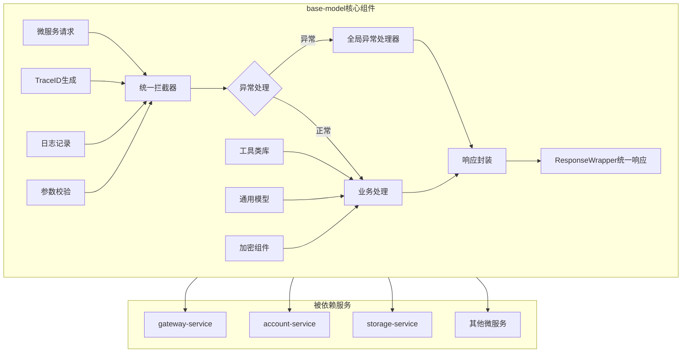

# base-model 基础模块

## 服务定位
- **架构层级**：基础支撑层
- **核心职责**：提供所有Java微服务的基础组件和通用功能，包括统一响应格式、异常处理、工具类、通用模型等
- **业务范围**：为所有微服务提供标准化的基础能力支撑

## 技术栈
- **主开发语言**：Java 17
- **核心框架**：Spring Boot 3.1.0
- **构建工具**：Maven 3.8+
- **通信协议**：作为基础库被其他服务依赖

## 核心功能模块

### 1. 统一响应体 (ResponseWrapper)
```java
public class ResponseWrapper<T> {
    private int code;           // 响应码
    private String message;      // 响应消息
    private T data;             // 响应数据
    private String traceId;     // 链路追踪ID
    private long timestamp;     // 时间戳
}
```

### 2. 全局异常处理
- BusinessException：业务异常
- SystemException：系统异常
- ValidationException：参数校验异常
- AuthException：认证授权异常

### 3. 错误码规范
```
1xxxx - 系统级错误
2xxxx - 认证授权错误
3xxxx - 参数校验错误
4xxxx - 业务逻辑错误
5xxxx - 第三方服务错误
```

### 4. 通用工具类
- TraceIdUtil：生成和管理TraceID
- EncryptUtil：加密解密工具（AES-256）
- JsonUtil：JSON序列化工具
- DateUtil：日期时间处理
- ValidationUtil：参数校验工具

### 5. 通用数据模型
- BaseEntity：基础实体类
- PageRequest/PageResponse：分页模型
- DeviceDTO：设备通用模型
- UserDTO：用户通用模型
- FamilyDTO：家庭通用模型

### 6. 注解和切面
- @TraceLog：日志追踪注解
- @RateLimit：限流注解
- @Encrypt：加密注解
- @Permission：权限校验注解

## 业务流程图



## 使用方式

### Maven依赖
```xml
<dependency>
    <groupId>com.haven</groupId>
    <artifactId>base-model</artifactId>
    <version>1.0.0</version>
</dependency>
```

### 快速集成示例
```java
// 1. 继承基础配置类
@SpringBootApplication
@Import(BaseModelAutoConfiguration.class)
public class YourServiceApplication {
    // ...
}

// 2. 使用统一响应
@RestController
public class YourController {
    @GetMapping("/api/test")
    public ResponseWrapper<String> test() {
        return ResponseWrapper.success("操作成功");
    }
}

// 3. 使用全局异常
throw new BusinessException(ErrorCode.PARAM_ERROR, "参数错误");
```

## 配置说明

### application.yml配置项
```yaml
base-model:
  trace:
    enabled: true                    # 启用链路追踪
    prefix: "tr"                     # TraceID前缀
  encrypt:
    enabled: true                    # 启用加密功能
    algorithm: "AES"                 # 加密算法
  log:
    level: INFO                      # 日志级别
    format: JSON                     # 日志格式
  response:
    include-timestamp: true          # 响应包含时间戳
    include-trace-id: true          # 响应包含TraceID
```

## 开发规范

### 代码规范
- 所有公共类必须添加详细的中文注释
- 工具类方法必须是静态方法
- 异常必须继承自定义的基础异常类
- 所有常量定义在对应的Constants类中

### 版本管理
- 遵循语义化版本规范（Major.Minor.Patch）
- 向后兼容原则，不随意删除或修改公共API
- 重大变更需要提前通知所有依赖服务

## 测试要求
```bash
mvn test
# 单元测试覆盖率要求：≥90%（作为基础模块要求更高）
```

## 监控指标
- 被依赖次数
- 方法调用频率
- 异常抛出统计
- 性能指标（工具类执行时间）

## 更新历史
- v1.0.0 (2025-01-15): 初始版本，提供基础功能框架