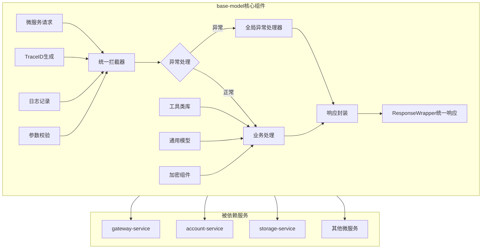

# base-model 基础模块

## 服务定位
- **架构层级**：基础支撑层
- **核心职责**：提供所有Java微服务的基础组件和通用功能，包括统一响应格式、异常处理、工具类、通用模型等
- **业务范围**：为所有微服务提供标准化的基础能力支撑

## 技术栈
- **主开发语言**：Java 17
- **核心框架**：Spring Boot 3.1.0
- **构建工具**：Maven 3.8+
- **通信协议**：作为基础库被其他服务依赖

## 核心功能模块

### 1. 统一响应体 (ResponseWrapper)
```java
public class ResponseWrapper<T> {
    private int code;           // 响应码
    private String message;      // 响应消息
    private T data;             // 响应数据
    private String traceId;     // 链路追踪ID
    private long timestamp;     // 时间戳
}
```

### 2. 全局异常处理
- BusinessException：业务异常
- SystemException：系统异常
- ValidationException：参数校验异常
- AuthException：认证授权异常

### 3. 错误码规范
```
1xxxx - 系统级错误
2xxxx - 认证授权错误
3xxxx - 参数校验错误
4xxxx - 业务逻辑错误
5xxxx - 第三方服务错误
```

### 4. 通用工具类
- TraceIdUtil：生成和管理TraceID
- EncryptUtil：加密解密工具（AES-256）
- JsonUtil：JSON序列化工具
- DateUtil：日期时间处理
- ValidationUtil：参数校验工具

### 5. 通用数据模型
- BaseEntity：基础实体类
- PageRequest/PageResponse：分页模型
- DeviceDTO：设备通用模型
- UserDTO：用户通用模型
- FamilyDTO：家庭通用模型

### 6. 注解和切面
- @TraceLog：日志追踪注解
- @RateLimit：限流注解
- @Encrypt：加密注解
- @Permission：权限校验注解

## 业务流程图



## 使用方式

### Maven依赖
```xml
<dependency>
    <groupId>com.haven</groupId>
    <artifactId>base-model</artifactId>
    <version>1.0.0</version>
</dependency>
```

### 快速集成示例
```java
// 1. 继承基础配置类
@SpringBootApplication
@Import(BaseModelAutoConfiguration.class)
public class YourServiceApplication {
    // ...
}

// 2. 使用统一响应
@RestController
public class YourController {
    @GetMapping("/api/test")
    public ResponseWrapper<String> test() {
        return ResponseWrapper.success("操作成功");
    }
}

// 3. 使用全局异常
throw new BusinessException(ErrorCode.PARAM_ERROR, "参数错误");
```

## 配置说明

### application.yml配置项
```yaml
base-model:
  trace:
    enabled: true                    # 启用链路追踪
    prefix: "tr"                     # TraceID前缀
  encrypt:
    enabled: true                    # 启用加密功能
    algorithm: "AES"                 # 加密算法
  log:
    level: INFO                      # 日志级别
    format: JSON                     # 日志格式
  response:
    include-timestamp: true          # 响应包含时间戳
    include-trace-id: true          # 响应包含TraceID
```

## 开发规范

### 代码规范
- 所有公共类必须添加详细的中文注释
- 工具类方法必须是静态方法
- 异常必须继承自定义的基础异常类
- 所有常量定义在对应的Constants类中

### 版本管理
- 遵循语义化版本规范（Major.Minor.Patch）
- 向后兼容原则，不随意删除或修改公共API
- 重大变更需要提前通知所有依赖服务

## 测试要求
```bash
mvn test
# 单元测试覆盖率要求：≥90%（作为基础模块要求更高）
```

## 监控指标
- 被依赖次数
- 方法调用频率
- 异常抛出统计
- 性能指标（工具类执行时间）

## 已实现功能清单

✅ **核心功能**
- ResponseWrapper统一响应包装器
- ErrorCode错误码枚举（100+预定义错误码）
- 完整的异常体系（BaseException、BusinessException、SystemException、ValidationException、AuthException）
- GlobalExceptionHandler全局异常处理器
- TraceIdInterceptor链路追踪拦截器

✅ **工具类库**
- TraceIdUtil：TraceID生成和管理
- EncryptUtil：AES/RSA/HMAC/BCrypt加密工具
- JsonUtil：JSON序列化和反序列化
- DateUtil：日期时间处理工具
- ValidationUtil：参数校验和数据脱敏

✅ **数据模型**
- BaseEntity：基础实体类（包含通用字段）
- PageRequest/PageResponse：分页请求和响应模型
- UserDTO：用户数据传输对象
- FamilyDTO：家庭数据传输对象
- DeviceDTO：设备数据传输对象

✅ **注解和切面**
- @TraceLog：日志追踪注解
- @RateLimit：限流注解
- @Encrypt：加密注解
- @Permission：权限校验注解
- TraceLogAspect：日志追踪切面实现

✅ **自动配置**
- BaseModelAutoConfiguration：Spring Boot自动配置
- 完整的配置属性类
- META-INF/spring.factories自动配置文件

## 集成使用指南

### 1. Maven依赖引入
```xml
<dependency>
    <groupId>com.haven</groupId>
    <artifactId>base-model</artifactId>
    <version>1.0.0</version>
</dependency>
```

### 2. 启用自动配置

#### 方式一：自动扫描（推荐）
```java
@SpringBootApplication
public class YourServiceApplication {
    public static void main(String[] args) {
        SpringApplication.run(YourServiceApplication.class, args);
    }
}
```

#### 方式二：显式导入
```java
@SpringBootApplication
@Import(BaseModelAutoConfiguration.class)
public class YourServiceApplication {
    public static void main(String[] args) {
        SpringApplication.run(YourServiceApplication.class, args);
    }
}
```

### 3. 配置文件设置

在`application.yml`中添加：

```yaml
# 引入基础配置
spring:
  profiles:
    include: base

# BaseModel配置项
base-model:
  version: 1.0.0
  trace:
    enabled: true                    # 启用链路追踪
    prefix: "tr"                     # TraceID前缀
    exclude-paths:                   # 排除路径
      - "/health"
      - "/actuator/**"
  exception:
    enabled: true                    # 启用全局异常处理
    include-stack-trace: false      # 是否包含堆栈信息
  log:
    enabled: true                    # 启用日志追踪
    level: INFO                      # 日志级别
    format: JSON                     # 日志格式
  response:
    include-timestamp: true          # 响应包含时间戳
    include-trace-id: true          # 响应包含TraceID
  encrypt:
    enabled: true                    # 启用加密功能
    algorithm: "AES"                 # 默认加密算法
```

### 4. 使用示例

#### 统一响应格式
```java
@RestController
@RequestMapping("/api/users")
public class UserController {

    @GetMapping("/{id}")
    public ResponseWrapper<UserDTO> getUser(@PathVariable Long id) {
        UserDTO user = userService.findById(id);
        return ResponseWrapper.success(user);
    }

    @PostMapping
    public ResponseWrapper<UserDTO> createUser(@RequestBody @Valid UserDTO user) {
        UserDTO created = userService.create(user);
        return ResponseWrapper.success("用户创建成功", created);
    }
}
```

#### 异常处理
```java
@Service
public class UserService {

    public UserDTO findById(Long id) {
        User user = userRepository.findById(id)
            .orElseThrow(() -> new BusinessException(ErrorCode.DATA_NOT_FOUND, "用户不存在"));
        return convertToDTO(user);
    }

    public void validateUser(UserDTO user) {
        if (!ValidationUtil.isValidPhone(user.getPhone())) {
            throw new ValidationException("phone", "手机号格式不正确");
        }

        if (!hasPermission(user)) {
            throw new AuthException(ErrorCode.PERMISSION_DENIED);
        }
    }
}
```

#### 日志追踪
```java
@Service
public class DeviceService {

    @TraceLog(value = "设备上线", module = "设备管理", type = "UPDATE")
    public void deviceOnline(String deviceId) {
        // 方法执行会自动记录日志
        // 包含：参数、返回值、执行时间、TraceID
        updateDeviceStatus(deviceId, "ONLINE");
    }

    @TraceLog(value = "批量控制设备", module = "设备管理", ignoreParamIndexes = {1})
    public void controlDevices(List<String> deviceIds, String secret) {
        // secret参数不会被记录到日志
        // 业务逻辑...
    }
}
```

#### 限流控制
```java
@RestController
public class DataController {

    @GetMapping("/api/data")
    @RateLimit(limit = 100, window = 60, type = RateLimit.LimitType.IP)
    public ResponseWrapper<List<DataDTO>> getData() {
        // 基于IP限流：每个IP每分钟最多100次请求
        return ResponseWrapper.success(dataService.getData());
    }

    @PostMapping("/api/sensitive")
    @RateLimit(limit = 10, window = 3600, type = RateLimit.LimitType.USER,
               message = "操作太频繁，请稍后再试")
    public ResponseWrapper<Void> sensitiveOperation() {
        // 基于用户限流：每用户每小时最多10次
        return ResponseWrapper.success();
    }
}
```

#### 工具类使用
```java
// TraceID工具
String traceId = TraceIdUtil.generate();
TraceIdUtil.setTraceId(traceId);
String current = TraceIdUtil.getCurrentOrGenerate();

// 加密工具
String encrypted = EncryptUtil.encryptAES(plainText, key);
String decrypted = EncryptUtil.decryptAES(encrypted, key);
String passwordHash = EncryptUtil.hashPassword(password);
boolean valid = EncryptUtil.verifyPassword(password, hash);

// JSON工具
String json = JsonUtil.toJson(object);
UserDTO user = JsonUtil.fromJson(json, UserDTO.class);
List<UserDTO> users = JsonUtil.fromJsonToList(json, UserDTO.class);

// 日期工具
LocalDateTime now = DateUtil.now();
String formatted = DateUtil.format(now, "yyyy-MM-dd HH:mm:ss");
long days = DateUtil.betweenDays(start, end);
String duration = DateUtil.formatDuration(3665); // "1小时1分钟5秒"

// 校验工具
boolean validPhone = ValidationUtil.isValidPhone("13812345678");
boolean validEmail = ValidationUtil.isValidEmail("test@example.com");
String maskedPhone = ValidationUtil.maskPhone("13812345678"); // "138****5678"
String maskedIdCard = ValidationUtil.maskIdCard(idCard); // "110101********1234"
```

#### 分页处理
```java
@GetMapping("/list")
public ResponseWrapper<PageResponse<UserDTO>> listUsers(
        @RequestParam(defaultValue = "1") Integer page,
        @RequestParam(defaultValue = "20") Integer size,
        @RequestParam(required = false) String keyword) {

    PageRequest pageRequest = PageRequest.of(page, size);
    pageRequest.setKeyword(keyword);
    pageRequest.setSortField("createTime");
    pageRequest.setSortOrder("DESC");

    PageResponse<UserDTO> result = userService.findPage(pageRequest);
    return ResponseWrapper.success(result);
}
```

## 扩展开发

### 自定义错误码
```java
public class CustomErrorCode {
    public static final ErrorCode CUSTOM_ERROR =
        new ErrorCode(60001, "自定义错误消息");
}
```

### 自定义异常
```java
public class CustomException extends BaseException {
    public CustomException(String message) {
        super(60000, message);
    }
}
```

### 自定义切面
```java
@Aspect
@Component
public class CustomAspect {

    @Around("@annotation(com.haven.base.annotation.YourAnnotation)")
    public Object around(ProceedingJoinPoint point) throws Throwable {
        // 前置处理
        Object result = point.proceed();
        // 后置处理
        return result;
    }
}
```

## 注意事项

1. **版本兼容**：基于Spring Boot 3.1.0，需要Java 17+
2. **依赖冲突**：如遇到依赖冲突，可通过exclusions排除
3. **配置优先级**：application.yml > application-base.yml > 默认配置
4. **性能考虑**：日志追踪在生产环境建议设置为WARN以上级别
5. **安全提醒**：加密密钥不要硬编码，应通过配置中心管理

## 故障排查

### TraceID未生成
- 检查TraceIdInterceptor是否被注册
- 确认base-model.trace.enabled=true
- 检查请求路径是否在exclude-paths中

### 全局异常处理不生效
- 确认@RestControllerAdvice注解存在
- 检查base-model.exception.enabled=true
- 确认没有其他ExceptionHandler覆盖

### 切面不工作
- 确认spring-boot-starter-aop依赖存在
- 检查@EnableAspectJAutoProxy是否启用
- 确认目标方法不是private或final

## GitHub Packages Maven配置

### 1. 认证配置

在`~/.m2/settings.xml`中添加GitHub认证信息：

```xml
<?xml version="1.0" encoding="UTF-8"?>
<settings xmlns="http://maven.apache.org/SETTINGS/1.0.0"
          xmlns:xsi="http://www.w3.org/2001/XMLSchema-instance"
          xsi:schemaLocation="http://maven.apache.org/SETTINGS/1.0.0
          http://maven.apache.org/xsd/settings-1.0.0.xsd">

    <servers>
        <server>
            <id>github</id>
            <username>你的GitHub用户名</username>
            <password>你的GitHub Personal Access Token</password>
        </server>
    </servers>

</settings>
```

**获取GitHub Personal Access Token步骤**：
1. 访问 GitHub > Settings > Developer settings > Personal access tokens > Tokens (classic)
2. 点击 "Generate new token (classic)"
3. 勾选以下权限：
   - ✅ `read:packages` - 读取包权限
   - ✅ `write:packages` - 发布包权限（如果需要）
   - ✅ `repo` - 仓库访问权限
4. 生成token并复制到settings.xml中

### 2. 项目pom.xml配置

在你的微服务项目中配置仓库地址和依赖：

```xml
<?xml version="1.0" encoding="UTF-8"?>
<project xmlns="http://maven.apache.org/POM/4.0.0"
         xmlns:xsi="http://www.w3.org/2001/XMLSchema-instance"
         xsi:schemaLocation="http://maven.apache.org/POM/4.0.0
         http://maven.apache.org/xsd/maven-4.0.0.xsd">

    <!-- 添加GitHub Packages仓库 -->
    <repositories>
        <repository>
            <id>github</id>
            <name>GitHub Packages</name>
            <url>https://maven.pkg.github.com/LHGrayHUIHUI/HavenButlers</url>
            <releases>
                <enabled>true</enabled>
            </releases>
            <snapshots>
                <enabled>false</enabled>
            </snapshots>
        </repository>
    </repositories>

    <dependencies>
        <!-- HavenButler base-model依赖 -->
        <dependency>
            <groupId>com.haven</groupId>
            <artifactId>base-model</artifactId>
            <version>1.0.0</version>
        </dependency>

        <!-- 其他依赖... -->
    </dependencies>

</project>
```

### 3. 完整的微服务集成示例

#### 3.1 项目结构
```
your-service/
├── src/main/java/com/haven/yourservice/
│   ├── YourServiceApplication.java
│   ├── controller/
│   │   └── YourController.java
│   ├── service/
│   │   └── YourService.java
│   └── config/
│       └── ServiceConfig.java
├── src/main/resources/
│   ├── application.yml
│   └── application-prod.yml
└── pom.xml
```

#### 3.2 主启动类配置
```java
package com.haven.yourservice;

import com.haven.base.config.BaseModelAutoConfiguration;
import org.springframework.boot.SpringApplication;
import org.springframework.boot.autoconfigure.SpringBootApplication;
import org.springframework.context.annotation.Import;

/**
 * 微服务启动类
 *
 * @author HavenButler
 */
@SpringBootApplication
@Import(BaseModelAutoConfiguration.class) // 显式导入base-model配置
public class YourServiceApplication {

    public static void main(String[] args) {
        SpringApplication.run(YourServiceApplication.class, args);
    }
}
```

#### 3.3 完整的Controller示例
```java
package com.haven.yourservice.controller;

import com.haven.base.common.response.ResponseWrapper;
import com.haven.base.common.response.ErrorCode;
import com.haven.base.common.exception.BusinessException;
import com.haven.base.annotation.TraceLog;
import com.haven.base.annotation.RateLimit;
import com.haven.base.model.dto.PageRequest;
import com.haven.base.model.dto.PageResponse;
import lombok.RequiredArgsConstructor;
import lombok.extern.slf4j.Slf4j;
import org.springframework.validation.annotation.Validated;
import org.springframework.web.bind.annotation.*;

import jakarta.validation.Valid;
import jakarta.validation.constraints.NotNull;
import java.util.List;

/**
 * 示例控制器 - 展示base-model完整使用方式
 *
 * @author HavenButler
 */
@Slf4j
@RestController
@RequestMapping("/api/v1/demo")
@RequiredArgsConstructor
@Validated
public class DemoController {

    private final DemoService demoService;

    /**
     * 查询单个数据
     * 展示：统一响应格式、异常处理、日志追踪
     */
    @GetMapping("/{id}")
    @TraceLog(value = "查询数据详情", module = "演示模块")
    public ResponseWrapper<DemoDTO> getById(@PathVariable @NotNull Long id) {
        DemoDTO data = demoService.findById(id);
        if (data == null) {
            throw new BusinessException(ErrorCode.DATA_NOT_FOUND, "数据不存在");
        }
        return ResponseWrapper.success(data);
    }

    /**
     * 分页查询
     * 展示：分页处理、参数验证
     */
    @GetMapping("/list")
    @TraceLog("分页查询数据")
    public ResponseWrapper<PageResponse<DemoDTO>> getPage(
            @RequestParam(defaultValue = "1") Integer page,
            @RequestParam(defaultValue = "20") Integer size,
            @RequestParam(required = false) String keyword) {

        PageRequest pageRequest = PageRequest.of(page, size);
        pageRequest.setKeyword(keyword);
        pageRequest.setSortField("createTime");
        pageRequest.setSortOrder("DESC");

        PageResponse<DemoDTO> result = demoService.findPage(pageRequest);
        return ResponseWrapper.success(result);
    }

    /**
     * 创建数据
     * 展示：参数校验、限流控制
     */
    @PostMapping
    @TraceLog(value = "创建数据", module = "演示模块", type = "CREATE")
    @RateLimit(limit = 10, window = 60) // 每分钟最多10次
    public ResponseWrapper<DemoDTO> create(@RequestBody @Valid DemoDTO demo) {
        DemoDTO created = demoService.create(demo);
        return ResponseWrapper.success("创建成功", created);
    }

    /**
     * 更新数据
     * 展示：业务异常处理
     */
    @PutMapping("/{id}")
    @TraceLog(value = "更新数据", type = "UPDATE")
    public ResponseWrapper<Void> update(
            @PathVariable Long id,
            @RequestBody @Valid DemoDTO demo) {

        boolean success = demoService.update(id, demo);
        if (!success) {
            throw new BusinessException(ErrorCode.OPERATION_NOT_ALLOWED, "更新失败");
        }
        return ResponseWrapper.success("更新成功");
    }

    /**
     * 删除数据
     * 展示：权限控制（需要在Service层实现）
     */
    @DeleteMapping("/{id}")
    @TraceLog(value = "删除数据", type = "DELETE")
    public ResponseWrapper<Void> delete(@PathVariable Long id) {
        demoService.delete(id);
        return ResponseWrapper.success("删除成功");
    }

    /**
     * 批量操作
     * 展示：限流、参数校验
     */
    @PostMapping("/batch")
    @RateLimit(limit = 5, window = 300) // 5分钟最多5次批量操作
    public ResponseWrapper<Integer> batchProcess(@RequestBody List<Long> ids) {
        if (ids.size() > 100) {
            throw new BusinessException(ErrorCode.PARAM_OUT_OF_RANGE, "批量操作不能超过100条");
        }
        int processed = demoService.batchProcess(ids);
        return ResponseWrapper.success("批量处理完成", processed);
    }
}
```

#### 3.4 Service层示例
```java
package com.haven.yourservice.service;

import com.haven.base.common.exception.BusinessException;
import com.haven.base.common.exception.SystemException;
import com.haven.base.common.response.ErrorCode;
import com.haven.base.utils.TraceIdUtil;
import com.haven.base.utils.ValidationUtil;
import com.haven.base.utils.EncryptUtil;
import com.haven.base.annotation.TraceLog;
import lombok.RequiredArgsConstructor;
import lombok.extern.slf4j.Slf4j;
import org.springframework.stereotype.Service;
import org.springframework.transaction.annotation.Transactional;

/**
 * 业务服务层 - 展示base-model工具类使用
 *
 * @author HavenButler
 */
@Slf4j
@Service
@RequiredArgsConstructor
public class DemoService {

    private final StorageServiceClient storageClient; // 假设的存储服务客户端

    /**
     * 数据验证示例
     */
    @TraceLog("验证用户数据")
    public void validateUserData(UserDTO user) {
        // 使用ValidationUtil进行参数校验
        if (!ValidationUtil.isValidPhone(user.getPhone())) {
            throw new BusinessException(ErrorCode.PARAM_FORMAT_ERROR, "手机号格式不正确");
        }

        if (!ValidationUtil.isValidEmail(user.getEmail())) {
            throw new BusinessException(ErrorCode.PARAM_FORMAT_ERROR, "邮箱格式不正确");
        }

        // 自定义业务校验
        if (user.getAge() < 18) {
            throw new BusinessException(ErrorCode.PARAM_OUT_OF_RANGE, "用户年龄不能小于18岁");
        }
    }

    /**
     * 敏感数据处理示例
     */
    @TraceLog(value = "处理敏感数据", ignoreParamIndexes = {1}) // 不记录密码参数
    public void processSensitiveData(String userId, String password) {
        try {
            // 生成TraceID用于跟踪
            String traceId = TraceIdUtil.getCurrentOrGenerate();
            log.info("处理用户敏感数据, traceId: {}, userId: {}", traceId, userId);

            // 密码加密
            String hashedPassword = EncryptUtil.hashPassword(password);

            // 敏感信息脱敏后记录
            String maskedUserId = ValidationUtil.maskIdCard(userId);
            log.info("用户数据处理完成, maskedUserId: {}", maskedUserId);

            // 调用存储服务保存
            storageClient.saveUserPassword(userId, hashedPassword);

        } catch (Exception e) {
            log.error("处理敏感数据失败: {}", e.getMessage(), e);
            throw new SystemException(ErrorCode.SYSTEM_ERROR, "数据处理失败");
        }
    }

    /**
     * 分页查询示例
     */
    public PageResponse<UserDTO> findUsers(PageRequest pageRequest) {
        try {
            // 参数校验
            if (pageRequest.getPage() < 1) {
                throw new BusinessException(ErrorCode.PARAM_ERROR, "页码不能小于1");
            }

            if (pageRequest.getSize() > 100) {
                throw new BusinessException(ErrorCode.PARAM_OUT_OF_RANGE, "每页数量不能超过100");
            }

            // 调用存储服务
            return storageClient.findUsersPage(pageRequest);

        } catch (BusinessException e) {
            throw e; // 业务异常直接抛出
        } catch (Exception e) {
            log.error("查询用户列表失败", e);
            throw new SystemException(ErrorCode.DATABASE_ERROR, "查询失败");
        }
    }

    /**
     * 事务处理示例
     */
    @Transactional(rollbackFor = Exception.class)
    @TraceLog(value = "批量更新用户状态", type = "BATCH_UPDATE")
    public int batchUpdateUserStatus(List<Long> userIds, String status) {
        if (userIds.isEmpty()) {
            throw new BusinessException(ErrorCode.PARAM_MISSING, "用户ID列表不能为空");
        }

        int updatedCount = 0;
        for (Long userId : userIds) {
            try {
                // 检查用户状态
                UserDTO user = storageClient.findUserById(userId);
                if (user == null) {
                    log.warn("用户不存在，跳过更新: {}", userId);
                    continue;
                }

                // 更新状态
                storageClient.updateUserStatus(userId, status);
                updatedCount++;

            } catch (Exception e) {
                log.error("更新用户状态失败, userId: {}", userId, e);
                throw new SystemException(ErrorCode.SYSTEM_ERROR, "批量更新失败");
            }
        }

        return updatedCount;
    }
}
```

#### 3.5 配置文件 application.yml
```yaml
# 服务基本配置
server:
  port: 8080
  servlet:
    context-path: /your-service

spring:
  application:
    name: your-service
  profiles:
    active: dev
    include: base  # 引入base-model的配置

# BaseModel完整配置
base-model:
  # 版本信息
  version: 1.0.0

  # 链路追踪配置
  trace:
    enabled: true                    # 启用TraceID追踪
    prefix: "tr"                     # TraceID前缀
    header-name: "X-Trace-Id"        # HTTP头名称
    exclude-paths:                   # 排除路径
      - "/actuator/**"               # 健康检查
      - "/swagger-ui/**"             # API文档
      - "/v3/api-docs/**"           # OpenAPI文档
      - "/health"                    # 简单健康检查
      - "/favicon.ico"              # 图标
    include-request-params: true     # 是否记录请求参数
    include-response-body: false     # 是否记录响应体（生产环境建议false）
    max-body-size: 1024             # 最大记录的body大小（字节）

  # 全局异常处理配置
  exception:
    enabled: true                    # 启用全局异常处理
    include-stack-trace: false      # 是否包含堆栈信息（生产环境false）
    include-error-detail: true      # 是否包含错误详情
    default-error-message: "系统繁忙，请稍后重试"  # 默认错误消息

  # 日志配置
  log:
    enabled: true                    # 启用日志追踪
    level: INFO                      # 日志级别
    format: JSON                     # 日志格式: JSON/SIMPLE
    include-headers: false          # 是否记录HTTP头
    include-payload: true           # 是否记录请求/响应载荷
    max-payload-size: 2048         # 最大载荷大小（字节）

  # 响应配置
  response:
    include-timestamp: true          # 响应包含时间戳
    include-trace-id: true          # 响应包含TraceID
    include-server-info: false      # 是否包含服务器信息
    success-message: "操作成功"       # 默认成功消息

  # 加密配置
  encrypt:
    enabled: true                    # 启用加密功能
    algorithm: "AES"                 # 默认加密算法
    key-size: 256                   # 密钥长度
    # 注意：实际密钥应该从配置中心获取，不要硬编码
    # default-key: "your-aes-key"   # 默认密钥（仅测试用）

  # 限流配置
  rate-limit:
    enabled: true                    # 启用限流
    default-limit: 1000             # 默认限制次数
    default-window: 3600            # 默认时间窗口（秒）
    redis-key-prefix: "rate_limit:" # Redis key前缀

  # 参数校验配置
  validation:
    enabled: true                    # 启用参数校验
    fail-fast: true                 # 快速失败模式
    include-field-error: true       # 包含字段错误信息

# 监控配置
management:
  endpoints:
    web:
      exposure:
        include: health,info,metrics,prometheus
  endpoint:
    health:
      show-details: when-authorized
  metrics:
    export:
      prometheus:
        enabled: true

# 日志配置
logging:
  level:
    com.haven: INFO
    com.haven.base: DEBUG           # base-model调试日志
    org.springframework.web: INFO
  pattern:
    console: "%d{yyyy-MM-dd HH:mm:ss} [%thread] %-5level [%X{traceId}] %logger{50} - %msg%n"
    file: "%d{yyyy-MM-dd HH:mm:ss} [%thread] %-5level [%X{traceId}] %logger{50} - %msg%n"
```

#### 3.6 生产环境配置 application-prod.yml
```yaml
# 生产环境配置
base-model:
  trace:
    include-request-params: false    # 生产环境不记录请求参数
    include-response-body: false     # 不记录响应体

  exception:
    include-stack-trace: false      # 生产环境不暴露堆栈信息
    include-error-detail: false     # 不暴露错误详情

  log:
    level: WARN                     # 生产环境只记录警告以上级别
    include-payload: false          # 不记录载荷
    include-headers: false          # 不记录头信息

  encrypt:
    # 从环境变量或配置中心获取密钥
    default-key: ${ENCRYPT_KEY:}

# 日志配置
logging:
  level:
    root: WARN
    com.haven: INFO
    com.haven.base: WARN            # 生产环境减少base-model日志
```

### 4. 验证集成是否成功

#### 4.1 启动检查
```bash
# 1. 编译项目
mvn clean compile

# 2. 启动服务
mvn spring-boot:run

# 3. 检查日志是否包含base-model初始化信息
# 应该能看到类似以下日志：
# BaseModelAutoConfiguration - base-model配置加载完成，版本: 1.0.0
# TraceIdInterceptor - TraceID拦截器注册成功
# GlobalExceptionHandler - 全局异常处理器启用
```

#### 4.2 功能验证
```bash
# 测试TraceID生成
curl -H "Content-Type: application/json" \
     http://localhost:8080/your-service/api/v1/demo/1

# 响应应该包含traceId字段：
# {
#   "code": 0,
#   "message": "操作成功",
#   "data": {...},
#   "traceId": "tr-20250116-143022-a3b5c7",
#   "timestamp": 1705396202000
# }

# 测试异常处理
curl http://localhost:8080/your-service/api/v1/demo/999999

# 应该返回标准错误格式：
# {
#   "code": 40001,
#   "message": "数据不存在",
#   "data": null,
#   "traceId": "tr-20250116-143030-b4c6d8",
#   "timestamp": 1705396210000
# }
```

#### 4.3 监控检查
```bash
# 检查健康状态
curl http://localhost:8080/your-service/actuator/health

# 检查指标
curl http://localhost:8080/your-service/actuator/metrics
```

### 5. 常见问题排查

#### 问题1：依赖下载失败
```
错误：Could not find artifact com.haven:base-model:jar:1.0.0
```
**解决方案**：
1. 检查 `~/.m2/settings.xml` 中的GitHub认证配置
2. 确认Personal Access Token具有 `read:packages` 权限
3. 验证仓库URL是否正确：`https://maven.pkg.github.com/LHGrayHUIHUI/HavenButlers`

#### 问题2：自动配置不生效
```
错误：No bean of type 'GlobalExceptionHandler' found
```
**解决方案**：
1. 确认启动类包路径包含 `com.haven` 或添加 `@ComponentScan("com.haven")`
2. 或者显式导入：`@Import(BaseModelAutoConfiguration.class)`

#### 问题3：TraceID不生成
```
问题：响应中没有traceId字段
```
**解决方案**：
1. 检查配置：`base-model.trace.enabled=true`
2. 确认请求路径不在 `exclude-paths` 中
3. 检查是否有其他拦截器冲突

#### 问题4：全局异常处理不工作
```
问题：异常没有被统一处理
```
**解决方案**：
1. 确认配置：`base-model.exception.enabled=true`
2. 检查是否有其他 `@RestControllerAdvice` 覆盖
3. 验证异常类型是否继承自 `BaseException`

### 6. 技术支持

如果在集成过程中遇到问题，请按以下步骤排查：

1. **查看启动日志**：确认base-model相关组件是否正常加载
2. **检查配置文件**：对比本文档中的配置示例
3. **验证依赖版本**：确保使用的是正确的base-model版本
4. **环境检查**：确认Java版本≥17，Maven版本≥3.6
5. **网络检查**：确认能访问GitHub Packages

更多技术细节请参考源码中的JavaDoc注释和单元测试用例。

## 更新历史
- v1.0.0 (2025-01-16): 初始版本发布，完整实现所有基础功能