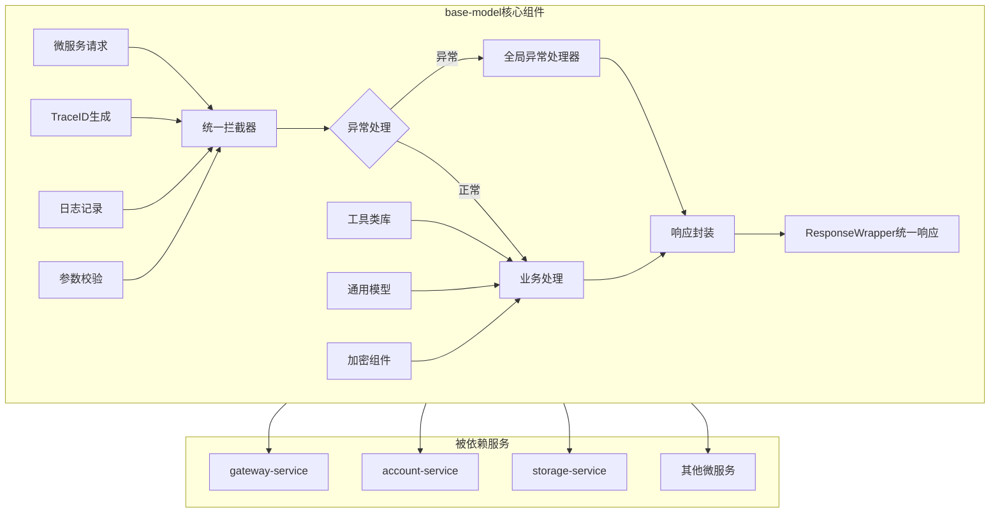

# base-model 基础模块

## 服务定位
- **架构层级**：基础支撑层
- **核心职责**：提供所有Java微服务的基础组件和通用功能，包括统一响应格式、异常处理、工具类、通用模型等
- **业务范围**：为所有微服务提供标准化的基础能力支撑

## 技术栈
- **主开发语言**：Java 17
- **核心框架**：Spring Boot 3.1.0
- **构建工具**：Maven 3.8+
- **通信协议**：作为基础库被其他服务依赖

## 核心功能模块

### 1. 统一响应体 (ResponseWrapper)
```java
public class ResponseWrapper<T> {
    private int code;           // 响应码
    private String message;      // 响应消息
    private T data;             // 响应数据
    private String traceId;     // 链路追踪ID
    private long timestamp;     // 时间戳
}
```

### 2. 全局异常处理
- BusinessException：业务异常
- SystemException：系统异常
- ValidationException：参数校验异常
- AuthException：认证授权异常

### 3. 错误码规范
```
1xxxx - 系统级错误
2xxxx - 认证授权错误
3xxxx - 参数校验错误
4xxxx - 业务逻辑错误
5xxxx - 第三方服务错误
```

### 4. 通用工具类
- TraceIdUtil：生成和管理TraceID
- EncryptUtil：加密解密工具（AES-256）
- JsonUtil：JSON序列化工具
- DateUtil：日期时间处理
- ValidationUtil：参数校验工具

### 5. 通用数据模型
- BaseEntity：基础实体类
- PageRequest/PageResponse：分页模型
- DeviceDTO：设备通用模型
- UserDTO：用户通用模型
- FamilyDTO：家庭通用模型

### 6. 注解和切面
- @TraceLog：日志追踪注解
- @RateLimit：限流注解
- @Encrypt：加密注解
- @Permission：权限校验注解

## 业务流程图



## 使用方式

### Maven依赖
```xml
<dependency>
    <groupId>com.haven</groupId>
    <artifactId>base-model</artifactId>
    <version>1.0.0</version>
</dependency>
```

### 快速集成示例
```java
// 1. 继承基础配置类
@SpringBootApplication
@Import(BaseModelAutoConfiguration.class)
public class YourServiceApplication {
    // ...
}

// 2. 使用统一响应
@RestController
public class YourController {
    @GetMapping("/api/test")
    public ResponseWrapper<String> test() {
        return ResponseWrapper.success("操作成功");
    }
}

// 3. 使用全局异常
throw new BusinessException(ErrorCode.PARAM_ERROR, "参数错误");
```

## 配置说明

### application.yml配置项
```yaml
base-model:
  trace:
    enabled: true                    # 启用链路追踪
    prefix: "tr"                     # TraceID前缀
  encrypt:
    enabled: true                    # 启用加密功能
    algorithm: "AES"                 # 加密算法
  log:
    level: INFO                      # 日志级别
    format: JSON                     # 日志格式
  response:
    include-timestamp: true          # 响应包含时间戳
    include-trace-id: true          # 响应包含TraceID
```

## 开发规范

### 代码规范
- 所有公共类必须添加详细的中文注释
- 工具类方法必须是静态方法
- 异常必须继承自定义的基础异常类
- 所有常量定义在对应的Constants类中

### 版本管理
- 遵循语义化版本规范（Major.Minor.Patch）
- 向后兼容原则，不随意删除或修改公共API
- 重大变更需要提前通知所有依赖服务

## 测试要求
```bash
mvn test
# 单元测试覆盖率要求：≥90%（作为基础模块要求更高）
```

## 监控指标
- 被依赖次数
- 方法调用频率
- 异常抛出统计
- 性能指标（工具类执行时间）

## 已实现功能清单

✅ **核心功能**
- ResponseWrapper统一响应包装器
- ErrorCode错误码枚举（100+预定义错误码）
- 完整的异常体系（BaseException、BusinessException、SystemException、ValidationException、AuthException）
- GlobalExceptionHandler全局异常处理器
- TraceIdInterceptor链路追踪拦截器

✅ **工具类库**
- TraceIdUtil：TraceID生成和管理
- EncryptUtil：AES/RSA/HMAC/BCrypt加密工具
- JsonUtil：JSON序列化和反序列化
- DateUtil：日期时间处理工具
- ValidationUtil：参数校验和数据脱敏

✅ **数据模型**
- BaseEntity：基础实体类（包含通用字段）
- PageRequest/PageResponse：分页请求和响应模型
- UserDTO：用户数据传输对象
- FamilyDTO：家庭数据传输对象
- DeviceDTO：设备数据传输对象

✅ **注解和切面**
- @TraceLog：日志追踪注解
- @RateLimit：限流注解
- @Encrypt：加密注解
- @Permission：权限校验注解
- TraceLogAspect：日志追踪切面实现

✅ **自动配置**
- BaseModelAutoConfiguration：Spring Boot自动配置
- 完整的配置属性类
- META-INF/spring.factories自动配置文件

## 集成使用指南

### 1. Maven依赖引入
```xml
<dependency>
    <groupId>com.haven</groupId>
    <artifactId>base-model</artifactId>
    <version>1.0.0</version>
</dependency>
```

### 2. 启用自动配置

#### 方式一：自动扫描（推荐）
```java
@SpringBootApplication
public class YourServiceApplication {
    public static void main(String[] args) {
        SpringApplication.run(YourServiceApplication.class, args);
    }
}
```

#### 方式二：显式导入
```java
@SpringBootApplication
@Import(BaseModelAutoConfiguration.class)
public class YourServiceApplication {
    public static void main(String[] args) {
        SpringApplication.run(YourServiceApplication.class, args);
    }
}
```

### 3. 配置文件设置

在`application.yml`中添加：

```yaml
# 引入基础配置
spring:
  profiles:
    include: base

# BaseModel配置项
base-model:
  version: 1.0.0
  trace:
    enabled: true                    # 启用链路追踪
    prefix: "tr"                     # TraceID前缀
    exclude-paths:                   # 排除路径
      - "/health"
      - "/actuator/**"
  exception:
    enabled: true                    # 启用全局异常处理
    include-stack-trace: false      # 是否包含堆栈信息
  log:
    enabled: true                    # 启用日志追踪
    level: INFO                      # 日志级别
    format: JSON                     # 日志格式
  response:
    include-timestamp: true          # 响应包含时间戳
    include-trace-id: true          # 响应包含TraceID
  encrypt:
    enabled: true                    # 启用加密功能
    algorithm: "AES"                 # 默认加密算法
```

### 4. 使用示例

#### 统一响应格式
```java
@RestController
@RequestMapping("/api/users")
public class UserController {

    @GetMapping("/{id}")
    public ResponseWrapper<UserDTO> getUser(@PathVariable Long id) {
        UserDTO user = userService.findById(id);
        return ResponseWrapper.success(user);
    }

    @PostMapping
    public ResponseWrapper<UserDTO> createUser(@RequestBody @Valid UserDTO user) {
        UserDTO created = userService.create(user);
        return ResponseWrapper.success("用户创建成功", created);
    }
}
```

#### 异常处理
```java
@Service
public class UserService {

    public UserDTO findById(Long id) {
        User user = userRepository.findById(id)
            .orElseThrow(() -> new BusinessException(ErrorCode.DATA_NOT_FOUND, "用户不存在"));
        return convertToDTO(user);
    }

    public void validateUser(UserDTO user) {
        if (!ValidationUtil.isValidPhone(user.getPhone())) {
            throw new ValidationException("phone", "手机号格式不正确");
        }

        if (!hasPermission(user)) {
            throw new AuthException(ErrorCode.PERMISSION_DENIED);
        }
    }
}
```

#### 日志追踪
```java
@Service
public class DeviceService {

    @TraceLog(value = "设备上线", module = "设备管理", type = "UPDATE")
    public void deviceOnline(String deviceId) {
        // 方法执行会自动记录日志
        // 包含：参数、返回值、执行时间、TraceID
        updateDeviceStatus(deviceId, "ONLINE");
    }

    @TraceLog(value = "批量控制设备", module = "设备管理", ignoreParamIndexes = {1})
    public void controlDevices(List<String> deviceIds, String secret) {
        // secret参数不会被记录到日志
        // 业务逻辑...
    }
}
```

#### 限流控制
```java
@RestController
public class DataController {

    @GetMapping("/api/data")
    @RateLimit(limit = 100, window = 60, type = RateLimit.LimitType.IP)
    public ResponseWrapper<List<DataDTO>> getData() {
        // 基于IP限流：每个IP每分钟最多100次请求
        return ResponseWrapper.success(dataService.getData());
    }

    @PostMapping("/api/sensitive")
    @RateLimit(limit = 10, window = 3600, type = RateLimit.LimitType.USER,
               message = "操作太频繁，请稍后再试")
    public ResponseWrapper<Void> sensitiveOperation() {
        // 基于用户限流：每用户每小时最多10次
        return ResponseWrapper.success();
    }
}
```

#### 工具类使用
```java
// TraceID工具
String traceId = TraceIdUtil.generate();
TraceIdUtil.setTraceId(traceId);
String current = TraceIdUtil.getCurrentOrGenerate();

// 加密工具
String encrypted = EncryptUtil.encryptAES(plainText, key);
String decrypted = EncryptUtil.decryptAES(encrypted, key);
String passwordHash = EncryptUtil.hashPassword(password);
boolean valid = EncryptUtil.verifyPassword(password, hash);

// JSON工具
String json = JsonUtil.toJson(object);
UserDTO user = JsonUtil.fromJson(json, UserDTO.class);
List<UserDTO> users = JsonUtil.fromJsonToList(json, UserDTO.class);

// 日期工具
LocalDateTime now = DateUtil.now();
String formatted = DateUtil.format(now, "yyyy-MM-dd HH:mm:ss");
long days = DateUtil.betweenDays(start, end);
String duration = DateUtil.formatDuration(3665); // "1小时1分钟5秒"

// 校验工具
boolean validPhone = ValidationUtil.isValidPhone("13812345678");
boolean validEmail = ValidationUtil.isValidEmail("test@example.com");
String maskedPhone = ValidationUtil.maskPhone("13812345678"); // "138****5678"
String maskedIdCard = ValidationUtil.maskIdCard(idCard); // "110101********1234"
```

#### 分页处理
```java
@GetMapping("/list")
public ResponseWrapper<PageResponse<UserDTO>> listUsers(
        @RequestParam(defaultValue = "1") Integer page,
        @RequestParam(defaultValue = "20") Integer size,
        @RequestParam(required = false) String keyword) {

    PageRequest pageRequest = PageRequest.of(page, size);
    pageRequest.setKeyword(keyword);
    pageRequest.setSortField("createTime");
    pageRequest.setSortOrder("DESC");

    PageResponse<UserDTO> result = userService.findPage(pageRequest);
    return ResponseWrapper.success(result);
}
```

## 扩展开发

### 自定义错误码
```java
public class CustomErrorCode {
    public static final ErrorCode CUSTOM_ERROR =
        new ErrorCode(60001, "自定义错误消息");
}
```

### 自定义异常
```java
public class CustomException extends BaseException {
    public CustomException(String message) {
        super(60000, message);
    }
}
```

### 自定义切面
```java
@Aspect
@Component
public class CustomAspect {

    @Around("@annotation(com.haven.base.annotation.YourAnnotation)")
    public Object around(ProceedingJoinPoint point) throws Throwable {
        // 前置处理
        Object result = point.proceed();
        // 后置处理
        return result;
    }
}
```

## 注意事项

1. **版本兼容**：基于Spring Boot 3.1.0，需要Java 17+
2. **依赖冲突**：如遇到依赖冲突，可通过exclusions排除
3. **配置优先级**：application.yml > application-base.yml > 默认配置
4. **性能考虑**：日志追踪在生产环境建议设置为WARN以上级别
5. **安全提醒**：加密密钥不要硬编码，应通过配置中心管理

## 故障排查

### TraceID未生成
- 检查TraceIdInterceptor是否被注册
- 确认base-model.trace.enabled=true
- 检查请求路径是否在exclude-paths中

### 全局异常处理不生效
- 确认@RestControllerAdvice注解存在
- 检查base-model.exception.enabled=true
- 确认没有其他ExceptionHandler覆盖

### 切面不工作
- 确认spring-boot-starter-aop依赖存在
- 检查@EnableAspectJAutoProxy是否启用
- 确认目标方法不是private或final

## 更新历史
- v1.0.0 (2025-01-16): 初始版本发布，完整实现所有基础功能