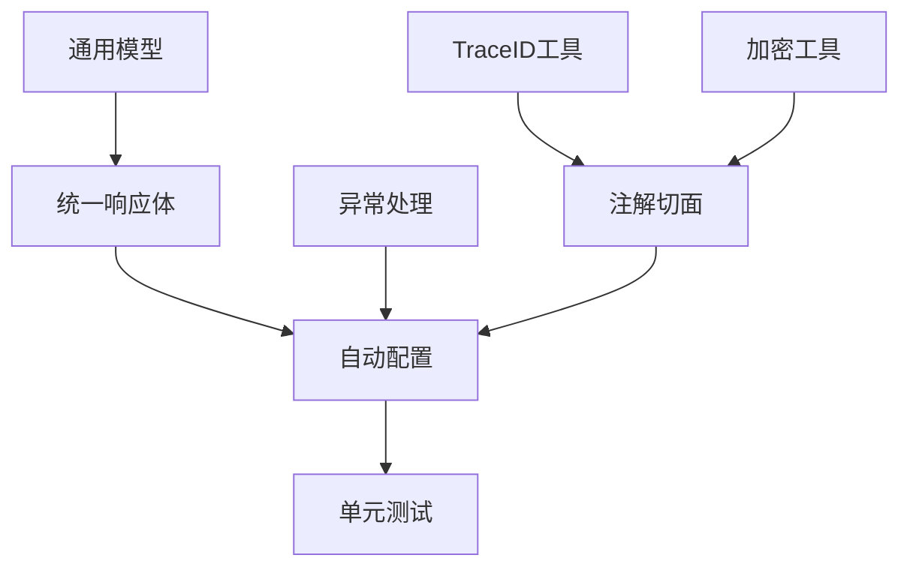

# base-model 开发面板

## 当前任务进度

| 任务ID | 任务描述 | 开发状态 | 完成度 | 预计完成 | 阻塞点 |
|--------|----------|----------|--------|----------|--------|
| BM001 | 统一响应体设计与实现 | 待开始 | 0% | 01-16 | 无 |
| BM002 | 全局异常处理体系 | 待开始 | 0% | 01-17 | 无 |
| BM003 | TraceID工具类 | 待开始 | 0% | 01-17 | 无 |
| BM004 | 加密解密工具类 | 待开始 | 0% | 01-18 | 无 |
| BM005 | 通用数据模型定义 | 待开始 | 0% | 01-18 | 无 |
| BM006 | 自定义注解和切面 | 待开始 | 0% | 01-19 | 无 |
| BM007 | 自动配置类 | 待开始 | 0% | 01-19 | 无 |
| BM008 | 单元测试编写 | 待开始 | 0% | 01-20 | 无 |

## 开发日志快速链接
- [2025-01-15 初始化项目结构](../../dev-logs/2025-01-15/base-model/)

## 模块依赖关系

## 当前阻塞问题
- 无

## 下一步计划
1. 实现ResponseWrapper统一响应体
2. 构建全局异常处理体系
3. 实现TraceID生成和传递机制
4. 完成AES-256加密工具类
5. 定义Device、User、Family等通用DTO

## 技术决策记录

### 2025-01-15
- **决策**：采用Spring Boot 3.1.0作为基础框架
- **原因**：最新LTS版本，性能优化，原生支持GraalVM
- **影响**：所有微服务需要使用Java 17+

## 性能基线

| 指标 | 目标值 | 当前值 | 状态 |
|------|--------|--------|------|
| 工具类方法执行时间 | <10ms | - | 待测试 |
| 内存占用 | <50MB | - | 待测试 |
| 启动时间 | <1s | - | 待测试 |

## 代码质量指标

| 指标 | 目标值 | 当前值 | 状态 |
|------|--------|--------|------|
| 单元测试覆盖率 | ≥90% | 0% | 🔴 |
| 代码复杂度 | <10 | - | 待检测 |
| 技术债务 | <1天 | - | 待评估 |

## 风险跟踪

| 风险项 | 概率 | 影响 | 缓解措施 | 状态 |
|--------|------|------|----------|------|
| API变更影响其他服务 | 中 | 高 | 严格版本管理，向后兼容 | 监控中 |
| 性能瓶颈 | 低 | 中 | 性能测试，优化算法 | 监控中 |

## 待办事项清单
- [ ] 编写ResponseWrapper类
- [ ] 实现错误码枚举
- [ ] 创建基础异常类体系
- [ ] 实现TraceID生成算法
- [ ] 编写AES加密工具
- [ ] 定义通用DTO模型
- [ ] 实现日志追踪注解
- [ ] 创建限流注解和切面
- [ ] 编写自动配置类
- [ ] 完成单元测试
- [ ] 编写使用文档
- [ ] 性能测试和优化