# account-service 账户服务

## 服务定位
- **架构层级**：核心业务层
- **核心职责**：用户注册/登录、家庭权限管理（RBAC模型）、设备级权限控制、JWT Token管理
- **业务范围**：用户账户体系、家庭成员管理、房间权限分配、设备访问控制

## 技术栈
- **主开发语言**：Java 17
- **核心框架**：Spring Cloud 2023.0.1, Spring Boot 3.1.0
- **通信协议**：gRPC (内部), HTTP/JSON (外部)
- **数据存储**：通过 storage-service 统一访问

## 部署信息
- **Docker镜像**：`smart-home/account-service:v1.0.0`
- **内部端口**：8080 (Docker网络内)
- **健康检查**：`/actuator/health`
- **环境变量**：
  ```
  NACOS_ADDR=nacos:8848
  STORAGE_SERVICE_URL=http://storage-service:8080
  GATEWAY_SERVICE_URL=http://gateway:8080
  JWT_SECRET=${JWT_SECRET}
  ```

## 业务流程图

```mermaid
graph TB
    subgraph 用户认证流程
        A[用户请求] --> B{请求类型}
        B -->|注册| C[验证手机号/邮箱]
        B -->|登录| D[验证账号密码]
        
        C --> E[创建用户账户]
        E --> F[创建默认家庭]
        F --> G[生成JWT Token]
        
        D --> H{验证结果}
        H -->|成功| G
        H -->|失败| I[返回错误]
        
        G --> J[返回Token给客户端]
    end
    
    subgraph 权限管理流程
        K[权限请求] --> L[解析JWT Token]
        L --> M[获取用户ID]
        M --> N[查询用户角色]
        
        N --> O{角色判断}
        O -->|家庭管理员| P[全部权限]
        O -->|家庭成员| Q[查询房间权限]
        O -->|访客| R[临时权限]
        
        Q --> S[查询设备权限]
        S --> T{权限验证}
        T -->|允许| U[执行操作]
        T -->|拒绝| V[返回403]
    end
    
    subgraph 家庭管理流程
        W[家庭操作] --> X{操作类型}
        X -->|创建家庭| Y[初始化家庭结构]
        X -->|邀请成员| Z[生成邀请码]
        X -->|管理房间| AA[房间CRUD]
        X -->|设备授权| AB[设备权限分配]
        
        Y --> AC[设置管理员]
        Z --> AD[发送邀请通知]
        AA --> AE[更新权限树]
        AB --> AF[同步到设备]
    end
```



## 接口信息

### 对外暴露API
- **路由方式**：通过网关路由 `/api/v1/account/*`
- **接口文档**：`http://gateway-ip:8080/swagger/account`

### 主要接口列表

#### 1. 用户认证接口
```
POST /api/v1/account/register   - 用户注册
POST /api/v1/account/login      - 用户登录
POST /api/v1/account/logout     - 用户登出
POST /api/v1/account/refresh    - 刷新Token
GET  /api/v1/account/profile    - 获取用户信息
PUT  /api/v1/account/profile    - 更新用户信息
```

#### 2. 家庭管理接口
```
POST /api/v1/account/family            - 创建家庭
GET  /api/v1/account/family            - 获取家庭列表
PUT  /api/v1/account/family/{id}       - 更新家庭信息
DELETE /api/v1/account/family/{id}     - 删除家庭
POST /api/v1/account/family/{id}/invite - 邀请成员
POST /api/v1/account/family/join       - 加入家庭
```

#### 3. 权限管理接口
```
GET  /api/v1/account/permissions              - 获取用户权限
POST /api/v1/account/family/{id}/permissions  - 设置成员权限
GET  /api/v1/account/family/{id}/rooms        - 获取房间列表
POST /api/v1/account/room/{id}/permissions    - 设置房间权限
```

### 内部服务调用
- **通信协议**：gRPC + TLS
- **Proto定义**：`src/main/proto/account.proto`
- **调用方式**：`AccountServiceGrpc.newBlockingStub(channel)`

## 三级权限模型

```yaml
权限层级:
  家庭级:
    - 家庭管理员: 全部权限
    - 家庭成员: 默认权限
    - 访客: 临时权限
  
  房间级:
    - 房间所有者: 房间内全部权限
    - 房间使用者: 使用权限
    - 无权限: 不可访问
  
  设备级:
    - 完全控制: 所有操作权限
    - 使用权限: 基本操作权限
    - 只读权限: 仅查看状态
    - 无权限: 不可见
```

## 依赖关系
- **直接依赖**：
  - `storage-service:v1.0.0` (必需) - 数据存储
  - `nacos:2.3.0` (必需) - 配置中心
  - `base-model:1.0.0` (必需) - 基础组件
- **被依赖方**：
  - `nlp-service` - 权限验证
  - `gateway-service` - 用户认证
  - `ai-service` - 用户信息查询
  - `file-manager-service` - 权限校验

## 数据访问规范
⚠️ **严禁直接连接数据库** - 所有数据操作必须通过 `storage-service` 接口

### 支持的数据操作
```
用户数据:
  - POST /storage/api/v1/user          - 用户CRUD
  - GET  /storage/api/v1/user/{id}     - 查询用户
  
家庭数据:
  - POST /storage/api/v1/family        - 家庭CRUD
  - GET  /storage/api/v1/family/{id}   - 查询家庭
  
权限数据:
  - POST /storage/api/v1/permissions   - 权限设置
  - GET  /storage/api/v1/permissions   - 权限查询
  
会话数据:
  - POST /storage/api/v1/sessions      - 会话管理
  - GET  /storage/api/v1/sessions/{id} - 会话查询
```

## JWT Token规范

### Token结构
```json
{
  "sub": "user_id",
  "name": "用户名",
  "family_id": "当前家庭ID",
  "role": "family_admin",
  "permissions": ["read", "write", "admin"],
  "exp": 1234567890,
  "iat": 1234567890
}
```

### Token管理策略
- Access Token有效期：2小时
- Refresh Token有效期：7天
- Token黑名单机制（登出后加入黑名单）
- 多设备登录管理（最多5个设备）

## 独立测试部署
```bash
# 启动最小依赖环境
docker-compose -f docker/test-compose.yml up -d

# 构建和启动服务
./scripts/build.sh
./scripts/test-deploy.sh

# 验证服务状态
curl http://localhost:8080/actuator/health
```

## Docker网络配置
- **网络名称**：smart-home-network
- **容器名称**：account-service
- **端口映射**：仅测试环境临时开放 localhost:8081->8080
- **内部通信**：其他服务通过 `account-service:8080` 访问

## 测试要求
### 单元测试
```bash
mvn test
# 覆盖率要求：≥80%
```

### Docker集成测试
```bash
# 必须在Docker环境中测试
docker-compose -f docker/integration-test.yml up --abort-on-container-exit
```

## 监控和日志
- **关键指标**：登录成功率、权限验证延迟、用户会话数、Token刷新频率
- **日志级别**：INFO (业务操作), ERROR (系统异常)
- **TraceID**：所有请求必须携带并传递

## 故障排查
1. **服务启动失败**：检查 Nacos 连接和环境变量
2. **权限验证异常**：查看 storage-service 连接状态
3. **Token验证失败**：检查JWT密钥配置
4. **性能问题**：监控 JVM 内存和 GC 情况

## 安全要求
- 密码必须加密存储（BCrypt）
- 敏感操作需要二次验证
- 登录失败锁定机制（5次失败锁定30分钟）
- 异常登录检测和告警

## 更新历史
- v1.0.0 (2025-01-15): 初始版本，基础认证功能