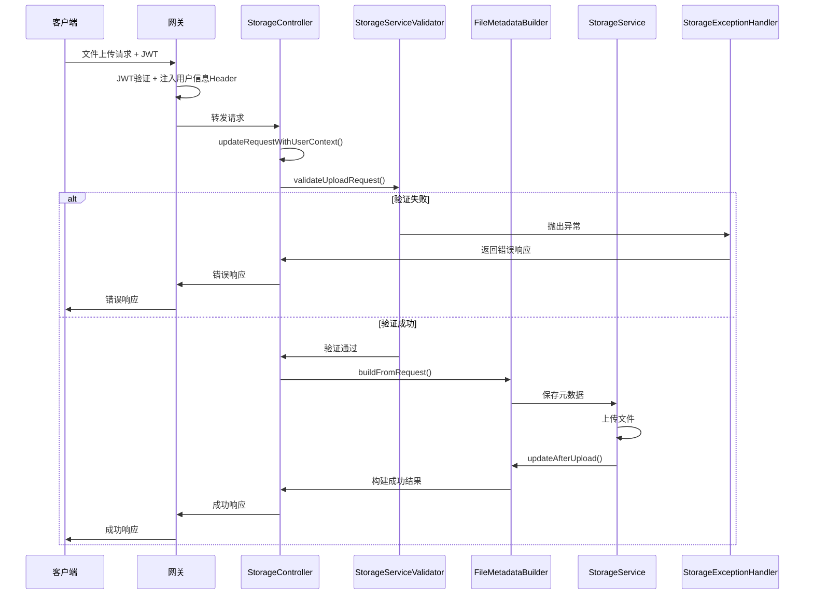

# 存储服务架构文档

## 📋 概述

本文档描述了HavenButler存储服务的架构设计、异常处理规范和核心组件说明。

## 🏗️ 架构设计原则

### 1. 职责分离原则
- **控制器层**: 只负责HTTP请求处理和响应
- **验证层**: 负责参数验证和权限校验
- **构建层**: 负责数据对象构建和转换
- **服务层**: 负责核心业务逻辑
- **异常处理层**: 负责统一异常处理和响应格式

### 2. 异常处理规范
严格遵循base-model的异常处理体系：

```java
// 异常类型和错误码规范
1xxxx - 系统级错误 (SystemException)
2xxxx - 认证授权错误 (AuthException)
3xxxx - 参数校验错误 (ValidationException)
4xxxx - 业务逻辑错误 (BusinessException)
5xxxx - 第三方服务错误
```

### 3. 响应格式规范
统一使用base-model的ResponseWrapper格式：

```java
public class ResponseWrapper<T> {
    private int code;           // 响应码
    private String message;      // 响应消息
    private T data;             // 响应数据
    private String traceId;     // 链路追踪ID
    private long timestamp;     // 时间戳
}
```

## 🔧 核心组件说明

### 1. StorageServiceValidator (验证器)
**位置**: `com.haven.storage.validator.StorageServiceValidator`

**职责**:
- 用户认证验证
- 请求参数验证
- 文件类型和大小验证
- 权限级别验证
- 文件夹路径验证

**使用示例**:
```java
@Autowired
private StorageServiceValidator validator;

// 验证上传请求
validator.validateUploadRequest(request);

// 验证下载权限
validator.validateDownloadPermission(fileId, familyId);
```

**异常类型**:
- `AuthException`: 用户认证相关异常 (2xxxx)
- `ValidationException`: 参数验证异常 (3xxxx)
- `SystemException`: 系统异常 (1xxxx)

### 2. FileMetadataBuilder (构建器)
**位置**: `com.haven.storage.builder.FileMetadataBuilder`

**职责**:
- 从上传请求构建文件元数据
- 上传后更新文件元数据
- 生成唯一文件名
- 检测文件类型
- 创建删除元数据

**使用示例**:
```java
@Autowired
private FileMetadataBuilder metadataBuilder;

// 构建文件元数据
FileMetadata metadata = metadataBuilder.buildFromRequest(request, storageType);

// 上传后更新元数据
metadata = metadataBuilder.updateAfterUpload(metadata, uploadResult);
```

**异常类型**:
- `SystemException`: 构建过程中的系统异常 (1xxxx)

### 3. StorageExceptionHandler (异常处理器)
**位置**: `com.haven.storage.handler.StorageExceptionHandler`

**职责**:
- 全局异常捕获和处理
- 统一异常响应格式
- 错误日志记录
- HTTP状态码映射

**异常映射**:
```java
AuthException -> HTTP 401 (UNAUTHORIZED)
ValidationException -> HTTP 400 (BAD_REQUEST)
BusinessException -> HTTP 400 (BAD_REQUEST)
SystemException -> HTTP 500 (INTERNAL_SERVER_ERROR)
MaxUploadSizeExceededException -> HTTP 400 (BAD_REQUEST)
MultipartException -> HTTP 400 (BAD_REQUEST)
SecurityException -> HTTP 403 (FORBIDDEN)
```

**响应创建**:
```java
// 成功响应
ResponseWrapper<T> response = StorageExceptionHandler.createSuccessResponse(data, message);

// 错误响应
ResponseWrapper<T> response = StorageExceptionHandler.createErrorResponse(errorCode, errorMessage);
```

### 4. UserContext (用户上下文)
**位置**: `com.haven.storage.security.UserContext`

**职责**:
- 从网关注入的Header获取用户信息
- 提供线程安全的用户信息访问
- 支持权限和角色检查

**Header映射**:
```java
X-User-ID -> getCurrentUserId()
X-Family-ID -> getCurrentFamilyId()
X-User-Name -> getCurrentUserName()
X-User-Email -> getCurrentUserEmail()
X-User-Roles -> getCurrentUserRoles()
X-User-Permissions -> getCurrentUserPermissions()
```

## 🔄 请求处理流程

### 文件上传流程


## 📊 错误码清单

### 系统级错误 (1xxxx)
- `10001`: 用户认证验证失败
- `10002`: 文件上传请求验证失败
- `10003`: 文件下载权限验证失败
- `10004`: 文件元数据构建失败
- `10005`: 设置文件基础信息失败
- `10006`: 设置文件信息失败
- `10007`: 设置权限信息失败
- `10008`: 设置存储信息失败
- `10009`: 设置预览信息失败
- `10010`: 设置自定义元数据失败
- `10011`: 文件元数据上传后更新失败
- `10012`: 创建文件删除元数据失败

### 认证授权错误 (2xxxx)
- `20001`: 用户未认证，请重新登录
- `20002`: 无法获取用户身份信息
- `20003`: 请求中的用户ID与当前用户不一致
- `20004`: 无权设置指定所有者
- `20005`: 安全验证失败

### 参数校验错误 (3xxxx)
- `30001`: 家庭ID不能为空
- `30002`: 家庭ID格式不正确
- `30003`: 上传文件不能为空
- `30004`: 文件大小不能超过100MB
- `30005`: 文件名不能为空
- `30006`: 不支持的文件类型
- `30007`: 文件扩展名与内容类型不匹配
- `30008`: 权限级别不能为空
- `30009`: 无效的权限级别
- `30010`: 文件夹路径必须以 / 开头
- `30011`: 文件夹路径包含非法字符
- `30012`: 文件夹路径过长，最大255个字符
- `30013`: 文件ID不能为空
- `30014`: 文件上传大小超过限制
- `30015`: 文件上传失败
- `30016`: 参数错误

### 业务逻辑错误 (4xxxx)
- `40001`: 文件上传失败
- `40002`: 无法生成文件访问URL

### 系统内部错误 (5xxxx)
- `50001`: 文件上传失败
- `50002`: 系统内部错误，请稍后重试
- `50003`: 系统异常，请联系管理员

## 🎯 开发规范

### 1. 异常处理规范
- 严格使用base-model定义的异常类型
- 抛出异常时必须提供错误码和错误消息
- 异常消息要用户友好，技术细节记录在日志中
- 使用try-catch包装已知异常，避免系统异常暴露

### 2. 日志规范
- 使用TraceID进行链路追踪
- 记录关键操作的开始和结束
- 异常日志要包含完整的上下文信息
- 敏感信息不得记录在日志中

### 3. 代码规范
- 单个类职责单一，代码行数控制在合理范围
- 方法参数不超过5个，复杂参数使用对象封装
- 使用Builder模式构建复杂对象
- 必要的注释和JavaDoc说明

### 4. 测试规范
- 单元测试覆盖所有验证逻辑
- 集成测试覆盖完整业务流程
- 异常场景测试覆盖所有错误码
- 性能测试确保系统稳定性

## 🔍 监控和告警

### 1. 关键指标监控
- 文件上传成功率
- 文件上传平均耗时
- 异常发生频率和类型
- 系统资源使用情况

### 2. 告警规则
- 文件上传失败率超过5%
- 平均上传耗时超过10秒
- 系统异常数量激增
- 磁盘空间使用率超过80%

### 3. 日志监控
- 错误日志实时监控
- 性能日志趋势分析
- 用户行为日志分析
- 安全事件日志监控

## 📈 性能优化

### 1. 文件处理优化
- 大文件分片上传
- 并行处理多文件上传
- 缩略图异步生成
- 文件类型快速检测

### 2. 缓存策略
- 文件元数据缓存
- 用户权限信息缓存
- 频繁访问文件缓存
- 分布式缓存一致性

### 3. 存储优化
- 文件去重机制
- 冷热数据分离
- 自动清理过期文件
- 存储容量监控

## 🔒 安全考虑

### 1. 权限控制
- 基于家庭ID的数据隔离
- 文件访问权限验证
- 用户身份认证
- API访问频率限制

### 2. 数据安全
- 敏感文件加密存储
- 传输过程TLS加密
- 访问日志审计
- 数据备份和恢复

### 3. 安全防护
- 文件类型白名单
- 文件大小限制
- 恶意文件检测
- 入侵检测和防护

---

*文档版本: v1.0.0*
*更新时间: 2025-01-16*
*维护人员: HavenButler团队*