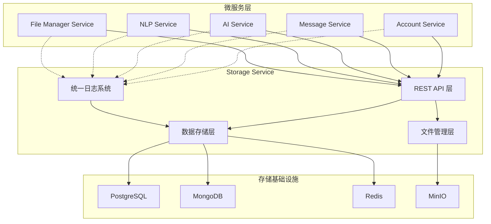

# Storage Service - HavenButler 智能存储服务

## 🎯 服务概述

Storage Service 是 HavenButler 智能家庭平台的**核心存储服务**，提供三大核心功能：

- 🗄️ **统一数据存储**: 多数据源统一访问接口
- 🔗 **数据库访问代理**: 智能连接池和代理服务
- 📝 **统一日志系统**: 基于base-model的日志收集分析

### ✨ 服务定位
- **架构层级**: 核心业务层
- **核心职责**: 数据存储代理、日志收集、文件管理
- **业务范围**: 数据库代理、日志系统、文件存储、性能监控

## 🏗️ 核心架构



## 🚀 三大核心功能

### 1. 统一数据存储 🗄️
提供多数据源的统一REST API接口，支持PostgreSQL、MongoDB、Redis的标准化操作。

**核心特性**: 多租户数据隔离、Service-Key认证、跨数据源事务、连接池优化

**📖 详细文档**: [统一数据存储系统详解](docs/数据存储系统.md)

### 2. 数据库访问代理 🔗
作为微服务与数据库之间的智能代理层，提供连接池管理、读写分离、故障切换等功能。

**核心特性**: 智能路由、连接池管理、SQL安全防护、性能优化、故障自愈

**📖 详细文档**: [数据库访问代理系统详解](docs/数据库代理系统.md)

### 3. 统一日志系统 📝
基于base-model的微服务统一日志解决方案，支持操作、安全、性能、业务、错误五种日志类型。

**核心特性**: 注解式日志、异步处理、链路追踪、实时监控、智能告警

**📖 详细文档**: [统一日志系统详解](docs/统一日志系统.md)

## 🔧 技术架构

### 技术栈
- **主开发语言**: Java 17
- **核心框架**: Spring Cloud 2023.0.1, Spring Boot 3.2.0
- **通信协议**: HTTP/REST API
- **数据存储**: PostgreSQL、MongoDB、Redis、MinIO
- **配置中心**: Nacos 2.3.0
- **日志基础**: Base-Model统一日志模型

### 部署信息
- **Docker镜像**: `smart-home/storage-service:v1.0.0`
- **内部端口**: 8081
- **健康检查**: `/actuator/health`
- **网关路由**: `/api/v1/storage/*`
- **日志接口**: `/api/v1/logs/*`

## 📋 核心API接口

### 数据存储接口
```bash
# 统一数据访问
POST /api/v1/storage/{type}/{operation}   # 统一数据操作接口
GET  /api/v1/storage/health               # 存储健康检查
```

### 数据库代理接口
```bash
# 数据库代理访问
POST /api/v1/proxy/{database}             # 数据库代理请求
GET  /api/v1/proxy/health                 # 代理健康检查
GET  /api/v1/proxy/metrics                # 代理性能指标
```

### 日志系统接口
```bash
# 日志接收
POST /api/v1/logs/unified                 # 统一日志入口
POST /api/v1/logs/{type}                  # 按类型接收日志
POST /api/v1/logs/{type}/batch            # 批量日志接收

# 日志查询
GET  /api/v1/logs/{type}                  # 查询特定类型日志
GET  /api/v1/logs/metrics/realtime        # 实时监控指标
```

## 🔐 认证授权

### 服务间认证
```http
POST /api/v1/storage/postgresql/query
Service-Key: key_account_xxx
X-Family-ID: family123
X-Trace-ID: tr-20240101-120000-123456
Content-Type: application/json
```

### 用户认证
```http
POST /api/v1/storage/files/upload
Authorization: Bearer <jwt_token>
X-Family-ID: family123
X-Trace-ID: tr-20240101-120000-123456
```

## 🚀 快速集成指南

### 1. 添加Base-Model依赖
```xml
<dependency>
    <groupId>com.haven</groupId>
    <artifactId>base-model</artifactId>
    <version>1.0.0</version>
</dependency>
```

### 2. 配置连接信息
```yaml
# application.yml
haven:
  logging:
    enabled: true
    async: true

storage:
  service:
    url: http://storage-service:8081
```

### 3. 使用示例
```java
// 注解式日志
@LogOperation(operationType = "USER_LOGIN", description = "用户登录")
public LoginResult login(@RequestBody LoginRequest request) {
    return userService.login(request);
}

// 数据存储访问
@Autowired
private StorageClient storageClient;

public User createUser(CreateUserRequest request) {
    return storageClient.insert("users", request.toMap());
}
```

**🔗 更多集成示例请参考各功能详细文档**

## 📊 监控运维

### 健康检查
```bash
# 服务健康检查
curl http://storage-service:8081/actuator/health

# 各模块健康状态
curl http://storage-service:8081/api/v1/storage/health   # 数据存储
curl http://storage-service:8081/api/v1/proxy/health     # 数据库代理
curl http://storage-service:8081/api/v1/logs/health      # 日志系统
```

### 关键指标
- **存储性能**: API响应时间、吞吐量、错误率
- **代理性能**: 连接池状态、查询耗时、故障切换
- **日志性能**: 处理速度、积压情况、实时统计
- **系统资源**: CPU、内存、磁盘使用率

## 🔧 配置管理

Storage Service采用分层配置管理策略，支持本地开发和Docker两种环境：

### 本地开发环境
```bash
# 启动方式
mvn spring-boot:run

# 配置文件: application.yml
# 连接: localhost的数据库服务
# Nacos: 启用配置中心和服务发现
```

### Docker环境
```bash
# 启动方式
mvn spring-boot:run -Dspring.profiles.active=docker

# 配置文件: application-docker.yml
# 连接: Docker容器名的数据库服务
# Nacos: 禁用，使用本地配置
```

### 环境变量配置
```bash
# 数据库配置
export POSTGRESQL_HOST=localhost
export MONGODB_HOST=localhost
export REDIS_HOST=localhost
export MINIO_ENDPOINT=http://localhost:9000

# 日志系统配置
export HAVEN_LOGGING_ENABLED=true
export STORAGE_SERVICE_URL=http://localhost:8081
```

## 📚 详细文档

### 🔥 核心功能文档
| 功能模块 | 文档链接 | 主要内容 |
|---------|----------|----------|
| 🗄️ 统一数据存储 | [数据存储系统.md](docs/数据存储系统.md) | REST API接口、多数据源管理、性能优化 |
| 🔗 数据库访问代理 | [数据库代理系统.md](docs/数据库代理系统.md) | 智能代理、连接池管理、故障切换 |
| 📝 统一日志系统 | [统一日志系统.md](docs/统一日志系统.md) | 日志收集、实时监控、告警分析 |

### 📖 扩展文档
- **[API集成指南](docs/API集成指南.md)** - 完整的API接口文档和集成示例
- **[部署指南](docs/部署指南.md)** - 开发、测试、生产环境部署说明
- **[故障排查指南](docs/故障排查指南.md)** - 常见问题诊断和解决方案
- **[开发指导](CLAUDE.md)** - 开发规范和最佳实践

## ⚠️ 重要说明

### 数据安全
- **强制familyId**: 所有数据操作必须包含familyId进行数据隔离
- **服务认证**: 必须使用正确的Service-Key进行服务间认证
- **权限校验**: 基于JWT的用户权限验证

### 性能限制
- **全局QPS**: 1000次/秒
- **单Family QPS**: 100次/秒
- **文件上传**: 最大500MB
- **单次查询**: 最大1000条记录

### 日志使用
- **异步处理**: 日志记录不会阻塞业务流程
- **网络依赖**: 依赖storage-service，服务不可用时日志会丢失
- **存储容量**: 大量日志会占用存储空间，注意清理策略

## 🔄 版本历史

### v1.0.0 (当前版本)
- ✅ 统一数据存储接口
- ✅ 统一日志系统集成
- ✅ 多适配器文件管理
- ✅ 服务间认证机制
- ✅ 基于familyId的数据隔离
- ✅ 健康检查和监控
- ✅ 完整的API文档

### 后续版本规划
- v1.1.0: 日志分析和可视化
- v1.2.0: 文件智能分析和推荐
- v1.3.0: 数据库连接池优化
- v2.0.0: 云原生部署优化

---

**Storage Service** - HavenButler平台的数据存储和日志管理中心 🏗️