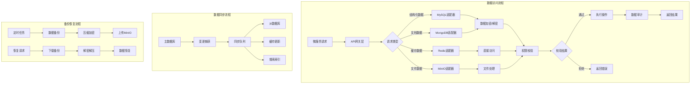

# storage-service 存储服务

## 服务定位
- **架构层级**：核心业务层
- **核心职责**：多存储适配（MySQL/MongoDB/Redis/MinIO）、底层数据持久化、数据备份、为所有微服务提供统一的数据访问接口
- **业务范围**：数据存储抽象层，隔离业务服务与底层存储，提供统一的数据访问API

## 技术栈
- **主开发语言**：Java 17
- **核心框架**：Spring Cloud 2023.0.1, Spring Boot 3.1.0
- **通信协议**：HTTP/JSON (对内)，gRPC (高频调用)
- **数据存储**：
  - MySQL 8.0 - 结构化业务数据
  - MongoDB 5.0 - 设备状态、日志数据
  - Redis 7.0 - 缓存、会话、限流计数
  - MinIO - 文件、图片存储

## 部署信息
- **Docker镜像**：`smart-home/storage-service:v1.0.0`
- **内部端口**：8080 (Docker网络内)
- **健康检查**：`/actuator/health`
- **环境变量**：
  ```
  NACOS_ADDR=nacos:8848
  MYSQL_URL=mysql://mysql:3306/smarthome
  MONGODB_URL=mongodb://mongodb:27017/smarthome
  REDIS_URL=redis://redis:6379
  MINIO_URL=http://minio:9000
  ENCRYPT_KEY=${ENCRYPT_KEY}  # 数据加密密钥
  ```

## 业务流程图



## 数据存储支持

### MySQL - 结构化数据
```yaml
用途:
  - 用户账户信息
  - 家庭关系数据
  - 权限配置数据
  - 设备基础信息
  - 系统配置数据

分库分表策略:
  - 按家庭ID分库（family_id % 8）
  - 大表按时间分表（按月）
  - 读写分离（1主2从）
```

### MongoDB - 文档数据
```yaml
用途:
  - 设备状态数据（时序）
  - 操作日志数据
  - 消息记录
  - AI对话历史
  - 临时数据存储

集合设计:
  - device_status: 设备状态集合
  - operation_logs: 操作日志集合
  - messages: 消息记录集合
  - ai_conversations: AI对话集合
```

### Redis - 缓存数据
```yaml
用途:
  - 用户会话缓存
  - 权限信息缓存
  - 限流计数器
  - 分布式锁
  - 消息队列

数据结构:
  - String: 简单缓存、计数器
  - Hash: 用户信息、设备状态
  - List: 消息队列、日志缓冲
  - Set: 标签、分组
  - ZSet: 排行榜、时序数据
```

### MinIO - 文件存储
```yaml
用途:
  - 用户头像
  - 家庭相册
  - 设备图片
  - 系统备份文件
  - 日志归档

桶设计:
  - user-avatars: 用户头像
  - family-photos: 家庭相册
  - device-images: 设备图片
  - system-backups: 系统备份
  - archived-logs: 归档日志
```

## API接口列表

### MySQL数据操作
```
POST /storage/api/v1/mysql/query    - 查询操作
POST /storage/api/v1/mysql/execute  - 执行操作
POST /storage/api/v1/mysql/batch    - 批量操作
POST /storage/api/v1/mysql/transaction - 事务操作
```

### MongoDB文档操作
```
POST /storage/api/v1/mongo/insert   - 插入文档
GET  /storage/api/v1/mongo/find     - 查询文档
PUT  /storage/api/v1/mongo/update   - 更新文档
DELETE /storage/api/v1/mongo/delete - 删除文档
POST /storage/api/v1/mongo/aggregate - 聚合查询
```

### Redis缓存操作
```
GET  /storage/api/v1/redis/{key}    - 获取缓存
POST /storage/api/v1/redis/set      - 设置缓存
DELETE /storage/api/v1/redis/{key}  - 删除缓存
POST /storage/api/v1/redis/expire   - 设置过期
POST /storage/api/v1/redis/lock     - 分布式锁
```

### MinIO文件操作
```
POST /storage/api/v1/files/upload   - 上传文件
GET  /storage/api/v1/files/{id}     - 下载文件
DELETE /storage/api/v1/files/{id}   - 删除文件
GET  /storage/api/v1/files/list     - 文件列表
POST /storage/api/v1/files/presign  - 预签名URL
```

## 访问接口规范

### 认证方式
- **JWT Token**：所有请求必须携带有效Token
- **HMAC签名**：请求体签名验证，防止篡改
- **API Key**：内部服务调用使用专用Key

### 权限校验
- **家庭隔离**：基于family_id的数据隔离
- **用户权限**：根据用户角色限制操作
- **服务权限**：不同服务有不同的数据访问权限

### 加密策略
- **敏感数据加密**：AES-256加密存储
- **密钥管理**：通过KMS管理加密密钥
- **传输加密**：TLS 1.3加密传输

## 数据安全措施

### 敏感数据处理
```java
/**
 * 敏感字段自动加密
 * 包括：密码、手机号、身份证、银行卡等
 */
@Encrypt
private String phoneNumber;

@Encrypt
private String idCard;
```

### 数据脱敏规则
- 手机号：138****5678
- 身份证：110***********1234
- 邮箱：t***@example.com
- 姓名：张*（两字）、王*明（三字）

### 审计日志
```yaml
记录内容:
  - 操作用户
  - 操作时间
  - 操作类型（增删改查）
  - 操作数据
  - 操作结果
  - 客户端IP
  - TraceID
```

## 性能优化

### 缓存策略
- **多级缓存**：本地缓存 + Redis缓存
- **缓存预热**：启动时加载热点数据
- **缓存更新**：写入时更新，定时刷新

### 查询优化
- **索引优化**：合理创建索引
- **分页查询**：限制单次查询数量
- **异步查询**：大数据量异步处理

### 连接池配置
```yaml
mysql:
  pool:
    max-connections: 100
    min-idle: 10
    max-lifetime: 1800000
    
redis:
  pool:
    max-active: 200
    max-idle: 50
    min-idle: 10
    
mongodb:
  connections-per-host: 100
  threads-allowed-to-block: 10
```

## 备份恢复策略

### 自动备份
- **MySQL**：每日全量备份，每小时增量备份
- **MongoDB**：每日全量备份
- **Redis**：RDB + AOF双重备份
- **MinIO**：跨区域复制

### 恢复流程
1. 停止写入操作
2. 下载备份文件
3. 验证备份完整性
4. 执行数据恢复
5. 验证数据一致性
6. 恢复服务

## 监控指标
- **数据库连接数**
- **查询响应时间**
- **缓存命中率**
- **存储空间使用率**
- **备份成功率**

## 故障处理
1. **数据库连接失败**：检查连接池配置和网络
2. **缓存穿透**：启用布隆过滤器
3. **数据不一致**：检查同步机制
4. **存储空间不足**：自动清理和告警

## 依赖关系
- **直接依赖**：
  - `base-model:1.0.0` (必需) - 基础组件
  - `nacos:2.3.0` (必需) - 配置中心
- **被依赖方**：
  - 所有微服务都依赖storage-service进行数据操作

## 更新历史
- v1.0.0 (2025-01-15): 初始版本，基础存储功能