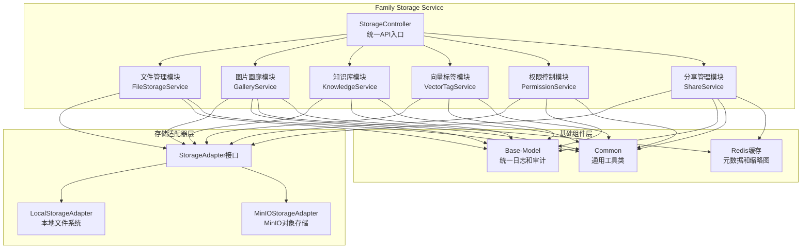
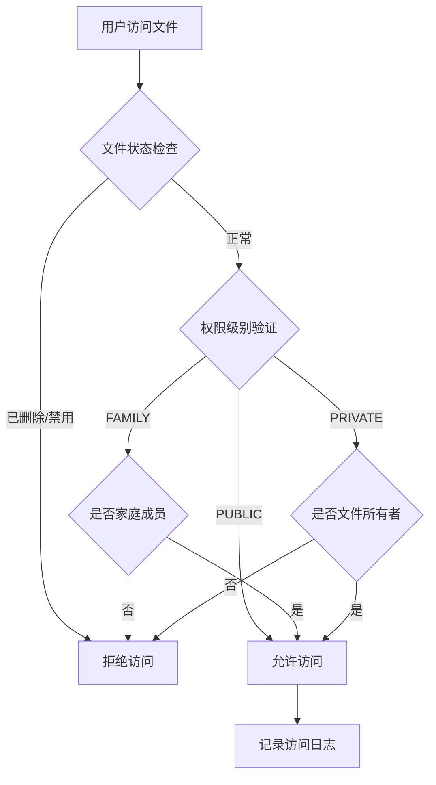

# Family Storage Service - HavenButler 智能家庭存储服务

## 🎯 服务概述

Family Storage Service 是 HavenButler 智能家庭平台的**家庭存储核心服务**，提供完整的家庭文件管理、知识库和分享功能：

- 🗄️ **家庭文件存储**: 支持本地、MinIO存储，按家庭组织存储结构，支持个人/公共文件权限控制
- 📁 **文件管理**: 提供完整的文件增、删、改、查功能，满足家庭文件管理需求
- 🖼️ **图片画廊**: 智能图片展示、缩略图生成、EXIF元数据提取、分类管理
- 🔗 **家庭分享**: 灵活的家庭内部文件分享，支持权限控制和分享链接管理
- 🧠 **知识库管理**: 个人知识库构建，支持文档管理和智能搜索
- 🏷️ **向量标签**: 文件内容向量化，提供语义搜索和智能标签功能

### ✨ 服务定位
- **架构层级**: 核心业务层 - 家庭存储服务
- **核心职责**: 家庭文件存储、权限控制、知识管理、分享管理
- **业务范围**: 文件存储、图片画廊、知识库、向量标签、权限管理、家庭分享

## 🏗️ 核心架构



## 🚀 核心功能

### 1. 家庭文件存储 🗄️
通过StorageAdapter接口提供统一的文件操作API，支持upload、download、delete、search等操作。

**核心特性**:
- 适配器模式支持本地、MinIO存储
- 动态存储切换和健康检查
- 按家庭数据隔离和组织
- 文件元数据管理和缓存

### 2. 图片画廊功能 🖼️
智能图片处理和展示系统，提供完整的家庭图片管理体验。

**核心特性**:
- 自动缩略图生成（多尺寸：200x200预览图、800x600展示图）
- EXIF元数据提取（拍摄时间、相机型号、GPS位置等）
- 图片分类和标签（按时间、地点、事件自动分类）
- 家庭图片画廊展示和浏览

### 3. 知识库管理 🧠
个人知识库构建和管理，支持文档智能处理和搜索。

**核心特性**:
- 知识库创建和文档管理
- 文档内容索引和检索
- 个人知识空间隔离
- 智能分类和标签推荐

### 4. 向量标签服务 🏷️
文件内容向量化，提供语义搜索和智能标签功能。

**核心特性**:
- 文件内容向量化处理
- 语义搜索和相似度匹配
- 智能标签自动生成
- 向量相似度文件推荐

### 5. 权限控制系统 🛡️
基于家庭和用户的三级文件权限管理，支持权限动态转换和访问控制。

#### 🏗️ 权限模型设计

**权限级别**:
- **私有文件 (PRIVATE)**: 归属当前用户，绑定用户ID和家庭ID，支持通过分享功能向其他用户开放不同权限
- **家庭文件 (FAMILY)**: 属于家庭分组，该家庭所有成员可访问，支持通过分享转为其他家庭成员的私有文件
- **公共文件 (PUBLIC)**: 对所有登录用户开放访问权限

**核心特性**:
- 三级权限控制（私有 ↔ 家庭 ↔ 公共）
- 权限动态转换和变更审计
- 基于用户ID和家庭ID的数据隔离
- 细粒度操作权限（查看/修改/删除）
- 权限继承和分享规则
- 完整的访问日志和审计跟踪

#### 📊 数据模型

```java
// 文件权限模型
public class FileMetadata {
    private String fileId;           // 文件唯一标识
    private String familyId;         // 所属家庭ID
    private String ownerId;          // 文件所有者ID
    private AccessLevel accessLevel; // 权限级别：PRIVATE/FAMILY/PUBLIC
    private Boolean enabled;         // 是否启用
    private Boolean deleted;         // 是否已删除
    // ... 其他字段
}

// 权限级别枚举
public enum AccessLevel {
    PRIVATE("私有"),    // 仅所有者可见
    FAMILY("家庭"),     // 家庭成员可见
    PUBLIC("公开");     // 所有人可见
}
```

#### 🔐 访问控制逻辑

**权限验证流程**:


**权限控制矩阵**:
| 权限级别 | 文件所有者 | 家庭成员 | 其他用户 | 分享权限 |
|----------|------------|----------|----------|----------|
| PRIVATE  | 查看/修改/删除 | ❌ | ❌ | ✅ 可分享 |
| FAMILY   | 查看/修改/删除 | 查看 | ❌ | ✅ 可分享 |
| PUBLIC   | 查看/修改/删除 | 查看 | 查看 | ❌ 无需分享 |

#### 🔄 权限变更流程

**权限转换规则**:


**权限变更控制**:
1. **私有 → 家庭**: 仅文件所有者可操作，文件变为家庭所有成员可见
2. **家庭 → 私有**: 仅文件所有者可操作，文件变为仅所有者可见
3. **家庭 → 公开**: 仅文件所有者可操作，文件变为所有用户可见
4. **公共 → 家庭**: 仅文件所有者可操作，文件权限收窄至家庭范围

**变更限制条件**:
- 只有文件所有者可以变更权限级别
- 权限变更需要记录变更原因和操作日志
- 涉及分享的文件权限变更需通知相关用户
- 公共文件转为私有/家庭时需检查是否影响其他用户的访问

#### 📤 分享权限体系

**分享类型与权限映射**:
- **家庭分享 (FAMILY_LINK)**: 仅家庭成员可访问，继承文件原有权限
- **公开分享 (PUBLIC_LINK)**: 所有用户可访问，需验证分享令牌
- **密码分享 (PASSWORD_LINK)**: 需要密码验证的分享链接
- **限时分享 (LIMITED_LINK)**: 有时间限制的分享，自动过期失效

**分享权限控制**:
- 私有文件：可创建任意类型的分享，向指定用户开放查看/修改/删除权限
- 家庭文件：可创建公开分享，但不能改变文件在家庭内的权限级别
- 公共文件：无需分享，所有登录用户均可直接访问

#### 🔍 权限验证实现

```java
// 文件访问权限验证
public boolean isAccessibleByUser(String userId, String familyId) {
    // 1. 文件状态检查
    if (deleted || !enabled) return false;

    // 2. 所有者权限
    if (userId.equals(ownerId)) return true;

    // 3. 权限级别检查
    switch (accessLevel) {
        case PUBLIC:
            return true;  // 所有人可访问
        case FAMILY:
            return familyId.equals(this.familyId);  // 家庭成员可访问
        case PRIVATE:
            return false;  // 仅所有者可访问
    }
}

// 权限变更验证
public boolean canChangeAccessLevel(String userId, AccessLevel newLevel) {
    // 只有所有者可以变更权限
    if (!userId.equals(ownerId)) return false;

    // 权限不能变更为相同级别
    if (newLevel == this.accessLevel) return false;

    // 检查权限变更的合理性
    return validateAccessLevelChange(newLevel);
}
```

### 6. 家庭分享系统 🔗
家庭内部文件分享机制，支持权限控制和分享管理。

**核心特性**:
- 家庭成员间文件分享
- 分享权限和有效期控制
- 分享链接生成和管理
- 分享访问统计和审计

## 🔧 技术架构

### 技术栈
- **主开发语言**: Java 17
- **核心框架**: Spring Boot 3.2.0, Spring Cloud 2023.0.1
- **通信协议**: HTTP/REST API, gRPC (内部通信)
- **存储后端**: 本地文件系统, MinIO, S3兼容存储
- **图片处理**: ImageIO, Thumbnailator, Apache Tika
- **基础组件**: Haven Base-Model, Haven Common
- **配置中心**: Nacos 2.3.0
- **缓存**: Redis (分享链接、缩略图缓存)

### 部署信息
- **Docker镜像**: `haven/family-storage-service:v1.0.0`
- **内部端口**: 8086
- **健康检查**: `/actuator/health`
- **服务路径**: `/api/v1/storage/*` (统一入口)

## 📋 核心API接口

### 家庭文件存储接口
```bash
# 文件操作
POST /api/v1/storage/files/upload                    # 文件上传
GET  /api/v1/storage/files/download/{fileId}         # 文件下载
DELETE /api/v1/storage/files/{fileId}               # 删除文件
GET  /api/v1/storage/files/list                     # 获取文件列表
GET  /api/v1/storage/files/search                   # 搜索文件
GET  /api/v1/storage/files/stats                    # 获取存储统计

# 存储管理
POST /api/v1/storage/files/switch-storage           # 切换存储方式
GET  /api/v1/storage/files/storage-status           # 存储状态检查
GET  /api/v1/storage/files/access-url/{fileId}      # 生成文件访问URL
```

### 图片画廊接口
```bash
# 图片处理
GET  /api/v1/storage/gallery/images/{fileId}/thumbnail/{size}  # 获取缩略图
GET  /api/v1/storage/gallery/images/{fileId}/exif              # 获取EXIF信息
GET  /api/v1/storage/gallery/images/{fileId}/metadata          # 获取图片元数据

# 画廊展示
GET  /api/v1/storage/gallery/family/{familyId}                 # 家庭图片画廊
GET  /api/v1/storage/gallery/family/{familyId}/categories      # 图片分类
GET  /api/v1/storage/gallery/family/{familyId}/timeline        # 时间线视图
```

### 知识库管理接口
```bash
# 知识库操作
POST /api/v1/storage/knowledge/bases                       # 创建知识库
GET  /api/v1/storage/knowledge/bases                       # 获取知识库列表
DELETE /api/v1/storage/knowledge/bases/{knowledgeBaseId}  # 删除知识库
POST /api/v1/storage/knowledge/bases/{knowledgeBaseId}/documents  # 添加文档
POST /api/v1/storage/knowledge/bases/{knowledgeBaseId}/search      # 知识库搜索
GET  /api/v1/storage/knowledge/bases/{knowledgeBaseId}/stats       # 获取知识库统计
```

### 向量标签接口
```bash
# 向量标签操作
POST /api/v1/storage/vector-tags/generate              # 生成向量标签
POST /api/v1/storage/vector-tags/search                # 向量相似度搜索
GET  /api/v1/storage/vector-tags/files/{fileId}        # 获取文件向量标签
GET  /api/v1/storage/vector-tags/stats                 # 获取家庭标签统计
DELETE /api/v1/storage/vector-tags/files/{fileId}      # 删除文件向量标签
```

### 数据库管理接口
```bash
# 项目数据库管理
GET  /api/v1/storage/database/connection/{projectId}   # 获取项目数据库连接
POST /api/v1/storage/database/project                 # 创建项目数据库
GET  /api/v1/storage/database/projects                # 获取家庭所有项目数据库
```

### 健康检查接口
```bash
# 服务健康检查
GET  /api/v1/storage/health                           # 服务健康状态
GET  /actuator/health                                 # Spring Boot健康检查
```

## 🔐 认证授权

### 用户认证 (通过API Gateway)
```http
POST /api/v1/files/upload
Authorization: Bearer <jwt_token>
X-Family-ID: family123
X-User-ID: user456
X-Trace-ID: tr-20240101-120000-123456
Content-Type: multipart/form-data
```

### 分享访问认证
```http
GET /api/v1/share/{shareId}
X-Share-Token: <share_token>  # 分享令牌
X-Password: <password>         # 密码保护(可选)
```

## 🚀 快速集成指南

### 1. 添加依赖
```xml
<dependency>
    <groupId>com.haven</groupId>
    <artifactId>file-storage-client</artifactId>
    <version>2.1.0</version>
</dependency>
<dependency>
    <groupId>com.haven</groupId>
    <artifactId>base-model</artifactId>
    <version>1.0.0</version>
</dependency>
<dependency>
    <groupId>com.haven</groupId>
    <artifactId>common</artifactId>
    <version>1.0.0</version>
</dependency>
```

### 2. 配置存储客户端
```yaml
# application.yml
file-storage:
  service:
    url: http://file-storage-service:8086
  default-storage: minio
  timeout: 30s
  gallery:
    enabled: true
    thumbnail-sizes: "200,400,800"
    auto-extract-exif: true
  share:
    enabled: true
    default-expire-hours: 168  # 7天
    max-expire-hours: 720      # 30天
```

### 3. 使用示例
```java
// 文件上传并自动生成缩略图
@Autowired
private FileStorageClient fileStorageClient;

public String uploadImage(MultipartFile file, String familyId) {
    UploadRequest request = UploadRequest.builder()
        .file(file)
        .familyId(familyId)
        .category("images")
        .autoGenerateThumbnail(true)
        .extractExif(true)
        .build();

    return fileStorageClient.upload(request);
}

// 创建分享链接
public String createShare(String fileId, ShareConfig config) {
    ShareRequest request = ShareRequest.builder()
        .fileId(fileId)
        .shareType(ShareType.PUBLIC_LINK)
        .permissions(Permission.READ_ONLY)
        .expireHours(config.getExpireHours())
        .passwordProtected(config.hasPassword())
        .build();

    ShareResult result = fileStorageClient.createShare(request);
    return result.getShareUrl();
}

// 获取图片缩略图
public String getThumbnailUrl(String fileId, ThumbnailSize size) {
    return fileStorageClient.getThumbnailUrl(fileId, size);
}
```

## 🔧 存储适配器配置

### 本地存储配置
```yaml
storage:
  type: local
  local:
    base-path: /data/haven-storage
    auto-create-dirs: true
    max-file-size: 100MB
    family-organization: true  # 按家庭组织目录结构
    allowed-extensions: "pdf,doc,docx,txt,jpg,jpeg,png,gif,mp4,avi,mp3,wav,zip,rar"
```

### MinIO存储配置
```yaml
storage:
  type: minio
  minio:
    bucket-prefix: "family"
    auto-create-bucket: true
    region: us-east-1
    family-bucket-suffix: true  # 每个家庭独立bucket

minio:
  endpoint: http://minio:9000
  access-key: minioadmin
  secret-key: minioadmin
  secure: false
```

### 图片处理配置
```yaml
image-processing:
  enabled: true
  thumbnail:
    enabled: true
    sizes:
      - name: small
        width: 200
        height: 200
        quality: 0.8
      - name: medium
        width: 400
        height: 400
        quality: 0.85
      - name: large
        width: 800
        height: 800
        quality: 0.9
  exif:
    enabled: true
    extract-gps: true
    extract-camera-info: true
    extract-date: true
  auto-classification:
    enabled: true
    by-date: true
    by-location: true
    by-event: true
```

### 分享配置
```yaml
share:
  enabled: true
  default-permissions: READ_ONLY
  max-expire-hours: 720
  password-min-length: 6
  share-url-prefix: "https://haven.example.com/share"
  security:
    rate-limit: 100  # 每分钟访问次数限制
    tracking-enabled: true  # 访问统计
```

## 📊 监控运维

### 健康检查
```bash
# 服务健康检查
curl http://file-storage-service:8086/actuator/health

# 各模块健康状态
curl http://file-storage-service:8086/api/v1/files/health    # 文件管理
curl http://file-storage-service:8086/api/v1/storage/health  # 存储适配器
curl http://file-storage-service:8086/api/v1/gallery/health  # 图片处理
curl http://file-storage-service:8086/api/v1/share/health    # 分享系统
```

### 关键指标
- **存储性能**: 上传/下载速度、API响应时间、吞吐量
- **图片处理**: 缩略图生成速度、EXIF提取成功率
- **分享统计**: 分享链接数、访问次数、分享文件分布
- **系统资源**: CPU、内存、磁盘IO、网络带宽

## ⚠️ 重要说明

### 数据安全
- **强制familyId**: 所有文件操作必须包含familyId进行数据隔离
- **权限验证**: 基于JWT和用户权限的文件访问控制
- **分享安全**: 分享链接加密、访问频率限制、过期自动失效
- **访问日志**: 记录所有文件访问和分享操作，支持安全审计

### 性能限制
- **全局QPS**: 500次/秒
- **单Family QPS**: 50次/秒
- **文件上传**: 最大500MB
- **图片处理**: 并发处理限制10张
- **分享访问**: 每分钟100次限制

### 存储管理
- **家庭隔离**: 每个家庭独立的存储空间
- **自动清理**: 定期清理过期分享和临时缩略图
- **容量监控**: 实时监控存储容量使用情况
- **备份策略**: 支持跨存储后端的文件备份

## 🔄 版本历史

### v2.1.0 (当前版本) - 画廊和分享功能
- ✅ 新增图片画廊功能（缩略图、EXIF、分类展示）
- ✅ 新增文件分享系统（权限控制、链接管理）
- ✅ 重新集成base-model和common基础组件
- ✅ 优化按家庭组织的存储结构
- ✅ 增强图片处理和元数据提取能力
- ✅ 完善分享权限和安全机制
- ✅ 新增分享统计和审计功能

### v2.0.0 - 架构重构
- ✅ 重构为纯文件存储服务
- ✅ 移除数据库代理功能
- ✅ 移除统一日志系统功能
- ✅ 实现多存储适配器架构
- ✅ 优化文件上传下载性能

### v1.0.0 (原版本) - 多功能存储服务
- 基础的数据库连接管理服务
- 家庭文件存储功能（本地存储）
- 统一日志系统
- 数据库代理功能

### 后续版本规划
- v2.2.0: 智能图片分类和AI标签
- v2.3.0: 文件版本管理和同步
- v2.4.0: 存储成本分析和优化
- v3.0.0: 云原生部署优化

---

**File Storage Service** - HavenButler平台的智能文件存储、图片画廊和分享中心 🏗️