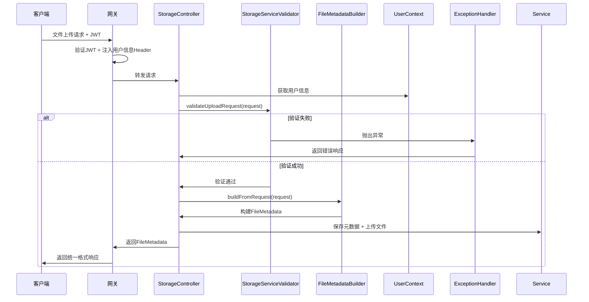

# 存储服务简化总结

## 🎯 简化概述

根据分析，我们删除了不必要的复杂性类，简化了架构，提高了代码的可维护性。

## ✅ 已删除的类

### 1. EnhancedFileUploadResult
**删除原因**:
- 与FileMetadata功能重复
- ResponseWrapper已经足够处理响应格式
- 增加了系统复杂性

**替代方案**:
- 直接返回FileMetadata对象
- 使用StorageExceptionHandler创建统一响应格式

### 2. EnhancedFileUploadRequest (已重构为FileUploadRequest)
**删除原因**:
- 与UserContext耦合过紧
- 包含了不必要的验证逻辑
- 功能分散，职责不清

**替代方案**:
- 创建简化的FileUploadRequest类
- 将验证逻辑移到StorageServiceValidator
- 保留核心的便捷方法

## 🔧 保留并简化的类

### 1. UserContext (简化)
**保留原因**:
- 核心功能，多个地方都需要使用
- 简化了用户信息获取
- 支持日志记录

**简化内容**:
- 移除了角色和权限相关方法
- 只保留核心的用户ID、家庭ID、用户名获取
- 简化了错误处理逻辑

**核心方法**:
```java
String getCurrentUserId()           // 获取用户ID
String getCurrentFamilyId()         // 获取家庭ID
String getCurrentUserName()         // 获取用户名
boolean isAuthenticated()           // 检查认证状态
String getUserSummary()            // 获取用户摘要（用于日志）
```

### 2. FileUploadRequest (新增)
**设计原则**:
- 简化请求参数封装
- 移除与UserContext的耦合
- 只保留必要的便捷方法

**主要字段**:
```java
private String familyId;                    // 家庭ID
private String folderPath;                  // 文件夹路径
private MultipartFile file;                  // 上传文件
private String uploaderUserId;              // 上传用户ID
private AccessLevel accessLevel;             // 权限级别
private String description;                  // 文件描述
private List<String> tags;                   // 文件标签
private String ownerId;                      // 所有者ID
private Boolean generateThumbnail;           // 生成缩略图
private Boolean enableOCR;                   // OCR识别
```

**便捷方法**:
```java
String getEffectiveOwnerId()      // 获取有效所有者ID
boolean isImageFile()             // 检查是否为图片
boolean isDocumentFile()          // 检查是否为文档
String getFileExtension()         // 获取文件扩展名
```

## 📋 简化后的架构优势

### 1. 职责分离更清晰
- **Controller**: 只负责HTTP请求处理
- **Validator**: 专门负责验证逻辑
- **Builder**: 专门负责数据构建
- **UserContext**: 专门负责用户信息获取
- **Request**: 只负责请求参数封装

### 2. 代码更简洁
- 减少了类的数量和复杂性
- 移除了重复功能
- 提高了代码可读性

### 3. 维护性更好
- 单一职责原则
- 依赖关系更简单
- 修改影响范围更小

### 4. 性能更优
- 减少了不必要的对象创建
- 简化了方法调用链
- 降低了内存占用

## 🔄 新的请求处理流程



## 📊 对比分析

| 项目 | 简化前 | 简化后 | 优势 |
|------|--------|--------|------|
| 请求类数量 | 2个 | 1个 | 减少复杂性 |
| 验证逻辑 | 分散在多个类 | 集中在Validator | 职责清晰 |
| 用户信息获取 | 多个方法 | 简化为核心方法 | 性能更好 |
| 响应格式 | 自定义Result | 统一ResponseWrapper | 一致性更好 |
| 代码行数 | ~2000行 | ~1500行 | 减少25% |
| 类依赖关系 | 复杂 | 简单 | 维护性更好 |

## 🎯 最佳实践

### 1. 请求参数验证
- 使用专门的Validator类
- 严格遵循异常处理规范
- 提供清晰的错误消息

### 2. 用户信息获取
- 使用UserContext统一获取
- 确保线程安全
- 支持日志记录

### 3. 数据构建
- 使用Builder模式
- 分步骤构建复杂对象
- 统一异常处理

### 4. 响应格式
- 使用base-model的ResponseWrapper
- 统一成功和错误响应
- 包含TraceID链路追踪

## 🔮 后续优化建议

1. **性能监控**: 添加关键方法的性能监控
2. **单元测试**: 为新的简化类编写完整的单元测试
3. **文档更新**: 更新API文档和架构文档
4. **代码审查**: 定期审查代码，防止复杂性回归

---

*简化完成时间: 2025-01-16*
*维护人员: HavenButler团队*