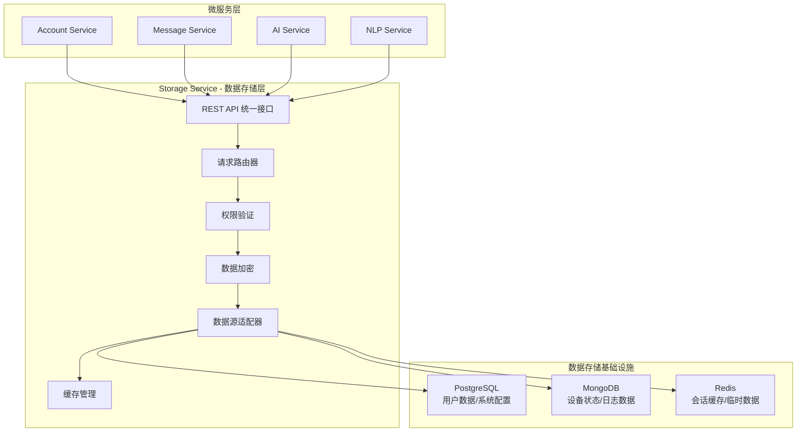
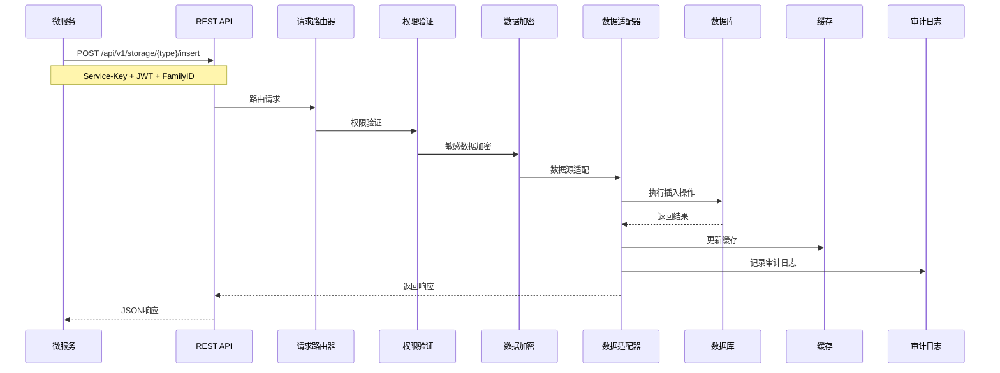
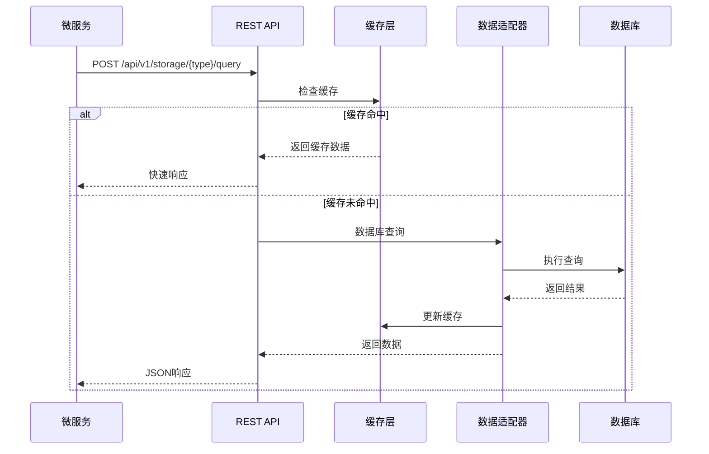
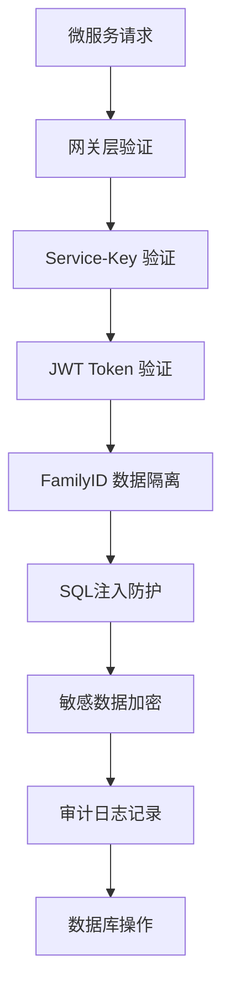

# 统一数据存储系统详解

## 📋 功能概述

统一数据存储系统是 Storage Service 的核心功能，为所有微服务提供统一的数据访问接口，支持 PostgreSQL、MongoDB、Redis 三种数据源的透明化操作。

## 🏗️ 系统架构

### 整体架构图



### 核心组件说明

#### 1. REST API 统一接口
- **职责**: 提供标准化的数据操作接口
- **支持操作**: INSERT、UPDATE、DELETE、QUERY
- **协议**: HTTP/JSON
- **认证**: Service-Key + JWT Token

#### 2. 请求路由器
- **职责**: 根据数据类型路由到对应的数据源
- **路由规则**: 基于 `storageType` 参数
- **负载均衡**: 支持读写分离和负载分发

#### 3. 数据源适配器
- **职责**: 将统一请求转换为具体数据源的操作
- **支持数据源**: PostgreSQL、MongoDB、Redis
- **事务支持**: 跨数据源分布式事务

## 🔧 技术实现

### 统一请求模型

```java
/**
 * 统一数据存储请求模型
 */
public class StorageRequest {
    private String storageType;    // postgresql/mongodb/redis
    private String operation;      // insert/update/delete/query
    private String table;          // 表名/集合名/Key前缀
    private Map<String, Object> data;      // 操作数据
    private Map<String, Object> filters;  // 查询条件
    private String familyId;       // 家庭ID（必需）
    private String userId;         // 用户ID
    private String traceId;        // 链路追踪ID
    private Map<String, Object> options;  // 扩展选项
}
```

### 统一响应模型

```java
/**
 * 统一数据存储响应模型
 */
public class StorageResponse {
    private boolean success;               // 操作是否成功
    private String message;               // 响应消息
    private Object data;                  // 返回数据
    private Integer totalCount;           // 总记录数（查询时）
    private String traceId;              // 链路追踪ID
    private Long executionTime;          // 执行耗时（毫秒）
    private Map<String, Object> metadata; // 元数据信息
}
```

### 数据源适配器实现

```java
/**
 * PostgreSQL 适配器
 */
@Component
public class PostgreSQLAdapter implements StorageAdapter {

    @Override
    public StorageResponse execute(StorageRequest request) {
        long startTime = System.currentTimeMillis();

        try {
            // 1. 参数验证
            validateRequest(request);

            // 2. 权限检查
            checkPermissions(request);

            // 3. 数据加密（敏感字段）
            encryptSensitiveData(request);

            // 4. 构建SQL语句
            String sql = buildSQL(request);

            // 5. 执行数据库操作
            Object result = executeSQL(sql, request);

            // 6. 记录审计日志
            auditLog(request, result);

            return StorageResponse.success(result, System.currentTimeMillis() - startTime);

        } catch (Exception e) {
            logError(request, e);
            return StorageResponse.error(e.getMessage());
        }
    }

    private void validateRequest(StorageRequest request) {
        // familyId 必需验证
        if (StringUtils.isEmpty(request.getFamilyId())) {
            throw new IllegalArgumentException("familyId 不能为空");
        }

        // SQL 注入防护
        if (containsSQLInjection(request)) {
            throw new SecurityException("检测到SQL注入攻击");
        }
    }
}
```

## 📊 数据流程图

### 数据写入流程



### 数据查询流程



## 🔐 安全机制

### 多层安全防护



### 权限控制实现

```java
/**
 * 基于 familyId 的数据隔离
 */
@Aspect
@Component
public class DataIsolationAspect {

    @Before("@annotation(DataIsolation)")
    public void enforceDataIsolation(JoinPoint point) {
        StorageRequest request = getStorageRequest(point);

        // 强制添加 familyId 过滤条件
        if (request.getFilters() == null) {
            request.setFilters(new HashMap<>());
        }
        request.getFilters().put("family_id", request.getFamilyId());

        // 记录数据访问日志
        auditDataAccess(request);
    }
}
```

## 🚀 使用指南

### 1. PostgreSQL 数据操作

#### 插入用户数据
```bash
curl -X POST http://storage-service:8081/api/v1/storage/postgresql/insert \
  -H "Service-Key: key_account_xxx" \
  -H "X-Family-ID: family123" \
  -H "Content-Type: application/json" \
  -d '{
    "table": "users",
    "data": {
      "username": "张三",
      "email": "zhangsan@example.com",
      "phone": "13800138000"
    }
  }'
```

#### 查询用户列表
```bash
curl -X POST http://storage-service:8081/api/v1/storage/postgresql/query \
  -H "Service-Key: key_account_xxx" \
  -H "X-Family-ID: family123" \
  -H "Content-Type: application/json" \
  -d '{
    "table": "users",
    "filters": {
      "status": "active"
    },
    "options": {
      "limit": 10,
      "offset": 0,
      "orderBy": "created_at DESC"
    }
  }'
```

### 2. MongoDB 文档操作

#### 插入设备状态
```bash
curl -X POST http://storage-service:8081/api/v1/storage/mongodb/insert \
  -H "Service-Key: key_device_xxx" \
  -H "X-Family-ID: family123" \
  -H "Content-Type: application/json" \
  -d '{
    "table": "device_states",
    "data": {
      "deviceId": "device_001",
      "status": "online",
      "temperature": 25.5,
      "humidity": 60,
      "timestamp": "2024-01-15T10:30:00Z"
    }
  }'
```

#### 查询设备历史
```bash
curl -X POST http://storage-service:8081/api/v1/storage/mongodb/query \
  -H "Service-Key: key_device_xxx" \
  -H "X-Family-ID: family123" \
  -H "Content-Type: application/json" \
  -d '{
    "table": "device_states",
    "filters": {
      "deviceId": "device_001",
      "timestamp": {
        "$gte": "2024-01-15T00:00:00Z"
      }
    },
    "options": {
      "sort": {"timestamp": -1},
      "limit": 100
    }
  }'
```

### 3. Redis 缓存操作

#### 设置会话缓存
```bash
curl -X POST http://storage-service:8081/api/v1/storage/redis/set \
  -H "Service-Key: key_account_xxx" \
  -H "X-Family-ID: family123" \
  -H "Content-Type: application/json" \
  -d '{
    "table": "sessions",
    "data": {
      "key": "session:user123",
      "value": {
        "userId": "user123",
        "username": "张三",
        "loginTime": "2024-01-15T10:30:00Z"
      },
      "ttl": 3600
    }
  }'
```

#### 获取缓存数据
```bash
curl -X POST http://storage-service:8081/api/v1/storage/redis/get \
  -H "Service-Key: key_account_xxx" \
  -H "X-Family-ID: family123" \
  -H "Content-Type: application/json" \
  -d '{
    "table": "sessions",
    "filters": {
      "key": "session:user123"
    }
  }'
```

## 📈 性能优化

### 1. 连接池配置

```yaml
# PostgreSQL 连接池
spring:
  datasource:
    hikari:
      maximum-pool-size: 20        # 最大连接数
      minimum-idle: 5              # 最小空闲连接
      connection-timeout: 30000    # 连接超时
      idle-timeout: 600000         # 空闲超时
      max-lifetime: 1800000        # 连接最大生命周期

# MongoDB 连接池
spring:
  data:
    mongodb:
      options:
        max-pool-size: 20
        min-pool-size: 5
        max-wait-time: 30000

# Redis 连接池
spring:
  redis:
    lettuce:
      pool:
        max-active: 8
        max-idle: 8
        min-idle: 0
```

### 2. 缓存策略

```java
/**
 * 多级缓存实现
 */
@Component
public class MultiLevelCache {

    private final Cache<String, Object> localCache;  // L1: 本地缓存
    private final RedisTemplate<String, Object> redisTemplate;  // L2: Redis缓存

    public Object get(String key, Supplier<Object> loader) {
        // L1 缓存检查
        Object value = localCache.getIfPresent(key);
        if (value != null) {
            return value;
        }

        // L2 缓存检查
        value = redisTemplate.opsForValue().get(key);
        if (value != null) {
            localCache.put(key, value);
            return value;
        }

        // 数据库加载
        value = loader.get();
        if (value != null) {
            redisTemplate.opsForValue().set(key, value, 10, TimeUnit.MINUTES);
            localCache.put(key, value);
        }

        return value;
    }
}
```

### 3. 批量操作

```java
/**
 * 批量插入优化
 */
@Service
public class BatchOperationService {

    public StorageResponse batchInsert(List<Map<String, Object>> dataList, String table) {
        // 分批处理，避免内存溢出
        int batchSize = 1000;
        List<List<Map<String, Object>>> batches = Lists.partition(dataList, batchSize);

        return batches.parallelStream()
            .map(batch -> processBatch(batch, table))
            .reduce(StorageResponse.empty(), StorageResponse::merge);
    }

    private StorageResponse processBatch(List<Map<String, Object>> batch, String table) {
        // 使用 jdbcTemplate.batchUpdate 批量插入
        String sql = buildBatchInsertSQL(table, batch.get(0).keySet());

        List<Object[]> batchArgs = batch.stream()
            .map(data -> data.values().toArray())
            .collect(Collectors.toList());

        int[] results = jdbcTemplate.batchUpdate(sql, batchArgs);
        return StorageResponse.success(results.length);
    }
}
```

## 🔍 监控和告警

### 关键指标监控

```java
/**
 * 存储服务性能监控
 */
@Component
public class StorageMetrics {

    private final MeterRegistry registry;

    // 请求计数和耗时
    @Timed("storage.request.time")
    @Counted("storage.request.count")
    public StorageResponse processRequest(StorageRequest request) {
        // 处理请求
    }

    // 数据库连接池监控
    @Scheduled(fixedRate = 60000)
    public void collectPoolMetrics() {
        registry.gauge("db.connections.active", getActiveConnections());
        registry.gauge("db.connections.idle", getIdleConnections());
        registry.gauge("db.connections.total", getTotalConnections());
    }

    // 缓存命中率监控
    @EventListener
    public void onCacheEvent(CacheEvent event) {
        if (event.getType() == CacheEvent.Type.HIT) {
            registry.counter("cache.hit").increment();
        } else if (event.getType() == CacheEvent.Type.MISS) {
            registry.counter("cache.miss").increment();
        }
    }
}
```

### 告警规则

- **响应时间告警**: 平均响应时间 > 2秒
- **错误率告警**: 5分钟内错误率 > 5%
- **连接池告警**: 活跃连接数 > 90%
- **缓存告警**: 缓存命中率 < 70%

## 🛠️ 故障排查

### 常见问题

#### 1. 连接超时
```bash
# 检查数据库连接状态
curl http://storage-service:8081/actuator/health

# 查看连接池状态
curl http://storage-service:8081/actuator/metrics/hikaricp.connections.active
```

#### 2. 查询性能问题
```bash
# 检查慢查询日志
curl http://storage-service:8081/api/v1/storage/health/slow-queries

# 查看缓存命中率
curl http://storage-service:8081/actuator/metrics/cache.gets
```

#### 3. 数据隔离问题
```bash
# 检查 familyId 是否正确传递
curl -H "X-Family-ID: family123" http://storage-service:8081/api/v1/storage/debug/family-check
```

## 📋 最佳实践

### 1. 性能优化建议
- 优先使用批量操作
- 合理设置缓存过期时间
- 使用连接池，避免频繁创建连接
- 定期分析慢查询并优化

### 2. 安全建议
- 所有请求必须包含 familyId
- 敏感数据入库前加密
- 定期轮换 Service-Key
- 监控异常访问模式

### 3. 开发建议
- 使用统一的错误处理机制
- 记录详细的审计日志
- 实现优雅的降级策略
- 编写全面的单元测试

---

**统一数据存储系统** - 为HavenButler平台提供安全、高效的数据访问服务 🗄️