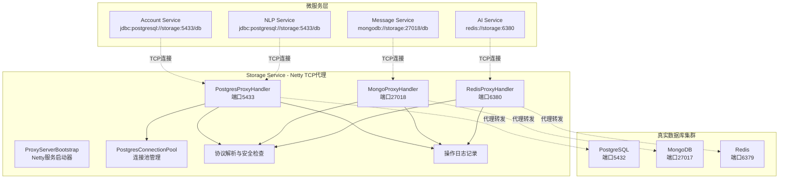
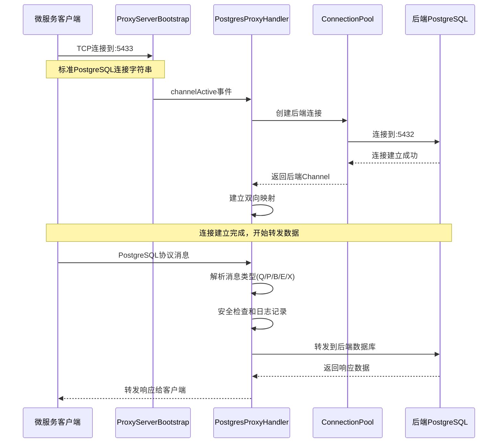
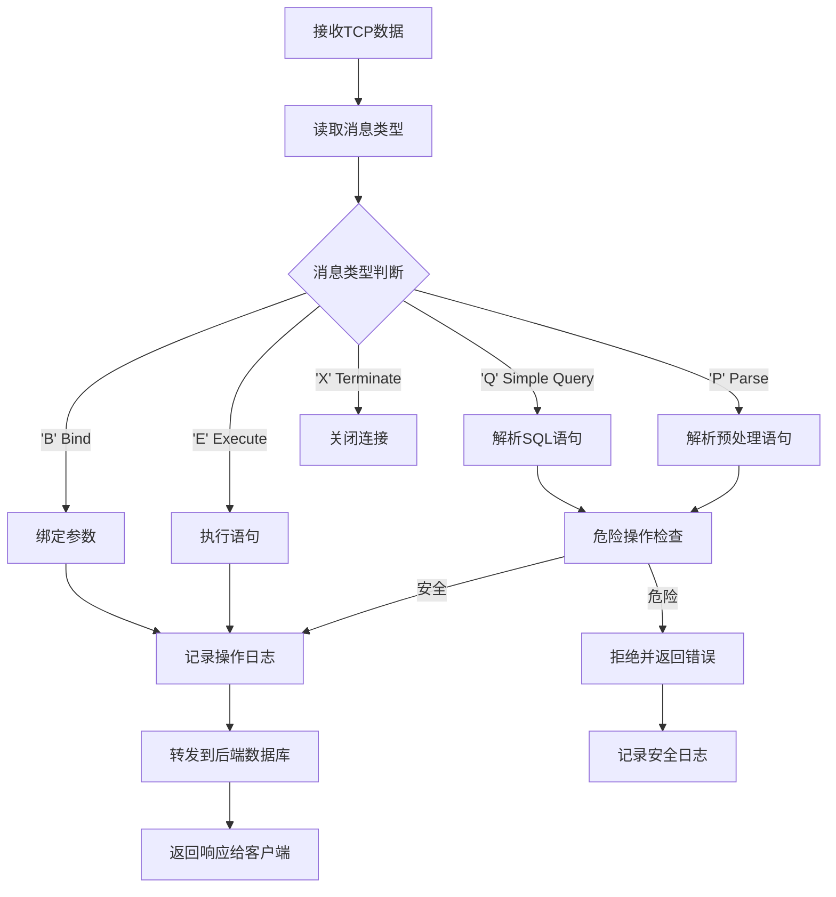
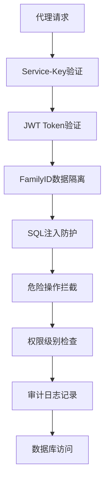
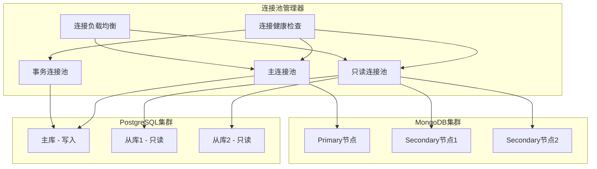

# 数据库访问代理系统详解

## 📋 功能概述

数据库访问代理系统是 Storage Service 基于 **Netty框架** 实现的 **TCP协议代理服务**，为微服务提供透明的数据库访问代理。支持 PostgreSQL、MongoDB、Redis 三种数据库的**原生协议代理**，实现连接池管理、安全控制、操作审计和性能优化。

### 🔗 代理模式说明
- **TCP协议代理**：微服务使用标准数据库连接字符串，连接到代理端口
- **协议透明**：完全兼容原生数据库协议，无需修改现有代码
- **端口映射**：PostgreSQL(5433)、MongoDB(27018)、Redis(6380)

## 🏗️ 代理架构设计

### TCP代理架构图



### 核心组件说明

#### 1. ProxyServerBootstrap（代理服务启动器）
- **实现方式**: Netty ServerBootstrap
- **职责**: 启动三个TCP代理服务器
- **端口管理**: 监听不同端口提供代理服务
- **线程模型**: Boss线程组 + Worker线程组

#### 2. PostgresProxyHandler（PostgreSQL代理处理器）
- **协议支持**: PostgreSQL Wire Protocol
- **功能特性**:
  - 协议消息解析（Query、Parse、Bind、Execute等）
  - SQL注入防护和危险操作拦截
  - 连接状态管理和事务上下文
  - 操作日志记录和安全审计

#### 3. PostgresConnectionPool（连接池管理器）
- **实现技术**: Netty Bootstrap + BlockingQueue
- **连接管理**: 预创建连接、动态扩展、连接回收
- **配置参数**: 最大连接数、最小空闲数、连接超时
- **健康监控**: 连接可用性检查、连接池状态统计

#### 4. 协议处理特性
- **透明代理**: 完全兼容原生数据库协议
- **双向转发**: 客户端↔代理↔后端数据库
- **状态维护**: 连接映射、事务状态、会话信息

## 🔧 TCP代理技术实现

### Netty代理服务器启动

```java
/**
 * 基于Netty的数据库代理服务启动器
 */
@Component
public class ProxyServerBootstrap {

    @Value("${proxy.postgresql.port:5433}")
    private int postgresPort;

    @Value("${proxy.mongodb.port:27018}")
    private int mongoPort;

    @Value("${proxy.redis.port:6380}")
    private int redisPort;

    // 启动PostgreSQL代理服务
    private void startPostgresProxy() {
        ServerBootstrap bootstrap = new ServerBootstrap();
        bootstrap.group(bossGroup, workerGroup)
            .channel(NioServerSocketChannel.class)
            .childHandler(new ChannelInitializer<SocketChannel>() {
                @Override
                protected void initChannel(SocketChannel ch) {
                    ch.pipeline().addLast("postgres-handler", postgresHandler);
                }
            });

        // 绑定端口启动服务
        ChannelFuture future = bootstrap.bind(postgresPort).sync();
        log.info("PostgreSQL代理服务启动成功，监听端口: {}", postgresPort);
    }
}
```

### PostgreSQL协议代理处理

```java
/**
 * PostgreSQL Wire Protocol 代理处理器
 */
@ChannelHandler.Sharable
public class PostgresProxyHandler extends ChannelInboundHandlerAdapter {

    // 存储客户端与后端连接的映射
    private final Map<ChannelId, Channel> clientToBackendChannelMap;

    @Override
    public void channelRead(ChannelHandlerContext ctx, Object msg) {
        ByteBuf data = (ByteBuf) msg;

        // 1. 解析PostgreSQL协议消息
        parseAndLogPostgresMessage(ctx, data.duplicate(), clientIP);

        // 2. 安全检查（SQL注入防护）
        if (isDangerousOperation(sqlContent)) {
            sendErrorResponse(ctx, "操作被代理拦截");
            return;
        }

        // 3. 转发到后端数据库
        Channel backendChannel = clientToBackendChannelMap.get(ctx.channel().id());
        backendChannel.writeAndFlush(data.retain());
    }
}
```

### 连接池管理实现

```java
/**
 * PostgreSQL连接池管理器
 */
@Component
public class PostgresConnectionPool {

    @Value("${proxy.postgresql.backend.host:localhost}")
    private String backendHost;

    @Value("${proxy.postgresql.backend.port:5432}")
    private int backendPort;

    // 连接池队列
    private BlockingQueue<Channel> availableConnections;
    private final AtomicInteger activeConnections = new AtomicInteger(0);

    /**
     * 获取可用连接
     */
    public Channel getConnection() throws InterruptedException {
        Channel channel = availableConnections.poll(5, TimeUnit.SECONDS);

        if (channel == null || !channel.isActive()) {
            // 创建新连接
            channel = createConnection();
            if (channel != null) {
                totalConnections.incrementAndGet();
            }
        }

        if (channel != null && channel.isActive()) {
            activeConnections.incrementAndGet();
            return channel;
        }

        throw new RuntimeException("无法获取PostgreSQL连接");
    }

    /**
     * 创建到后端PostgreSQL的连接
     */
    private Channel createConnection() {
        ChannelFuture future = bootstrap.connect(backendHost, backendPort);
        return future.sync().channel();
    }
}
```

### PostgreSQL协议消息解析

```java
/**
 * PostgreSQL协议消息解析和安全检查
 */
private void parseAndLogPostgresMessage(ChannelHandlerContext ctx, ByteBuf data, String clientIP) {
    try {
        data.markReaderIndex();
        byte messageType = data.readByte();
        int messageLength = data.readInt();
        data.resetReaderIndex();

        String operation = "UNKNOWN";
        String content = "";

        // PostgreSQL Wire Protocol 消息类型解析
        switch (messageType) {
            case 'Q': // Simple Query
                operation = "QUERY";
                if (data.readableBytes() >= messageLength + 1) {
                    data.skipBytes(5); // 跳过类型和长度
                    byte[] sqlBytes = new byte[messageLength - 5];
                    data.readBytes(sqlBytes);
                    content = new String(sqlBytes, StandardCharsets.UTF_8);
                    if (content.endsWith("\0")) {
                        content = content.substring(0, content.length() - 1);
                    }
                }
                break;
            case 'P': // Parse
                operation = "PARSE";
                break;
            case 'B': // Bind
                operation = "BIND";
                break;
            case 'E': // Execute
                operation = "EXECUTE";
                break;
            case 'X': // Terminate
                operation = "TERMINATE";
                break;
        }

        // 危险操作检查
        if (isDangerousOperation(content)) {
            log.warn("检测到危险操作，拒绝执行: {} - {}", clientIP, content);
            sendErrorResponse(ctx, "操作被代理拦截：" + content);
            return;
        }

        // 记录操作日志
        operationLogService.logOperation(/* 日志参数 */);

    } catch (Exception e) {
        log.warn("解析PostgreSQL消息失败: {}", e.getMessage());
    }
}

/**
 * 危险操作检查
 */
private boolean isDangerousOperation(String sql) {
    if (sql == null || sql.trim().isEmpty()) return false;

    String upperSQL = sql.trim().toUpperCase();
    String[] dangerousPatterns = {
        "DROP DATABASE", "DROP SCHEMA", "TRUNCATE TABLE",
        "DELETE FROM", "ALTER SYSTEM", "CREATE ROLE", "DROP ROLE"
    };

    for (String pattern : dangerousPatterns) {
        if (upperSQL.contains(pattern)) {
            return true;
        }
    }
    return false;
}
```

## 📊 TCP代理流程图

### PostgreSQL TCP代理连接建立流程



### PostgreSQL协议消息处理流程



## 🔐 代理安全机制

### 多层安全防护



### SQL安全防护实现

```java
/**
 * SQL安全解析器
 */
@Component
public class SQLSecurityParser {

    // 危险操作关键词
    private static final Set<String> DANGEROUS_KEYWORDS = Set.of(
        "DROP", "TRUNCATE", "ALTER", "CREATE", "DELETE",
        "EXEC", "EXECUTE", "UNION", "SCRIPT", "DECLARE"
    );

    // 允许的表前缀
    private static final Set<String> ALLOWED_TABLE_PREFIXES = Set.of(
        "user_", "device_", "message_", "log_", "file_"
    );

    public ParsedSQL parseAndValidate(String sql, String familyId) {
        // 1. SQL注入检测
        if (containsSQLInjection(sql)) {
            throw new SecurityException("检测到SQL注入攻击");
        }

        // 2. 危险操作检测
        if (containsDangerousOperation(sql)) {
            throw new SecurityException("不允许执行危险操作");
        }

        // 3. 表访问权限检查
        validateTableAccess(sql, familyId);

        // 4. 自动添加数据隔离条件
        return addDataIsolationCondition(sql, familyId);
    }

    private boolean containsSQLInjection(String sql) {
        // 检测常见SQL注入模式
        String normalized = sql.toUpperCase().replaceAll("\\s+", " ");

        return normalized.contains("'; DROP") ||
               normalized.contains("' OR '1'='1") ||
               normalized.contains("' UNION SELECT") ||
               normalized.contains("/*") ||
               normalized.contains("--");
    }

    private ParsedSQL addDataIsolationCondition(String sql, String familyId) {
        // 自动在WHERE子句中添加 family_id 条件
        if (sql.toUpperCase().contains("WHERE")) {
            sql = sql.replaceFirst("(?i)WHERE",
                "WHERE family_id = '" + familyId + "' AND");
        } else if (sql.toUpperCase().contains("FROM")) {
            sql = sql.replaceFirst("(?i)(FROM\\s+\\w+)",
                "$1 WHERE family_id = '" + familyId + "'");
        }

        return new ParsedSQL(sql, familyId);
    }
}
```

### 权限控制实现

```java
/**
 * 数据库权限控制服务
 */
@Service
public class DatabasePermissionService {

    // 服务权限映射
    private static final Map<String, Set<String>> SERVICE_PERMISSIONS = Map.of(
        "account-service", Set.of("users", "roles", "permissions"),
        "message-service", Set.of("messages", "conversations"),
        "device-service", Set.of("devices", "device_states", "device_logs"),
        "ai-service", Set.of("ai_models", "ai_sessions", "ai_results")
    );

    public void checkPermission(DatabaseProxyRequest request) {
        String serviceId = request.getServiceId();
        String targetTable = extractTableName(request.getSql());

        // 检查服务是否有访问该表的权限
        Set<String> allowedTables = SERVICE_PERMISSIONS.get(serviceId);
        if (allowedTables == null || !allowedTables.contains(targetTable)) {
            throw new SecurityException(
                String.format("服务 %s 无权访问表 %s", serviceId, targetTable));
        }

        // 检查操作权限
        checkOperationPermission(request);

        // 记录权限审计日志
        auditPermissionCheck(request, targetTable);
    }

    private void checkOperationPermission(DatabaseProxyRequest request) {
        String operation = request.getOperation().toUpperCase();
        String serviceId = request.getServiceId();

        // 某些服务只允许读操作
        if ("ai-service".equals(serviceId) && !"SELECT".equals(operation)) {
            throw new SecurityException("AI服务只允许执行查询操作");
        }

        // 管理员操作权限检查
        if (isAdminOperation(operation) && !isAdminService(serviceId)) {
            throw new SecurityException("非管理员服务不允许执行管理员操作");
        }
    }
}
```

## 🔗 连接池管理

### 智能连接池架构



### 连接池配置实现

```java
/**
 * 智能连接池管理器
 */
@Component
@ConfigurationProperties(prefix = "database.pool")
public class ConnectionPoolManager {

    private final Map<String, HikariDataSource> dataSources = new ConcurrentHashMap<>();
    private final Map<String, ConnectionPoolStats> poolStats = new ConcurrentHashMap<>();

    /**
     * 获取数据库连接
     */
    public Connection getConnection(DatabaseProxyRequest request) {
        String poolKey = buildPoolKey(request);
        HikariDataSource dataSource = getOrCreateDataSource(poolKey, request);

        try {
            Connection connection = dataSource.getConnection();
            recordConnectionMetrics(poolKey);
            return connection;

        } catch (SQLException e) {
            // 连接获取失败，尝试故障切换
            return tryFailover(request, e);
        }
    }

    private HikariDataSource createDataSource(String databaseType, String node) {
        HikariConfig config = new HikariConfig();

        // 基础连接配置
        config.setJdbcUrl(buildJdbcUrl(databaseType, node));
        config.setUsername(getUsername(databaseType));
        config.setPassword(getPassword(databaseType));

        // 连接池配置
        config.setMaximumPoolSize(20);          // 最大连接数
        config.setMinimumIdle(5);               // 最小空闲连接
        config.setConnectionTimeout(30000);     // 连接超时30秒
        config.setIdleTimeout(600000);          // 空闲超时10分钟
        config.setMaxLifetime(1800000);         // 连接最大生命周期30分钟

        // 健康检查配置
        config.setValidationTimeout(5000);      // 验证超时5秒
        config.setLeakDetectionThreshold(60000); // 连接泄露检测1分钟

        // 性能优化配置
        config.addDataSourceProperty("cachePrepStmts", "true");
        config.addDataSourceProperty("prepStmtCacheSize", "250");
        config.addDataSourceProperty("prepStmtCacheSqlLimit", "2048");

        return new HikariDataSource(config);
    }

    /**
     * 连接池健康检查
     */
    @Scheduled(fixedRate = 30000) // 每30秒检查一次
    public void healthCheck() {
        dataSources.forEach((poolKey, dataSource) -> {
            try {
                // 测试连接可用性
                try (Connection conn = dataSource.getConnection()) {
                    boolean isValid = conn.isValid(5);
                    updatePoolHealth(poolKey, isValid);
                }

                // 记录连接池状态
                recordPoolStats(poolKey, dataSource);

            } catch (SQLException e) {
                log.warn("连接池健康检查失败: poolKey={}, error={}", poolKey, e.getMessage());
                markPoolUnhealthy(poolKey);
            }
        });
    }

    private void recordPoolStats(String poolKey, HikariDataSource dataSource) {
        HikariPoolMXBean poolBean = dataSource.getHikariPoolMXBean();

        ConnectionPoolStats stats = ConnectionPoolStats.builder()
            .activeConnections(poolBean.getActiveConnections())
            .idleConnections(poolBean.getIdleConnections())
            .totalConnections(poolBean.getTotalConnections())
            .threadsAwaitingConnection(poolBean.getThreadsAwaitingConnection())
            .build();

        poolStats.put(poolKey, stats);

        // 发送监控指标
        sendMetrics(poolKey, stats);
    }
}
```

## 🚀 TCP代理使用指南

### 1. 微服务配置

#### Java微服务连接配置
```yaml
# application.yml - 使用代理的配置
spring:
  datasource:
    driver-class-name: org.postgresql.Driver
    # 连接到代理端口，而不是真实数据库端口
    url: jdbc:postgresql://storage-service:5433/smarthome
    username: ${POSTGRESQL_USER:postgres}
    password: ${POSTGRESQL_PASSWORD:password}
    hikari:
      maximum-pool-size: 10
      minimum-idle: 2
```

#### 对比：不使用代理的配置
```yaml
# 直连数据库的配置（不推荐）
spring:
  datasource:
    url: jdbc:postgresql://postgres:5432/smarthome  # 直连端口5432
```

### 2. 连接字符串对比

#### 使用代理（推荐）
```java
// 微服务通过代理连接
String proxyUrl = "jdbc:postgresql://storage-service:5433/smarthome";
```

#### 直连数据库
```java
// 直接连接数据库（绕过代理）
String directUrl = "jdbc:postgresql://postgres:5432/smarthome";
```

### 3. 代理服务端口配置

```yaml
# storage-service 代理端口配置
proxy:
  enabled: true
  postgresql:
    port: 5433          # 代理监听端口
    backend:
      host: postgres    # 后端真实数据库主机
      port: 5432        # 后端真实数据库端口
    pool:
      max-connections: 50
      min-idle: 5
      connection-timeout: 30000

  mongodb:
    port: 27018         # MongoDB代理端口
    backend:
      host: mongodb
      port: 27017

  redis:
    port: 6380          # Redis代理端口
    backend:
      host: redis
      port: 6379
```

### 4. 使用代理 vs 直连数据库

#### 🔄 使用代理的优势
- ✅ **统一管控**：集中的连接池管理和监控
- ✅ **安全防护**：SQL注入防护、危险操作拦截
- ✅ **操作审计**：完整的数据库操作日志记录
- ✅ **性能优化**：连接复用、读写分离、负载均衡
- ✅ **故障恢复**：自动故障检测和连接重建

#### ⚡ 直连数据库的场景
- **高性能要求**：延迟敏感的核心业务（如实时交易）
- **特殊协议需求**：需要使用代理不支持的高级PostgreSQL特性
- **临时调试**：开发调试阶段直连数据库进行问题排查

#### 📋 微服务连接方式选择建议

| 微服务 | 推荐方式 | 端口 | 原因 |
|--------|----------|------|------|
| account-service | 🔗 使用代理 | :5433 | 需要操作审计和安全防护 |
| message-service | 🔗 使用代理 | :5433 | 需要数据隔离和日志记录 |
| ai-service | ⚡ 可直连 | :5432 | 高频AI推理，性能敏感 |
| nlp-service | 🔗 使用代理 | :5433 | 标准CRUD操作 |
| file-manager-service | 🔗 使用代理 | :5433 | 需要文件访问权限控制 |

#### 🔧 动态切换示例
```yaml
# 开发环境：使用代理便于调试
spring:
  profiles: development
  datasource:
    url: jdbc:postgresql://storage-service:5433/smarthome

---
# 生产环境高性能服务：直连数据库
spring:
  profiles: production-high-performance
  datasource:
    url: jdbc:postgresql://postgres:5432/smarthome
```

### 2. MongoDB 代理访问

#### 查询设备状态
```bash
curl -X POST http://storage-service:8081/api/v1/proxy/mongodb \
  -H "Service-Key: key_device_xxx" \
  -H "X-Family-ID: family123" \
  -H "Content-Type: application/json" \
  -d '{
    "operation": "find",
    "targetDatabase": "smarthome",
    "sql": "db.device_states.find({\"deviceId\": \"device_001\", \"timestamp\": {\"$gte\": \"2024-01-15\"}})",
    "options": {
      "readOnly": true,
      "preferredNode": "secondary"
    }
  }'
```

#### 更新设备状态
```bash
curl -X POST http://storage-service:8081/api/v1/proxy/mongodb \
  -H "Service-Key: key_device_xxx" \
  -H "X-Family-ID: family123" \
  -H "Content-Type: application/json" \
  -d '{
    "operation": "updateOne",
    "targetDatabase": "smarthome",
    "sql": "db.device_states.updateOne({\"deviceId\": \"device_001\"}, {\"$set\": {\"status\": \"online\", \"lastUpdate\": \"2024-01-15T10:30:00Z\"}})",
    "options": {
      "enableTransaction": false
    }
  }'
```

### 3. Redis 代理访问

#### 设置缓存数据
```bash
curl -X POST http://storage-service:8081/api/v1/proxy/redis \
  -H "Service-Key: key_account_xxx" \
  -H "X-Family-ID: family123" \
  -H "Content-Type: application/json" \
  -d '{
    "operation": "set",
    "sql": "SET session:user123 \"{\\\"userId\\\": \\\"user123\\\", \\\"loginTime\\\": \\\"2024-01-15T10:30:00Z\\\"}\" EX 3600",
    "options": {
      "timeout": 5
    }
  }'
```

#### 获取缓存数据
```bash
curl -X POST http://storage-service:8081/api/v1/proxy/redis \
  -H "Service-Key: key_account_xxx" \
  -H "X-Family-ID: family123" \
  -H "Content-Type: application/json" \
  -d '{
    "operation": "get",
    "sql": "GET session:user123",
    "options": {
      "readOnly": true
    }
  }'
```

## 📈 代理性能优化

### 1. 查询优化策略

```java
/**
 * 查询优化器
 */
@Component
public class QueryOptimizerService {

    /**
     * SQL查询优化
     */
    public OptimizedQuery optimize(ParsedSQL parsedSQL, DatabaseProxyRequest request) {
        OptimizedQuery.Builder builder = OptimizedQuery.builder()
            .originalSQL(parsedSQL.getSql())
            .familyId(request.getFamilyId());

        // 1. 索引建议
        suggestIndexes(builder, parsedSQL);

        // 2. 查询重写
        rewriteQuery(builder, parsedSQL);

        // 3. 分页优化
        optimizePagination(builder, parsedSQL);

        // 4. 缓存策略
        determineCacheStrategy(builder, parsedSQL, request);

        return builder.build();
    }

    private void rewriteQuery(OptimizedQuery.Builder builder, ParsedSQL parsedSQL) {
        String sql = parsedSQL.getSql();

        // 避免 SELECT *
        if (sql.contains("SELECT *")) {
            sql = replaceSelectAll(sql);
        }

        // 添加 LIMIT 防止大结果集
        if (!sql.toUpperCase().contains("LIMIT") &&
            sql.toUpperCase().startsWith("SELECT")) {
            sql += " LIMIT 1000";
        }

        // 优化 ORDER BY
        sql = optimizeOrderBy(sql);

        builder.optimizedSQL(sql);
    }

    private void determineCacheStrategy(OptimizedQuery.Builder builder,
                                      ParsedSQL parsedSQL,
                                      DatabaseProxyRequest request) {
        String sql = parsedSQL.getSql().toUpperCase();

        // 只读查询且结果可预期的才缓存
        if (sql.startsWith("SELECT") &&
            !sql.contains("NOW()") &&
            !sql.contains("RANDOM()") &&
            request.getOptions().isUseCache()) {

            String cacheKey = generateCacheKey(parsedSQL, request.getFamilyId());
            int ttl = determineCacheTTL(sql);

            builder.cacheKey(cacheKey).cacheTTL(ttl);
        }
    }
}
```

### 2. 连接负载均衡

```java
/**
 * 连接负载均衡器
 */
@Component
public class ConnectionLoadBalancer {

    private final List<DatabaseNode> readNodes = new ArrayList<>();
    private final AtomicInteger currentIndex = new AtomicInteger(0);

    public DatabaseNode selectReadNode(DatabaseProxyRequest request) {
        // 过滤健康的只读节点
        List<DatabaseNode> healthyNodes = readNodes.stream()
            .filter(DatabaseNode::isHealthy)
            .collect(Collectors.toList());

        if (healthyNodes.isEmpty()) {
            throw new RuntimeException("没有可用的只读节点");
        }

        // 负载均衡策略选择
        return switch (getLoadBalanceStrategy()) {
            case ROUND_ROBIN -> roundRobinSelect(healthyNodes);
            case LEAST_CONNECTIONS -> leastConnectionsSelect(healthyNodes);
            case WEIGHTED_ROUND_ROBIN -> weightedRoundRobinSelect(healthyNodes);
            case RANDOM -> randomSelect(healthyNodes);
            default -> roundRobinSelect(healthyNodes);
        };
    }

    private DatabaseNode roundRobinSelect(List<DatabaseNode> nodes) {
        int index = currentIndex.getAndIncrement() % nodes.size();
        return nodes.get(index);
    }

    private DatabaseNode leastConnectionsSelect(List<DatabaseNode> nodes) {
        return nodes.stream()
            .min(Comparator.comparing(DatabaseNode::getActiveConnections))
            .orElse(nodes.get(0));
    }

    private DatabaseNode weightedRoundRobinSelect(List<DatabaseNode> nodes) {
        int totalWeight = nodes.stream()
            .mapToInt(DatabaseNode::getWeight)
            .sum();

        int randomWeight = ThreadLocalRandom.current().nextInt(totalWeight);
        int currentWeight = 0;

        for (DatabaseNode node : nodes) {
            currentWeight += node.getWeight();
            if (randomWeight < currentWeight) {
                return node;
            }
        }

        return nodes.get(0);
    }
}
```

## 🔍 代理监控和告警

### 关键性能指标

```java
/**
 * 数据库代理监控指标
 */
@Component
public class DatabaseProxyMetrics {

    private final MeterRegistry registry;

    // 请求计数和耗时
    @Timed("proxy.request.time")
    @Counted("proxy.request.count")
    public DatabaseProxyResponse processProxyRequest(DatabaseProxyRequest request) {
        return doProcessRequest(request);
    }

    // 连接池监控
    @Scheduled(fixedRate = 30000)
    public void collectConnectionPoolMetrics() {
        connectionPools.forEach((name, pool) -> {
            registry.gauge("proxy.pool.active", Tags.of("pool", name),
                          pool.getActiveConnections());
            registry.gauge("proxy.pool.idle", Tags.of("pool", name),
                          pool.getIdleConnections());
            registry.gauge("proxy.pool.total", Tags.of("pool", name),
                          pool.getTotalConnections());
        });
    }

    // 查询性能监控
    @EventListener
    public void onQueryExecuted(QueryExecutedEvent event) {
        registry.timer("proxy.query.execution.time",
                      Tags.of("database", event.getDatabaseType(),
                             "operation", event.getOperation()))
                .record(event.getExecutionTime(), TimeUnit.MILLISECONDS);

        // 慢查询告警
        if (event.getExecutionTime() > 2000) {
            alertSlowQuery(event);
        }
    }

    // 故障切换监控
    @EventListener
    public void onFailover(FailoverEvent event) {
        registry.counter("proxy.failover.count",
                        Tags.of("from", event.getFromNode(),
                               "to", event.getToNode()))
                .increment();

        log.warn("数据库故障切换: {} -> {}, 原因: {}",
                event.getFromNode(), event.getToNode(), event.getReason());
    }
}
```

### 告警规则配置

```yaml
# 代理监控告警规则
proxy:
  alerts:
    # 响应时间告警
    response_time:
      threshold: 2000ms      # 超过2秒告警
      duration: 1m           # 持续1分钟
      severity: warning

    # 连接池告警
    connection_pool:
      active_threshold: 90%   # 活跃连接超过90%
      wait_threshold: 10      # 等待连接数超过10
      severity: critical

    # 错误率告警
    error_rate:
      threshold: 5%          # 错误率超过5%
      duration: 5m           # 持续5分钟
      severity: critical

    # 故障切换告警
    failover:
      frequency: 3           # 5分钟内故障切换超过3次
      duration: 5m
      severity: critical
```

## 🛠️ 代理故障排查

### 常见代理问题

#### 1. 连接超时问题
```bash
# 检查连接池状态
curl http://storage-service:8081/actuator/metrics/proxy.pool.active

# 检查数据库连接健康状态
curl http://storage-service:8081/api/v1/proxy/health/connections

# 查看连接等待情况
curl http://storage-service:8081/actuator/metrics/proxy.pool.pending
```

#### 2. 查询性能问题
```bash
# 查看慢查询统计
curl http://storage-service:8081/api/v1/proxy/metrics/slow-queries

# 检查缓存命中率
curl http://storage-service:8081/actuator/metrics/proxy.cache.hit.ratio

# 分析查询执行计划
curl -X POST http://storage-service:8081/api/v1/proxy/debug/explain \
  -d '{"sql": "SELECT * FROM users WHERE family_id = ?"}'
```

#### 3. 权限访问问题
```bash
# 检查服务权限配置
curl http://storage-service:8081/api/v1/proxy/debug/permissions/{serviceId}

# 验证 familyId 数据隔离
curl -H "X-Family-ID: family123" \
     http://storage-service:8081/api/v1/proxy/debug/isolation-check
```

### 代理故障自动恢复

```java
/**
 * 代理故障自动恢复机制
 */
@Component
public class ProxyFailureRecovery {

    @EventListener
    public void onDatabaseConnectionFailure(ConnectionFailureEvent event) {
        String failedNode = event.getNodeId();

        // 1. 标记节点为不健康
        markNodeUnhealthy(failedNode);

        // 2. 触发故障切换
        triggerFailover(failedNode);

        // 3. 启动自动恢复检查
        scheduleRecoveryCheck(failedNode);
    }

    @Scheduled(fixedRate = 60000) // 每分钟检查一次
    public void checkNodeRecovery() {
        List<DatabaseNode> unhealthyNodes = getUnhealthyNodes();

        for (DatabaseNode node : unhealthyNodes) {
            if (testNodeConnection(node)) {
                // 节点恢复，重新加入负载均衡
                markNodeHealthy(node.getId());
                log.info("数据库节点已恢复: {}", node.getId());
            }
        }
    }

    private void triggerFailover(String failedNode) {
        // 将该节点的连接转移到其他健康节点
        List<Connection> activeConnections = getActiveConnections(failedNode);

        for (Connection conn : activeConnections) {
            try {
                // 优雅关闭连接
                conn.close();
            } catch (SQLException e) {
                log.warn("关闭失效连接失败: {}", e.getMessage());
            }
        }

        // 通知连接池管理器更新路由规则
        connectionPoolManager.updateRoutingRules(failedNode, false);
    }
}
```

## 📋 代理最佳实践

### 1. 性能优化建议
- **连接池配置**: 根据业务负载合理配置连接池大小
- **读写分离**: 查询操作优先路由到只读节点
- **查询缓存**: 对频繁查询的结果进行缓存
- **批量操作**: 使用批量操作减少网络往返

### 2. 安全防护建议
- **SQL注入防护**: 严格验证所有SQL语句
- **权限最小化**: 每个服务只授予必需的数据库权限
- **数据隔离**: 强制执行基于familyId的数据隔离
- **审计日志**: 记录所有数据库访问操作

### 3. 高可用建议
- **多节点部署**: 配置主从复制和故障切换
- **健康检查**: 定期检查数据库节点健康状态
- **自动恢复**: 实现故障节点的自动检测和恢复
- **负载均衡**: 使用智能负载均衡分发请求

### 4. 开发建议
- **统一接口**: 使用标准化的代理API接口
- **错误处理**: 实现完善的错误处理和重试机制
- **监控告警**: 建立完整的监控和告警体系
- **文档维护**: 保持代理配置和使用文档的更新

---

**数据库访问代理系统** - 为HavenButler平台提供安全、高效的数据库代理服务 🔗