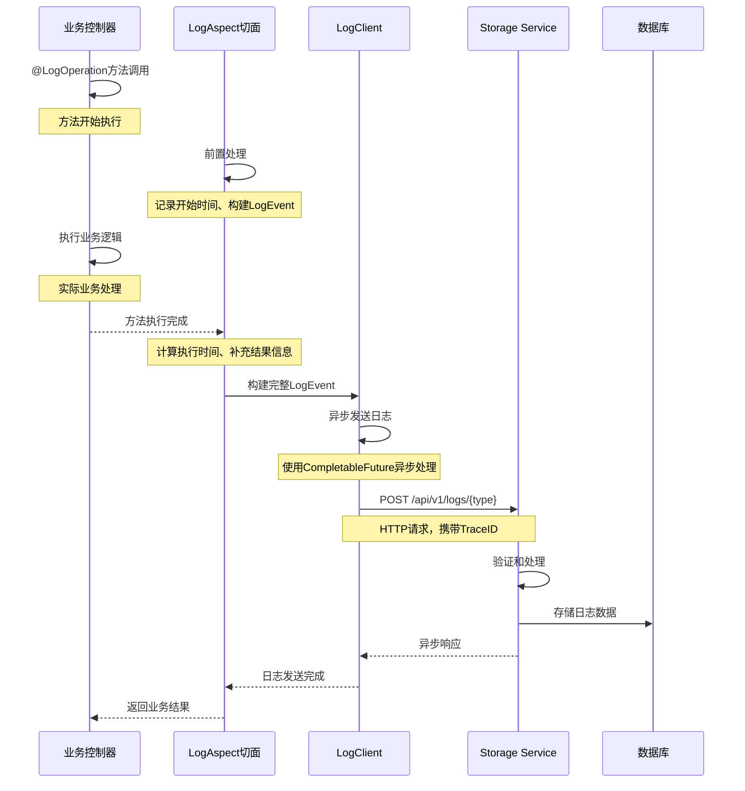
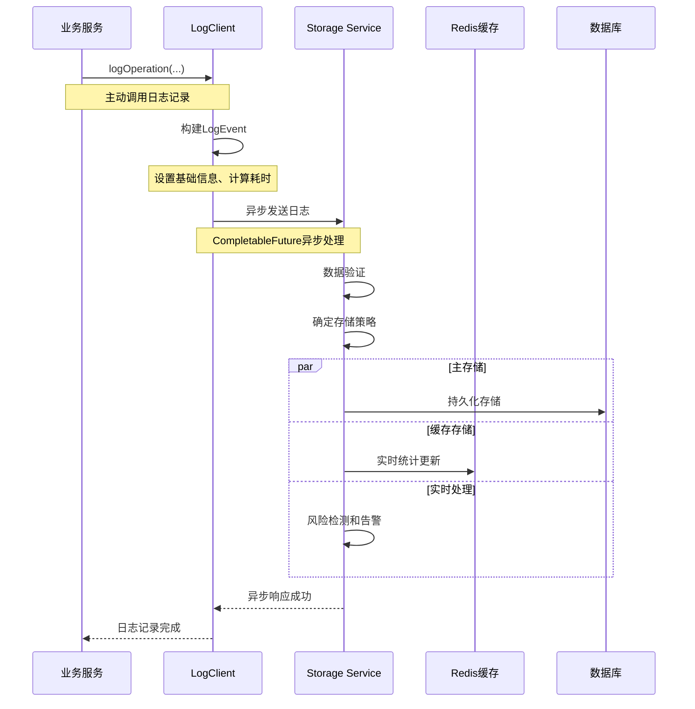
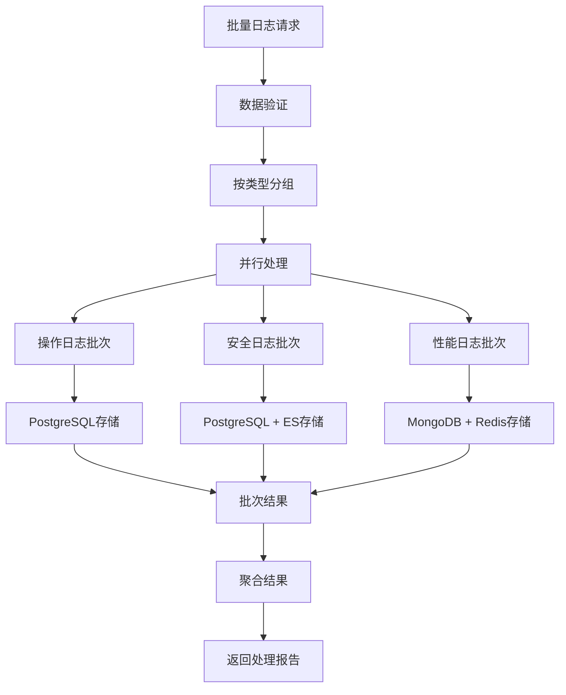

# 统一日志系统详解

## 📋 功能概述

统一日志系统是 Storage Service 基于 base-model 模块的核心功能，为整个 HavenButler 平台提供统一的日志收集、存储、分析和监控服务。支持操作、安全、性能、业务、错误五种日志类型的全链路追踪。

## 🏗️ 日志系统架构

### 整体日志架构图

```mermaid
graph TB
    subgraph "微服务层"
        A[Account Service]
        B[Message Service]
        C[AI Service]
        D[NLP Service]
        E[File Manager Service]
    end

    subgraph "Base-Model 日志模块"
        F[@LogOperation 注解]
        G[LogClient 客户端]
        H[LogEvent 事件模型]
        I[LogAspect 切面]
        J[异步处理器]
    end

    subgraph "Storage Service - 日志系统"
        K[日志接收API]
        L[日志类型路由]
        M[数据验证器]
        N[批量处理器]
        O[存储适配器]
        P[实时监控]
    end

    subgraph "日志存储层"
        Q[PostgreSQL<br/>结构化日志]
        R[MongoDB<br/>非结构化日志]
        S[Elasticsearch<br/>日志检索]
        T[Redis<br/>实时统计]
    end

    A --> F
    A --> G
    B --> F
    B --> G
    C --> F
    C --> G
    D --> F
    D --> G
    E --> F
    E --> G

    F --> I
    G --> H
    I --> J
    H --> J

    J --> K
    K --> L
    L --> M
    M --> N
    N --> O

    O --> Q
    O --> R
    O --> S
    O --> T

    P --> T
```

### 日志系统核心组件

#### 1. Base-Model 日志模块
- **@LogOperation 注解**: 声明式日志记录
- **LogClient**: 编程式日志客户端
- **LogEvent**: 统一日志事件模型
- **LogAspect**: AOP 切面处理器

#### 2. Storage Service 日志接收层
- **日志接收API**: 统一的HTTP接口
- **类型路由器**: 根据日志类型分发
- **数据验证器**: 日志数据格式验证
- **批量处理器**: 高性能批量处理

#### 3. 日志存储适配层
- **PostgreSQL**: 关键业务日志结构化存储
- **MongoDB**: 大量设备日志非结构化存储
- **Elasticsearch**: 全文检索和日志分析
- **Redis**: 实时统计和缓存

## 🔧 日志技术实现

### 统一日志事件模型

```java
/**
 * 统一日志事件模型 - Base-Model
 */
public class LogEvent {
    private String traceId;              // 链路追踪ID
    private String familyId;             // 家庭ID
    private String userId;               // 用户ID
    private String serviceId;            // 服务ID
    private LogType logType;             // 日志类型
    private String operationType;        // 操作类型
    private String description;          // 操作描述
    private Long timestamp;              // 时间戳
    private Long executionTime;          // 执行耗时
    private RiskLevel riskLevel;         // 风险等级
    private String clientIp;            // 客户端IP
    private String userAgent;           // 用户代理
    private Map<String, Object> extraData; // 扩展数据
    private String errorMessage;        // 错误信息
    private String stackTrace;          // 堆栈信息

    /**
     * 日志类型枚举
     */
    public enum LogType {
        OPERATION("操作日志"),    // 用户操作记录
        SECURITY("安全日志"),     // 安全事件记录
        PERFORMANCE("性能日志"),  // 性能监控记录
        BUSINESS("业务日志"),     // 业务流程记录
        ERROR("错误日志");        // 异常错误记录

        private final String description;
    }

    /**
     * 风险等级枚举
     */
    public enum RiskLevel {
        LOW("低风险"),
        MEDIUM("中风险"),
        HIGH("高风险"),
        CRITICAL("严重风险");

        private final String description;
    }
}
```

### 日志接收API实现

```java
/**
 * 统一日志接收控制器 - Storage Service
 */
@RestController
@RequestMapping("/api/v1/logs")
@Slf4j
public class LogReceiveController {

    private final LogEventService logEventService;
    private final LogValidator logValidator;
    private final LogMetricsCollector metricsCollector;

    /**
     * 统一日志接收入口
     */
    @PostMapping("/unified")
    public CompletableFuture<ApiResponse<String>> receiveLog(
            @RequestBody LogEvent logEvent,
            @RequestHeader("X-Family-ID") String familyId,
            @RequestHeader("X-Trace-ID") String traceId) {

        return CompletableFuture.supplyAsync(() -> {
            try {
                // 1. 基础验证
                logValidator.validate(logEvent, familyId, traceId);

                // 2. 补充系统信息
                enrichLogEvent(logEvent, familyId, traceId);

                // 3. 异步处理日志
                logEventService.processLogAsync(logEvent);

                // 4. 更新实时指标
                metricsCollector.updateMetrics(logEvent);

                return ApiResponse.success("日志接收成功");

            } catch (Exception e) {
                log.error("日志接收失败: traceId={}, error={}", traceId, e.getMessage(), e);
                return ApiResponse.error("日志接收失败: " + e.getMessage());
            }
        });
    }

    /**
     * 按类型接收日志
     */
    @PostMapping("/{logType}")
    public CompletableFuture<ApiResponse<String>> receiveLogByType(
            @PathVariable LogEvent.LogType logType,
            @RequestBody LogEvent logEvent,
            @RequestHeader("X-Family-ID") String familyId,
            @RequestHeader("X-Trace-ID") String traceId) {

        logEvent.setLogType(logType);
        return receiveLog(logEvent, familyId, traceId);
    }

    /**
     * 批量日志接收
     */
    @PostMapping("/{logType}/batch")
    public CompletableFuture<ApiResponse<BatchResult>> receiveBatchLogs(
            @PathVariable LogEvent.LogType logType,
            @RequestBody List<LogEvent> logEvents,
            @RequestHeader("X-Family-ID") String familyId,
            @RequestHeader("X-Trace-ID") String traceId) {

        return CompletableFuture.supplyAsync(() -> {
            try {
                // 设置日志类型
                logEvents.forEach(event -> event.setLogType(logType));

                // 批量验证
                List<LogEvent> validEvents = logValidator.validateBatch(logEvents, familyId);

                // 批量处理
                BatchResult result = logEventService.processBatchAsync(validEvents);

                return ApiResponse.success(result);

            } catch (Exception e) {
                log.error("批量日志接收失败: traceId={}, count={}, error={}",
                         traceId, logEvents.size(), e.getMessage(), e);
                return ApiResponse.error("批量日志接收失败: " + e.getMessage());
            }
        });
    }

    private void enrichLogEvent(LogEvent logEvent, String familyId, String traceId) {
        if (StringUtils.isEmpty(logEvent.getFamilyId())) {
            logEvent.setFamilyId(familyId);
        }
        if (StringUtils.isEmpty(logEvent.getTraceId())) {
            logEvent.setTraceId(traceId);
        }
        if (logEvent.getTimestamp() == null) {
            logEvent.setTimestamp(System.currentTimeMillis());
        }
    }
}
```

### 日志处理服务实现

```java
/**
 * 日志事件处理服务
 */
@Service
@Slf4j
public class LogEventService {

    private final LogStorageRouter storageRouter;
    private final LogRealTimeProcessor realTimeProcessor;
    private final LogAlertManager alertManager;

    /**
     * 异步处理单个日志事件
     */
    @Async("logProcessorExecutor")
    public CompletableFuture<Void> processLogAsync(LogEvent logEvent) {
        return CompletableFuture.runAsync(() -> {
            try {
                // 1. 确定存储策略
                StorageStrategy strategy = determineStorageStrategy(logEvent);

                // 2. 路由到对应存储
                storageRouter.route(logEvent, strategy);

                // 3. 实时处理（告警、统计）
                realTimeProcessor.process(logEvent);

                // 4. 风险检测和告警
                if (isHighRisk(logEvent)) {
                    alertManager.sendAlert(logEvent);
                }

            } catch (Exception e) {
                log.error("日志处理失败: traceId={}, error={}",
                         logEvent.getTraceId(), e.getMessage(), e);

                // 记录处理失败的日志到死信队列
                sendToDeadLetterQueue(logEvent, e);
            }
        });
    }

    /**
     * 批量异步处理日志事件
     */
    @Async("logBatchProcessorExecutor")
    public CompletableFuture<BatchResult> processBatchAsync(List<LogEvent> logEvents) {
        return CompletableFuture.supplyAsync(() -> {
            BatchResult result = new BatchResult();

            // 按日志类型分组
            Map<LogEvent.LogType, List<LogEvent>> groupedLogs =
                logEvents.stream().collect(Collectors.groupingBy(LogEvent::getLogType));

            // 并行处理每种类型
            groupedLogs.entrySet().parallelStream()
                .forEach(entry -> {
                    try {
                        int processed = processBatchByType(entry.getKey(), entry.getValue());
                        result.addSuccess(entry.getKey(), processed);
                    } catch (Exception e) {
                        result.addFailure(entry.getKey(), entry.getValue().size(), e);
                    }
                });

            return result;
        });
    }

    private StorageStrategy determineStorageStrategy(LogEvent logEvent) {
        return switch (logEvent.getLogType()) {
            case OPERATION -> StorageStrategy.builder()
                .primaryStorage(StorageType.POSTGRESQL)
                .secondaryStorage(StorageType.ELASTICSEARCH)
                .enableRealTime(true)
                .build();

            case SECURITY -> StorageStrategy.builder()
                .primaryStorage(StorageType.POSTGRESQL)
                .secondaryStorage(StorageType.ELASTICSEARCH)
                .enableRealTime(true)
                .enableAlert(true)
                .build();

            case PERFORMANCE -> StorageStrategy.builder()
                .primaryStorage(StorageType.MONGODB)
                .secondaryStorage(StorageType.REDIS)
                .enableRealTime(true)
                .enableMetrics(true)
                .build();

            case BUSINESS -> StorageStrategy.builder()
                .primaryStorage(StorageType.POSTGRESQL)
                .secondaryStorage(StorageType.MONGODB)
                .enableRealTime(false)
                .build();

            case ERROR -> StorageStrategy.builder()
                .primaryStorage(StorageType.POSTGRESQL)
                .secondaryStorage(StorageType.ELASTICSEARCH)
                .enableRealTime(true)
                .enableAlert(true)
                .build();
        };
    }

    private boolean isHighRisk(LogEvent logEvent) {
        return logEvent.getRiskLevel() == LogEvent.RiskLevel.HIGH ||
               logEvent.getRiskLevel() == LogEvent.RiskLevel.CRITICAL ||
               isSecuritySensitiveOperation(logEvent);
    }

    private boolean isSecuritySensitiveOperation(LogEvent logEvent) {
        Set<String> sensitiveOps = Set.of(
            "USER_LOGIN", "PASSWORD_CHANGE", "PERMISSION_CHANGE",
            "DEVICE_CONTROL", "DATA_EXPORT", "ADMIN_ACCESS"
        );
        return sensitiveOps.contains(logEvent.getOperationType());
    }
}
```

## 📊 日志流程图

### 注解式日志流程



### 编程式日志流程



### 批量日志处理流程



## 🔐 日志安全机制

### 敏感数据保护

```java
/**
 * 敏感数据脱敏处理器
 */
@Component
public class SensitiveDataMasker {

    // 敏感字段配置
    private static final Map<String, MaskingRule> MASKING_RULES = Map.of(
        "password", MaskingRule.FULL_MASK,
        "phone", MaskingRule.MIDDLE_MASK,
        "email", MaskingRule.MIDDLE_MASK,
        "idCard", MaskingRule.MIDDLE_MASK,
        "bankCard", MaskingRule.PARTIAL_MASK,
        "address", MaskingRule.PARTIAL_MASK
    );

    /**
     * 脱敏处理日志数据
     */
    public LogEvent maskSensitiveData(LogEvent logEvent) {
        // 脱敏操作描述
        if (logEvent.getDescription() != null) {
            logEvent.setDescription(maskString(logEvent.getDescription()));
        }

        // 脱敏扩展数据
        if (logEvent.getExtraData() != null) {
            Map<String, Object> maskedData = new HashMap<>();
            logEvent.getExtraData().forEach((key, value) -> {
                if (MASKING_RULES.containsKey(key.toLowerCase())) {
                    maskedData.put(key, maskValue(value, MASKING_RULES.get(key.toLowerCase())));
                } else {
                    maskedData.put(key, value);
                }
            });
            logEvent.setExtraData(maskedData);
        }

        return logEvent;
    }

    private String maskValue(Object value, MaskingRule rule) {
        if (value == null) return null;
        String str = value.toString();

        return switch (rule) {
            case FULL_MASK -> "*".repeat(str.length());
            case MIDDLE_MASK -> maskMiddle(str);
            case PARTIAL_MASK -> maskPartial(str);
            default -> str;
        };
    }

    private String maskMiddle(String str) {
        if (str.length() <= 6) return str.charAt(0) + "*".repeat(str.length() - 2) + str.charAt(str.length() - 1);

        int prefixLen = 3;
        int suffixLen = 3;
        return str.substring(0, prefixLen) + "*".repeat(str.length() - prefixLen - suffixLen) + str.substring(str.length() - suffixLen);
    }

    private String maskPartial(String str) {
        if (str.length() <= 4) return "*".repeat(str.length());
        return str.substring(0, 2) + "*".repeat(str.length() - 4) + str.substring(str.length() - 2);
    }

    enum MaskingRule {
        FULL_MASK, MIDDLE_MASK, PARTIAL_MASK, NO_MASK
    }
}
```

### 日志访问权限控制

```java
/**
 * 日志访问权限控制
 */
@Component
public class LogAccessController {

    /**
     * 检查日志查询权限
     */
    public boolean checkQueryPermission(String serviceId, String familyId, LogQueryRequest request) {
        // 1. 服务权限检查
        if (!hasServicePermission(serviceId, request.getLogType())) {
            return false;
        }

        // 2. 家庭数据隔离检查
        if (!familyId.equals(request.getFamilyId())) {
            return false;
        }

        // 3. 时间范围限制检查
        if (!isValidTimeRange(request.getStartTime(), request.getEndTime())) {
            return false;
        }

        // 4. 敏感日志访问检查
        if (isSensitiveLog(request.getLogType()) && !hasAdminPermission(serviceId)) {
            return false;
        }

        return true;
    }

    private boolean hasServicePermission(String serviceId, LogEvent.LogType logType) {
        Map<String, Set<LogEvent.LogType>> permissions = Map.of(
            "account-service", Set.of(LogEvent.LogType.OPERATION, LogEvent.LogType.SECURITY),
            "message-service", Set.of(LogEvent.LogType.OPERATION, LogEvent.LogType.BUSINESS),
            "ai-service", Set.of(LogEvent.LogType.PERFORMANCE, LogEvent.LogType.BUSINESS),
            "admin-service", Set.of(LogEvent.LogType.values()) // 管理服务可访问所有日志
        );

        return permissions.getOrDefault(serviceId, Set.of()).contains(logType);
    }

    private boolean isSensitiveLog(LogEvent.LogType logType) {
        return logType == LogEvent.LogType.SECURITY || logType == LogEvent.LogType.ERROR;
    }
}
```

## 🚀 日志使用指南

### 1. 注解式日志使用

#### 基础操作日志
```java
@RestController
public class UserController {

    @LogOperation(
        operationType = "USER_LOGIN",
        description = "用户登录操作",
        recordExecutionTime = true
    )
    @PostMapping("/login")
    public LoginResult login(@RequestBody LoginRequest request) {
        // 业务逻辑自动记录操作日志
        return userService.login(request);
    }

    @LogOperation(
        operationType = "USER_PROFILE_UPDATE",
        description = "更新用户资料",
        logType = LogEvent.LogType.BUSINESS,
        riskLevel = LogEvent.RiskLevel.LOW
    )
    @PutMapping("/profile")
    public void updateProfile(@RequestBody UpdateProfileRequest request) {
        userService.updateProfile(request);
    }
}
```

#### 安全敏感操作日志
```java
@RestController
public class SecurityController {

    @LogOperation(
        operationType = "PASSWORD_CHANGE",
        description = "用户修改密码",
        logType = LogEvent.LogType.SECURITY,
        riskLevel = LogEvent.RiskLevel.MEDIUM,
        recordExecutionTime = true
    )
    @PostMapping("/change-password")
    public void changePassword(@RequestBody ChangePasswordRequest request) {
        securityService.changePassword(request);
    }

    @LogOperation(
        operationType = "ADMIN_ACCESS",
        description = "管理员权限访问",
        logType = LogEvent.LogType.SECURITY,
        riskLevel = LogEvent.RiskLevel.HIGH
    )
    @GetMapping("/admin/users")
    @PreAuthorize("hasRole('ADMIN')")
    public List<User> getUsers() {
        return userService.getAllUsers();
    }
}
```

### 2. 编程式日志使用

#### 性能监控日志
```java
@Service
public class DeviceService {

    @Autowired
    private LogClient logClient;

    public void controlDevice(String familyId, String userId, String deviceId, String action) {
        long startTime = System.currentTimeMillis();
        String traceId = TraceIdGenerator.generate();

        try {
            // 业务逻辑
            deviceManager.sendCommand(deviceId, action);

            // 记录成功的性能日志
            logClient.logPerformance(
                familyId, userId, "DEVICE_CONTROL",
                "设备控制: " + deviceId + " -> " + action,
                startTime,
                Map.of(
                    "deviceId", deviceId,
                    "action", action,
                    "result", "success"
                )
            );

        } catch (Exception e) {
            // 记录错误日志
            logClient.logError(
                familyId, userId, "DEVICE_CONTROL",
                "设备控制失败: " + e.getMessage(),
                e,
                Map.of(
                    "deviceId", deviceId,
                    "action", action,
                    "errorType", e.getClass().getSimpleName()
                )
            );
            throw e;
        }
    }
}
```

#### 业务流程日志
```java
@Service
public class OrderService {

    @Autowired
    private LogClient logClient;

    @Transactional
    public Order createOrder(CreateOrderRequest request) {
        String familyId = request.getFamilyId();
        String userId = request.getUserId();

        // 记录订单创建开始
        logClient.logBusiness(familyId, userId, "ORDER_CREATE_START",
            "开始创建订单", Map.of("productCount", request.getItems().size()));

        try {
            // 创建订单
            Order order = new Order();
            // ... 业务逻辑

            // 记录订单创建成功
            logClient.logBusiness(familyId, userId, "ORDER_CREATE_SUCCESS",
                "订单创建成功", Map.of(
                    "orderId", order.getId(),
                    "totalAmount", order.getTotalAmount(),
                    "itemCount", order.getItems().size()
                ));

            return order;

        } catch (Exception e) {
            // 记录订单创建失败
            logClient.logError(familyId, userId, "ORDER_CREATE_FAILED",
                "订单创建失败: " + e.getMessage(), e);
            throw e;
        }
    }
}
```

### 3. 批量日志发送

```java
@Service
public class BatchLogService {

    @Autowired
    private LogClient logClient;

    /**
     * 批量记录设备状态日志
     */
    public void batchLogDeviceStates(String familyId, List<DeviceState> states) {
        List<LogEvent> logEvents = states.stream()
            .map(state -> LogEvent.builder()
                .familyId(familyId)
                .logType(LogEvent.LogType.PERFORMANCE)
                .operationType("DEVICE_STATE_UPDATE")
                .description("设备状态更新: " + state.getDeviceId())
                .timestamp(System.currentTimeMillis())
                .extraData(Map.of(
                    "deviceId", state.getDeviceId(),
                    "status", state.getStatus(),
                    "temperature", state.getTemperature(),
                    "humidity", state.getHumidity()
                ))
                .build())
            .collect(Collectors.toList());

        // 批量发送日志
        logClient.sendBatchLogs(logEvents)
            .thenAccept(result -> {
                log.info("批量日志发送完成: 成功={}, 失败={}",
                        result.getSuccessCount(), result.getFailureCount());
            })
            .exceptionally(e -> {
                log.error("批量日志发送失败", e);
                return null;
            });
    }
}
```

## 📈 日志监控和分析

### 实时监控指标

```java
/**
 * 日志实时监控
 */
@Component
public class LogRealTimeMonitor {

    private final MeterRegistry registry;
    private final RedisTemplate<String, Object> redisTemplate;

    /**
     * 更新实时指标
     */
    public void updateMetrics(LogEvent logEvent) {
        String familyId = logEvent.getFamilyId();
        String logType = logEvent.getLogType().name();

        // 1. 计数器指标
        registry.counter("logs.count",
                        Tags.of("family", familyId, "type", logType))
                .increment();

        // 2. 响应时间指标
        if (logEvent.getExecutionTime() != null) {
            registry.timer("logs.execution.time",
                          Tags.of("family", familyId, "operation", logEvent.getOperationType()))
                    .record(logEvent.getExecutionTime(), TimeUnit.MILLISECONDS);
        }

        // 3. 错误率指标
        if (logEvent.getLogType() == LogEvent.LogType.ERROR) {
            registry.counter("logs.error.count",
                            Tags.of("family", familyId, "service", logEvent.getServiceId()))
                    .increment();
        }

        // 4. 实时统计更新
        updateRealTimeStats(logEvent);
    }

    private void updateRealTimeStats(LogEvent logEvent) {
        String familyId = logEvent.getFamilyId();
        String today = LocalDate.now().toString();

        // 每日日志统计
        String dailyKey = "logs:daily:" + familyId + ":" + today;
        redisTemplate.opsForHash().increment(dailyKey, logEvent.getLogType().name(), 1);
        redisTemplate.expire(dailyKey, 7, TimeUnit.DAYS);

        // 实时错误统计
        if (logEvent.getLogType() == LogEvent.LogType.ERROR) {
            String errorKey = "logs:errors:" + familyId + ":recent";
            redisTemplate.opsForList().leftPush(errorKey, logEvent);
            redisTemplate.opsForList().trim(errorKey, 0, 99); // 保留最近100条错误
            redisTemplate.expire(errorKey, 1, TimeUnit.HOURS);
        }

        // 性能统计
        if (logEvent.getExecutionTime() != null) {
            String perfKey = "logs:performance:" + familyId + ":" + logEvent.getOperationType();
            redisTemplate.opsForList().leftPush(perfKey, logEvent.getExecutionTime());
            redisTemplate.opsForList().trim(perfKey, 0, 999); // 保留最近1000次记录
            redisTemplate.expire(perfKey, 1, TimeUnit.HOURS);
        }
    }
}
```

### 日志查询和分析API

```java
/**
 * 日志查询控制器
 */
@RestController
@RequestMapping("/api/v1/logs")
public class LogQueryController {

    private final LogQueryService logQueryService;
    private final LogAnalysisService logAnalysisService;

    /**
     * 查询操作日志
     */
    @GetMapping("/operations")
    public ApiResponse<PageResult<OperationLog>> queryOperationLogs(
            @RequestHeader("X-Family-ID") String familyId,
            @RequestParam(defaultValue = "0") int page,
            @RequestParam(defaultValue = "20") int size,
            @RequestParam(required = false) String operationType,
            @RequestParam(required = false) String userId,
            @RequestParam(required = false) Long startTime,
            @RequestParam(required = false) Long endTime) {

        LogQueryRequest request = LogQueryRequest.builder()
            .familyId(familyId)
            .logType(LogEvent.LogType.OPERATION)
            .operationType(operationType)
            .userId(userId)
            .startTime(startTime)
            .endTime(endTime)
            .page(page)
            .size(size)
            .build();

        PageResult<OperationLog> result = logQueryService.queryOperationLogs(request);
        return ApiResponse.success(result);
    }

    /**
     * 安全事件统计
     */
    @GetMapping("/security/stats")
    public ApiResponse<SecurityStats> getSecurityStats(
            @RequestHeader("X-Family-ID") String familyId,
            @RequestParam(defaultValue = "7") int days) {

        SecurityStats stats = logAnalysisService.getSecurityStats(familyId, days);
        return ApiResponse.success(stats);
    }

    /**
     * 性能指标统计
     */
    @GetMapping("/performance/stats")
    public ApiResponse<PerformanceStats> getPerformanceStats(
            @RequestHeader("X-Family-ID") String familyId,
            @RequestParam(required = false) String operationType,
            @RequestParam(defaultValue = "24") int hours) {

        PerformanceStats stats = logAnalysisService.getPerformanceStats(
            familyId, operationType, hours);
        return ApiResponse.success(stats);
    }

    /**
     * 实时监控数据
     */
    @GetMapping("/metrics/realtime")
    public ApiResponse<RealTimeMetrics> getRealTimeMetrics(
            @RequestHeader("X-Family-ID") String familyId) {

        RealTimeMetrics metrics = logAnalysisService.getRealTimeMetrics(familyId);
        return ApiResponse.success(metrics);
    }
}
```

## 🔍 日志告警和通知

### 告警规则配置

```java
/**
 * 日志告警管理器
 */
@Component
public class LogAlertManager {

    private final AlertRuleEngine ruleEngine;
    private final NotificationService notificationService;

    /**
     * 处理日志告警
     */
    public void processAlert(LogEvent logEvent) {
        // 1. 匹配告警规则
        List<AlertRule> matchedRules = ruleEngine.match(logEvent);

        for (AlertRule rule : matchedRules) {
            // 2. 检查告警频率限制
            if (!checkRateLimit(rule, logEvent)) {
                continue;
            }

            // 3. 生成告警事件
            AlertEvent alertEvent = createAlertEvent(rule, logEvent);

            // 4. 发送通知
            sendNotification(alertEvent);

            // 5. 记录告警历史
            recordAlertHistory(alertEvent);
        }
    }

    private AlertEvent createAlertEvent(AlertRule rule, LogEvent logEvent) {
        return AlertEvent.builder()
            .ruleId(rule.getId())
            .ruleName(rule.getName())
            .severity(rule.getSeverity())
            .familyId(logEvent.getFamilyId())
            .serviceId(logEvent.getServiceId())
            .description(rule.getDescription())
            .logEvent(logEvent)
            .timestamp(System.currentTimeMillis())
            .build();
    }

    private void sendNotification(AlertEvent alertEvent) {
        // 根据告警级别选择通知方式
        switch (alertEvent.getSeverity()) {
            case CRITICAL -> {
                // 严重告警：短信 + 邮件 + 钉钉
                notificationService.sendSms(alertEvent);
                notificationService.sendEmail(alertEvent);
                notificationService.sendDingTalk(alertEvent);
            }
            case HIGH -> {
                // 高级告警：邮件 + 钉钉
                notificationService.sendEmail(alertEvent);
                notificationService.sendDingTalk(alertEvent);
            }
            case MEDIUM -> {
                // 中级告警：钉钉
                notificationService.sendDingTalk(alertEvent);
            }
            case LOW -> {
                // 低级告警：仅记录
                log.info("低级告警: {}", alertEvent.getDescription());
            }
        }
    }
}
```

### 预定义告警规则

```yaml
# 日志告警规则配置
log:
  alerts:
    rules:
      # 登录失败告警
      - id: "login_failure_rate"
        name: "登录失败率过高"
        condition: "logType == 'SECURITY' && operationType == 'USER_LOGIN' && errorMessage != null"
        threshold:
          count: 5
          timeWindow: "5m"
        severity: "HIGH"
        description: "5分钟内登录失败超过5次"

      # 性能超时告警
      - id: "performance_timeout"
        name: "操作响应时间过长"
        condition: "executionTime > 5000"
        threshold:
          count: 3
          timeWindow: "1m"
        severity: "MEDIUM"
        description: "操作响应时间超过5秒"

      # 错误率告警
      - id: "error_rate_spike"
        name: "错误率激增"
        condition: "logType == 'ERROR'"
        threshold:
          rate: 10
          timeWindow: "5m"
        severity: "CRITICAL"
        description: "5分钟内错误率超过10%"

      # 异常操作告警
      - id: "suspicious_operation"
        name: "可疑操作检测"
        condition: "riskLevel == 'HIGH' || riskLevel == 'CRITICAL'"
        threshold:
          count: 1
          timeWindow: "1m"
        severity: "HIGH"
        description: "检测到高风险操作"
```

## 📋 日志最佳实践

### 1. 日志记录建议
- **关键操作必记**: 用户登录、权限变更、设备控制等关键操作
- **性能监控**: 记录关键接口的执行时间
- **错误详情**: 记录完整的错误信息和堆栈信息
- **业务流程**: 记录重要业务流程的关键节点

### 2. 性能优化建议
- **异步处理**: 使用异步方式发送日志，避免影响业务性能
- **批量发送**: 对于大量日志，使用批量发送提高效率
- **合理采样**: 对于高频操作，可以使用采样方式减少日志量
- **存储优化**: 根据日志类型选择合适的存储方式

### 3. 安全防护建议
- **敏感数据脱敏**: 对密码、手机号等敏感信息进行脱敏
- **访问权限控制**: 严格控制日志查询和分析权限
- **数据隔离**: 确保不同家庭的日志数据严格隔离
- **传输加密**: 日志传输过程中使用HTTPS加密

### 4. 运维管理建议
- **定期清理**: 制定日志保留策略，定期清理过期日志
- **监控告警**: 建立完善的日志监控和告警机制
- **性能监控**: 监控日志系统本身的性能指标
- **备份策略**: 对重要日志进行定期备份

---

**统一日志系统** - 为HavenButler平台提供全面的日志收集、分析和监控服务 📝